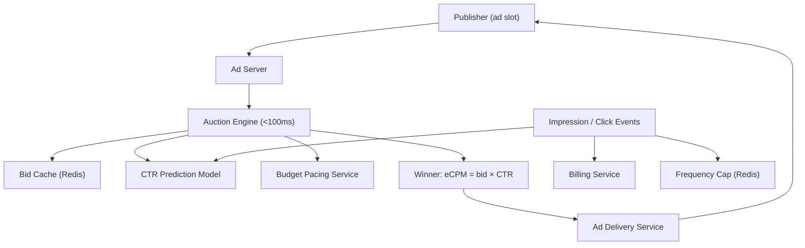
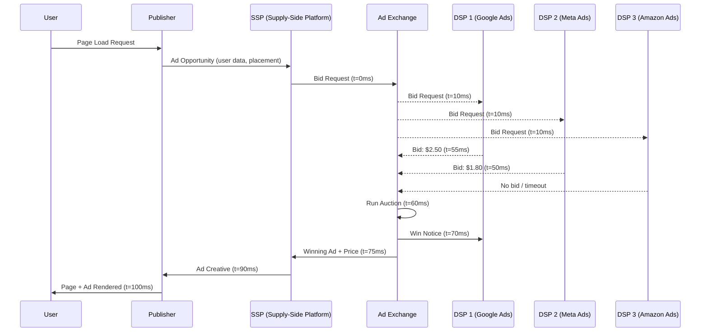

# Ad Auction System Design

**Interview Question**: *"Design Google AdWords or Facebook Ads auction system"*

**Difficulty**: 🔴 Advanced
**Asked by**: Google, Meta, Twitter, Snap, TikTok, Amazon
**Time to Answer**: 10-15 minutes

---

## 🗺️ Quick Overview



*Every ad request triggers a sub-100ms auction: bids are ranked by eCPM (bid × predicted CTR), budget pacing caps spend rate, and frequency capping prevents over-exposure, all updated in real time via an event stream.*

---

## 🎯 Quick Answer (30 seconds)

An ad auction system must run a complete auction — receive bid requests from publishers, collect bids from advertisers, pick a winner, and serve the ad — all within 100ms. The core is a second-price auction where the winner pays the second-highest bid multiplied by quality score. Critical sub-systems include CTR prediction (which ad will users click?), budget pacing (spread budget evenly across the day), and frequency capping (don't show the same ad too many times to one user).

**Key Components**:
1. **Ad Exchange** — orchestrates the auction, enforces the 100ms deadline
2. **CTR Prediction Model** — estimates click probability for each ad to compute Ad Rank
3. **Budget Pacing** — smoothly deploys advertiser budgets across time to avoid exhaustion at 9am
4. **Frequency Capping** — limits impressions per user per ad using approximate counting (Bloom filters, Redis)
5. **Fraud Detection** — identifies click fraud and invalid traffic before billing

---

## 📚 Detailed Explanation

### Problem Breakdown

Ad auctions are arguably the most latency-sensitive and revenue-critical workloads in software:

- **Scale**: Google processes 8.5 billion searches/day, each triggering an auction
- **Latency budget**: The entire auction must complete in < 100ms (user is waiting for the page to load)
- **Money**: Google's ad revenue is ~$200B/year; even a 1% error in auction logic means $2B
- **Adversarial**: Fraudsters actively try to steal advertiser money via fake clicks and impressions
- **Fairness**: The auction must be provably incentive-compatible (truthful bidding is the dominant strategy)

The core tension: you want to maximize revenue (charge high prices) while maintaining advertiser ROI (charge fair prices so they keep spending), while also protecting user experience (show relevant ads).

### High-Level Architecture: Real-Time Bidding (RTB)

In header bidding / open RTB, an ad exchange runs the auction with external demand-side platforms (DSPs):



**Key timing constraints**:
- 0ms: Page load starts, SSP triggered
- 10ms: Bid request broadcast to all DSPs
- 50ms: DSP response deadline (50ms window for DSP to run their own internal auction)
- 60ms: Exchange runs its auction on received bids
- 75ms: Winner notified, ad creative URL returned to publisher
- 100ms: Ad renders in the page

Any DSP that misses the 50ms window gets a "no bid" recorded. The exchange cannot wait indefinitely.

### Deep Dive: Auction Mechanics

**Second-Price Auction (Vickrey Auction)**:

The winner pays the second-highest bid, not their own bid. This is incentive-compatible — the optimal strategy is to bid your true value.

```
// Example auction with 4 bidders
bids = [
  { advertiserId: "A", bid: $5.00 },
  { advertiserId: "B", bid: $3.50 },
  { advertiserId: "C", bid: $2.00 },
  { advertiserId: "D", bid: $1.00 },
]

winner = "A"
pricePaid = $3.50  // second-highest bid
// A wins but only pays $3.50, not $5.00
// This means A's truthful bid of $5.00 was correct strategy
// If A had bid $4.00, they'd still win at $3.50 (same outcome)
// If A had bid $3.00, they'd lose — understatement harms them
```

**Ad Rank (Google's formula)**:

Raw bids alone don't determine the winner. Low-quality ads hurt user experience, so the system factors in quality:

```
// Ad Rank calculation
adRank = bid × qualityScore

qualityScore = (
  expectedCTR * 0.40 +           // predicted click-through rate
  adRelevance * 0.35 +            // how well ad text matches query
  landingPageQuality * 0.25       // landing page experience score
)
// qualityScore is on a scale of 1-10

// Example auction for query "buy running shoes"
ads = [
  { id: "A", bid: $3.00, qualityScore: 9, rank: 27.0 },
  { id: "B", bid: $5.00, qualityScore: 4, rank: 20.0 },
  { id: "C", bid: $2.00, qualityScore: 8, rank: 16.0 },
]

winner = "A"  // highest Ad Rank (27.0), despite not highest bid

// Actual price paid (Generalized Second Price):
// Price = (next_rank / your_quality_score) + $0.01
priceA = (20.0 / 9) + 0.01 = $2.23  // A wins at $2.23, not $3.00
```

This means an advertiser with a highly relevant ad (high quality score) can beat a higher bidder at lower cost.

### Deep Dive: CTR Prediction

CTR prediction is the engine of ad quality scoring:

**Evolution of CTR models at scale**:

```
// Generation 1: Logistic Regression (2005-2012)
// Fast, interpretable, easy to update
features = [
  query_ad_match_score,
  advertiser_historical_ctr,
  position_on_page,
  device_type,
  time_of_day,
]
ctr = sigmoid(w0 + w1*f1 + w2*f2 + ... + wn*fn)

// Problem: can't capture non-linear feature interactions

// Generation 2: Gradient Boosted Trees (GBDT, 2012-2018)
// Better accuracy via feature interaction learning
ctr = gbdt.predict(features)
// e.g., LightGBM, XGBoost trained on billions of (impression, click) pairs

// Generation 3: Deep Learning with embeddings (2018-present)
// Handles hundreds of millions of sparse features (user IDs, ad IDs)

function deepCTRModel(query, ad, user, context):
  // Sparse feature embeddings
  queryEmbed = embedding(queryId)         // 64-dim
  adEmbed = embedding(adId)               // 64-dim
  userEmbed = embedding(userId)           // 64-dim

  // Dense feature processing
  densFeatures = [
    historical_ctr,
    bid,
    position,
    device_type,
    hour_of_day
  ]

  // Concatenate and pass through DNN
  combined = concat(queryEmbed, adEmbed, userEmbed, denseFeatures)
  hidden1 = ReLU(Dense(512)(combined))
  hidden2 = ReLU(Dense(256)(hidden1))
  hidden3 = ReLU(Dense(128)(hidden2))
  ctr = sigmoid(Dense(1)(hidden3))

  return ctr  // probability of click, range [0, 1]
```

**Training at scale**:
- Training data: billions of (impression, click/no-click) pairs logged daily
- Label: 1 = user clicked, 0 = user ignored
- Online learning: model is updated every few hours with fresh data (concept drift is real)
- Calibration: raw model output may be miscalibrated (predicted 0.10 CTR but actual is 0.05); use Platt scaling or isotonic regression to calibrate

### Deep Dive: Budget Pacing

An advertiser has a $10,000 daily budget. Without pacing, the system spends it all in the first few hours when traffic is highest (mornings in each timezone).

```
// Target: spend budget evenly across 24 hours
// Or more sophisticated: spend proportionally to expected traffic volume

// Simple throttling approach
function shouldBid(advertiser, opportunityValue):
  currentHour = now().hour
  hourlyBudgetTarget = advertiser.dailyBudget / 24  // simple: equal per hour
  alreadySpentThisHour = getSpentThisHour(advertiser.id)

  if alreadySpentThisHour >= hourlyBudgetTarget:
    return false  // skip this opportunity to pace

  return true  // bid on this opportunity

// More sophisticated: probabilistic throttling
function throttlingProbability(advertiser):
  // Feedback control loop (PID controller)
  expectedSpendRate = advertiser.dailyBudget / 86400  // per second
  actualSpendRate = getSpendRate(advertiser.id, window=60s)

  throttle = expectedSpendRate / max(actualSpendRate, 0.001)
  return min(throttle, 1.0)  // never throttle below 0% (can go up to 100%)

// Example: advertiser spending 2× faster than target
// throttle = expected(100) / actual(200) = 0.5
// Only bid on 50% of opportunities

function shouldBid(advertiser, opportunity):
  p = throttlingProbability(advertiser)
  return random() < p  // bid with probability p
```

**Budget tracking architecture**:
```
// Budget tracking must be fast (< 2ms) and consistent enough
// Using Redis with atomic increments

// On each impression/click
function recordSpend(advertiserId, amount):
  // Atomic increment — no race condition
  redis.incrbyfloat(f"budget:spent:{advertiserId}:{today}", amount)
  redis.expire(f"budget:spent:{advertiserId}:{today}", 86400)  // expire after 1 day

// On bid evaluation
function getRemainingBudget(advertiserId):
  totalBudget = db.getAdvertiserBudget(advertiserId)
  spent = float(redis.get(f"budget:spent:{advertiserId}:{today}") or 0)
  return totalBudget - spent

// Problem: Redis doesn't guarantee exactly-once — can slightly over-deliver
// Solution: set a soft cap (95% of budget triggers throttling, 100% triggers hard stop)
```

### Deep Dive: Frequency Capping

An advertiser pays not to annoy users with the same ad 50 times a day. Frequency capping limits impressions per user.

```
// Requirement: at most 5 impressions of ad X per user per day

// Naive approach: Redis counter per (userId, adId, date)
// Problem: 300M users × 10M ads × 3 bytes = 9 petabytes just for counters

// Better: Bloom filter per user per day (approximate counting)
// HyperLogLog for frequency counting: 12KB per user tracks any number of items

// Practical approach: Redis with key expiry
function shouldShowAd(userId, adId, maxFrequency=5):
  key = f"freq:{userId}:{adId}:{today()}"
  count = redis.get(key)

  if count and int(count) >= maxFrequency:
    return false  // cap reached

  redis.incr(key)
  redis.expire(key, 86400)  // expire next day
  return true

// Scale optimization: shard by userId
// userId % 1000 → shard[i] redis cluster
// Each shard handles 300K users
function getShardedRedis(userId):
  shardId = hash(userId) % NUM_SHARDS
  return redisCluster[shardId]
```

### Deep Dive: Fraud Detection

Click fraud costs advertisers ~$35B/year globally. Patterns to detect:

```
// Real-time fraud signals (checked during/after auction)

// 1. Click velocity: too many clicks from same IP
function checkClickVelocity(ipAddress, adId):
  key = f"clicks:{ipAddress}:{adId}:{currentMinute()}"
  count = redis.incr(key)
  redis.expire(key, 60)

  if count > THRESHOLD_PER_MINUTE:  // e.g., 10 clicks/min from same IP
    return FRAUD_SUSPECTED

// 2. IP reputation check (batch-updated blacklist)
function checkIPReputation(ipAddress):
  return bloomFilter.contains(ipAddress)  // pre-built from known fraud IPs

// 3. User agent anomalies
function checkUserAgent(request):
  if request.userAgent.matches(BOT_PATTERNS):
    return FRAUD_SUSPECTED
  if request.userAgent == "" or request.userAgent == "unknown":
    return FRAUD_SUSPECTED

// 4. Behavioral signals (batch analysis, not real-time)
// - Click with no subsequent page view (the landing page never loaded)
// - Click-to-conversion time < 2 seconds (bot speed)
// - Geographic anomalies (Bangladesh IP clicking US-targeted ads)
// - Publisher-specific anomalies (publisher X has 10× average CTR)

// Fraud disposition
enum FraudAction {
  ALLOW,           // charge advertiser, credit publisher
  INVALID_CLICK,   // don't charge advertiser, don't credit publisher
  BLOCK_PUBLISHER, // publisher consistently sending fraud
}
```

### Waterfall vs. Header Bidding vs. Unified Auction

```
// Historical: Waterfall (sequential)
// Publisher tries premium buyers first, falls back to remnant if no fill
// Problem: buyers don't see all inventory, publishers miss revenue

Waterfall:
  try Google (premium) → if no fill, try AppNexus → if no fill, house ads
  // Latency: up to 300ms (sequential)
  // Revenue: low (buyers don't compete simultaneously)

// Current standard: Header Bidding (parallel)
// All buyers bid simultaneously in the browser before ad server call
// Problem: runs in browser JS, adds page load latency

HeaderBidding:
  all_bids = await Promise.all([
    google.bid(request),
    meta.bid(request),
    amazon.bid(request),
  ])  // parallel, 50ms
  winner = max(all_bids)
  // Revenue: higher (true competition)
  // Latency: parallel, but still impacts page load

// Future: Server-side Unified Auction
// All bidding happens server-side, invisible to browser
UnifiedAuction:
  exchange.runAuction(request)
  // Revenue: highest (all buyers, server-side speed)
  // Latency: lowest (no browser JS overhead)
  // Adoption: growing (Google Open Bidding, Amazon TAM)
```

---

## ⚖️ Trade-offs

| Approach | Pros | Cons | When to Use |
|----------|------|------|-------------|
| Second-price auction | Truthful bidding is optimal, simple to understand | Revenue lower than first-price, manipulable by colluding bidders | Display ads, search auctions |
| First-price auction | Higher revenue potential | Advertisers overbid uncertainty, not incentive-compatible | Programmatic display (header bidding trend) |
| Waterfall selling | Simple, predictable | Low revenue, sequential latency, unfair to buyers | Legacy publishers |
| Header bidding | All buyers compete simultaneously | Browser JS latency, complex setup | Mid-to-large publishers |
| Logistic regression CTR | Fast inference (< 1ms), online learning | Misses feature interactions | Real-time bidding, low latency budgets |
| Deep learning CTR | Higher accuracy, captures interactions | Slow inference, hard to update incrementally | Offline ranking, ad relevance scoring |
| Hard budget cap | Prevents overspend | Stops serving mid-day, misses afternoon traffic | Budget-sensitive small advertisers |
| Probabilistic pacing | Smooth spend, maximizes impressions | May slightly over- or under-deliver | Large campaigns, brand awareness |

---

## 🏢 Real-World Examples

**Google Search Ads**:
- 8.5 billion searches/day, each triggers an ad auction
- Ad Rank = Bid × Quality Score (CTR × Ad Relevance × Landing Page Quality)
- Quality Score rewards relevance: a score-10 ad at $1 bid beats a score-1 ad at $9 bid
- Google's CTR model is updated every few hours with new training data
- Annual ad revenue: ~$175B (2023)

**Meta Ads**:
- 10 million+ active advertisers
- Serves ads across Facebook, Instagram, WhatsApp, Audience Network
- "Total Value" auction: Advertiser Value × Estimated Action Rate × User Value
- User Value component prevents showing ads that degrade user experience
- Annual ad revenue: ~$116B (2023)

**Amazon Sponsored Products**:
- Ads appear in search results and product pages
- Unique advantage: Amazon knows purchase intent (you're already shopping)
- CPC (cost-per-click) auction with relevance scoring similar to Google
- Revenue: ~$46B (2023) — fastest growing ad business

**The Trade Desk (DSP)**:
- Processes 15 million+ bid requests/second
- Responds to each within 30ms (their internal SLA)
- Runs Koa algorithm: adjusts bids based on predicted probability of conversion, not just click

---

## ⚠️ Common Pitfalls

1. **Thundering herd on bid broadcast**: When a high-value ad opportunity appears (e.g., Super Bowl halftime show), hundreds of DSPs simultaneously bombard the exchange with responses. The exchange's receiving layer can be overwhelmed. Fix: rate limit per DSP, shed load gracefully, return a "no fill" rather than crashing.

2. **Budget over-delivery**: Redis-based budget tracking is eventually consistent. In a distributed system where 100 servers are bidding simultaneously, the budget can be exceeded before all servers see the updated count. Fix: soft budget (stop at 95%, allow up to 105% total) and issue advertiser credits for over-delivery.

3. **Auction timeout causing no-fill**: If all DSPs miss the 50ms deadline (network congestion, server overload), the auction has no bids and the publisher shows a house ad or blank space. Fix: keep a floor price fallback, allow publisher's direct-sold ads to fill in.

4. **Click fraud from publisher**: Publishers are incentivized to generate fake clicks (they earn money per click). Fix: post-auction audit pipeline that retroactively identifies and reverses fraudulent charges; publisher trust scoring with automated suspension.

5. **Frequency capping race conditions**: Without atomic operations, two ad servers may simultaneously check frequency (both see count=4, both decide to show), resulting in showing the ad twice and exceeding the cap. Fix: use Redis atomic INCR with a check-and-set pattern, or accept the occasional violation as acceptable.

6. **Stale quality scores**: Ad quality scores are computed offline and cached. If an advertiser suddenly updates their landing page or ad creative, the cached quality score may be wrong for hours. Fix: trigger quality re-evaluation on ad creative update; cache with shorter TTL for newly updated ads.

---

## ✅ Key Takeaways

- The entire RTB pipeline (bid request → auction → ad served) must complete in under 100ms — every component has a strict latency budget
- Second-price auctions are incentive-compatible: the optimal strategy for advertisers is to bid their true value, simplifying the system
- Ad Rank = Bid × Quality Score allows low-bid but highly relevant ads to win, aligning advertiser ROI with user experience
- CTR prediction evolved from logistic regression to gradient boosted trees to deep neural networks; all are still in use depending on latency constraints
- Budget pacing uses a feedback control loop (like a PID controller) to smooth spend across the day, preventing budget exhaustion in the morning
- Frequency capping requires atomic counter operations in Redis to prevent race conditions; shard by userId for scale
- Click fraud costs ~$35B/year globally; real-time signals (click velocity, IP reputation) combine with batch analysis (behavioral anomalies) to detect and reverse fraudulent charges
- The ad tech ecosystem has evolved from waterfall to header bidding to unified server-side auctions, each step improving publisher revenue and reducing latency
