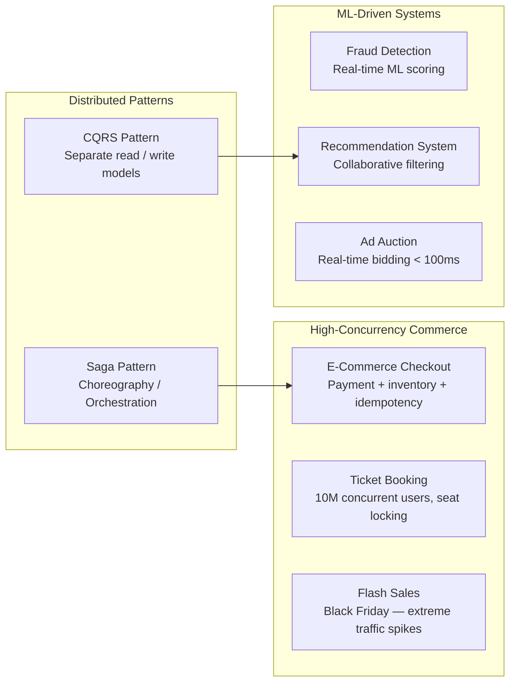

# Business & Advanced Patterns

These questions combine domain complexity with technical depth. They test whether you can design systems that handle real business constraints — high-stakes transactions, fraud, personalization, and complex distributed workflows.

## What's Covered

| Topic | Difficulty | Why It Matters |
|-------|-----------|----------------|
| E-Commerce Checkout Flow | 🔴 Advanced | Payment processing, inventory, idempotency |
| Ticket Booking System | 🔴 Advanced | 10M concurrent users, seat locking |
| Flash Sales | 🔴 Advanced | Extreme traffic spikes — Black Friday patterns |
| Fraud Detection System | 🔴 Advanced | Real-time ML scoring for transactions |
| Recommendation System | 🔴 Advanced | Netflix/Spotify collaborative filtering |
| Ad Auction System | 🔴 Advanced | Real-time bidding in < 100ms |
| Saga Pattern | 🔴 Advanced | Distributed transactions without 2PC |
| CQRS Pattern | 🔴 Advanced | Separate read and write models at scale |

## Study Order

Start with **Saga Pattern** and **CQRS** as foundational distributed patterns — they appear as building blocks in the other topics. Then **E-Commerce Checkout** (applies Saga), **Ticket Booking** and **Flash Sales** (concurrency under load), and finally **Fraud Detection**, **Recommendation System**, and **Ad Auction** for ML/real-time bidding scenarios.

## Common Interview Patterns

- "How would you handle a payment that succeeds but the order fails?" → Saga pattern
- "How do you scale reads without hitting the same database?" → CQRS
- "Design a Black Friday flash sale that handles 1M users in 1 minute" → Flash sales architecture
- "How does Netflix recommend movies?" → Recommendation system
- "How do ad exchanges decide which ad to show in real-time?" → Ad auction system
