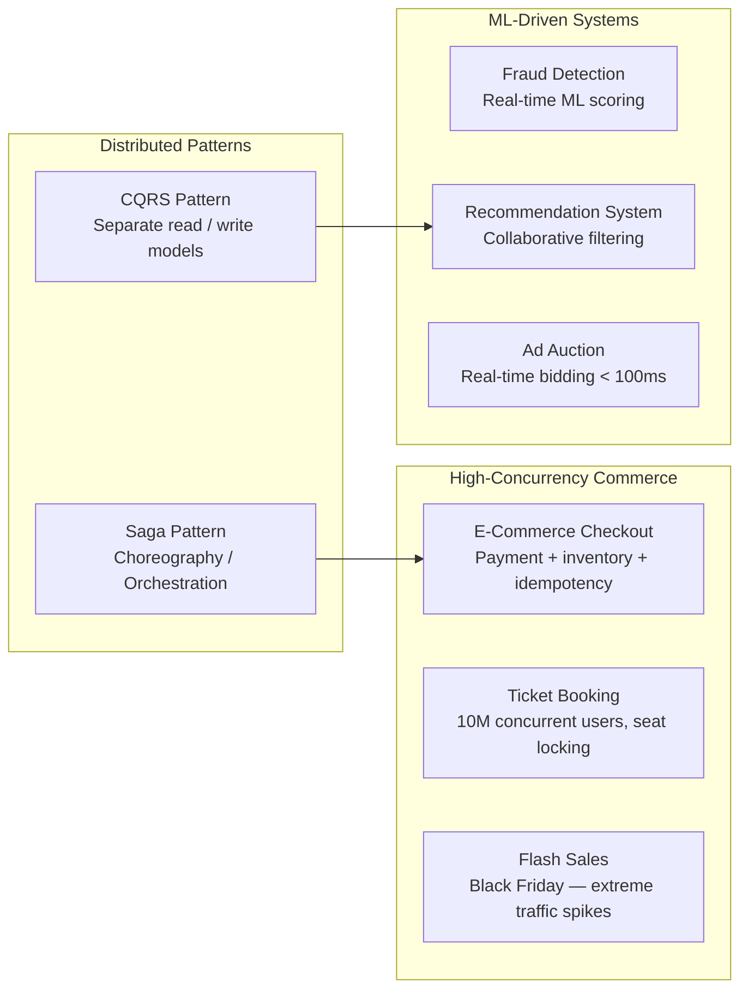

[← Interview Prep](/12-interview-prep) / [System Design](/12-interview-prep/system-design) / Business & Advanced Patterns

# Business & Advanced Patterns

These questions combine domain complexity with technical depth. They test whether you can design systems that handle real business constraints — high-stakes transactions, fraud, personalization, and complex distributed workflows.

## What's Covered

| Topic | Difficulty | Why It Matters |
|-------|-----------|----------------|
| [E-Commerce Checkout Flow](ecommerce-checkout) | 🔴 Advanced | Payment processing, inventory, idempotency |
| [Ticket Booking System](ticket-booking-system) | 🔴 Advanced | 10M concurrent users, seat locking |
| [Flash Sales](flash-sales) | 🔴 Advanced | Extreme traffic spikes — Black Friday patterns |
| [Fraud Detection System](fraud-detection-system) | 🔴 Advanced | Real-time ML scoring for transactions |
| [Recommendation System](recommendation-system) | 🔴 Advanced | Netflix/Spotify collaborative filtering |
| [Ad Auction System](ad-auction-system) | 🔴 Advanced | Real-time bidding in < 100ms |
| [Saga Pattern](saga-pattern) | 🔴 Advanced | Distributed transactions without 2PC |
| [CQRS Pattern](cqrs-pattern) | 🔴 Advanced | Separate read and write models at scale |

## Study Order

Start with **[Saga Pattern](saga-pattern)** and **[CQRS](cqrs-pattern)** as foundational distributed patterns — they appear as building blocks in the other topics. Then **[E-Commerce Checkout](ecommerce-checkout)** (applies Saga), **[Ticket Booking](ticket-booking-system)** and **[Flash Sales](flash-sales)** (concurrency under load), and finally **[Fraud Detection](fraud-detection-system)**, **[Recommendation System](recommendation-system)**, and **[Ad Auction](ad-auction-system)** for ML/real-time bidding scenarios.

## Common Interview Patterns

- "How would you handle a payment that succeeds but the order fails?" → Saga pattern
- "How do you scale reads without hitting the same database?" → CQRS
- "Design a Black Friday flash sale that handles 1M users in 1 minute" → Flash sales architecture
- "How does Netflix recommend movies?" → Recommendation system
- "How do ad exchanges decide which ad to show in real-time?" → Ad auction system

---

## Navigation

| ← Previous | ↑ Up | → Next |
|-----------|------|--------|
| [← Real-Time Systems](/12-interview-prep/system-design/real-time-systems) | [System Design](/12-interview-prep/system-design) | [AI & Agents →](/12-interview-prep/system-design/ai-and-agents) |
