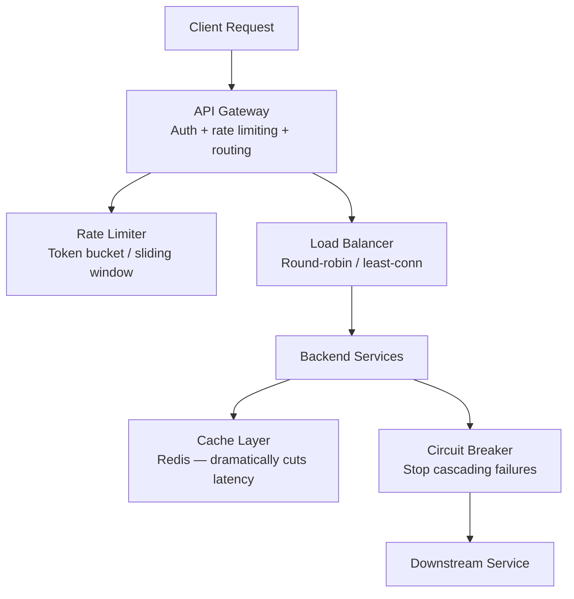

[← Interview Prep](/12-interview-prep) / [System Design](/12-interview-prep/system-design) / Fundamentals

# Fundamentals

These questions cover the building blocks that appear in virtually every system design interview. Master these before moving to specialized topics.

## What's Covered

| Topic | Difficulty | Why It Matters |
|-------|-----------|----------------|
| [API Design: REST vs GraphQL vs gRPC](api-design-rest-graphql-grpc) | 🟡 Intermediate | Choosing the right API protocol for your use case |
| [API Gateway Pattern](api-gateway-pattern) | 🟡 Intermediate | Single entry point for microservices — very common at MNCs |
| [Rate Limiting](rate-limiting) | 🟡 Intermediate | Protecting services from abuse and overload |
| [Caching Strategies](caching-strategies) | 🟡 Intermediate | Redis, Memcached, CDN — dramatically reduces latency |
| [Load Balancing Strategies](load-balancing-strategies) | 🟡 Intermediate | Distributing traffic across servers |
| [Circuit Breaker Pattern](circuit-breaker-pattern) | 🟡 Intermediate | Preventing cascading failures in distributed systems |
| [High Concurrency API](high-concurrency-api) | 🔴 Advanced | Handling millions of simultaneous requests |

## Study Order

Start with **[API Design](api-design-rest-graphql-grpc)** to understand how services communicate, then move to **[Caching](caching-strategies)** and **[Rate Limiting](rate-limiting)** as they appear in almost every follow-up question. **[Load Balancing](load-balancing-strategies)** and **[Circuit Breaker](circuit-breaker-pattern)** build toward reliability thinking. Finish with **[High Concurrency](high-concurrency-api)** once you're comfortable with the basics.

## Common Interview Patterns

- "How would you prevent abuse of your API?" → Rate limiting
- "How would you handle a spike of 10M requests?" → Load balancing + caching + rate limiting
- "What happens when a downstream service is slow?" → Circuit breaker
- "REST or GraphQL for a mobile app?" → API design trade-offs

---

## Navigation

| ← Previous | ↑ Up | → Next |
|-----------|------|--------|
| [Interview Prep](/12-interview-prep) | [System Design](/12-interview-prep/system-design) | [Storage & Databases →](/12-interview-prep/system-design/storage-and-databases) |
