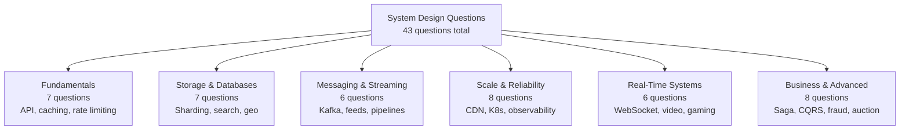

[← Interview Prep](/12-interview-prep) / System Design Questions

# System Design Interview Questions

43 real system design questions asked at FAANG and MNC companies, organized into 6 topic areas. Each question walks through requirements, constraints, component design, and trade-offs.

## Categories

### 🟢 [Fundamentals](fundamentals)
Core building blocks that appear in almost every interview: API design, caching, rate limiting, load balancing, circuit breaker, and high concurrency.

**7 questions** — Start here if you're new to system design.

---

### 🟡 [Storage & Databases](storage-and-databases)
Data layer questions: database replication, sharding, indexing, distributed file systems, search engines, typeahead, and geospatial services.

**7 questions** — Essential for backend and data engineering roles.

---

### 🟡 [Messaging & Streaming](messaging-and-streaming)
Async patterns: Kafka vs RabbitMQ, event-driven architecture, social media feeds, audio streaming, and document processing pipelines.

**6 questions** — Common in platform and infrastructure interviews.

---

### 🟡 [Scale & Reliability](scale-and-reliability)
Infrastructure questions: CDN design, Kubernetes, microservices migration, service discovery, distributed tracing, observability, and multi-tenant SaaS.

**8 questions** — Critical for senior/staff-level rounds.

---

### 🔴 [Real-Time Systems](real-time-systems)
Low-latency, high-concurrency systems: WebSockets, live streaming, video platforms, video conferencing, collaborative editing, and gaming backends.

**6 questions** — Advanced topics for senior and staff engineers.

---

### 🔴 [Business & Advanced Patterns](business-and-advanced)
Domain-complex systems: e-commerce checkout, ticket booking, flash sales, fraud detection, recommendation systems, ad auctions, Saga pattern, and CQRS.

**8 questions** — Staff-level and domain expert interviews.

---

### 🤖 [AI Agents & LLM Systems](ai-and-agents)
LLM-powered systems: agent loop design, tool calling, multi-agent coordination, RAG architecture, observability, and prompt injection defense.

**7 questions** — Increasingly common at companies shipping AI products.

---

## All Questions at a Glance

| # | Question | Category | Difficulty |
|---|----------|----------|-----------|
| 1 | [API Design: REST vs GraphQL vs gRPC](fundamentals/api-design-rest-graphql-grpc) | Fundamentals | 🟡 |
| 2 | [API Gateway Pattern](fundamentals/api-gateway-pattern) | Fundamentals | 🟡 |
| 3 | [Rate Limiting](fundamentals/rate-limiting) | Fundamentals | 🟡 |
| 4 | [Caching Strategies](fundamentals/caching-strategies) | Fundamentals | 🟡 |
| 5 | [Load Balancing Strategies](fundamentals/load-balancing-strategies) | Fundamentals | 🟡 |
| 6 | [Circuit Breaker Pattern](fundamentals/circuit-breaker-pattern) | Fundamentals | 🟡 |
| 7 | [High Concurrency API](fundamentals/high-concurrency-api) | Fundamentals | 🔴 |
| 8 | [Database Replication](storage-and-databases/database-replication) | Storage | 🟡 |
| 9 | [Database Sharding](storage-and-databases/database-sharding) | Storage | 🔴 |
| 10 | [Database Indexing Deep Dive](storage-and-databases/database-indexing-deep-dive) | Storage | 🔴 |
| 11 | [Distributed File System](storage-and-databases/distributed-file-system) | Storage | 🔴 |
| 12 | [Search Engine Architecture](storage-and-databases/search-engine-architecture) | Storage | 🔴 |
| 13 | [Typeahead Search](storage-and-databases/design-typeahead-search) | Storage | 🟡 |
| 14 | [Geospatial Service](storage-and-databases/geospatial-service) | Storage | 🔴 |
| 15 | [Message Queues: Kafka vs RabbitMQ](messaging-and-streaming/message-queues-kafka-rabbitmq) | Messaging | 🟡 |
| 16 | [Event-Driven Architecture](messaging-and-streaming/event-driven-architecture) | Messaging | 🔴 |
| 17 | [Social Media Feed](messaging-and-streaming/social-media-feed) | Messaging | 🔴 |
| 18 | [Audio Streaming (Spotify)](messaging-and-streaming/audio-streaming-spotify) | Messaging | 🟡 |
| 19 | [PDF Converter](messaging-and-streaming/pdf-converter) | Messaging | 🟡 |
| 20 | [CMS Design](messaging-and-streaming/cms-design) | Messaging | 🟡 |
| 21 | [Design a CDN from Scratch](scale-and-reliability/cdn-from-scratch) | Scale | 🔴 |
| 22 | [CDN & Edge Computing for Media](scale-and-reliability/cdn-edge-computing-media) | Scale | 🟡 |
| 23 | [Kubernetes Basics](scale-and-reliability/kubernetes-basics) | Scale | 🟡 |
| 24 | [Monolith to Microservices](scale-and-reliability/monolith-to-microservices) | Scale | 🔴 |
| 25 | [Service Discovery](scale-and-reliability/service-discovery) | Scale | 🟡 |
| 26 | [Distributed Tracing](scale-and-reliability/distributed-tracing) | Scale | 🟡 |
| 27 | [Observability & Monitoring](scale-and-reliability/observability-monitoring) | Scale | 🟡 |
| 28 | [Multi-Tenant SaaS Platform](scale-and-reliability/multi-tenant-saas) | Scale | 🔴 |
| 29 | [WebSocket Architecture](real-time-systems/websocket-architecture) | Real-Time | 🔴 |
| 30 | [Live Streaming (Twitch)](real-time-systems/live-streaming-twitch) | Real-Time | 🔴 |
| 31 | [Video Streaming Platform](real-time-systems/video-streaming-platform) | Real-Time | 🔴 |
| 32 | [Video Conferencing](real-time-systems/video-conferencing) | Real-Time | 🔴 |
| 33 | [Collaborative Editing (Google Docs)](real-time-systems/collaborative-editing-google-docs) | Real-Time | 🔴 |
| 34 | [Online Gaming Backend](real-time-systems/online-gaming-backend) | Real-Time | 🔴 |
| 35 | [E-Commerce Checkout Flow](business-and-advanced/ecommerce-checkout) | Business | 🔴 |
| 36 | [Ticket Booking System](business-and-advanced/ticket-booking-system) | Business | 🔴 |
| 37 | [Flash Sales](business-and-advanced/flash-sales) | Business | 🔴 |
| 38 | [Fraud Detection System](business-and-advanced/fraud-detection-system) | Business | 🔴 |
| 39 | [Recommendation System](business-and-advanced/recommendation-system) | Business | 🔴 |
| 40 | [Ad Auction System](business-and-advanced/ad-auction-system) | Business | 🔴 |
| 41 | [Saga Pattern](business-and-advanced/saga-pattern) | Business | 🔴 |
| 42 | [CQRS Pattern](business-and-advanced/cqrs-pattern) | Business | 🔴 |
| 43 | [Agent Loop Design](ai-and-agents/agent-loop-design) | AI/Agents | 🔴 |
| 44 | [Tool Calling Patterns](ai-and-agents/tool-calling-patterns) | AI/Agents | 🔴 |
| 45 | [Multi-Agent Coordination](ai-and-agents/multi-agent-coordination) | AI/Agents | ⚫ |
| 46 | [RAG Architecture](ai-and-agents/rag-architecture) | AI/Agents | 🔴 |
| 47 | [Designing APIs on LLMs](ai-and-agents/llm-api-design) | AI/Agents | 🔴 |
| 48 | [Agent Observability & Evals](ai-and-agents/agent-observability) | AI/Agents | ⚫ |
| 49 | [Prompt Injection Defense](ai-and-agents/prompt-injection-defense) | AI/Agents | 🔴 |

## Difficulty Guide

| Emoji | Level | Suitable For |
|-------|-------|-------------|
| 🟢 | Beginner | New grads, < 2 years experience |
| 🟡 | Intermediate | 2–5 years experience, L4/L5 |
| 🔴 | Advanced | 5+ years, L5/L6/Staff |
| ⚫ | Senior | Staff/Principal/Solution Architect |

## How to Use This Section

1. Pick a category based on the role you're interviewing for
2. Read each article end-to-end (30–45 min each)
3. Practice explaining the architecture out loud in 5 minutes
4. Focus on trade-offs — interviewers want your reasoning, not a perfect answer
