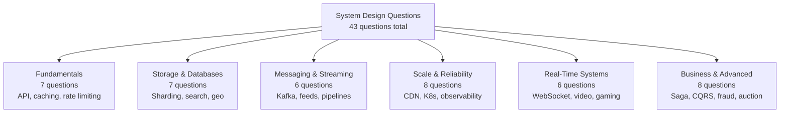

# System Design Interview Questions

43 real system design questions asked at FAANG and MNC companies, organized into 6 topic areas. Each question walks through requirements, constraints, component design, and trade-offs.

## Categories

### 🟢 [Fundamentals](fundamentals)
Core building blocks that appear in almost every interview: API design, caching, rate limiting, load balancing, circuit breaker, and high concurrency.

**7 questions** — Start here if you're new to system design.

---

### 🟡 [Storage & Databases](storage-and-databases)
Data layer questions: database replication, sharding, indexing, distributed file systems, search engines, typeahead, and geospatial services.

**7 questions** — Essential for backend and data engineering roles.

---

### 🟡 [Messaging & Streaming](messaging-and-streaming)
Async patterns: Kafka vs RabbitMQ, event-driven architecture, social media feeds, audio streaming, and document processing pipelines.

**6 questions** — Common in platform and infrastructure interviews.

---

### 🟡 [Scale & Reliability](scale-and-reliability)
Infrastructure questions: CDN design, Kubernetes, microservices migration, service discovery, distributed tracing, observability, and multi-tenant SaaS.

**8 questions** — Critical for senior/staff-level rounds.

---

### 🔴 [Real-Time Systems](real-time-systems)
Low-latency, high-concurrency systems: WebSockets, live streaming, video platforms, video conferencing, collaborative editing, and gaming backends.

**6 questions** — Advanced topics for senior and staff engineers.

---

### 🔴 [Business & Advanced Patterns](business-and-advanced)
Domain-complex systems: e-commerce checkout, ticket booking, flash sales, fraud detection, recommendation systems, ad auctions, Saga pattern, and CQRS.

**8 questions** — Staff-level and domain expert interviews.

---

## Difficulty Guide

| Emoji | Level | Suitable For |
|-------|-------|-------------|
| 🟢 | Beginner | New grads, < 2 years experience |
| 🟡 | Intermediate | 2–5 years experience, L4/L5 |
| 🔴 | Advanced | 5+ years, L5/L6/Staff |

## How to Use This Section

1. Pick a category based on the role you're interviewing for
2. Read each article end-to-end (30–45 min each)
3. Practice explaining the architecture out loud in 5 minutes
4. Focus on trade-offs — interviewers want your reasoning, not a perfect answer
