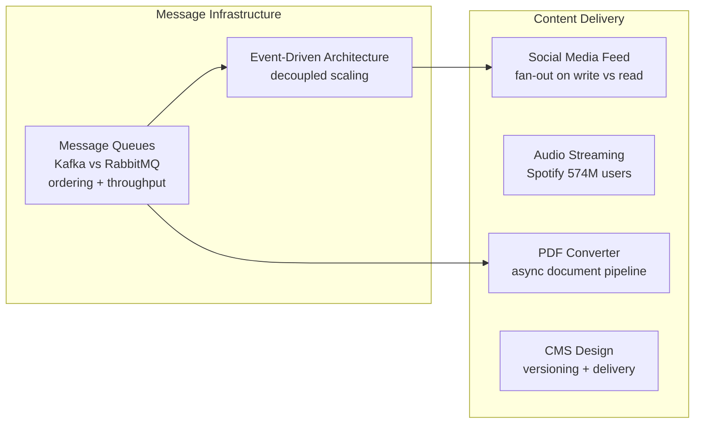

[← Interview Prep](/12-interview-prep) / [System Design](/12-interview-prep/system-design) / Messaging & Streaming

# Messaging & Streaming

These questions cover asynchronous communication patterns — from event queues to news feeds to content delivery pipelines. Async design is a core skill for building scalable, decoupled systems.

## What's Covered

| Topic | Difficulty | Why It Matters |
|-------|-----------|----------------|
| [Message Queues: Kafka vs RabbitMQ](message-queues-kafka-rabbitmq) | 🟡 Intermediate | Choosing the right async backbone |
| [Event-Driven Architecture](event-driven-architecture) | 🔴 Advanced | Decoupled systems that scale independently |
| [Social Media Feed](social-media-feed) | 🔴 Advanced | Twitter/Instagram timeline — classic interview question |
| [Audio Streaming (Spotify)](audio-streaming-spotify) | 🟡 Intermediate | Delivering audio to 574M users |
| [PDF Converter](pdf-converter) | 🟡 Intermediate | Async document processing pipeline |
| [CMS Design](cms-design) | 🟡 Intermediate | Content management with versioning and delivery |

## Study Order

Start with **[Message Queues](message-queues-kafka-rabbitmq)** to understand Kafka vs RabbitMQ trade-offs. Then **[Event-Driven Architecture](event-driven-architecture)** for the broader pattern. **[Social Media Feed](social-media-feed)** is a classic interview question worth mastering. **[Audio Streaming](audio-streaming-spotify)** and **[PDF Converter](pdf-converter)** demonstrate real async pipeline design.

## Common Interview Patterns

- "Design Twitter's feed" → Social media feed (fan-out on write vs read)
- "How would you process 1M uploads/hour?" → Message queues + async workers
- "How does Spotify stream audio without buffering?" → Audio streaming
- "What's the difference between Kafka and RabbitMQ?" → Message queues comparison

---

## Navigation

| ← Previous | ↑ Up | → Next |
|-----------|------|--------|
| [← Storage & Databases](/12-interview-prep/system-design/storage-and-databases) | [System Design](/12-interview-prep/system-design) | [Scale & Reliability →](/12-interview-prep/system-design/scale-and-reliability) |
