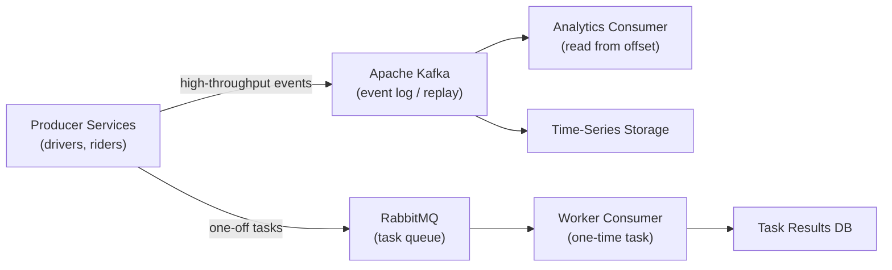

# Message Queues: Kafka vs RabbitMQ - Choose the Right Tool

## 🗺️ Quick Overview



*Kafka retains and replays events for analytics; RabbitMQ routes and deletes tasks once consumed — pick based on whether replay matters.*

> **Time to Read:** 20-25 minutes
> **Difficulty:** Intermediate-Advanced
> **Key Concepts:** Message Queues, Pub/Sub, Event Streaming, Distributed Systems

## 🚀 The Hook: How Uber Processes 1 Trillion Events Per Day

**Uber's Real-Time Platform (2024):**

- **1 trillion events/day** (12 million events/second)
- **5,000 microservices** communicating asynchronously
- **2,500 Kafka topics** for different event types
- **Data freshness:** <100ms from event → analytics dashboard
- **Infrastructure cost:** $47M/year (would be $840M with traditional databases)

**The Challenge:**
- Driver location updates: 500K drivers × 1 update/second = 500K events/sec
- Rider requests: 20M rides/day = 8,000 ride requests/sec
- Pricing calculations: Real-time surge pricing across 10,000 cities
- All must be: **Fast, reliable, scalable, and cost-effective**

**Why NOT traditional solutions?**
- **REST APIs:** Synchronous, tight coupling, poor for high volume
- **Databases:** Not designed for event streaming, expensive at scale
- **Simple queues:** Can't replay events, no partitioning, limited throughput

**Uber's solution:** Apache Kafka for event streaming + RabbitMQ for task queuing

This article shows you exactly when to use each.

---

## 💔 The Problem: Synchronous Communication Doesn't Scale

### The Monolith Nightmare

```
Traditional Synchronous Architecture:

User requests ride
      ↓
   [REST API]
      ↓
Ride Service calls → Driver Service (200ms)
                 ↓
              Pricing Service (150ms)
                 ↓
              Payment Service (300ms)
                 ↓
              Notification Service (100ms)
                 ↓
          Total: 750ms response time

Problems:
❌ Slow: User waits 750ms for response
❌ Cascading failures: If Payment is down, entire request fails
❌ Tight coupling: Changes to one service break others
❌ No retry: Network blip = failed request
❌ Scaling nightmare: Peak traffic overwhelms synchronous calls
```

### Real-World Disasters

**Amazon Prime Day 2018:**
- **Problem:** Order service called inventory via REST API
- **Peak:** 1M orders/minute = 16,000 API calls/second
- **Result:** Inventory service overwhelmed, timeouts cascading
- **Impact:** $72M in lost sales (2.5 hours partial outage)
- **Fix:** Migrated to event-driven with Kafka

**Twitter (2016):**
- **Problem:** Tweet fanout via synchronous writes to followers' timelines
- **Celebrity tweet:** 50M followers = 50M database writes synchronously
- **Result:** 45-second delays for celebrity tweets
- **Fix:** Asynchronous processing with RabbitMQ + Redis

**Shopify Black Friday 2019:**
- **Problem:** Order confirmation emails sent synchronously during checkout
- **Peak:** 10,000 orders/minute
- **Result:** Email service backed up, orders delayed 8 minutes
- **Fix:** RabbitMQ queue decouples order creation from email sending

---

## ❌ Why Traditional Solutions Fail

### Anti-Pattern #1: Database as Message Queue

```python
# Using database tables as a queue (terrible idea!)

class DatabaseQueue:
    def enqueue_job(self, job_data):
        # Insert job into database
        db.execute("""
            INSERT INTO job_queue (data, status, created_at)
            VALUES (?, 'pending', NOW())
        """, [job_data])

    def dequeue_job(self):
        # Poll database every second
        while True:
            jobs = db.execute("""
                SELECT * FROM job_queue
                WHERE status = 'pending'
                ORDER BY created_at
                LIMIT 1
                FOR UPDATE SKIP LOCKED
            """)

            if jobs:
                job = jobs[0]
                # Process job
                db.execute("UPDATE job_queue SET status = 'processing' WHERE id = ?", [job.id])
                self.process(job)
                db.execute("UPDATE job_queue SET status = 'completed' WHERE id = ?", [job.id])

            time.sleep(1)  # Poll every second

# Problems:
# ❌ Polling wastes CPU/database connections
# ❌ Locks contention at high volume
# ❌ No pub/sub (can't have multiple consumers for same message)
# ❌ Database bloat (old jobs pile up)
# ❌ Slow at scale (>1000 jobs/sec becomes bottleneck)
```

**Real Failure:**
- **Early Airbnb (2012):** Used PostgreSQL as job queue
- **Scale:** 10,000 background jobs/hour
- **Result:** Database CPU at 95%, 30-minute delays
- **Fix:** Migrated to RabbitMQ, 100x faster

---

### Anti-Pattern #2: Simple Queue Without Partitioning

```python
# Single-queue approach (doesn't scale)

class SimpleQueue:
    def __init__(self):
        self.queue = []  # In-memory queue

    def publish(self, message):
        self.queue.append(message)

    def consume(self):
        if self.queue:
            return self.queue.pop(0)

# Problems:
# ❌ Single consumer bottleneck (can't parallelize)
# ❌ No ordering guarantees across partitions
# ❌ Lost messages on crash (no persistence)
# ❌ Can't replay old messages
# ❌ Memory limited (queue in RAM)
```

---

### Anti-Pattern #3: REST Webhooks for Real-Time Events

```python
# Synchronous webhooks (fragile)

class WebhookNotifier:
    def send_order_confirmation(self, order_id):
        # Call external service synchronously
        response = requests.post('https://email-service.com/send', json={
            'order_id': order_id,
            'email': user.email
        }, timeout=5)

        # Problems:
        # ❌ If email service is down, order creation fails
        # ❌ Timeout delays checkout (user waits 5 seconds)
        # ❌ No retry mechanism
        # ❌ Tight coupling (email service affects order service)

        if response.status_code != 200:
            raise Exception("Email failed, order rollback!")
```

**Real Failure:**
- **Stripe (2019):** Webhook delivery failures during DNS outage
- **Impact:** 47,000 merchants didn't receive payment webhooks
- **Lost:** $2.3M in delayed order fulfillment
- **Fix:** Added Kafka for reliable event delivery with retries

---

## 🔄 The Paradigm Shift: Asynchronous Event-Driven Architecture

### The Key Insight

> "Don't make users wait for things that don't need to happen immediately. Decouple services with message queues."

**The Transformation:**

```
Synchronous (Before):
User → Order Service → [WAIT] → Inventory → [WAIT] → Email → Response
Total: 750ms, failures cascade

Asynchronous (After):
User → Order Service → [Kafka: OrderCreated event] → Response (50ms)
                              ↓
                    (Background processing)
                    ├→ Inventory Service (subscribes)
                    ├→ Email Service (subscribes)
                    ├→ Analytics Service (subscribes)
                    └→ Warehouse Service (subscribes)

Total user wait: 50ms (15x faster)
Failures isolated: Email down? Order still succeeds!
```

---

## 🆚 Kafka vs RabbitMQ: The Decision Matrix

### Architecture Comparison

```
┌─────────────────────────────────────────────────────────────┐
│                    Apache Kafka                              │
├─────────────────────────────────────────────────────────────┤
│  Architecture: Distributed commit log (append-only)         │
│  Model: Event streaming (pub/sub)                           │
│  Throughput: 1M+ messages/sec per broker                    │
│  Latency: 2-10ms (batch optimized)                          │
│  Retention: Days/weeks/forever (configurable)               │
│  Ordering: Per-partition guaranteed                         │
│  Replay: YES (can read old events)                          │
│  Durability: Replicated across brokers                      │
│  Use cases: Event sourcing, stream processing, analytics    │
│  Examples: LinkedIn (7T msgs/day), Uber (1T msgs/day)       │
└─────────────────────────────────────────────────────────────┘

┌─────────────────────────────────────────────────────────────┐
│                    RabbitMQ                                  │
├─────────────────────────────────────────────────────────────┤
│  Architecture: Traditional message broker                    │
│  Model: Queuing (point-to-point) + Pub/Sub                  │
│  Throughput: 10K-50K messages/sec per node                  │
│  Latency: <1ms (real-time optimized)                        │
│  Retention: Until consumed (then deleted)                   │
│  Ordering: Queue-level guaranteed                           │
│  Replay: NO (message deleted after ack)                     │
│  Durability: Optional (can persist to disk)                 │
│  Use cases: Task queues, RPC, routing, priority queues      │
│  Examples: Instagram (background jobs), Uber (task queues)  │
└─────────────────────────────────────────────────────────────┘
```

### When to Use Kafka

✅ **Use Kafka when you need:**
- **Event sourcing:** Store all events as source of truth
- **Stream processing:** Real-time analytics, aggregations
- **High throughput:** Millions of events per second
- **Replay capability:** Re-process old events
- **Multiple consumers:** Many services reading same event stream
- **Long retention:** Keep events for days/weeks/years

**Examples:**
- **Uber:** Driver location updates (500K updates/sec)
- **LinkedIn:** Activity feed (20M users' actions)
- **Netflix:** Viewing history & recommendations
- **Airbnb:** Price changes & availability updates

### When to Use RabbitMQ

✅ **Use RabbitMQ when you need:**
- **Task queues:** Background jobs, async processing
- **Complex routing:** Route messages based on headers/content
- **Priority queues:** High-priority tasks processed first
- **RPC patterns:** Request-response messaging
- **Low latency:** <1ms message delivery
- **One-time delivery:** Message consumed once and deleted

**Examples:**
- **Instagram:** Photo processing pipeline
- **GitHub:** CI/CD build jobs
- **Shopify:** Order confirmation emails
- **Twilio:** SMS delivery queue

---

## 📊 **Feature Comparison Table**

| Feature | Kafka | RabbitMQ |
|---------|-------|----------|
| **Throughput** | ⭐⭐⭐⭐⭐ 1M+ msg/sec | ⭐⭐⭐ 50K msg/sec |
| **Latency** | ⭐⭐⭐ 2-10ms | ⭐⭐⭐⭐⭐ <1ms |
| **Message Retention** | ⭐⭐⭐⭐⭐ Days/forever | ⭐ Until consumed |
| **Replay Events** | ⭐⭐⭐⭐⭐ Yes | ❌ No |
| **Complex Routing** | ⭐⭐ Basic | ⭐⭐⭐⭐⭐ Advanced |
| **Priority Queues** | ❌ No | ⭐⭐⭐⭐⭐ Yes |
| **Operational Complexity** | ⭐⭐ High (Zookeeper) | ⭐⭐⭐⭐ Lower |
| **Horizontal Scaling** | ⭐⭐⭐⭐⭐ Excellent | ⭐⭐⭐ Good |
| **Message Ordering** | ⭐⭐⭐⭐ Per-partition | ⭐⭐⭐⭐⭐ Per-queue |
| **Best For** | Event streaming | Task queues |

---

## ⚡ Quick Win: Decision Flowchart

```
START: Do you need to replay old messages?
  ├─ YES → Use Kafka
  └─ NO → Continue...

Do you need >100K messages/second?
  ├─ YES → Use Kafka
  └─ NO → Continue...

Do you need complex routing (topic exchanges, headers)?
  ├─ YES → Use RabbitMQ
  └─ NO → Continue...

Do you need priority queues?
  ├─ YES → Use RabbitMQ
  └─ NO → Continue...

Is message retention important (days/weeks)?
  ├─ YES → Use Kafka
  └─ NO → Use RabbitMQ

HYBRID APPROACH: Use both!
- Kafka: Event streaming, analytics, audit logs
- RabbitMQ: Task queues, notifications, background jobs
```

---

## 🏆 Social Proof: Real-World Usage

### Companies Using Kafka
- **LinkedIn:** 7 trillion messages/day (invented Kafka)
- **Uber:** 1 trillion messages/day
- **Netflix:** 500 billion events/day
- **Airbnb:** 1 trillion events/year
- **Spotify:** 1.5 billion events/day

### Companies Using RabbitMQ
- **Instagram:** 500M background jobs/day
- **Reddit:** Comment processing pipeline
- **StackOverflow:** Search indexing queue
- **GitHub:** CI/CD build orchestration
- **Imgur:** Image processing pipeline

### Companies Using BOTH
- **Uber:** Kafka (events) + RabbitMQ (tasks)
- **Shopify:** Kafka (inventory updates) + RabbitMQ (emails)
- **Stripe:** Kafka (audit logs) + RabbitMQ (webhooks)

---

## 🎯 Call to Action: Master Message Queues

**What you learned:**
- ✅ Kafka = Event streaming, high throughput, replay capability
- ✅ RabbitMQ = Task queues, low latency, complex routing
- ✅ Decision flowchart for choosing the right tool
- ✅ Real-world usage from Uber, Netflix, Instagram

**Next steps:**
1. **POC #46:** Build Kafka producer/consumer (15 minutes)
2. **POC #47:** Implement consumer groups for load balancing
3. **Deep dive:** Study Kafka partitioning strategy
4. **Interview:** Practice explaining Kafka vs RabbitMQ trade-offs

**Common interview questions:**
- "When would you use Kafka vs RabbitMQ?"
- "How does Kafka achieve high throughput?"
- "Explain consumer groups in Kafka"
- "Design a real-time analytics pipeline for user events"
- "How would you ensure exactly-once message delivery?"

---

**Time to read:** 20-25 minutes
**Difficulty:** ⭐⭐⭐⭐ Intermediate-Advanced
**Key takeaway:** Choose based on use case - Kafka for events, RabbitMQ for tasks

*Related articles:* Event-Driven Architecture, Microservices Communication, Distributed Systems

---

**Next:** POC #46 - Kafka Basics (Hands-on implementation)
