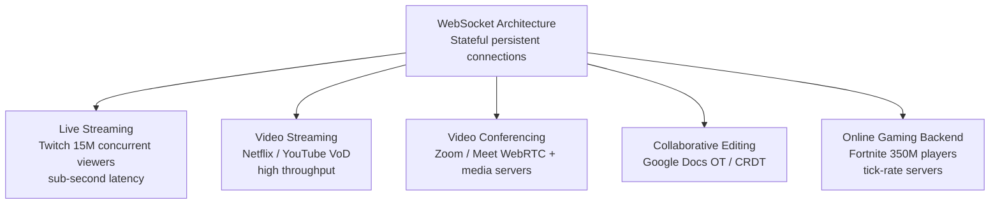

[← Interview Prep](/12-interview-prep) / [System Design](/12-interview-prep/system-design) / Real-Time Systems

# Real-Time Systems

These are some of the hardest system design questions — they require low latency, high throughput, and stateful connections at massive scale. Common in senior and staff-level interviews at companies like Google, Twitch, and Zoom.

## What's Covered

| Topic | Difficulty | Why It Matters |
|-------|-----------|----------------|
| [WebSocket Architecture](websocket-architecture) | 🔴 Advanced | Foundation for all real-time communication |
| [Live Streaming (Twitch)](live-streaming-twitch) | 🔴 Advanced | 15M concurrent viewers, sub-second latency |
| [Video Streaming Platform](video-streaming-platform) | 🔴 Advanced | Netflix/YouTube scale video delivery |
| [Video Conferencing](video-conferencing) | 🔴 Advanced | Zoom/Google Meet — WebRTC + media servers |
| [Collaborative Editing (Google Docs)](collaborative-editing-google-docs) | 🔴 Advanced | OT/CRDT for simultaneous edits |
| [Online Gaming Backend](online-gaming-backend) | 🔴 Advanced | Fortnite's 350M players, tick-rate servers |

## Study Order

Start with **[WebSocket Architecture](websocket-architecture)** as the foundation. Then **[Video Streaming](video-streaming-platform)** (YouTube-style, easier), followed by **[Live Streaming](live-streaming-twitch)** (Twitch, harder due to latency requirements). **[Video Conferencing](video-conferencing)** introduces WebRTC. **[Collaborative Editing](collaborative-editing-google-docs)** and **[Online Gaming](online-gaming-backend)** are the most complex — save these for last.

## Common Interview Patterns

- "How would you build a chat application?" → WebSocket architecture
- "Design YouTube" → Video streaming platform
- "Design Zoom" → Video conferencing + WebRTC
- "How does Google Docs handle simultaneous edits?" → Operational transforms / CRDT
- "What's the difference between live streaming and video-on-demand?" → Latency vs throughput trade-offs

---

## Navigation

| ← Previous | ↑ Up | → Next |
|-----------|------|--------|
| [← Scale & Reliability](/12-interview-prep/system-design/scale-and-reliability) | [System Design](/12-interview-prep/system-design) | [Business & Advanced →](/12-interview-prep/system-design/business-and-advanced) |
