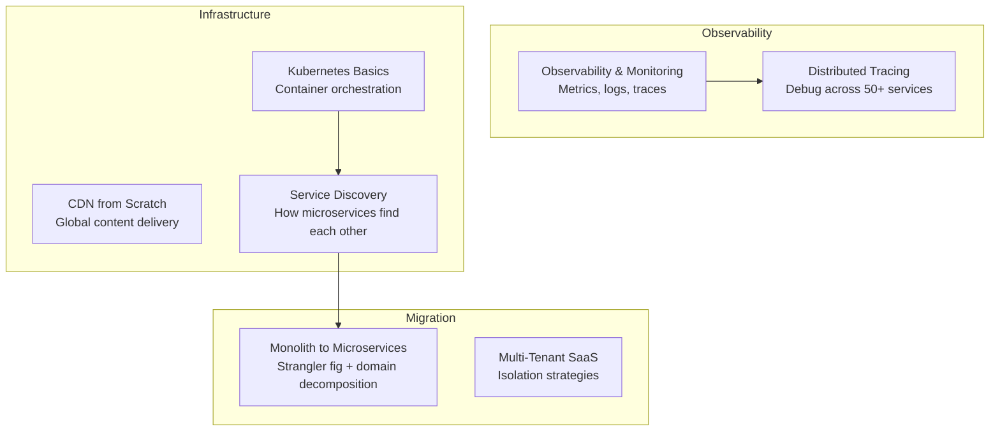

# Scale & Reliability

These questions cover infrastructure and operational concerns — how to build systems that stay up, scale horizontally, and give you visibility into what's happening in production.

## What's Covered

| Topic | Difficulty | Why It Matters |
|-------|-----------|----------------|
| Design a CDN from Scratch | 🔴 Advanced | Content delivery at global scale |
| CDN & Edge Computing for Media | 🟡 Intermediate | How Netflix delivers to 260M users |
| Kubernetes Basics | 🟡 Intermediate | Container orchestration fundamentals |
| Monolith to Microservices | 🔴 Advanced | Migration strategy without downtime |
| Service Discovery | 🟡 Intermediate | How microservices find each other |
| Distributed Tracing | 🟡 Intermediate | Debugging requests across 50+ services |
| Observability & Monitoring | 🟡 Intermediate | Metrics, logs, traces in production |
| Multi-Tenant SaaS Platform | 🔴 Advanced | Isolation strategies for B2B products |

## Study Order

Start with **Observability & Monitoring** and **Distributed Tracing** — these are asked in senior interviews as "how do you know your system is healthy?". Then **CDN** concepts, **Service Discovery**, **Kubernetes**, and finally **Monolith to Microservices** and **Multi-Tenant SaaS** for staff-level rounds.

## Common Interview Patterns

- "How do you debug a slow request across 10 microservices?" → Distributed tracing
- "How would you migrate a monolith to microservices?" → Migration strategies
- "Design Netflix's content delivery" → CDN + edge computing
- "How do you isolate tenants in a SaaS product?" → Multi-tenant patterns
