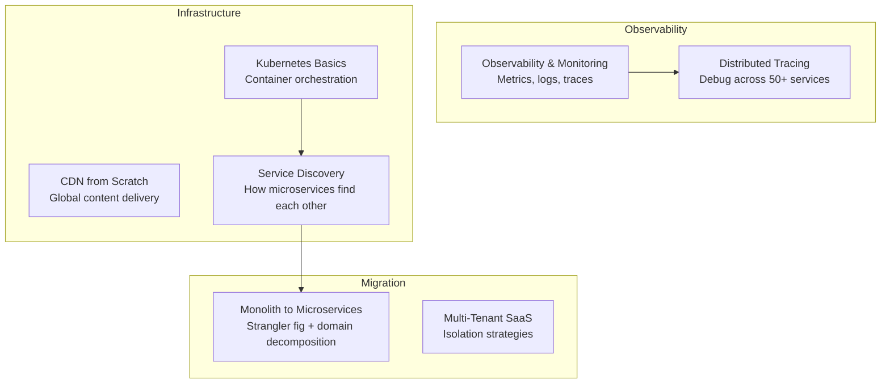

[← Interview Prep](/12-interview-prep) / [System Design](/12-interview-prep/system-design) / Scale & Reliability

# Scale & Reliability

These questions cover infrastructure and operational concerns — how to build systems that stay up, scale horizontally, and give you visibility into what's happening in production.

## What's Covered

| Topic | Difficulty | Why It Matters |
|-------|-----------|----------------|
| [Design a CDN from Scratch](cdn-from-scratch) | 🔴 Advanced | Content delivery at global scale |
| [CDN & Edge Computing for Media](cdn-edge-computing-media) | 🟡 Intermediate | How Netflix delivers to 260M users |
| [Kubernetes Basics](kubernetes-basics) | 🟡 Intermediate | Container orchestration fundamentals |
| [Monolith to Microservices](monolith-to-microservices) | 🔴 Advanced | Migration strategy without downtime |
| [Service Discovery](service-discovery) | 🟡 Intermediate | How microservices find each other |
| [Distributed Tracing](distributed-tracing) | 🟡 Intermediate | Debugging requests across 50+ services |
| [Observability & Monitoring](observability-monitoring) | 🟡 Intermediate | Metrics, logs, traces in production |
| [Multi-Tenant SaaS Platform](multi-tenant-saas) | 🔴 Advanced | Isolation strategies for B2B products |

## Study Order

Start with **[Observability & Monitoring](observability-monitoring)** and **[Distributed Tracing](distributed-tracing)** — these are asked in senior interviews as "how do you know your system is healthy?". Then **[CDN](cdn-from-scratch)** concepts, **[Service Discovery](service-discovery)**, **[Kubernetes](kubernetes-basics)**, and finally **[Monolith to Microservices](monolith-to-microservices)** and **[Multi-Tenant SaaS](multi-tenant-saas)** for staff-level rounds.

## Common Interview Patterns

- "How do you debug a slow request across 10 microservices?" → Distributed tracing
- "How would you migrate a monolith to microservices?" → Migration strategies
- "Design Netflix's content delivery" → CDN + edge computing
- "How do you isolate tenants in a SaaS product?" → Multi-tenant patterns

---

## Navigation

| ← Previous | ↑ Up | → Next |
|-----------|------|--------|
| [← Messaging & Streaming](/12-interview-prep/system-design/messaging-and-streaming) | [System Design](/12-interview-prep/system-design) | [Real-Time Systems →](/12-interview-prep/system-design/real-time-systems) |
