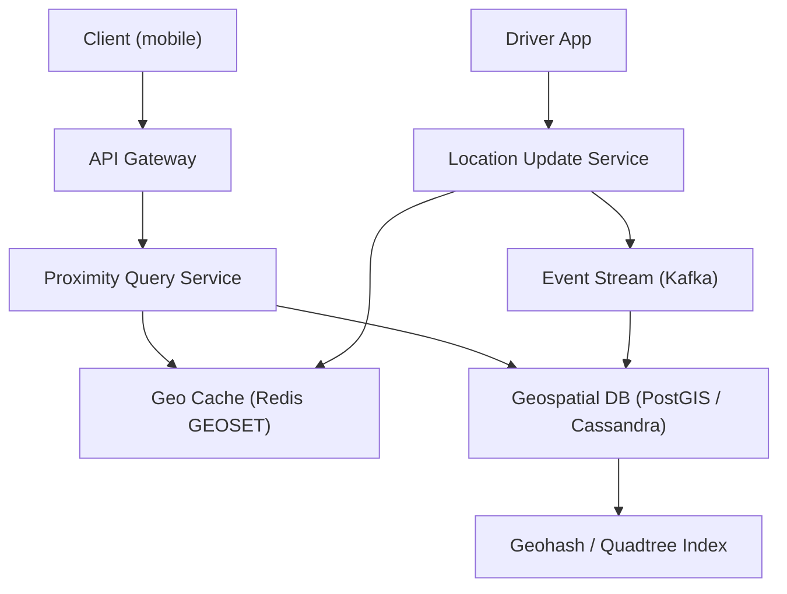
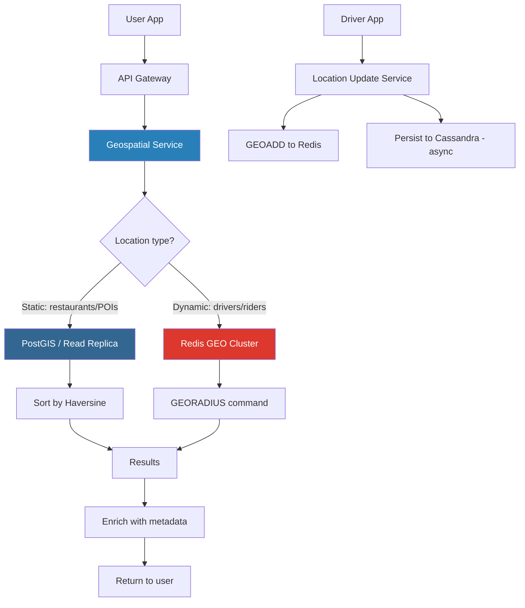

# Geospatial Service Design — Proximity Search at Scale

**Interview Question**: *"Design a location-based service like Yelp, Uber driver matching, or 'find nearby restaurants'. Handle 100M locations with sub-100ms query latency."*

**Difficulty**: 🔴 Advanced
**Asked by**: Uber, Lyft, Google Maps, Yelp, DoorDash, Airbnb
**Time to Answer**: 10-15 minutes

---

## 🗺️ Quick Overview



*Driver location updates are written to an in-memory Redis geospatial set for sub-millisecond proximity queries; a Kafka stream durably persists updates to the geo database with a quadtree index.*

---

## The Core Problem

You have 100 million points on a sphere (Earth). A user at (lat=37.7749, lng=-122.4194) queries: *"give me 10 restaurants within 5km."*

**What you need**: return 10 results in under 100ms.

**Why it's hard**:
- Earth is a sphere — Euclidean distance doesn't work, you need Haversine formula
- 100M rows in a database can't be scanned per-query
- For Uber driver matching, locations update every 5 seconds
- For Yelp, locations are static but there are concurrent millions of queries

### The Naive Approach (and Why It Fails)

```
-- Naive SQL: scan every row
SELECT * FROM locations
WHERE haversine(lat, lng, user_lat, user_lng) <= 5000  -- 5km in meters
ORDER BY distance
LIMIT 10;
```

This is **O(N)** — it checks every row. At 100M rows, even if each check takes 1 microsecond, that's 100 seconds. Unacceptable.

**Root cause**: a standard B-tree index on `lat` and `lng` separately doesn't help with two-dimensional proximity queries. You need a **spatial index**.

---

## Approach 1: Geohash

### What Is Geohash?

Geohash encodes a lat/lng coordinate into a **base-32 string**. The key property: **nearby places share a common prefix**.

- `9q8yy` = San Francisco, CA area (~2.4km × 4.9km cell)
- `9q8yyk` = narrower cell within SF (~0.6km × 1.2km)
- `9q8yykp3` = very precise location (~19m × 19m)

Each additional character increases precision by a factor of ~8.

| Geohash length | Cell size |
|---------------|-----------|
| 4 chars | ~40km × 20km |
| 5 chars | ~5km × 5km |
| 6 chars | ~1.2km × 0.6km |
| 7 chars | ~150m × 150m |
| 8 chars | ~38m × 19m |

For "restaurants within 5km", a 5-char geohash (5km cell) is the right granularity.

### Encoding Pseudocode

```
function encodeGeohash(lat, lng, precision):
    chars = "0123456789bcdefghjkmnpqrstuvwxyz"  # base-32 alphabet
    latRange = [-90.0, 90.0]
    lngRange = [-180.0, 180.0]
    hash = ""
    bits = [16, 8, 4, 2, 1]
    bitIdx = 0
    charIdx = 0
    isEven = true  # alternate between lng and lat bits

    while len(hash) < precision:
        for bit in bits:
            if isEven:  # encode longitude bit
                mid = (lngRange[0] + lngRange[1]) / 2
                if lng >= mid:
                    charIdx |= bit
                    lngRange[0] = mid
                else:
                    lngRange[1] = mid
            else:       # encode latitude bit
                mid = (latRange[0] + latRange[1]) / 2
                if lat >= mid:
                    charIdx |= bit
                    latRange[0] = mid
                else:
                    latRange[1] = mid
            isEven = !isEven

        hash += chars[charIdx]
        charIdx = 0

    return hash
```

### Database Schema

```sql
CREATE TABLE locations (
    id          BIGINT PRIMARY KEY,
    name        VARCHAR(255),
    type        VARCHAR(50),        -- restaurant, hotel, shop
    lat         DECIMAL(10, 7),
    lng         DECIMAL(10, 7),
    geohash_5   CHAR(5),            -- for 5km queries
    geohash_6   CHAR(6),            -- for 1km queries
    created_at  TIMESTAMP
);

-- Index on geohash for fast prefix lookups
CREATE INDEX idx_geohash_5 ON locations(geohash_5);
CREATE INDEX idx_geohash_6 ON locations(geohash_6);
```

### Query Algorithm

```
function findNearby(userLat, userLng, radiusKm):
    # 1. Compute user's geohash
    precision = selectPrecision(radiusKm)  # 5km → 5, 1km → 6
    userGeohash = encodeGeohash(userLat, userLng, precision)

    # 2. Get the 8 neighboring geohash cells
    neighbors = getNeighbors(userGeohash)  # N, NE, E, SE, S, SW, W, NW
    searchCells = [userGeohash] + neighbors  # 9 cells total

    # 3. Query all 9 cells
    candidates = []
    for cell in searchCells:
        results = db.query("SELECT * FROM locations WHERE geohash_5 = ?", cell)
        candidates.extend(results)

    # 4. Filter and sort by actual Haversine distance
    nearby = []
    for loc in candidates:
        dist = haversine(userLat, userLng, loc.lat, loc.lng)
        if dist <= radiusKm * 1000:  # convert km to meters
            nearby.append((loc, dist))

    nearby.sort(key=lambda x: x[1])
    return nearby[:10]
```

### The Boundary Problem

The major limitation of geohash: **two adjacent points can land in different cells with no common prefix**.

Example: Two restaurants 50 meters apart, straddling the boundary between geohash cells `9q8yy` and `9q8yz`. Their 5-char geohashes share no prefix.

**Solution**: always query **9 cells** (center + 8 neighbors). This guarantees you capture all points within radius, regardless of cell boundary effects.

---

## Approach 2: Quadtree

### What Is a Quadtree?

A quadtree recursively divides 2D space into 4 quadrants. Subdivision stops when a cell contains fewer than N points (e.g., N=100).

**Why quadtrees are better for non-uniform distributions**: a geohash gives every cell the same geographic area, regardless of how many locations are in it. Manhattan has thousands of restaurants per square kilometer; the Sahara has none. Quadtrees adapt to data density.

### Pseudocode

```
class QuadtreeNode:
    bounds: Rectangle  # (minLat, maxLat, minLng, maxLng)
    points: List[Location]
    children: [NW, NE, SW, SE]  # null if leaf node
    MAX_POINTS = 100

function insert(node, location):
    if not node.bounds.contains(location):
        return false

    if isLeaf(node):
        node.points.append(location)
        if len(node.points) > MAX_POINTS:
            subdivide(node)
        return true

    # Insert into appropriate child quadrant
    for child in node.children:
        if insert(child, location):
            return true

function subdivide(node):
    midLat = (node.bounds.minLat + node.bounds.maxLat) / 2
    midLng = (node.bounds.minLng + node.bounds.maxLng) / 2

    node.children = [
        QuadtreeNode(bounds=Rectangle(midLat, maxLat, minLng, midLng)),  # NW
        QuadtreeNode(bounds=Rectangle(midLat, maxLat, midLng, maxLng)),  # NE
        QuadtreeNode(bounds=Rectangle(minLat, midLat, minLng, midLng)),  # SW
        QuadtreeNode(bounds=Rectangle(minLat, midLat, midLng, maxLng)),  # SE
    ]
    for point in node.points:
        for child in node.children:
            insert(child, point)
    node.points = []  # internal nodes don't hold points

function search(node, centerLat, centerLng, radiusMeters):
    if not node.bounds.intersectsCircle(centerLat, centerLng, radiusMeters):
        return []

    results = []
    if isLeaf(node):
        for point in node.points:
            dist = haversine(centerLat, centerLng, point.lat, point.lng)
            if dist <= radiusMeters:
                results.append(point)
        return results

    for child in node.children:
        results.extend(search(child, centerLat, centerLng, radiusMeters))

    return results
```

### Geohash vs Quadtree Comparison

| Property | Geohash | Quadtree |
|----------|---------|----------|
| Cell shape | Fixed rectangular grid | Adaptive (dense areas subdivide more) |
| Non-uniform data | Wastes resolution in sparse areas | Efficient — only subdivides where data is dense |
| Storage | Single string column in DB | Requires tree structure (in-memory or DB) |
| Boundary problem | Yes — requires 9-cell lookup | No — tree traversal handles naturally |
| Range queries | Excellent (prefix match) | Good (tree traversal) |
| Dynamic updates | Easy (recompute geohash string) | Harder (tree rebalancing) |
| Use case | Static locations (Yelp, POIs) | Dynamic locations (moving drivers) |

---

## Approach 3: S2 Geometry (Google's Approach)

Google's S2 library maps the sphere to a cube, then subdivides each cube face using a Hilbert curve. This gives:

- **Hierarchical cells** at 30 levels (from Earth-size down to 1cm²)
- **Hilbert curve property**: nearby cells in the curve are geographically close — better cache locality than geohash
- **Exact circle covering**: given a lat/lng + radius, S2 computes the minimal set of cells that covers the circle exactly

S2 is used by:
- Google Maps
- Foursquare
- Uber (they switched from geohash to S2)
- Pokémon GO

S2 is the most geometrically precise approach but has a steeper implementation curve. Use when you need accurate circle or polygon queries.

---

## Approach 4: PostGIS Spatial Index

For static location data (restaurants, hotels, POIs), the simplest production-grade solution is often **PostGIS** — a PostgreSQL extension that adds native spatial types and an R-tree spatial index.

```sql
-- Enable PostGIS extension
CREATE EXTENSION postgis;

-- Add geometry column
ALTER TABLE locations ADD COLUMN geom GEOMETRY(Point, 4326);

-- Populate from lat/lng
UPDATE locations SET geom = ST_SetSRID(ST_MakePoint(lng, lat), 4326);

-- Create spatial index
CREATE INDEX idx_locations_geom ON locations USING GIST(geom);

-- Query: restaurants within 5km of user location
SELECT
    id,
    name,
    ST_Distance(
        geom::geography,
        ST_SetSRID(ST_MakePoint(-122.4194, 37.7749), 4326)::geography
    ) AS distance_meters
FROM locations
WHERE type = 'restaurant'
  AND ST_DWithin(
      geom::geography,
      ST_SetSRID(ST_MakePoint(-122.4194, 37.7749), 4326)::geography,
      5000  -- 5000 meters = 5km
  )
ORDER BY distance_meters
LIMIT 10;
```

The `ST_DWithin` call uses the spatial index — it does NOT scan all rows. The R-tree (GIST index) prunes the search space geometrically.

---

## Redis GEO: The Real-Time Solution

For **moving objects** (Uber drivers, DoorDash couriers), you need real-time location updates. Redis has built-in geospatial support via sorted sets + geohash encoding.

### Redis GEO Commands

```
# Driver updates location (called every 5 seconds)
GEOADD drivers:active -122.4194 37.7749 "driver:456"
GEOADD drivers:active -118.2437 34.0522 "driver:789"

# Find all drivers within 5km of user
GEORADIUS drivers:active -122.4194 37.7749 5 km
  ASC            # sort by distance
  COUNT 10       # limit to 10 results
  WITHCOORD      # include coordinates in response
  WITHDIST       # include distances

# Get distance between two drivers
GEODIST drivers:active "driver:456" "driver:789" km

# Get location of specific driver
GEOPOS drivers:active "driver:456"

# (Redis 6.2+) Modern syntax
GEOSEARCH drivers:active
  FROMMEMBER "driver:456"
  BYRADIUS 5 km
  ASC COUNT 10
```

### How Redis GEO Works Internally

Redis encodes coordinates as a 52-bit geohash, stored as the **score** in a sorted set. The sorted set's ZRANGEBYSCORE efficiently retrieves all members within a geohash range. Radius search works by:
1. Computing the geohash range that covers the search radius
2. Querying the sorted set for all members in that range
3. Filtering by exact Haversine distance

This gives O(log N + M) performance where M is the number of results.

---

## Full System Architecture



### Uber's Driver Location Pipeline

1. Driver app sends GPS coordinates every **5 seconds**
2. Location update service receives event
3. `GEOADD drivers:city:sf <lng> <lat> <driver_id>` — updates Redis GEO
4. Asynchronously persist to Cassandra for historical tracking
5. Rider request: `GEORADIUS drivers:city:sf <rider_lng> <rider_lat> 5 km ASC COUNT 10`
6. Returns closest 10 available drivers in ~1ms

The city-level sharding (`drivers:city:sf`) partitions the data — all SF drivers in one Redis key, NYC drivers in another.

---

## Horizontal Scaling: Partition by Geohash Prefix

To scale beyond a single machine, partition data by geohash prefix:

```
Shard 1: geohash prefix 'u4p' → all locations in London area
Shard 2: geohash prefix '9q8' → all locations in San Francisco area
Shard 3: geohash prefix 'dr5' → all locations in New York area
```

**Query routing**:
```
function route(userLat, userLng):
    prefix = encodeGeohash(userLat, userLng, 3)  # 3-char prefix for ~100km region
    shardId = shardMap[prefix]
    return shardId
```

Most queries stay within a single shard. Cross-shard queries are rare (near the boundary of two large regions) and can be handled with scatter-gather.

---

## Trade-offs Summary

| Approach | Latency | Scale | Accuracy | Use Case |
|----------|---------|-------|----------|----------|
| Naive SQL scan | Seconds | Poor | Perfect | Never — prototype only |
| Geohash + B-tree index | ~5ms | Very high | Good (9-cell fix) | Static locations (Yelp) |
| Quadtree (in-memory) | ~1ms | Medium (memory bound) | Excellent | Dense urban areas, gaming |
| S2 Geometry | ~2ms | Very high | Excellent | High-precision geographic apps |
| PostGIS R-tree | ~5ms | High (Postgres scale) | Perfect | Static locations with complex queries |
| Redis GEO | ~1ms | Very high (Redis scale) | Good | Real-time moving objects (Uber) |

---

## Common Pitfalls

**1. Not handling the geohash boundary problem**: always query 9 cells (center + 8 neighbors), not just the center cell.

**2. Wrong geohash precision**: if your precision is too coarse (3-char = 100km cells), you'll return far too many candidates. Too fine (8-char = 38m cells) and boundary queries become noisy. Match precision to your query radius.

**3. Storing driver locations in a relational database**: a PostgreSQL row update for every driver every 5 seconds creates massive write amplification. Use Redis for real-time, persist to Cassandra/Cassandra for history.

**4. Not using geography type in PostGIS**: using `geometry` type (flat earth) instead of `geography` type (sphere) gives incorrect distances for anything more than a few kilometers.

**5. Single Redis instance for global scale**: shard Redis GEO by city or geohash prefix. A single Redis instance tops out at ~100k writes/second.

**6. Ignoring availability zones**: geospatial services should be deployed multi-region. If your geospatial service is down, Uber can't dispatch drivers.

---

## Key Takeaways

- The core problem is reducing O(N) proximity scan to O(log N) using spatial indexing.
- **Geohash** encodes lat/lng as a string; nearby places share a common prefix. Use 9-cell lookup to handle boundary cases. Best for static location data.
- **Quadtree** adapts to data density. Better for non-uniform distributions and dynamic data.
- **PostGIS** with a GIST (R-tree) index is the simplest production solution for static locations.
- **Redis GEO** (GEOADD/GEORADIUS) is optimal for real-time moving objects — O(log N) using sorted set + geohash encoding.
- For horizontal scale, partition by geohash prefix — route queries to the shard responsible for that geographic region.
- At Uber scale: Redis GEO for real-time driver locations, separate read replicas for static place data.
