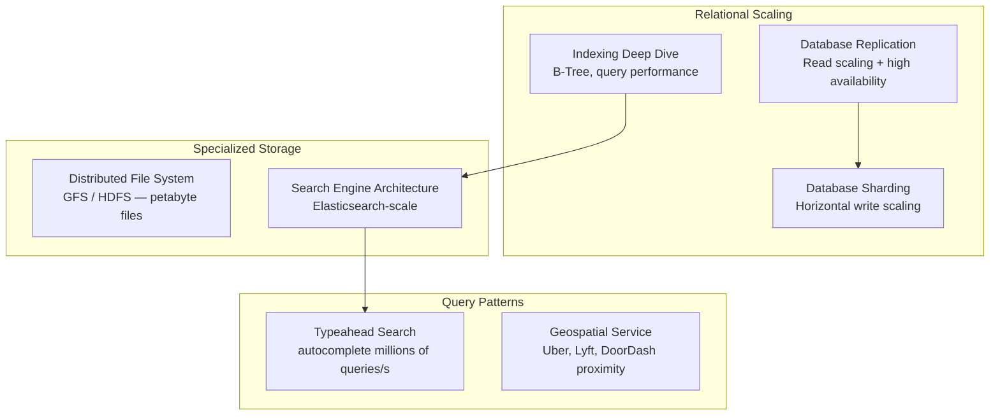

[← Interview Prep](/12-interview-prep) / [System Design](/12-interview-prep/system-design) / Storage & Databases

# Storage & Databases

These questions focus on the data layer — how you store, index, search, and retrieve data at massive scale. Database design questions are among the most common in senior engineer interviews.

## What's Covered

| Topic | Difficulty | Why It Matters |
|-------|-----------|----------------|
| [Database Replication](database-replication) | 🟡 Intermediate | Read scaling and high availability |
| [Database Sharding](database-sharding) | 🔴 Advanced | Horizontal scaling for petabyte-scale data |
| [Database Indexing Deep Dive](database-indexing-deep-dive) | 🔴 Advanced | Query performance fundamentals |
| [Distributed File System (GFS/HDFS)](distributed-file-system) | 🔴 Advanced | Storing large files across many machines |
| [Search Engine Architecture](search-engine-architecture) | 🔴 Advanced | Building Google-scale search with Elasticsearch |
| [Typeahead Search](design-typeahead-search) | 🟡 Intermediate | Autocomplete at millions of queries/second |
| [Geospatial Service](geospatial-service) | 🔴 Advanced | Proximity queries — used in Uber, Lyft, DoorDash |

## Study Order

Start with **[Replication](database-replication)** and **[Sharding](database-sharding)** as these are foundational. **[Indexing](database-indexing-deep-dive)** rounds out your SQL knowledge. Then move to **[Typeahead Search](design-typeahead-search)** (often asked standalone), followed by **[Search Engine Architecture](search-engine-architecture)**, **[Geospatial](geospatial-service)**, and **[Distributed File System](distributed-file-system)** for advanced rounds.

## Common Interview Patterns

- "How would you scale your database to 1 billion users?" → Sharding + replication
- "Design Uber's driver location feature" → Geospatial service
- "How does Google autocomplete work?" → Typeahead search
- "Design HDFS or S3" → Distributed file system

---

## Navigation

| ← Previous | ↑ Up | → Next |
|-----------|------|--------|
| [← Fundamentals](/12-interview-prep/system-design/fundamentals) | [System Design](/12-interview-prep/system-design) | [Messaging & Streaming →](/12-interview-prep/system-design/messaging-and-streaming) |
