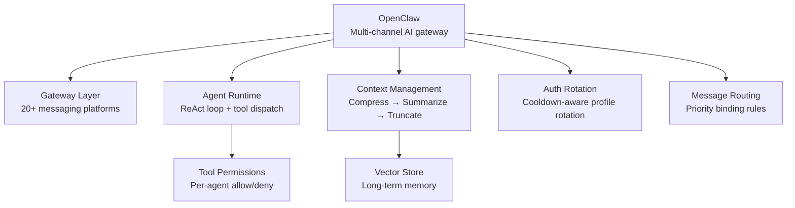

# Agent Workflow Case Studies

Theory tells you how agents *should* work. Production systems show you how they *actually* work — the constraints they hit, the trade-offs they make, and the patterns that survive contact with real users.

This section analyses OpenClaw, a self-hosted multi-channel AI gateway written in TypeScript, as a complete worked example of a production-grade agentic system. It is MIT-licensed and publicly available, which makes it unusually transparent for a production system of its complexity.

## Why Study Real Production Systems

Most agent tutorials show you a 50-line loop that calls a weather API. That's useful for understanding the basics. But when you're designing an agent system that needs to:

- Handle thousands of concurrent users across 20+ messaging platforms
- Manage API rate limits and auth failures gracefully
- Keep conversations coherent over days or weeks
- Route messages to the right agent without cross-contamination
- Let different agents have different tool permissions

...the tutorial loop stops being useful. You need to see how a real system solved these problems under real constraints.

OpenClaw is a good case study for three reasons:

1. **It is complete** — gateway layer, agent runtime, context management, tool system, auth rotation, multi-agent routing. Nothing is hand-waved.
2. **It is self-hosted** — no managed service hides the complexity. Every decision is visible in the code.
3. **It is open** — MIT license, TypeScript/Node.js stack, readable by any backend engineer.

## What OpenClaw Teaches

| Challenge | OpenClaw's Solution | Article |
|-----------|-------------------|---------|
| Long conversations overflow context | Three-tier compaction (compress → summarize → truncate) | [Architecture Deep Dive](./openclaw-architecture) |
| API rate limits break agent loops | Auth profile rotation with cooldown tracking | [Architecture Deep Dive](./openclaw-architecture) |
| Multi-channel message routing | Priority-ordered binding rules with session isolation | [Architecture Deep Dive](./openclaw-architecture) |
| Agent config without a database | Markdown files in isolated workspace directories | [Patterns Extracted](./openclaw-patterns) |
| Tool permissions per agent | Per-agent allow/deny policy evaluated at call time | [Patterns Extracted](./openclaw-patterns) |
| Streaming UX across gateway | Three separate event channels (lifecycle / tokens / tools) | [Patterns Extracted](./openclaw-patterns) |
| Applying these patterns elsewhere | Domain adaptation guide | [Domain Adaptation](./openclaw-domain-adaptation) |

## Reading Guide

**If you have 15 minutes**: Read [OpenClaw: Architecture Deep Dive](./openclaw-architecture). Focus on the five-layer architecture diagram and the context compaction section. These two things explain most of the interesting design decisions.

**If you have 30 minutes**: Add [OpenClaw: Agent Patterns Extracted](./openclaw-patterns). Each pattern is a standalone concept you can apply independently.

**If you are designing a new system**: Read all three articles in order, then use [Adapting OpenClaw Patterns to Your Domain](./openclaw-domain-adaptation) as a checklist.

## Prerequisites

These articles assume you already understand:
- [What is an AI Agent?](../concepts/what-is-an-agent) — the basic agent loop
- [Multi-Agent Systems](../concepts/multi-agent-systems) — agent coordination concepts
- [Long-Running Agents](../concepts/long-running-agents) — checkpointing and async patterns

The case studies are **advanced** content. They are not a good starting point if you are new to agents.
