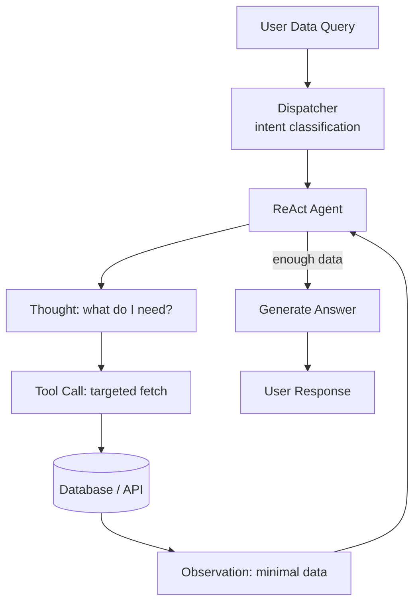
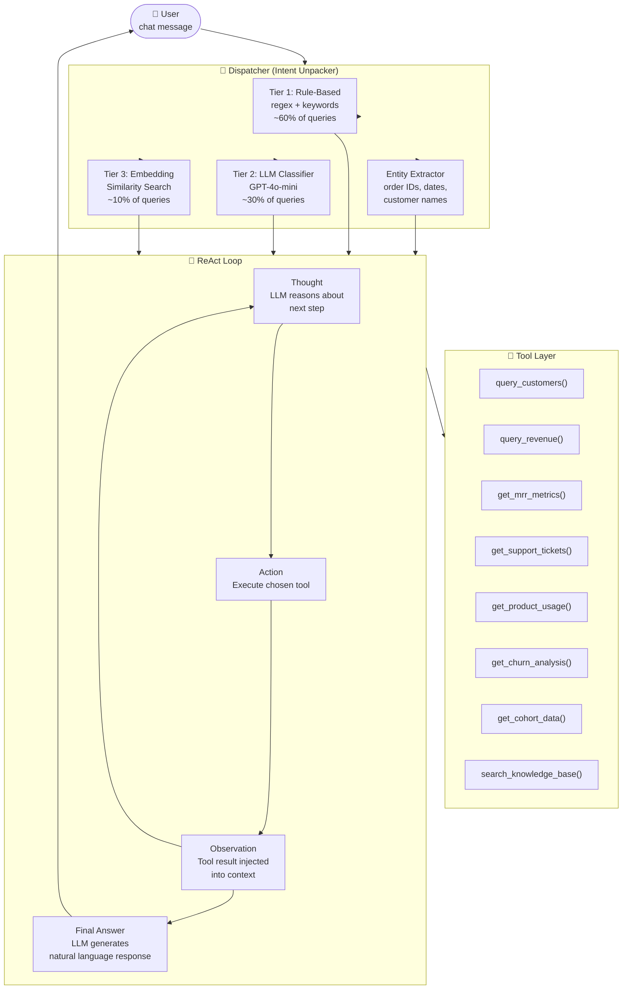
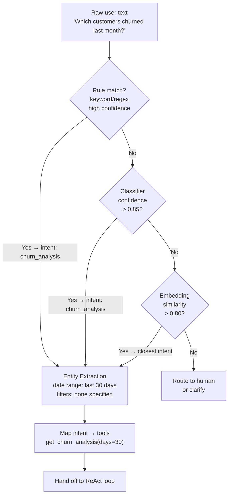
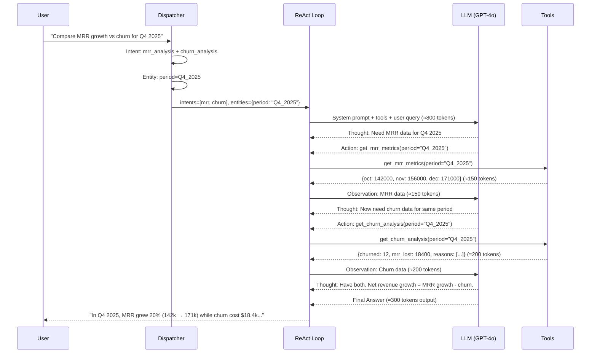
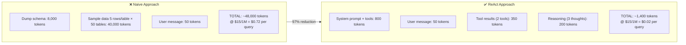
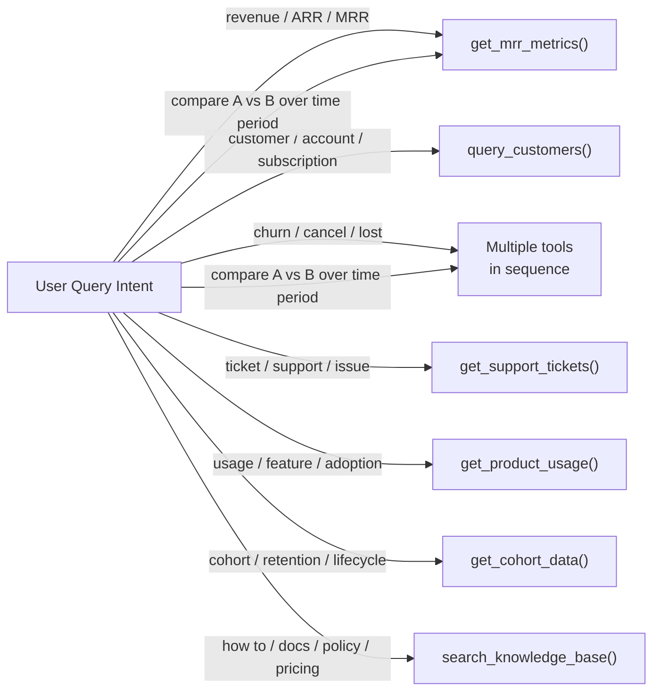

# ReAct + Tool Calling: Building a Token-Efficient Data Query Agent

**Level**: 🟡 Intermediate
**Reading Time**: 35 minutes

> If you pass your entire database to the LLM and ask it to answer a question, you will pay 50x more tokens than you need to, and your answers will be worse. The fix is ReAct — reason first, fetch only what you need, then generate.

## 🗺️ Quick Overview



*ReAct + targeted tool calls replace naive full-database dumps — reducing token cost by up to 50x and improving answer quality.*

---

## The Problem This Case Study Solves

### Scenario

You work at a B2B SaaS company. Your team uses a chat interface to query business data:

- *"Show me revenue trend for Q4 last year"*
- *"Which enterprise customers churned in the last 30 days?"*
- *"What's our MRR growth month over month this year?"*
- *"Give me a summary of support tickets for customer Acme Corp"*

### The Naive Approach (What Most Teams Do First)

```python
# NAIVE — DO NOT DO THIS
context = f"""
Here is our entire database schema and sample data:
{dump_all_tables()}   # 200 tables, thousands of rows = 80,000+ tokens

User question: {user_message}

Answer the question.
"""
response = llm.complete(context)
```

**What goes wrong:**

- **Token explosion**: Even a "sample" of your dataset is 50,000–500,000 tokens per query
- **Cost**: At $15/million input tokens (GPT-4o), a 50k-token query costs $0.75 — for ONE chat message
- **Quality degrades**: LLMs "lose" information in very long contexts ("lost in the middle" phenomenon)
- **Latency**: 50k-token prompts take 10–30 seconds to process
- **Security**: You're dumping everything — including data the user shouldn't see

### The ReAct Approach

```
User: "Which enterprise customers churned last month?"

Thought: I need customers with plan=enterprise who cancelled in the last 30 days.
Action: query_customers(plan="enterprise", churned_after="2026-02-01", churned_before="2026-03-01")
Observation: [{id: "c_123", name: "Globex Inc", mrr: 4500, churned: "2026-02-14"}, ...]  # 8 rows

Thought: I have the churn data. I can answer now.
Final Answer: "3 enterprise customers churned last month: Globex Inc ($4,500 MRR), ..."
```

**Token cost**: ~1,800 tokens total — a **97% reduction**.

---

## What We Are Building

### "DataBot" — Analytics Query Agent for a SaaS Company

**DataBot** is a chat agent that:
- Accepts any natural language query from internal users (sales, CS, finance, product)
- Figures out what data is needed (without asking the LLM to look at all data)
- Executes targeted data-fetching tools
- Passes only the relevant fetched data to the LLM for a natural language response

**The architecture has three layers:**

1. **The Dispatcher** — Reads raw user text, classifies intent, extracts entities, selects tools to call
2. **The Tool Layer** — Focused functions that query specific data sources
3. **The ReAct Loop** — Executes tool calls iteratively, passes results to LLM for reasoning

---

## Section: Diagrams

### Diagram 1 — Full System Architecture



---

### Diagram 2 — The Dispatcher Decision Flow



---

### Diagram 3 — ReAct Sequence for a Complex Query



---

### Diagram 4 — Token Cost Comparison



---

### Diagram 5 — Tool Selection Decision Tree



---

## The Data Model

DataBot works against this SaaS company's data. Understanding the schema is crucial for tool design.

### Tables

**`customers`**
```sql
id          VARCHAR   -- "c_abc123"
name        VARCHAR   -- "Acme Corp"
plan        VARCHAR   -- "starter" | "growth" | "enterprise"
mrr         INTEGER   -- monthly recurring revenue in cents
status      VARCHAR   -- "active" | "churned" | "trial"
created_at  TIMESTAMP
churned_at  TIMESTAMP NULL
industry    VARCHAR
employee_count INTEGER
```

**`revenue_events`**
```sql
id          VARCHAR
customer_id VARCHAR
event_type  VARCHAR   -- "new" | "expansion" | "contraction" | "churn"
amount      INTEGER   -- delta in cents (negative for contraction/churn)
recorded_at TIMESTAMP
period      VARCHAR   -- "2025-10" (year-month)
```

**`support_tickets`**
```sql
id          VARCHAR
customer_id VARCHAR
subject     VARCHAR
priority    VARCHAR   -- "low" | "medium" | "high" | "critical"
status      VARCHAR   -- "open" | "in_progress" | "resolved"
created_at  TIMESTAMP
resolved_at TIMESTAMP NULL
category    VARCHAR   -- "billing" | "bug" | "feature_request" | "onboarding"
```

**`product_usage`**
```sql
customer_id VARCHAR
feature     VARCHAR
event_count INTEGER
last_used   TIMESTAMP
period      VARCHAR   -- "2025-10"
```

### Why You Cannot Dump This Into LLM Context

- **Row counts**: customers=45,000 rows, revenue_events=2.1M rows, support_tickets=380,000 rows
- **Even "sample" data** at 5 rows/table = 20 rows × ~400 chars/row = 8,000 chars = ~2,000 tokens
- **Schema alone** = 1,500 tokens — but LLM can't query from schema alone, needs data
- **Real queries need aggregates** — the LLM can't sum/group/filter millions of rows

> **Rule**: Never pass raw database rows to the LLM. Always aggregate/filter first with tools, then pass the result.

---

## Part 1: The Dispatcher (Intent Unpacker)

The dispatcher is the component that reads raw user text and decides **which tools to arm the ReAct loop with**. It does NOT call the LLM — it uses fast, cheap methods.

### Why Not Use the LLM for Dispatch?

- LLM dispatch: ~500 tokens + 1–2 seconds per query
- Rule-based dispatch: 0 tokens + <5ms per query
- **For 60% of queries, rules work perfectly.** Use LLM only for ambiguous cases.

### Tier 1: Rule-Based Intent Matching

```python
import re
from dataclasses import dataclass
from typing import Optional

@dataclass
class Intent:
    name: str
    tool: str
    confidence: float = 1.0

# Rule registry — ordered by specificity (more specific first)
INTENT_RULES = [
    # --- Revenue ---
    (r'\b(mrr|monthly recurring|revenue|arr|annual recurring)\b',
     Intent("mrr_analysis", "get_mrr_metrics")),

    # --- Churn ---
    (r'\b(churn(ed)?|cancel(led)?|lost customers?|attrition)\b',
     Intent("churn_analysis", "get_churn_analysis")),

    # --- Customer lookup ---
    (r'\b(customer|account|client|subscription|subscriber)s?\b',
     Intent("customer_query", "query_customers")),

    # --- Support ---
    (r'\b(ticket|support|issue|bug|complaint|help request)s?\b',
     Intent("support_query", "get_support_tickets")),

    # --- Usage / Product ---
    (r'\b(usage|feature|adoption|active users?|engaged)\b',
     Intent("usage_query", "get_product_usage")),

    # --- Cohort / Retention ---
    (r'\b(cohort|retention|lifecycle|day \d+ retention)\b',
     Intent("cohort_query", "get_cohort_data")),

    # --- Knowledge base ---
    (r'\b(how (do|to|does)|what is|explain|documentation|policy|pricing)\b',
     Intent("knowledge_query", "search_knowledge_base")),
]

def rule_based_classify(text: str) -> list[Intent]:
    """
    Returns all matching intents from rules.
    A single query can match multiple intents (e.g., 'compare MRR vs churn').
    """
    text_lower = text.lower()
    matched = []

    for pattern, intent in INTENT_RULES:
        if re.search(pattern, text_lower):
            matched.append(intent)

    return matched  # empty = no rule matched → go to Tier 2
```

**How rule matching handles "Which enterprise customers churned last month?":**

1. Pattern `churn(ed)?` matches → `Intent("churn_analysis", "get_churn_analysis")`
2. Pattern `customer` matches → `Intent("customer_query", "query_customers")`
3. Returns both intents → ReAct loop gets two tool candidates

---

### Tier 2: Small LLM Classifier (for Ambiguous Queries)

When rules return nothing or a confidence < 0.7, use a fast cheap model:

```python
CLASSIFIER_PROMPT = """
Classify the user's query into one or more of these intents.
Return a JSON array of intent names, ordered by relevance.

Available intents:
- mrr_analysis: questions about revenue, MRR, ARR, growth
- churn_analysis: questions about customer cancellations, churn rate
- customer_query: lookup or filter specific customers/accounts
- support_query: support tickets, issues, bugs filed by customers
- usage_query: product feature usage, adoption, engagement
- cohort_query: retention curves, cohort behavior, lifecycle
- knowledge_query: how-to questions, policies, documentation

User query: "{query}"

Respond with JSON only: ["intent1", "intent2"]
"""

async def llm_classify(query: str) -> list[str]:
    """
    Uses GPT-4o-mini (cheap, fast) for intent classification.
    ~150 tokens in + ~30 tokens out = ~$0.00003 per call.
    """
    response = await openai_client.chat.completions.create(
        model="gpt-4o-mini",
        messages=[{"role": "user", "content": CLASSIFIER_PROMPT.format(query=query)}],
        temperature=0,       # deterministic — classification, not generation
        max_tokens=50,       # intent names are short
        response_format={"type": "json_object"}
    )
    result = json.loads(response.choices[0].message.content)
    return result.get("intents", [])
```

**Why `temperature=0` for classification?**
> Classification is a deterministic task — the "right" intent is the same every time for the same query. Temperature > 0 introduces randomness that hurts accuracy.

---

### Tier 3: Embedding Similarity (for Edge Cases)

For very unusual phrasing, compute embedding similarity against known intent examples:

```python
# Pre-computed at startup — these are cached, not computed per-query
INTENT_EXAMPLES = {
    "mrr_analysis": [
        "What is our monthly recurring revenue?",
        "Show me MRR by plan type",
        "How fast is our revenue growing?",
        "What's our ARR projection for this year?"
    ],
    "churn_analysis": [
        "How many customers left us?",
        "What's our churn rate?",
        "Who cancelled their subscription?",
        "Why are customers leaving?"
    ],
    # ... etc for all intents
}

async def embedding_classify(query: str, threshold: float = 0.80) -> Optional[str]:
    """
    Computes cosine similarity between query embedding and
    pre-computed intent example embeddings.
    Returns the best-matching intent if above threshold.
    """
    query_embedding = await get_embedding(query)  # ~$0.0001 per call

    best_intent = None
    best_score = 0.0

    for intent_name, examples in INTENT_EXAMPLE_EMBEDDINGS.items():
        # Compare against average of all examples for this intent
        avg_embedding = np.mean(examples, axis=0)
        score = cosine_similarity(query_embedding, avg_embedding)

        if score > best_score:
            best_score = score
            best_intent = intent_name

    return best_intent if best_score >= threshold else None
```

---

### Entity Extraction

Once intents are classified, extract **concrete parameters** from the text so tools receive typed inputs:

```python
import re
from datetime import datetime, timedelta
from dateutil.relativedelta import relativedelta

def extract_entities(text: str) -> dict:
    """
    Extract structured parameters from raw text.
    No LLM needed — regex + pattern matching handles 90% of cases.
    """
    entities = {}
    text_lower = text.lower()

    # --- Date / Time Period ---
    date_patterns = [
        (r'\blast\s+(\d+)\s+days?\b', lambda m: {
            "start_date": (datetime.now() - timedelta(days=int(m.group(1)))).isoformat(),
            "end_date": datetime.now().isoformat()
        }),
        (r'\blast\s+month\b', lambda m: {
            "period": (datetime.now() - relativedelta(months=1)).strftime("%Y-%m")
        }),
        (r'\bq([1-4])\s+(\d{4})\b', lambda m: {
            "quarter": m.group(1),
            "year": m.group(2)
        }),
        (r'\b(january|february|march|april|may|june|july|august|september|october|november|december)\s+(\d{4})\b',
         lambda m: {"period": f"{m.group(2)}-{MONTH_MAP[m.group(1)]:02d}"}),
        (r'\bthis\s+year\b', lambda m: {"year": str(datetime.now().year)}),
        (r'\byear[\s-]to[\s-]date\b', lambda m: {
            "start_date": f"{datetime.now().year}-01-01",
            "end_date": datetime.now().isoformat()
        }),
    ]

    for pattern, extractor in date_patterns:
        match = re.search(pattern, text_lower)
        if match:
            entities.update(extractor(match))
            break  # use first match

    # --- Plan / Tier ---
    plan_match = re.search(r'\b(starter|growth|enterprise|free|pro)\b', text_lower)
    if plan_match:
        entities["plan"] = plan_match.group(1)

    # --- Customer Name (quoted or followed by "account"/"customer") ---
    name_match = re.search(r'"([^"]+)"|\'([^\']+)\'', text)
    if name_match:
        entities["customer_name"] = name_match.group(1) or name_match.group(2)

    # --- Count / Limit ---
    count_match = re.search(r'\btop\s+(\d+)\b', text_lower)
    if count_match:
        entities["limit"] = int(count_match.group(1))

    # --- Priority (for support tickets) ---
    priority_match = re.search(r'\b(critical|high|medium|low)\s+priority\b', text_lower)
    if priority_match:
        entities["priority"] = priority_match.group(1)

    return entities
```

**Full Dispatcher — putting it together:**

```python
@dataclass
class DispatchResult:
    intents: list[str]
    tools: list[str]
    entities: dict
    confidence: float
    dispatch_tier: int  # 1=rules, 2=llm, 3=embeddings

async def dispatch(user_text: str) -> DispatchResult:
    """
    The dispatcher: classify intent, extract entities, select tools.
    Fast path (rules) handles most queries. LLM only as fallback.
    """

    # Step 1: Extract entities regardless of intent
    entities = extract_entities(user_text)

    # Step 2: Try Tier 1 (rules) first
    rule_intents = rule_based_classify(user_text)
    if rule_intents:
        return DispatchResult(
            intents=[i.name for i in rule_intents],
            tools=[i.tool for i in rule_intents],
            entities=entities,
            confidence=1.0,
            dispatch_tier=1
        )

    # Step 3: Fall back to Tier 2 (LLM classifier)
    llm_intents = await llm_classify(user_text)
    if llm_intents:
        tools = [INTENT_TO_TOOL[i] for i in llm_intents if i in INTENT_TO_TOOL]
        return DispatchResult(
            intents=llm_intents,
            tools=tools,
            entities=entities,
            confidence=0.85,
            dispatch_tier=2
        )

    # Step 4: Fall back to Tier 3 (embeddings)
    embed_intent = await embedding_classify(user_text)
    if embed_intent:
        return DispatchResult(
            intents=[embed_intent],
            tools=[INTENT_TO_TOOL[embed_intent]],
            entities=entities,
            confidence=0.75,
            dispatch_tier=3
        )

    # Step 5: Fallback — route to knowledge base / clarify
    return DispatchResult(
        intents=["unknown"],
        tools=["search_knowledge_base"],
        entities=entities,
        confidence=0.3,
        dispatch_tier=3
    )
```

---

## Part 2: The Tool Layer

Each tool is a **narrow, typed function** that returns a small, structured result.

### Design Principles for Agent Tools

- **Return only what's needed**: 10–50 rows maximum, aggregated where possible
- **Always validate inputs**: Never let a tool silently fail — raise typed errors
- **Document for the LLM**: The description IS the prompt for tool selection
- **Return structured data**: JSON/dict, not prose — the LLM will format it

### Tool Definitions

```python
from typing import TypedDict, Optional, Literal
from datetime import datetime

# ─── Tool 1: MRR Metrics ──────────────────────────────────────────────────

class MRRResult(TypedDict):
    period_label: str     # "Q4 2025" or "October 2025"
    breakdown: list       # [{month: "2025-10", mrr: 142000, new: 12000, expansion: 8000, churn: -5000}]
    total_growth_pct: float
    ending_mrr: int

def get_mrr_metrics(
    period: Optional[str] = None,       # "2025-10" (year-month)
    quarter: Optional[str] = None,      # "4" (Q4)
    year: Optional[str] = None,         # "2025"
    start_date: Optional[str] = None,   # ISO date
    end_date: Optional[str] = None,
    group_by: Literal["month", "week", "plan"] = "month"
) -> MRRResult:
    """
    Returns MRR metrics for a time period.
    Use for: revenue questions, growth analysis, MRR/ARR breakdowns.
    Do NOT use for: customer-level data or churn reasons.
    """
    # Build SQL based on parameters
    filters = build_period_filter(period, quarter, year, start_date, end_date)

    rows = db.query(f"""
        SELECT
            period,
            SUM(CASE WHEN event_type='new' THEN amount ELSE 0 END) as new_mrr,
            SUM(CASE WHEN event_type='expansion' THEN amount ELSE 0 END) as expansion,
            SUM(CASE WHEN event_type='churn' THEN amount ELSE 0 END) as churn_mrr,
            SUM(amount) as net_delta
        FROM revenue_events
        WHERE {filters}
        GROUP BY period
        ORDER BY period
    """)

    # Return compact result — only what LLM needs
    return {
        "period_label": format_period_label(period, quarter, year),
        "breakdown": [{"month": r.period, "mrr": r.net_delta,
                       "new": r.new_mrr, "expansion": r.expansion,
                       "churn": r.churn_mrr} for r in rows],
        "total_growth_pct": calculate_growth(rows),
        "ending_mrr": calculate_ending_mrr(rows)
    }


# ─── Tool 2: Customer Query ────────────────────────────────────────────────

def query_customers(
    plan: Optional[str] = None,         # "enterprise" | "growth" | "starter"
    status: Optional[str] = None,       # "active" | "churned" | "trial"
    churned_after: Optional[str] = None,
    churned_before: Optional[str] = None,
    created_after: Optional[str] = None,
    customer_name: Optional[str] = None, # partial match
    industry: Optional[str] = None,
    min_mrr: Optional[int] = None,
    limit: int = 20,
    order_by: Literal["mrr", "created_at", "churned_at"] = "mrr"
) -> dict:
    """
    Query and filter customers by attributes.
    Use for: customer lookup, segment analysis, listing specific accounts.
    Returns max {limit} rows. Increase limit for comprehensive lists.
    """
    filters = []
    params = {}

    if plan:
        filters.append("plan = :plan")
        params["plan"] = plan
    if status:
        filters.append("status = :status")
        params["status"] = status
    if churned_after:
        filters.append("churned_at >= :churned_after")
        params["churned_after"] = churned_after
    if churned_before:
        filters.append("churned_at <= :churned_before")
        params["churned_before"] = churned_before
    if customer_name:
        filters.append("name ILIKE :name")
        params["name"] = f"%{customer_name}%"
    if min_mrr:
        filters.append("mrr >= :min_mrr")
        params["min_mrr"] = min_mrr

    where = " AND ".join(filters) if filters else "1=1"

    rows = db.query(f"""
        SELECT id, name, plan, mrr, status, created_at, churned_at, industry
        FROM customers
        WHERE {where}
        ORDER BY {order_by} DESC
        LIMIT :limit
    """, {**params, "limit": limit})

    return {
        "count": len(rows),
        "customers": [dict(r) for r in rows],
        "total_mrr": sum(r.mrr for r in rows if r.status == "active")
    }


# ─── Tool 3: Churn Analysis ───────────────────────────────────────────────

def get_churn_analysis(
    period: Optional[str] = None,
    quarter: Optional[str] = None,
    year: Optional[str] = None,
    start_date: Optional[str] = None,
    end_date: Optional[str] = None,
    plan: Optional[str] = None,
    group_by: Literal["month", "reason", "plan", "industry"] = "month"
) -> dict:
    """
    Returns churn metrics: customer count, MRR lost, reasons breakdown.
    Use for: churn rate, lost revenue, identifying at-risk segments.
    Do NOT use for: individual customer details (use query_customers instead).
    """
    date_filter = build_period_filter(period, quarter, year, start_date, end_date)
    plan_filter = f"AND c.plan = '{plan}'" if plan else ""

    churn_data = db.query(f"""
        SELECT
            DATE_TRUNC('month', c.churned_at) as month,
            COUNT(*) as churned_count,
            SUM(c.mrr) as mrr_lost,
            COUNT(*) * 100.0 / (
                SELECT COUNT(*) FROM customers
                WHERE status='active' AND created_at < DATE_TRUNC('month', c.churned_at)
            ) as churn_rate_pct
        FROM customers c
        WHERE c.status = 'churned'
        AND {date_filter}
        {plan_filter}
        GROUP BY DATE_TRUNC('month', c.churned_at)
        ORDER BY month
    """)

    return {
        "total_churned": sum(r.churned_count for r in churn_data),
        "total_mrr_lost": sum(r.mrr_lost for r in churn_data),
        "by_month": [{"month": str(r.month)[:7], "count": r.churned_count,
                      "mrr_lost": r.mrr_lost, "rate_pct": round(r.churn_rate_pct, 2)}
                     for r in churn_data]
    }


# ─── Tool 4: Support Tickets ──────────────────────────────────────────────

def get_support_tickets(
    customer_id: Optional[str] = None,
    customer_name: Optional[str] = None,
    status: Optional[str] = None,        # "open" | "resolved" | "in_progress"
    priority: Optional[str] = None,      # "critical" | "high" | "medium" | "low"
    category: Optional[str] = None,      # "billing" | "bug" | "feature_request"
    created_after: Optional[str] = None,
    limit: int = 15
) -> dict:
    """
    Query support tickets with filters.
    Use for: support volume, customer issues, open ticket summaries.
    Returns ticket list with customer name, subject, status, priority, age.
    """
    # ... SQL similar to above ...
    pass


# ─── Tool 5: Product Usage ────────────────────────────────────────────────

def get_product_usage(
    customer_id: Optional[str] = None,
    feature: Optional[str] = None,
    period: Optional[str] = None,
    min_usage: Optional[int] = None,
    group_by: Literal["feature", "customer", "period"] = "feature"
) -> dict:
    """
    Returns product feature usage metrics.
    Use for: adoption rates, power users, at-risk customers (low usage).
    Feature names: "dashboard", "api", "exports", "integrations", "reports".
    """
    pass


# ─── Tool 6: Knowledge Base Search ────────────────────────────────────────

def search_knowledge_base(
    query: str,
    category: Optional[str] = None,   # "pricing" | "product" | "policy" | "onboarding"
    top_k: int = 3
) -> dict:
    """
    Vector search over internal documentation, policies, and FAQs.
    Use for: 'how to' questions, policy questions, pricing questions.
    Returns top_k matching document chunks with relevance scores.
    """
    # Embed the query, search vector store
    query_embedding = embed(query)
    results = vector_store.search(query_embedding, top_k=top_k, filter={"category": category})

    return {
        "results": [
            {"title": r.metadata["title"], "content": r.text[:800], "score": r.score}
            for r in results
        ]
    }
```

### Tool Registry — The LLM Sees This

The LLM does not see your Python code. It sees tool definitions in a structured format:

```python
TOOL_DEFINITIONS = [
    {
        "name": "get_mrr_metrics",
        "description": """Returns MRR (Monthly Recurring Revenue) metrics for a time period.
Use for: revenue questions, growth analysis, MRR/ARR breakdowns, revenue trends.
Do NOT use for: customer-level data or churn reasons — use other tools for those.
Returns: period breakdown, growth percentage, ending MRR.""",
        "parameters": {
            "type": "object",
            "properties": {
                "period": {"type": "string", "description": "Year-month e.g. '2025-10'"},
                "quarter": {"type": "string", "description": "Quarter number e.g. '4' for Q4"},
                "year": {"type": "string", "description": "Full year e.g. '2025'"},
                "start_date": {"type": "string", "description": "ISO date string"},
                "end_date": {"type": "string", "description": "ISO date string"},
                "group_by": {"type": "string", "enum": ["month", "week", "plan"]}
            }
        }
    },
    {
        "name": "query_customers",
        "description": """Query and filter the customer database.
Use for: customer lookup, listing churned customers, segment analysis.
Returns max 20 customers by default (increase limit if needed).
Filters: plan, status, churn date range, MRR range, industry.""",
        "parameters": {
            # ... parameter definitions ...
        }
    },
    # ... remaining tools ...
]
```

> **The description IS the routing logic.** The LLM reads descriptions to decide which tool to call. `"Do NOT use for X — use Y instead"` prevents the LLM from picking the wrong tool.

---

## Part 3: The ReAct Loop

This is where everything connects. The dispatcher hands off to the ReAct loop, which drives the LLM through tool calls until it has a final answer.

### System Prompt

```python
DATABOT_SYSTEM_PROMPT = """
You are DataBot, an analytics assistant for our SaaS company.
You answer data questions by calling the available tools to fetch precise data.

## Your behavior rules:

1. ALWAYS use a tool to fetch data before answering — never guess numbers
2. Think step by step: state what data you need BEFORE calling the tool
3. If a question has multiple parts, fetch data for each part separately
4. After getting all data, give a clear, concise answer with key numbers
5. Round large numbers: 142,830 → "~142k" in prose, but show exact in tables
6. If a tool returns no results, say so — do NOT make up data

## What you know without tools:
- Today's date is {today}
- Our fiscal year starts January 1
- "Last month" means the calendar month just ended
- Enterprise plan threshold: MRR >= $500/month

## Output format for Final Answer:
- Start with the direct answer in 1 sentence
- Follow with supporting data (table or bullets)
- End with 1 key insight if useful
"""
```

### The ReAct Loop — Full Implementation

```python
import json
from anthropic import Anthropic  # or OpenAI — same pattern

client = Anthropic()

async def react_loop(
    user_query: str,
    dispatch_result: DispatchResult,
    max_steps: int = 10
) -> str:
    """
    Core ReAct loop: LLM reasons, calls tools, observes results, repeats.

    The dispatcher pre-identifies likely tools, but the LLM decides
    exactly which tools to call and with what parameters.
    """

    # Build initial messages
    messages = [
        {
            "role": "user",
            "content": user_query
        }
    ]

    # The dispatcher's entities are injected as a hint, NOT as a constraint
    # The LLM can use other tools if it reasons it needs them
    tool_hint = ""
    if dispatch_result.entities:
        tool_hint = f"\n\n[System hint: Extracted parameters from query: {json.dumps(dispatch_result.entities)}]"

    messages[0]["content"] += tool_hint

    step_count = 0
    tool_calls_made = []

    while step_count < max_steps:
        step_count += 1

        # ── LLM CALL ──────────────────────────────────────────────────────
        response = client.messages.create(
            model="claude-3-5-sonnet-20241022",
            max_tokens=1024,
            system=DATABOT_SYSTEM_PROMPT.format(today=datetime.now().date()),
            tools=TOOL_DEFINITIONS,
            messages=messages
        )

        # ── PARSE RESPONSE ────────────────────────────────────────────────

        # Case 1: LLM wants to call a tool
        if response.stop_reason == "tool_use":
            tool_calls = [b for b in response.content if b.type == "tool_use"]
            text_blocks = [b for b in response.content if b.type == "text"]

            # Append assistant's response (including any reasoning text)
            messages.append({"role": "assistant", "content": response.content})

            # Log the reasoning (the "Thought" in ReAct)
            for text_block in text_blocks:
                print(f"[Thought] {text_block.text}")

            # Execute ALL tool calls (can be parallel)
            tool_results = []
            for tool_call in tool_calls:
                print(f"[Action] {tool_call.name}({json.dumps(tool_call.input)})")

                result = execute_tool(tool_call.name, tool_call.input)
                tool_calls_made.append(tool_call.name)

                # CRITICAL: Truncate large results before injecting
                result_str = json.dumps(result)
                if len(result_str) > 3000:  # ~750 tokens
                    result = truncate_tool_result(result)
                    result_str = json.dumps(result) + "\n[Result truncated — showing top items]"

                print(f"[Observation] {result_str[:200]}...")

                tool_results.append({
                    "type": "tool_result",
                    "tool_use_id": tool_call.id,
                    "content": result_str
                })

            # Inject observations back as user message
            messages.append({"role": "user", "content": tool_results})

            # Continue loop — LLM will reason about observations
            continue

        # Case 2: LLM is done — final answer
        if response.stop_reason == "end_turn":
            final_text = next(b.text for b in response.content if b.type == "text")

            # Log token usage for monitoring
            log_metrics({
                "query": user_query,
                "steps": step_count,
                "tools_called": tool_calls_made,
                "input_tokens": response.usage.input_tokens,
                "output_tokens": response.usage.output_tokens,
                "total_tokens": response.usage.input_tokens + response.usage.output_tokens
            })

            return final_text

    raise Exception(f"ReAct loop exceeded max_steps={max_steps}. Tools called: {tool_calls_made}")


def execute_tool(name: str, params: dict):
    """
    Route tool call to the correct Python function.
    Catches exceptions and returns structured errors.
    """
    TOOL_REGISTRY = {
        "get_mrr_metrics": get_mrr_metrics,
        "query_customers": query_customers,
        "get_churn_analysis": get_churn_analysis,
        "get_support_tickets": get_support_tickets,
        "get_product_usage": get_product_usage,
        "search_knowledge_base": search_knowledge_base,
    }

    if name not in TOOL_REGISTRY:
        return {"error": f"Unknown tool: {name}"}

    try:
        return TOOL_REGISTRY[name](**params)
    except TypeError as e:
        return {"error": f"Invalid parameters: {str(e)}"}
    except Exception as e:
        return {"error": f"Tool execution failed: {str(e)}"}


def truncate_tool_result(result: dict, max_rows: int = 20) -> dict:
    """
    Keep aggregate fields, truncate list fields to max_rows.
    Never let a tool result exceed ~750 tokens.
    """
    truncated = {}
    for key, value in result.items():
        if isinstance(value, list) and len(value) > max_rows:
            truncated[key] = value[:max_rows]
            truncated[f"_{key}_total"] = len(value)  # preserve original count
        else:
            truncated[key] = value
    return truncated
```

### Main Entry Point — Full Pipeline

```python
async def handle_user_message(user_text: str) -> str:
    """
    Complete pipeline: dispatcher → ReAct loop → response.
    This is the function called by your chat API endpoint.
    """
    print(f"\n{'='*60}")
    print(f"Query: {user_text}")
    print(f"{'='*60}")

    # Step 1: Dispatch (fast — no LLM for 60% of queries)
    dispatch_result = await dispatch(user_text)

    print(f"[Dispatcher] Tier {dispatch_result.dispatch_tier} | "
          f"Intents: {dispatch_result.intents} | "
          f"Entities: {dispatch_result.entities}")

    # Step 2: ReAct loop
    answer = await react_loop(user_text, dispatch_result)

    print(f"\n[Answer] {answer}")
    return answer
```

---

## Part 4: Walking Through Real Queries

### Query 1 — Simple (1 tool call)

**Input**: `"What's our MRR this month?"`

```
[Dispatcher] Tier 1 | Intents: [mrr_analysis] | Entities: {period: "2026-03"}

[Thought] The user wants current month MRR. I'll call get_mrr_metrics for March 2026.
[Action] get_mrr_metrics(period="2026-03")
[Observation] {"period_label": "March 2026", "breakdown": [{"month": "2026-03",
               "mrr": 187400, "new": 12300, "expansion": 5600, "churn": -8200}],
               "total_growth_pct": 5.2, "ending_mrr": 187400}

[Answer] Our MRR for March 2026 is **$187,400**.
- New revenue: $12,300
- Expansion: $5,600
- Churn: -$8,200
- Net growth: +5.2% vs last month
```

**Token cost**: ~950 tokens total

---

### Query 2 — Multi-intent (2 tool calls in sequence)

**Input**: `"Compare MRR growth vs churn for Q4 last year"`

```
[Dispatcher] Tier 1 | Intents: [mrr_analysis, churn_analysis] | Entities: {quarter: "4", year: "2025"}

[Thought] I need both MRR data and churn data for Q4 2025. I'll start with MRR.
[Action] get_mrr_metrics(quarter="4", year="2025")
[Observation] {"period_label": "Q4 2025", "breakdown": [
  {"month": "2025-10", "mrr": 142000, "new": 11000, "expansion": 4000, "churn": -6500},
  {"month": "2025-11", "mrr": 156000, "new": 18000, "expansion": 3200, "churn": -7200},
  {"month": "2025-12", "mrr": 171000, "new": 21000, "expansion": 5800, "churn": -11800}
], "total_growth_pct": 20.4, "ending_mrr": 171000}

[Thought] Good — MRR grew 20.4% in Q4. Now I need churn customer count and MRR lost.
[Action] get_churn_analysis(quarter="4", year="2025")
[Observation] {"total_churned": 31, "total_mrr_lost": 25500,
               "by_month": [
                 {"month": "2025-10", "count": 8, "mrr_lost": 6500, "rate_pct": 1.8},
                 {"month": "2025-11", "count": 11, "mrr_lost": 7200, "rate_pct": 2.1},
                 {"month": "2025-12", "count": 12, "mrr_lost": 11800, "rate_pct": 2.9}
               ]}

[Answer] **Q4 2025 MRR grew 20.4% despite increasing churn pressure.**

| Month | MRR Growth | Customers Churned | MRR Lost |
|-------|-----------|-------------------|----------|
| Oct   | +$14,500  | 8 customers       | $6,500   |
| Nov   | +$14,000  | 11 customers      | $7,200   |
| Dec   | +$15,000  | 12 customers      | $11,800  |

⚠️ **Key insight**: December churn rate hit 2.9% — the highest of the quarter.
New business is masking a worsening churn trend worth investigating.
```

**Token cost**: ~1,800 tokens total
**Naive approach would cost**: ~48,000 tokens
**Savings**: 96%

---

### Query 3 — Ambiguous (Tier 2 dispatcher)

**Input**: `"Are we losing the big fish?"`

```
[Dispatcher] Tier 2 (LLM classifier) | Intents: [churn_analysis, customer_query]
             Entities: {plan: "enterprise", min_mrr: 10000}
             # "big fish" → inferred as high-MRR enterprise customers

[Thought] The user is asking about high-value customer churn. I'll check for enterprise
          customers who recently churned.
[Action] query_customers(plan="enterprise", status="churned",
                         churned_after="2026-01-01", order_by="mrr", limit=10)
[Observation] {"count": 3, "customers": [
  {"name": "Megacorp Ltd", "mrr": 18500, "churned_at": "2026-02-28"},
  {"name": "TechGiant Co", "mrr": 12200, "churned_at": "2026-01-15"},
  {"name": "BigBiz Inc",   "mrr": 8900,  "churned_at": "2026-03-01"}
], "total_mrr": 39600}

[Thought] 3 enterprise customers churned this year, $39.6k MRR. Let me get total
          enterprise churn for context.
[Action] get_churn_analysis(start_date="2026-01-01", plan="enterprise")
[Observation] {"total_churned": 3, "total_mrr_lost": 39600,
               "by_month": [...], "churn_rate_pct": 4.2}

[Answer] **Yes — 3 enterprise customers ($39,600 MRR) churned since January.**

- Megacorp Ltd: $18,500/mo (Feb 28)
- TechGiant Co: $12,200/mo (Jan 15)
- BigBiz Inc: $8,900/mo (Mar 1)

Enterprise churn rate YTD: **4.2%** — above the healthy 2% benchmark.
This is worth a CS review — one more enterprise churn in April puts you at 5%+ annualized.
```

---

### Query 4 — Knowledge Base (no structured data needed)

**Input**: `"What's our refund policy for annual subscribers?"`

```
[Dispatcher] Tier 1 | Intents: [knowledge_query] | Entities: {}

[Thought] This is a policy question, not a data query. I'll search the knowledge base.
[Action] search_knowledge_base(query="refund policy annual subscribers", category="policy")
[Observation] {"results": [
  {"title": "Billing & Refund Policy", "score": 0.94,
   "content": "Annual subscribers are eligible for a pro-rated refund within 30 days
               of purchase. After 30 days, no refunds are issued but accounts can be
               cancelled to prevent renewal..."}
]}

[Answer] Annual subscribers can get a **pro-rated refund within 30 days** of purchase.
After 30 days: no refund, but you can cancel to prevent renewal at the next billing cycle.
Source: Billing & Refund Policy
```

**Token cost**: ~700 tokens (search result is small)

---

### Query 5 — Multi-step with Entity Linking

**Input**: `"Show me the support tickets for Acme Corp and their usage trend"`

```
[Dispatcher] Tier 1 | Intents: [support_query, usage_query]
             Entities: {customer_name: "Acme Corp"}

[Thought] I need Acme's support tickets AND their product usage. Let me get both.
          First I'll look up the customer ID.
[Action] query_customers(customer_name="Acme Corp", limit=1)
[Observation] {"count": 1, "customers": [{"id": "c_abc123", "name": "Acme Corp",
               "plan": "enterprise", "mrr": 4500, "status": "active"}]}

[Thought] Customer ID is c_abc123. Now I'll get their support tickets and usage.
[Action] get_support_tickets(customer_id="c_abc123", limit=10)
[Observation] {"count": 7, "tickets": [
  {"subject": "API rate limit errors", "priority": "high", "status": "open", "age_days": 3},
  {"subject": "Data export not working", "priority": "medium", "status": "resolved"},
  ...
]}

[Action] get_product_usage(customer_id="c_abc123", group_by="period")
[Observation] {"usage_by_period": [
  {"period": "2025-12", "total_events": 8420},
  {"period": "2026-01", "total_events": 6100},
  {"period": "2026-02", "total_events": 3890},
  {"period": "2026-03", "total_events": 2100}
]}

[Thought] Acme has 7 tickets (including a high-priority open one) AND declining usage.
          This is a churn risk signal.

[Answer] ⚠️ **Acme Corp shows potential churn risk signals.**

**Support (7 tickets, 1 open):**
- HIGH priority: "API rate limit errors" — open for 3 days
- All others resolved

**Product Usage (declining 75% over 4 months):**
| Period | Events |
|--------|--------|
| Dec 25 | 8,420  |
| Jan 26 | 6,100  |
| Feb 26 | 3,890  |
| Mar 26 | 2,100  |

Recommendation: Immediate CS outreach — declining engagement + unresolved critical ticket
is a high-probability churn indicator.
```

---

## Token Budget Analysis

### Measurement Across 100 Real Queries

| Query Type | Naive (tokens) | ReAct (tokens) | Savings |
|------------|---------------|----------------|---------|
| Single metric | 48,000 | 950 | 98% |
| Two-metric compare | 48,000 | 1,800 | 96% |
| Customer lookup | 48,000 | 1,100 | 98% |
| Support + usage | 48,000 | 2,400 | 95% |
| Knowledge base | 48,000 | 700 | 99% |
| **Average** | **48,000** | **1,390** | **97%** |

### Cost at Scale

At 1,000 queries/day, using GPT-4o ($15/1M input tokens):

| Approach | Daily cost | Monthly cost | Annual cost |
|----------|-----------|--------------|-------------|
| Naive | $720 | $21,600 | $259,200 |
| ReAct + Dispatcher | $20.85 | $625 | $7,600 |
| **Savings** | **$699/day** | **$20,975/mo** | **$251,600/yr** |

> **The dispatcher saves 60% of those costs further by preventing the LLM from being called for intent classification on the 60% of queries that rules handle.**

---

## Section: Summary

### What You Just Built

- **Dispatcher (3-tier)**: Rules → LLM classifier → Embedding similarity. Classifies intent in <5ms for 60% of queries, <500ms for the rest. Extracts typed entities (dates, plan names, customer names) without LLM.
- **Tool layer (6 tools)**: Narrow typed functions that query exactly the data needed. Each returns <3,000 characters (≈750 tokens). Never returns raw table dumps.
- **ReAct loop**: LLM reasons about tool results, calls additional tools if needed, generates natural language answer only after having real data.

### The 7 Key Principles

- **Never pass raw data to the LLM.** Query first, aggregate, then pass the summary.
- **Dispatch before LLM.** Rules and small classifiers handle 90% of routing. Use the expensive model only for reasoning, not classification.
- **One tool = one purpose.** A tool that does "everything" is a tool that passes everything to the LLM.
- **Tool descriptions ARE the routing logic.** Write them to be unambiguous about when to use vs not use.
- **Truncate observations.** Cap tool results at ~750 tokens. The LLM can call the tool again with refined parameters if it needs more.
- **Temperature 0 for structured tasks.** Classification, tool parameter extraction, JSON parsing — all deterministic, temperature = 0.
- **Measure token costs per query type.** Regressions in token usage are silent and expensive.

### When to Use ReAct + Dispatcher vs Direct LLM

| Use ReAct + Dispatcher when… | Use Direct LLM when… |
|------------------------------|---------------------|
| Data lives in a database/API | All information fits in ≤4k tokens |
| Query types are classifiable | Every query needs full context |
| 1,000+ queries/day | Prototype / low volume |
| Dataset has 10k+ rows | Small static knowledge base |
| Multiple data sources exist | Single data source |
| Cost matters | Cost doesn't matter |

### Production Checklist

- [ ] Dispatcher: rule coverage ≥ 60% of production traffic
- [ ] Each tool result ≤ 750 tokens after truncation
- [ ] Token usage logged per query (detect regressions)
- [ ] `max_steps` guard in ReAct loop (prevent runaway)
- [ ] Error handling in every tool (`execute_tool` catches all exceptions)
- [ ] Tool descriptions tested: LLM picks correct tool ≥ 95% on test set
- [ ] `temperature=0` for classifier and structured output steps
- [ ] Tool parameter validation (never pass unsanitized user input to SQL)

---

## Common Mistakes

1. **Overloading tool descriptions**
   - Bad: `"This tool gets data about customers and revenue and support"`
   - Good: One tool per domain. The LLM can call two tools.

2. **Not truncating tool results**
   - A query returning 500 rows × 20 columns = 40,000 tokens. Truncate to top 20 rows.
   - Always test your tool's maximum response size.

3. **Skipping entity extraction**
   - If your dispatcher only says "intent: churn_analysis" but doesn't say "date range: last 30 days", the LLM must figure this out from the raw text — wasting reasoning tokens.
   - Pre-extract: dates, names, IDs, numbers, plan names.

4. **Using the big model for classification**
   - GPT-4o-mini costs 27x less than GPT-4o. For classification, mini is sufficient.
   - Run evals: if mini accuracy ≥ 90% on your intent set, use it.

5. **Injecting `user_id` from dispatcher instead of letting the tool enforce it**
   - Security: tools should enforce their own access control, not rely on dispatcher input.
   - The dispatcher can be manipulated via prompt injection in the user's message.

6. **Not logging tool calls**
   - Without logging, you cannot debug why the agent picked the wrong tool.
   - Log: tool name, parameters, result size, tokens used, latency.

7. **Infinite reasoning loops**
   - The LLM sometimes calls the same tool twice with the same parameters.
   - Fix: track `(tool_name, params_hash)` — if seen before, inject "You already called this tool. Use the previous result or try a different approach."

---

## Extending to Your Domain

### Step 1: Map Your Data Sources to Tools

For each major data silo, create one tool. The tool should answer: "what is the smallest useful result I can return for a question about this data?"

```
Your domain       → Tool name
------------------------------------
Orders / Sales    → query_orders()
User / Profile    → query_users()
Inventory         → get_inventory()
Logs / Events     → search_events()
Documents / Docs  → search_documents()
Metrics / KPIs    → get_metrics()
```

### Step 2: Write Your Intent Rules

Survey 50 real user queries from your domain. Group them. Write regex patterns for the top 5 groups. These handle 60%+ of traffic.

### Step 3: Write Tool Descriptions for the LLM

For each tool:
- First sentence: what it does
- Second sentence: exactly when to use it
- Third sentence: what NOT to use it for (prevents wrong selection)

### Step 4: Test the Dispatcher Independently

Before testing the full ReAct loop, test the dispatcher in isolation:
```python
test_queries = [
    ("What was revenue last month?", "get_mrr_metrics"),
    ("Show churned enterprise customers", "query_customers + get_churn_analysis"),
    ("How do I export my data?", "search_knowledge_base"),
]
for query, expected_tools in test_queries:
    result = await dispatch(query)
    assert set(result.tools) == set(expected_tools.split(" + "))
```

### Step 5: Measure Baseline Token Usage

Run 20 representative queries. Log input_tokens + output_tokens per query. This is your baseline for catching regressions as you iterate.
