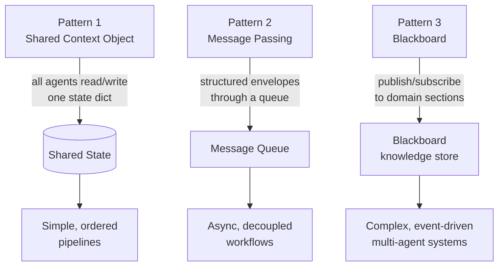
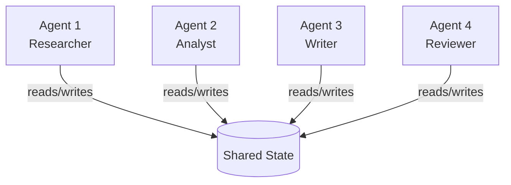
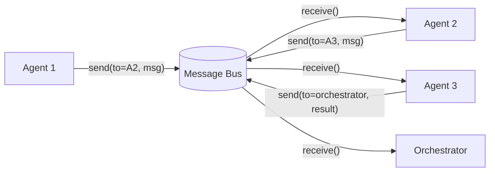
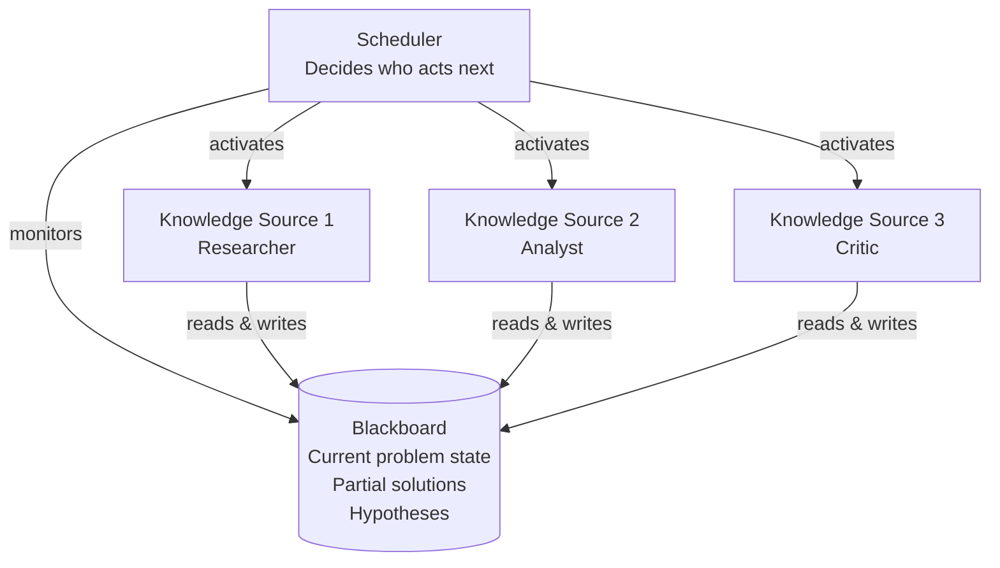

# Agent Communication Protocols

**Level**: 🔴 Advanced
**Reading Time**: 12 minutes

> The difference between a multi-agent system that scales and one that falls apart is how agents communicate — too tightly coupled and you get race conditions; too loosely coupled and you lose coherence.

## 🗺️ Quick Overview



*Three communication patterns — shared context, message passing, and blackboard — each trade coupling for consistency at different scales.*

## The Problem

Once you have multiple agents, they need to share information. How?

The naive approach: dump everything into a global shared dictionary and let every agent read/write. It works for 2 agents in a prototype. With 10 agents running concurrently, you get race conditions, dirty reads, and no audit trail.

There are three mature patterns for agent communication, each with different consistency, coupling, and debugging trade-offs. This article covers all three.

## Pattern 1: Shared Context Object

All agents read from and write to a single shared state object. This is the simplest approach and works well when agents have a clear order of operations.



```
SharedState = {
  // Input
  originalTask: string,
  userContext: dict,

  // Accumulated results — each agent adds its section
  researchFindings: null,      // Set by Agent 1
  analysisReport: null,        // Set by Agent 2
  draftDocument: null,         // Set by Agent 3
  reviewFeedback: null,        // Set by Agent 4

  // Coordination
  completedSteps: set(),
  errors: list(),
  tokenBudget: { total: 100000, used: 0 }
}

// Agent reads what it needs, writes its result
function agentRun(agentId, state):
  // Read relevant parts of shared state
  context = buildContext(agentId, state)

  // Execute the agent
  result = runAgentLoop(context)

  // Write result back to shared state (with locking for concurrent agents)
  lock(state)
  state[outputKey(agentId)] = result
  state.completedSteps.add(agentId)
  state.tokenBudget.used += result.tokensUsed
  unlock(state)

  return result
```

**Pros**: Simple, full visibility, easy to debug (one object to inspect)
**Cons**: Race conditions if agents run concurrently, grows unbounded, no message history

### Handling Concurrency with Shared State

```
// Optimistic locking — check for conflicts
function writeToState(state, key, value, expectedVersion):
  if state.version != expectedVersion:
    raise ConcurrentModification("State changed since read")
  state[key] = value
  state.version += 1

// Or use append-only updates (safer)
function appendToState(state, key, value):
  if state[key] is null:
    state[key] = []
  state[key].append({ value: value, agentId: currentAgent, timestamp: now() })
```

## Pattern 2: Message Passing

Agents communicate by sending and receiving messages through a bus. No shared mutable state — each agent has an inbox.



```
// Message structure
Message = {
  id: string,
  fromAgent: string,
  toAgent: string,           // null for broadcast
  type: REQUEST | RESPONSE | EVENT | ERROR,
  payload: dict,
  correlationId: string,     // Links request to its response
  timestamp: datetime,
  ttl: int                   // Time-to-live in seconds
}

// Message bus
MessageBus = {
  queues: dict[agentId, Queue[Message]],

  send: function(message):
    if message.toAgent is null:
      // Broadcast — put in all queues
      for agentId in this.queues:
        this.queues[agentId].enqueue(message)
    else:
      this.queues[message.toAgent].enqueue(message)

  receive: function(agentId, timeout=30):
    return this.queues[agentId].dequeue(timeout=timeout)

  waitForResponse: function(correlationId, timeout=60):
    deadline = now() + timeout
    while now() < deadline:
      for queue in this.queues.values():
        msg = queue.peek()
        if msg.correlationId == correlationId and msg.type == RESPONSE:
          return queue.dequeue()
    raise TimeoutError("No response for " + correlationId)
}

// Agent with inbox pattern
function agentWithInbox(agentId, bus, taskQueue):
  while true:
    task = taskQueue.next()
    if task is null:
      break

    // Check inbox for relevant context from other agents
    inboundMessages = []
    while bus.hasMessage(agentId):
      inboundMessages.append(bus.receive(agentId))

    context = buildContextFromMessages(inboundMessages)
    result = runAgentLoop(context, task)

    // Send result to orchestrator
    bus.send(Message(
      fromAgent = agentId,
      toAgent = "orchestrator",
      type = RESPONSE,
      payload = result,
      correlationId = task.correlationId
    ))
```

**Pros**: Decoupled, auditable (messages are logs), easy to replay for debugging
**Cons**: More complex, requires message routing logic, async coordination is harder to reason about

## Pattern 3: Blackboard Pattern

Inspired by AI planning systems from the 1980s. A shared "blackboard" stores the current state of the problem. Agents are specialists who monitor the blackboard and contribute when they can add value.



```
Blackboard = {
  problem: string,
  hypotheses: list[Hypothesis],  // Current best partial answers
  evidence: list[Evidence],       // Facts gathered so far
  confidence: float,              // 0-1, how confident we are in current solution
  workingMemory: dict             // Scratchpad for agents
}

// Each agent checks if it can contribute
function canContribute(agent, blackboard):
  // Agent checks if there's work it can do given current blackboard state
  return agent.preconditions.all(satisfied by blackboard)

// Scheduler activates the right agent
function blackboardScheduler(blackboard, agents, maxCycles=50):
  for cycle in 1..maxCycles:
    if blackboard.confidence >= DONE_THRESHOLD:
      break

    // Find agents that can contribute
    eligible = [a for a in agents if canContribute(a, blackboard)]
    if eligible is empty:
      break

    // Pick best agent (could be priority-based, random, or LLM-decided)
    nextAgent = selectBestAgent(eligible, blackboard)

    // Agent reads blackboard, contributes
    contribution = nextAgent.run(blackboard)
    blackboard.apply(contribution)

  return blackboard.getBestHypothesis()
```

**Pros**: Excellent for exploratory tasks where the solution path isn't known upfront; agents contribute opportunistically
**Cons**: Hard to reason about ordering, non-deterministic, complex to debug

## Comparing the Three Patterns

| Dimension | Shared State | Message Passing | Blackboard |
|-----------|-------------|-----------------|------------|
| Coupling | Tight (all share state) | Loose (messages only) | Medium |
| Concurrency safety | Needs locking | Natural isolation | Needs scheduling |
| Debuggability | Inspect state dump | Replay messages | Complex to trace |
| Task types | Sequential workflows | Async pipelines | Exploratory problems |
| Complexity | Low | Medium | High |
| Real-world usage | LangGraph, most frameworks | AutoGen, event-driven | AI planning, game AI |

## Hybrid: Structured Handoff

In practice, many systems use a hybrid: shared state for the overall workflow, message passing for inter-agent calls:

```
// Structured handoff protocol
HandoffMessage = {
  fromAgent: string,
  toAgent: string,
  taskCompleted: Task,
  result: AgentResult,
  nextTask: Task,        // What the next agent should do
  sharedContext: dict    // Key context to pass forward (not the full state)
}

function handoffToNext(completedTask, result, nextAgent, sharedContext):
  handoff = HandoffMessage(
    fromAgent = currentAgent,
    toAgent = nextAgent,
    taskCompleted = completedTask,
    result = result,
    nextTask = determineNextTask(result),
    sharedContext = extractKeyContext(result, maxTokens=500)
  )
  bus.send(handoff)
  log.trace("handoff", { from: currentAgent, to: nextAgent, taskId: completedTask.id })
```

## Standards and Real Platforms

**LangGraph** uses a shared state object (typed dict) that flows through graph nodes. Agents (nodes) read from and write to this state. The graph edges determine flow.

**AutoGen** uses message passing. Agents have a `receive` method and can call other agents. Conversations between agents are the primary mechanism.

**OpenAI Swarm** (experimental) uses a handoff pattern — when agent A determines the task belongs to agent B, it returns a Handoff object that transfers control.

**Google's Agent2Agent (A2A) protocol**: A draft standard for agent-to-agent communication using structured JSON messages over HTTP. Defines task lifecycle: create, accept, work, complete.

## Common Pitfalls

1. **Shared state without locks**: Two agents writing to the same field simultaneously causes lost updates. Always serialize writes or use append-only fields.
2. **Messages without expiry**: If an agent crashes and never reads its inbox, messages pile up forever. Set TTL on all messages.
3. **No dead-letter queue**: Failed messages (undelivered, timed out) disappear silently. Route them to a dead-letter queue for inspection.
4. **Over-broadcasting**: An agent that broadcasts every intermediate result floods all agent inboxes. Be selective — send to specific recipients.
5. **State schema drift**: If agents write to shared state without a schema, one agent's field naming convention conflicts with another's. Define a typed schema upfront.

## Key Takeaways

- Three patterns: shared state (simple, sequential), message passing (decoupled, async), blackboard (exploratory)
- Shared state needs locking or append-only updates for concurrent agents
- Message passing provides natural audit trails — messages are logs
- Blackboard excels for problems where the solution path is unknown upfront
- Most production systems use hybrid approaches: shared state for overall workflow, messages for agent-to-agent calls
- Always add TTL on messages and define typed schemas for shared state to prevent silent failures
