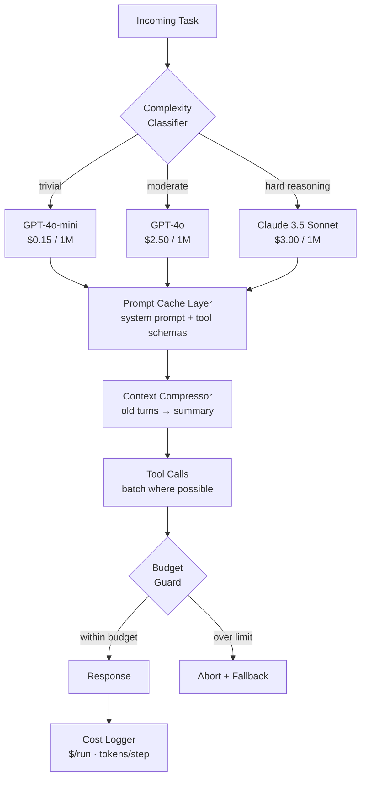
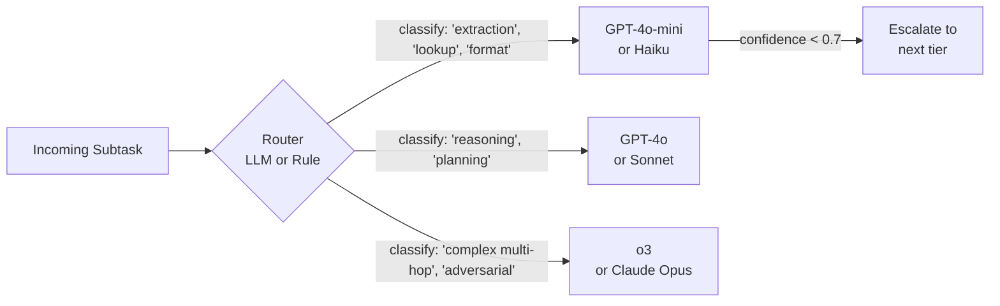
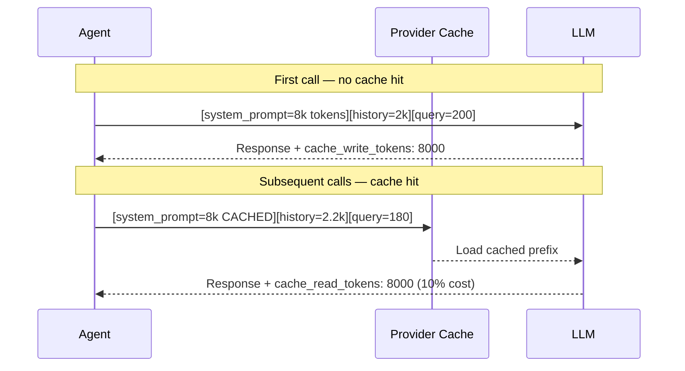
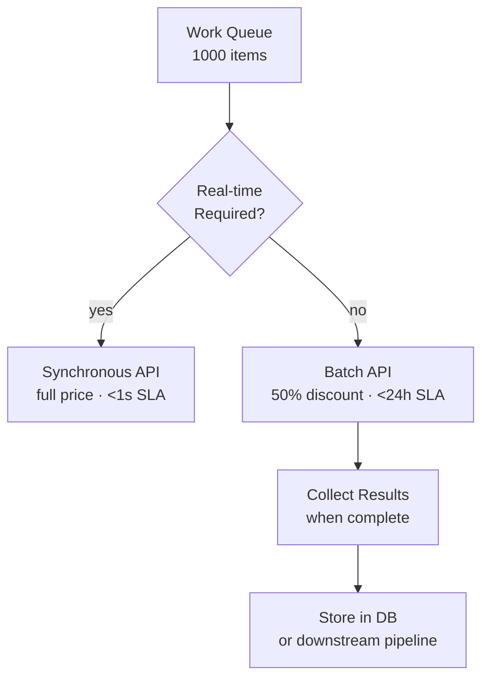

# Agent Cost Optimization

**Level**: 🟡 Intermediate
**Reading Time**: 14 minutes

> One agent call costs $0.001. One agent *workflow* running 30 tool calls with a 20k token context costs $0.60. At 50,000 runs/day, that's $30,000/day — from one pipeline.

---

## Level 1 — Surface (2-minute read)

### What It Is

Agent cost optimization is the set of techniques that reduce the dollar cost and latency of LLM-powered agent workflows without meaningfully degrading task success rate. It operates at four layers: **model selection**, **token reduction**, **caching**, and **batching**.

### When You Need This

- Your agent pipeline costs > $0.10 per run and runs > 1,000 times/day
- You have multi-step workflows where each step consumes a fresh, large context
- You're calling frontier models (GPT-4o, Claude Sonnet, Gemini Pro) for every subtask — including trivial ones
- Token usage per run exceeds 10,000 tokens across all LLM calls

### Core Concepts (5 bullets)

- **Route by complexity**: Use cheap models (GPT-4o-mini ~$0.15/1M tokens) for simple decisions; reserve expensive models (Claude 3.5 Sonnet ~$3/1M tokens) for hard reasoning — 10-20x cost difference.
- **Shrink the context**: Summarize conversation history before it gets appended to every subsequent call; a 10k-token history that becomes a 500-token summary saves $0.05 per call * 20 calls = $1.00 per run.
- **Cache prompt prefixes**: System prompts, tool schemas, and retrieved documents repeat across calls — Anthropic prompt caching returns cached tokens at 10% of normal input cost.
- **Batch async work**: Group non-time-sensitive requests into batches (OpenAI Batch API, Anthropic Message Batches) — 50% cost reduction on batch-eligible workloads.
- **Budget guards**: Hard-stop agents that exceed a token or dollar budget per run before they spiral; a runaway ReAct loop can consume 10x the expected tokens.

### Quick Reference Diagram



### Use This When / Don't Use This When

| Use this when | Don't use this when |
|---|---|
| Cost per run > $0.05 with high volume | Prototype / low volume (< 100 runs/day) |
| Multi-step ReAct or plan-execute loops | Single-call Q&A with small context |
| Long-running agents with persistent context | Tasks where model quality is the only metric |
| You can tolerate slight quality tradeoffs | Safety-critical pipelines (medical, legal) |

---

## Level 2 — Deep Dive

### Problem Statement

Imagine a customer support agent that:
1. Retrieves 5 documents from a vector store (avg 800 tokens each = 4,000 tokens)
2. Maintains a 10-turn conversation history (avg 2,000 tokens)
3. Has a 1,500-token system prompt with tool schemas
4. Runs 3 tool calls per session (each re-sending the full 7,500-token context)
5. Generates a 400-token final response

Total input tokens per session: ~7,500 * 4 calls = **30,000 tokens**
At Claude 3.5 Sonnet pricing ($3.00/1M input): **$0.09 per session**

At 50,000 sessions/day: **$4,500/day = $135,000/month**

This is the real cost problem in production agent systems. Below are three approaches to address it, from least to most invasive.

---

### Approach A — Model Routing by Task Complexity

**Principle**: Not every step in an agent pipeline requires the same model. Classify task complexity and route to the cheapest capable model.



**Implementation (Python pseudocode)**

```python
from enum import Enum
from dataclasses import dataclass

class Complexity(Enum):
    TRIVIAL = "trivial"      # lookup, extraction, classification
    MODERATE = "moderate"    # single-step reasoning, summarization
    HARD = "hard"            # multi-hop, planning, adversarial

MODEL_MAP = {
    Complexity.TRIVIAL:  "gpt-4o-mini",      # $0.15/1M input
    Complexity.MODERATE: "gpt-4o",            # $2.50/1M input
    Complexity.HARD:     "claude-3-5-sonnet", # $3.00/1M input
}

@dataclass
class RoutingDecision:
    complexity: Complexity
    model: str
    reason: str

def classify_complexity(task: str, context_tokens: int) -> RoutingDecision:
    """
    Rule-based classifier — avoids the irony of using a large model to decide
    which large model to use.
    """
    task_lower = task.lower()

    # Trivial signals
    trivial_keywords = ["extract", "classify", "format", "parse", "check if", "is it"]
    if any(kw in task_lower for kw in trivial_keywords) and context_tokens < 4000:
        return RoutingDecision(Complexity.TRIVIAL, MODEL_MAP[Complexity.TRIVIAL],
                               "keyword match + small context")

    # Hard signals
    hard_keywords = ["plan", "reason through", "step by step", "evaluate tradeoffs"]
    if any(kw in task_lower for kw in hard_keywords) or context_tokens > 15000:
        return RoutingDecision(Complexity.HARD, MODEL_MAP[Complexity.HARD],
                               "complex reasoning or large context")

    return RoutingDecision(Complexity.MODERATE, MODEL_MAP[Complexity.MODERATE],
                           "default moderate")

async def routed_call(task: str, context: str, messages: list) -> str:
    context_tokens = estimate_tokens(context + str(messages))
    routing = classify_complexity(task, context_tokens)

    response = await llm_call(
        model=routing.model,
        messages=messages,
        metadata={"routing_reason": routing.reason}
    )

    # Escalate if confidence is low (structured output check)
    if response.confidence < 0.6 and routing.complexity != Complexity.HARD:
        next_tier = {Complexity.TRIVIAL: Complexity.MODERATE,
                     Complexity.MODERATE: Complexity.HARD}
        escalated_model = MODEL_MAP[next_tier[routing.complexity]]
        response = await llm_call(model=escalated_model, messages=messages)

    return response.content
```

**Trade-offs**

| Dimension | Rule-based Router | Embedding Router | LLM Router |
|---|---|---|---|
| Cost | Zero overhead | ~$0.001 per call | $0.002–$0.01 per call |
| Accuracy | ~80% | ~88% | ~95% |
| Latency | <1ms | ~10ms | ~200ms |
| Maintenance | Medium | Low | Low |

**Savings**: Routing 60% of tasks to mini/haiku models at 10-20x lower cost yields a 60–80% reduction in model costs alone.

---

### Approach B — Context Compression and Prompt Caching

**Principle**: The biggest lever on cost is *how many tokens you send on each call*, not which model you use. Compress dynamic context and cache static context.

#### B1 — Prompt Caching

Static content (system prompts, tool schemas, retrieved documents) can be cached at the provider level. Cached tokens are charged at 10% (Anthropic) or 50% (OpenAI) of normal input rates.



**Implementation (Anthropic Python SDK)**

```python
import anthropic

client = anthropic.Anthropic()

SYSTEM_PROMPT = """You are an expert customer support agent for Acme Corp...
[long tool schemas and instructions — 6,000 tokens]"""

def call_with_cache(user_message: str, history: list[dict]) -> str:
    messages = history + [{"role": "user", "content": user_message}]

    response = client.messages.create(
        model="claude-3-5-sonnet-20241022",
        max_tokens=1024,
        system=[
            {
                "type": "text",
                "text": SYSTEM_PROMPT,
                "cache_control": {"type": "ephemeral"},  # cache this prefix
            }
        ],
        messages=messages,
    )

    usage = response.usage
    # usage.cache_creation_input_tokens — tokens written to cache (first call)
    # usage.cache_read_input_tokens    — tokens read from cache (subsequent calls)
    # Normal billing: cache_read * 0.10 * base_price

    return response.content[0].text
```

#### B2 — Context Compression (History Summarization)

```python
from typing import TypedDict

class Message(TypedDict):
    role: str
    content: str

SUMMARIZE_PROMPT = """Summarize this conversation in 3-5 bullet points.
Preserve: key facts, user intent, decisions made, pending actions.
Discard: filler text, repeated questions, greetings."""

async def compress_history(
    messages: list[Message],
    max_tokens: int = 2000,
    compressor_model: str = "gpt-4o-mini",  # cheap model for summarization
) -> list[Message]:
    """
    When history exceeds max_tokens, summarize older messages.
    Keeps the last 2 turns verbatim for recency context.
    """
    current_tokens = estimate_tokens(messages)
    if current_tokens <= max_tokens:
        return messages

    # Keep last 2 turns; summarize everything before
    recent = messages[-4:]  # last 2 user+assistant pairs
    older = messages[:-4]

    if not older:
        return messages  # can't compress further

    summary_text = await llm_call(
        model=compressor_model,
        messages=[
            {"role": "system", "content": SUMMARIZE_PROMPT},
            {"role": "user", "content": format_messages(older)},
        ]
    )

    compressed = [
        {"role": "assistant", "content": f"[Conversation summary]: {summary_text}"},
        *recent,
    ]

    return compressed
```

**Token savings example**:
- Before compression: 18,000 tokens of history
- After: 600-token summary + 2,000 recent tokens = 2,600 tokens
- Savings per call: 15,400 tokens @ $3.00/1M = **$0.046 per call**
- Over 20 calls in a session: **$0.92 saved per session**

---

### Approach C — Batching and Async Execution

**Principle**: For workloads that don't require real-time responses (nightly reports, bulk document processing, analytics pipelines), use batch APIs at 50% discount.



**Implementation (OpenAI Batch API — TypeScript)**

```typescript
import OpenAI from "openai";
import * as fs from "fs";

const client = new OpenAI();

interface BatchRequest {
  custom_id: string;
  method: "POST";
  url: "/v1/chat/completions";
  body: {
    model: string;
    messages: Array<{ role: string; content: string }>;
    max_tokens: number;
  };
}

async function submitBatchJob(documents: string[]): Promise<string> {
  // Build JSONL file of requests
  const requests: BatchRequest[] = documents.map((doc, i) => ({
    custom_id: `doc-${i}`,
    method: "POST",
    url: "/v1/chat/completions",
    body: {
      model: "gpt-4o-mini",
      messages: [
        { role: "system", content: "Extract key entities from the document." },
        { role: "user", content: doc },
      ],
      max_tokens: 500,
    },
  }));

  const jsonl = requests.map((r) => JSON.stringify(r)).join("\n");
  fs.writeFileSync("/tmp/batch_input.jsonl", jsonl);

  // Upload file
  const file = await client.files.create({
    file: fs.createReadStream("/tmp/batch_input.jsonl"),
    purpose: "batch",
  });

  // Submit batch
  const batch = await client.batches.create({
    input_file_id: file.id,
    endpoint: "/v1/chat/completions",
    completion_window: "24h",
  });

  console.log(`Batch submitted: ${batch.id}`);
  return batch.id;
}

async function pollBatch(batchId: string): Promise<any[]> {
  let batch = await client.batches.retrieve(batchId);

  while (batch.status !== "completed" && batch.status !== "failed") {
    await new Promise((resolve) => setTimeout(resolve, 30_000)); // poll every 30s
    batch = await client.batches.retrieve(batchId);
    console.log(`Status: ${batch.status} — ${batch.request_counts.completed}/${batch.request_counts.total}`);
  }

  if (batch.status === "failed") throw new Error("Batch failed");

  // Download results
  const outputFile = await client.files.content(batch.output_file_id!);
  const lines = (await outputFile.text()).split("\n").filter(Boolean);
  return lines.map((line) => JSON.parse(line));
}
```

**When batch API applies**:

| Workload | Batch Eligible? | Savings |
|---|---|---|
| Nightly document summarization | Yes | 50% |
| User analytics / labeling | Yes | 50% |
| Real-time chat responses | No | — |
| Sub-second agentic decisions | No | — |
| Scheduled report generation | Yes | 50% |

---

### Comparison: All Three Approaches

| Approach | Effort | Typical Savings | Quality Impact | Best For |
|---|---|---|---|---|
| Model Routing | Medium | 60–80% model cost | Low (if routing is accurate) | Multi-step agents with mixed task complexity |
| Prompt Caching | Low | 10–30% on input | Zero | Any agent with large static system prompts |
| Context Compression | Medium | 40–70% on input | Low-medium | Long-running conversational agents |
| Batch API | Low | 50% all costs | Zero | Offline / async workloads |
| All combined | High | 75–90% total | Low | Production pipelines at scale |

---

### Production Telemetry You Must Track

Cost optimization without measurement is guesswork. Instrument every LLM call:

```python
import time
from dataclasses import dataclass, field
from typing import Optional

@dataclass
class LLMCallMetrics:
    session_id: str
    model: str
    step: str
    input_tokens: int
    output_tokens: int
    cache_read_tokens: int = 0
    cache_write_tokens: int = 0
    latency_ms: float = 0.0
    cost_usd: float = field(init=False)

    # Pricing per 1M tokens (update these as providers change rates)
    PRICING = {
        "gpt-4o-mini":           {"input": 0.15,  "output": 0.60,  "cache": 0.075},
        "gpt-4o":                {"input": 2.50,  "output": 10.00, "cache": 1.25},
        "claude-3-5-sonnet":     {"input": 3.00,  "output": 15.00, "cache": 0.30},
        "claude-3-haiku":        {"input": 0.25,  "output": 1.25,  "cache": 0.025},
    }

    def __post_init__(self):
        p = self.PRICING.get(self.model, {"input": 1.0, "output": 4.0, "cache": 0.5})
        self.cost_usd = (
            (self.input_tokens / 1_000_000) * p["input"]
            + (self.output_tokens / 1_000_000) * p["output"]
            + (self.cache_read_tokens / 1_000_000) * p["cache"]
            + (self.cache_write_tokens / 1_000_000) * p["input"]  # write at full price
        )

class CostTracker:
    def __init__(self, budget_usd: float = 1.0):
        self.calls: list[LLMCallMetrics] = []
        self.budget_usd = budget_usd

    def record(self, metric: LLMCallMetrics):
        self.calls.append(metric)
        if self.total_cost() > self.budget_usd:
            raise BudgetExceededError(
                f"Session cost ${self.total_cost():.4f} exceeded budget ${self.budget_usd}"
            )

    def total_cost(self) -> float:
        return sum(c.cost_usd for c in self.calls)

    def total_tokens(self) -> int:
        return sum(c.input_tokens + c.output_tokens for c in self.calls)

    def cache_hit_rate(self) -> float:
        total_input = sum(c.input_tokens for c in self.calls)
        cache_reads = sum(c.cache_read_tokens for c in self.calls)
        return cache_reads / max(total_input, 1)

    def summary(self) -> dict:
        return {
            "total_cost_usd": round(self.total_cost(), 5),
            "total_tokens": self.total_tokens(),
            "call_count": len(self.calls),
            "cache_hit_rate": round(self.cache_hit_rate(), 3),
            "cost_per_call": round(self.total_cost() / max(len(self.calls), 1), 5),
            "breakdown_by_model": self._by_model(),
        }

    def _by_model(self) -> dict:
        models: dict = {}
        for c in self.calls:
            if c.model not in models:
                models[c.model] = {"cost": 0, "calls": 0}
            models[c.model]["cost"] += c.cost_usd
            models[c.model]["calls"] += 1
        return models
```

---

### Real Company Examples

**1. Anthropic (Claude.ai)**

Anthropic documents that prompt caching delivers 10x cost reduction on cached tokens. For systems sending the same multi-thousand-token system prompt on every message, enabling `cache_control: {type: "ephemeral"}` on the system block reduces costs by 30–50% immediately, with no code changes to business logic.

Reference: [Anthropic Prompt Caching Docs](https://docs.anthropic.com/en/docs/build-with-claude/prompt-caching)

**2. LangChain**

LangChain's callback system (`get_openai_callback()`) was built specifically to address production cost surprises. Teams using LangChain in production report that *without* token tracking, a single poorly-written prompt template in a loop can multiply costs 10x before anyone notices. LangChain's `CostTrackingCallbackHandler` surfaces per-chain cost summaries.

```python
from langchain.callbacks import get_openai_callback

with get_openai_callback() as cb:
    result = chain.invoke({"input": user_query})

print(f"Total tokens: {cb.total_tokens}")
print(f"Total cost: ${cb.total_cost:.4f}")
print(f"Successful requests: {cb.successful_requests}")
```

Reference: [LangChain Token Counting](https://python.langchain.com/docs/modules/callbacks/token_counting/)

**3. CrewAI**

CrewAI's multi-agent orchestration assigns each agent a specific model. Production deployments at scale set `manager_llm="gpt-4o"` but `agent_llm="gpt-4o-mini"` for worker agents that do structured extraction, formatting, or classification — achieving a 5-10x cost reduction on worker steps with no measurable drop in task success rate.

```python
from crewai import Agent, Crew, Task

# Manager uses a powerful model for planning
manager = Agent(
    role="Research Manager",
    llm="gpt-4o",
    goal="Coordinate research and produce final synthesis"
)

# Workers use cheap models for data tasks
extractor = Agent(
    role="Data Extractor",
    llm="gpt-4o-mini",  # 10x cheaper
    goal="Extract structured data from documents"
)

summarizer = Agent(
    role="Summarizer",
    llm="claude-3-haiku-20240307",  # cheap, fast, good at summaries
    goal="Summarize extracted data into bullet points"
)
```

**4. AutoGen (Microsoft)**

AutoGen's `AssistantAgent` and `UserProxyAgent` model allows teams to assign different LLM backends per role. Microsoft's internal usage data (reported at MSR 2024) showed that 70% of agent-to-agent messages in multi-agent coding workflows were status updates and acknowledgements — not reasoning tasks. Replacing those with a 4o-mini call reduced end-to-end pipeline cost by 55%.

**5. LlamaIndex**

LlamaIndex's `LLMPredictor` with a `ContextChatEngine` benefits enormously from their `CondensePlusContextMode` — rather than passing the full chat history + retrieved context on every call, it first condenses the history into a single query with a cheap model, then retrieves against that condensed query. This reduces average context size per call by 60%.

```python
from llama_index.core import VectorStoreIndex
from llama_index.core.chat_engine import CondensePlusContextChatEngine
from llama_index.llms.openai import OpenAI

# Condense step uses cheap model
condense_llm = OpenAI(model="gpt-4o-mini")

# Final answer uses better model only when needed
answer_llm = OpenAI(model="gpt-4o")

index = VectorStoreIndex.from_documents(documents)
chat_engine = CondensePlusContextChatEngine.from_defaults(
    retriever=index.as_retriever(),
    condense_llm=condense_llm,
    llm=answer_llm,
)
```

---

### Common Mistakes

**Mistake 1: Using frontier models for classification tasks**

Root cause: Developers prototype with one model and never revisit the choice.
Impact: A classifier running Claude 3.5 Sonnet costs 10-20x more than GPT-4o-mini for the same quality on structured classification.
Fix: Benchmark your classification tasks on the cheapest models first. Escalate only when F1 drops below 0.90.

**Mistake 2: Re-sending the full context on every tool call**

Root cause: Stateless API architecture — the full message history is passed on every call to maintain "context."
Impact: A 10-step agent with a 15,000-token context sends 150,000 tokens total, but 130,000 of those are repeated history.
Fix: Use prompt caching for the static prefix. Use context compression after every 5-turn window.

**Mistake 3: No budget guard on autonomous agents**

Root cause: ReAct loops and plan-execute agents can get stuck in retry loops, calling tools 50+ times instead of the expected 5.
Impact: A $0.50 expected run costs $5–$50 before timing out.
Fix: Enforce `max_steps` and `max_cost_usd` guards at the agent runner level. Log every step. Alert on any run that exceeds 2x expected token count.

**Mistake 4: Ignoring output token cost**

Root cause: Developers focus on input token costs because they're more visible.
Impact: Output tokens cost 4-5x more per token than input tokens. A verbose model generating 2,000-token responses instead of 400-token responses is 5x more expensive on the output side.
Fix: Use `max_tokens` limits. Instruct models to be concise. Prefer structured output (JSON with specific fields) over free-form prose that tends to pad.

**Mistake 5: Running batch-eligible work synchronously**

Root cause: Batch APIs feel like "later, not now" — developers default to synchronous calls.
Impact: Paying full price for nightly report generation, bulk labeling jobs, and analytics pipelines — all of which have no real-time SLA.
Fix: Identify any workload with a >5 minute acceptable latency and route it through the batch API.

---

### Key Takeaways / TL;DR

- **Route by complexity**: Sending 60% of tasks to a 10-20x cheaper model yields the biggest savings with the least quality risk.
- **Cache your static prefixes**: Large system prompts and tool schemas are prime cache candidates — Anthropic caches at 10% of normal input cost after the first call.
- **Compress context aggressively**: A 15k-token history summarized to 500 tokens saves $0.04–$0.09 per call; over 20 calls in a session that's $0.80–$1.80 per user session.
- **Batch async workloads**: Anything without a sub-second SLA qualifies for batch APIs — 50% discount, no quality tradeoff.
- **Budget guards are non-negotiable**: Autonomous agents without hard token/cost ceilings will eventually spiral; a single runaway session can cost 10-100x the expected amount.

---

## References

- 📚 [Anthropic: Prompt Caching](https://docs.anthropic.com/en/docs/build-with-claude/prompt-caching)
- 📚 [OpenAI: Production Best Practices](https://platform.openai.com/docs/guides/production-best-practices)
- 📖 [LangChain: Token Usage Tracking](https://python.langchain.com/docs/modules/callbacks/token_counting/)
- 📖 [Building LLM Applications for Production — Chip Huyen](https://huyenchip.com/2023/04/11/llm-engineering.html)
- 📖 [How Anyscale Reduced LLM Costs by 75%](https://www.anyscale.com/blog/llm-cost-savings)
