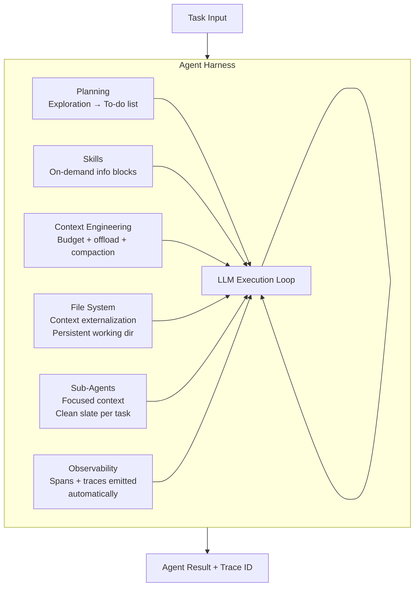

# Agent Harness Design

**Level**: 🔴 Advanced
**Reading Time**: 16 minutes

> Raw LLM + tools = prototype. LLM + harness = production. The harness is the product. Manus's success came from its harness, not its model. Claude Code's value is its harness, not just Claude.

## 🗺️ Quick Overview



*Six pillars form the harness. The LLM loop sits at the center — but every pillar is required for the system to be reliable, observable, and economical at production scale.*

## What a Harness Is

A harness is the full scaffold around the LLM loop that handles the entire agent lifecycle — from receiving a task to producing a verified result. It's the difference between a demo that works once and a system that works reliably at 3AM when nobody is watching.

Without a harness:
- The LLM decides whether it's done — there's no external verification
- Errors are unrecoverable — one failed tool call ends the run
- Context grows unchecked until the window overflows
- You don't know what the agent did — no traces, no replay
- Sub-tasks get tangled in a single monolithic context that degrades as it grows

With a harness:
- Planning happens before execution — the agent knows its own checklist
- Sub-agents handle deep subtasks in isolated context windows
- Tool results too large for context are offloaded to files automatically
- On-demand skills inject the right information at the right moment
- Every step emits an observable trace without the developer instrumenting anything
- Context compaction runs automatically before the window overflows

Harrison Chase (CEO of LangChain) frames it this way: "Manus's success wasn't the model — it was the harness. When you look at what Deep Agents does for coding, the harness is the product. Claude Code — the harness is the product, not just Claude behind it."

## Framework vs. Harness vs. Platform

Before building, understand what category of tool you're reaching for:

| Layer | Examples | What it provides | Who assembles |
|-------|----------|-----------------|---------------|
| **Framework** | LangChain, LlamaIndex, CrewAI | Building blocks: LLM wrappers, tool abstractions, memory interfaces | You assemble the full system |
| **Harness** | Deep Agents, Claude Code, AutoGen (v2) | Opinionated scaffold: batteries included, you configure | Harness handles the agent loop |
| **Platform** | LangSmith, Langfuse, Arize | Observability, deployment, eval infra | Where the harness runs and is monitored |

These layers compose. A typical production stack: **LangGraph (framework)** for building custom agent logic → **LangSmith (platform)** for tracing and evaluation. Or: **Deep Agents (harness)** with custom tools deployed on **your own infra**, traces flowing to **Langfuse (platform)**.

The harness is the layer most developers underinvest in. Frameworks give you the Lego bricks. Platforms give you the observability dashboard. The harness is the structural engineering that holds the bricks together under production load.

## The Six Pillars

### Pillar 1: Planning

The single biggest reliability improvement for complex agents: make them plan before they act.

Naive agents execute reactively — each step is a response to the current state. Planning agents first explore the task, build a structured to-do list, then execute against it. The difference:

- **Reactive**: agent decides on the next step based only on what just happened. No global awareness of task scope. Prone to getting lost in sub-problems or repeating work.
- **Planned**: agent starts with an exploration phase ("what do I need to understand to do this?"), builds a to-do list, executes steps in order, marks completions, and self-corrects against the plan.

The to-do list is key. It's not a rigid upfront specification — it's a living document the agent updates as it learns more. The plan is a tool, not a constraint.

```
// Planning phase in a coding agent
function planningPhase(task):
  // Exploration: understand the task before acting
  explorationResults = []

  // Explore codebase structure
  dirListing = tools.list_directory(".")
  explorationResults.append(dirListing)

  // Read key files
  for file in inferKeyFiles(task, dirListing):
    content = tools.read_file(file)
    explorationResults.append(content)

  // Now build the plan
  plan = LLM.generate(
    [SystemPrompt(PLANNING_INSTRUCTIONS)] +
    [HumanMessage("Task: " + task)] +
    explorationResults +
    [HumanMessage("""
      Based on your exploration, create a to-do list.
      Each item should be: specific, verifiable, and independently executable.
      Mark items [TODO], [IN_PROGRESS], or [DONE].
    """)]
  )

  return Plan(plan.text, task)

// Plan as a tool (agent can update it during execution)
TODO_LIST_TOOL = {
  name: "update_todo",
  description: "Update the to-do list. Mark steps done, add new steps, reorder.",
  parameters: {
    action: "MARK_DONE | ADD_STEP | REORDER",
    stepId: string,
    content: string  // for ADD_STEP
  }
}
```

The planning phase adds latency (1-3 extra LLM calls). The trade-off is worth it: planned agents complete complex tasks significantly more reliably than reactive agents because they don't lose track of what they were doing.

### Pillar 2: Sub-Agents

Sub-agents handle deep subtasks in isolated context windows. The motivating problem: a large agent doing 10 things in one context window eventually degrades. By step 80, the early context about the original goal is pushed out or diluted.

Sub-agents give each subtask a clean context slate:

```
// Spawning a sub-agent for a focused subtask
function spawnSubAgent(subtask, parentContext):
  // Sub-agent gets: the specific subtask + minimal parent context
  // NOT the full parent context (that's the point)
  subAgentContext = {
    task: subtask.description,
    relevantFiles: subtask.requiredFiles,
    constraints: subtask.constraints,
    // Deliberately minimal — clean slate
  }

  result = SubAgent(
    model = FOCUSED_MODEL,
    context = subAgentContext,
    tools = subtask.requiredTools,  // Only the tools for this subtask
    maxSteps = subtask.estimatedSteps * 2,
    workingDir = createTempDir()
  ).run()

  return result

// Parent agent orchestrates sub-agents
function orchestratorLoop(plan, tools):
  while not plan.isComplete():
    nextStep = plan.nextStep()

    if nextStep.isComplexSubtask:
      // Delegate to sub-agent — isolated context
      result = spawnSubAgent(nextStep, minimalContext(plan))
      plan.markDone(nextStep, result.summary)
    else:
      // Handle directly — small, bounded step
      result = executeSingleStep(nextStep, tools)
      plan.markDone(nextStep, result)
```

Sub-agents also enable parallelism. Independent subtasks can run simultaneously in separate sub-agents, each with their own context, with results merged by the orchestrator.

The cost: spawning a sub-agent adds latency (new session init) and tokens (new context setup). Only use them for genuinely deep subtasks, not for simple single-step operations.

### Pillar 3: File System

The file system is the harness's persistent memory layer and the primary tool for context offloading.

Two uses:
1. **Context externalization**: Large tool results go to files. Agent references the path, reads on demand. See [Context Engineering](./context-engineering) for the full pattern.
2. **Persistent working state**: Intermediate results, scraped data, generated code drafts — all written to a working directory that persists across sub-agent invocations and even across sessions.

```
// Working directory as agent state
WorkingDirectory = {
  root: "/tmp/agent_session_{sessionId}/",

  write: function(filename, content):
    path = this.root + filename
    writeFile(path, content)
    this.manifest.add(path, {
      size: content.length,
      createdAt: now(),
      description: inferDescription(filename, content[:200])
    })
    return path

  list: function():
    return this.manifest.entries()  // Agent can list what's been written

  read: function(path):
    return readFile(path)  // Agent reads on demand
}

// Tool result offload threshold
INLINE_THRESHOLD = 5_000   // tokens — inject directly into context
SUMMARIZE_THRESHOLD = 20_000  // tokens — summarize then inject
FILE_OFFLOAD_THRESHOLD = 20_000  // tokens — write to file, pass path

function handleToolResult(result, workingDir, contextBudget):
  tokens = countTokens(result)

  if tokens <= INLINE_THRESHOLD:
    return ToolResult(result)

  elif tokens <= SUMMARIZE_THRESHOLD:
    summary = LLM.summarize(result, maxTokens=600)
    return ToolResult("[Summarized]\n" + summary)

  else:
    path = workingDir.write(generateFilename(), result)
    preview = result[:500]
    return ToolResult(
      "Result too large for inline context (" + tokens + " tokens).\n" +
      "Saved to: " + path + "\n" +
      "Preview:\n" + preview
    )
```

### Pillar 4: Skills

Skills are on-demand information blocks loaded into the context window as the agent progresses. They're distinct from tools (no API call, just text injection) and distinct from the static system prompt (loaded selectively, not always).

```
// Skills directory structure
skills/
  sql-patterns.md        // How to write efficient queries for this codebase
  api-authentication.md  // How our API auth works
  coding-standards.md    // Team's coding conventions
  deployment-checklist.md // Steps before deploying
  customer-tier-matrix.md // Customer tier features and limits

// Harness loads skills based on current step context
function loadRelevantSkills(step, skillsDir, contextBudget):
  availableSkills = listSkills(skillsDir)

  // Self-directed: model requests specific skills by name
  if step.requestedSkills:
    return loadByName(step.requestedSkills, skillsDir, contextBudget)

  // Deterministic: map task keywords to skills
  keywords = extractKeywords(step.description)
  matching = availableSkills.filter(skill =>
    skill.tags.any(tag => keywords.includes(tag))
  )

  return loadWithBudget(matching, contextBudget.skills)
```

The enterprise use case: a general-purpose coding agent (like Claude Code) plus custom skills files that teach it your company's specific patterns. No model fine-tuning needed — the skills files are the customization layer.

### Pillar 5: Context Engineering

The harness handles context management automatically. The developer shouldn't have to think about token counts during normal development — the harness enforces the budget.

```python
class ContextBudget:
    TOTAL = 200_000       # tokens

    SYSTEM_PROMPT = 4_000
    SKILLS = 2_000        # per loaded skill
    TOOL_DEFINITIONS = 3_000
    HISTORY = 80_000      # rolling window
    WORKING_MEMORY = 10_000
    TOOL_RESULTS = 100_000  # overflow → file system
    OUTPUT_RESERVE = 8_000  # always reserve for model response
```

See [Context Engineering](./context-engineering) for the full discipline. In the harness, context engineering is operationalized as:
- Automatic budget checking before every LLM call
- Automatic tool result offloading above the file threshold
- Automatic history compaction at 75% of the history budget
- Stable prefix ordering for prompt cache hits

### Pillar 6: Observability

A well-designed harness emits full observability automatically. The developer gets traces of every step without manual instrumentation.

What a trace from a production harness looks like:

```
Trace: agent_run_{runId}
├── span: planning_phase (2.3s)
│   ├── span: list_directory (50ms)
│   ├── span: read_file (auth.py) (120ms)
│   └── span: llm_call (plan generation) (1.8s)
│       └── output: plan with 7 steps
├── span: execution_step_1 (3.1s)
│   ├── span: load_skills (coding-standards) (10ms)
│   ├── span: llm_call (80K tokens in, 450 tokens out) (2.4s)
│   └── span: tool_call (bash: run tests) (680ms)
├── span: sub_agent_spawn (step 4 - refactor module) (18.4s)
│   ├── span: sub_agent_planning (1.2s)
│   ├── span: sub_agent_execution_loop (15.8s)
│   │   └── [8 nested tool calls]
│   └── span: sub_agent_result (merge summary)
├── event: context_compaction_triggered (at step 6, 78% usage)
├── event: hitl_pause (step 5 - awaiting human approval)
├── span: execution_step_7 (final verification) (4.2s)
└── output: AgentResult(success=True, trace_id="abc123")
```

Every LLM call shows input/output token counts. Every tool call shows latency. Every sub-agent gets its own trace nested under the parent. Cost is computable from the trace. Debugging is possible by replaying any specific step.

The harness emits all of this automatically — the developer gets it for free.

## Full Harness Pseudocode

```python
class AgentHarness:
    def __init__(self, model, tools, skills_dir, working_dir, tracer):
        self.model = model
        self.tools = tools           # includes todo_list, bash, sub_agent_spawn
        self.skills_dir = skills_dir # on-demand info blocks
        self.working_dir = working_dir  # file system for context offload
        self.tracer = tracer
        self.context = ContextBudget()

    def run(self, task: str) -> AgentResult:
        with self.tracer.span("agent_run") as span:

            # Phase 1: Planning — exploration before execution
            with self.tracer.span("planning_phase"):
                plan = self._planning_phase(task)
                span.add_event("plan_created", {"steps": len(plan.steps)})

            # Phase 2: Execution loop
            while not plan.is_complete():
                step = plan.next_step()

                with self.tracer.span("execution_step", {"step_id": step.id}):

                    # Load relevant skills into context for this step
                    skills = self._load_skills(step)
                    self.context.inject_skills(skills)

                    # Get tools relevant to current phase
                    active_tools = self._get_tools_for_phase(plan.current_phase())

                    # Run LLM step
                    with self.tracer.span("llm_call") as llm_span:
                        action = self.model.invoke(
                            self.context.render(),
                            tools=active_tools
                        )
                        llm_span.set_tokens(action.input_tokens, action.output_tokens)

                    if action.is_final_answer():
                        plan.mark_complete(step, action.answer)
                        continue

                    # Execute tool
                    result = self._execute(action)

                    # Offload large results to file system
                    processed_result = self._process_result(result)

                    self.context.append(action, processed_result)
                    span.add_event("tool_call", {
                        "tool": action.tool_name,
                        "result_tokens": len(processed_result)
                    })

                    # Check if context needs compaction
                    if self.context.usage_ratio() > COMPACT_THRESHOLD:
                        with self.tracer.span("context_compaction"):
                            self.context.compact()

            return AgentResult(
                output=plan.final_output(),
                trace_id=span.trace_id,
                total_tokens=span.total_tokens()
            )

    def _planning_phase(self, task):
        # Exploration reads before building plan
        exploration = self._explore(task)
        plan_text = self.model.invoke(
            PLANNING_PROMPT + exploration + task
        )
        return Plan.parse(plan_text)

    def _execute(self, action):
        if action.tool_name == "spawn_sub_agent":
            with self.tracer.span("sub_agent"):
                return self._spawn_sub_agent(action.args)
        else:
            return self.tools[action.tool_name].call(action.args)

    def _process_result(self, result):
        tokens = count_tokens(result)
        if tokens > RESULT_SIZE_THRESHOLD:
            path = self.working_dir.write(result)
            return f"[Large result saved to {path}]\nPreview: {result[:300]}..."
        return result

    def _spawn_sub_agent(self, args):
        sub_harness = AgentHarness(
            model=self.model,
            tools=args.required_tools,
            skills_dir=self.skills_dir,
            working_dir=self.working_dir.create_subdir(),
            tracer=self.tracer.child_tracer()  # nested traces
        )
        return sub_harness.run(args.subtask)
```

## The Build vs. Buy Decision

When should you use an existing harness vs. build your own?

### Use a general-purpose harness when:
- Your task fits the harness's model (coding, research, customer support)
- You need to ship in days, not months
- The harness's observability and reliability properties are already production-grade
- You can customize via tools, skills, and instructions without touching the scaffold

**The enterprise playbook**: Take a general-purpose harness (Deep Agents, Claude Code-style) + write custom tools specific to your domain + write custom skills files that teach the agent your company's patterns. This gets you 80% of a custom harness with 10% of the build effort.

### Build a custom harness when:
- Your workflow has a rigid structure that doesn't match any general harness
- Your task requires specialized planning logic (not a general to-do list)
- You have strict latency or cost constraints the general harness can't meet
- Your observability requirements exceed what any off-the-shelf harness provides

**The build cost**: A production-grade harness takes months to get right. Planning robustness, context management edge cases, sub-agent error propagation, cost controls, HITL integration — each of these is non-trivial. Most teams underestimate this.

### Decision framework:

```
Question 1: Does an existing harness fit 80% of your workflow?
  Yes → Use it + customize via tools and skills
  No  → Continue to Question 2

Question 2: Do you have 2+ engineers for 3+ months to build properly?
  Yes → Build custom harness (but consider using a framework like LangGraph)
  No  → Use existing harness + accept the 20% fit gap, or reduce scope

Question 3: Will you maintain it as models and APIs evolve?
  Yes → Custom harness is viable long-term
  No  → Existing harness is safer — vendor handles model API changes
```

## Harness Evaluation Criteria

When evaluating an existing harness or reviewing a custom build:

| Criterion | What to check |
|-----------|---------------|
| **Planning reliability** | Does the agent build a plan before acting? Can it recover when a step fails? |
| **Context management** | Is token budget enforced? Is result offloading automatic? |
| **Observability** | Are LLM calls, tool calls, and sub-agents all traced without manual instrumentation? |
| **HITL support** | Can runs pause for human approval and resume without losing state? |
| **Error recovery** | What happens when a tool times out? When the LLM returns garbage? |
| **Cost controls** | Is there a max-token budget per run? A max-step limit? Cost estimation before run? |
| **Streaming** | Does the harness support streaming partial results to the user? |
| **Memory integration** | Can context persist across sessions via external memory? |
| **Sub-agent support** | Can tasks be delegated to focused child agents with isolated contexts? |

## The Evolution of Harnesses

Seeing the progression helps understand why the six pillars exist:

**AutoGPT (2023)**: The first widely known general agent harness. Showed the concept was viable — but had no reliable planning, no context management, no observability. Runs would spiral endlessly or fail in unrecoverable states. No sub-agents. Context would overflow silently.

**LangChain Chains + Agents (2023-2024)**: Added structure — chains gave predictable execution paths, agents added tool use. But the full harness still required the developer to assemble manually. Context management, planning, and observability were left as exercises.

**LangGraph (2024)**: Graph-based agent state machines. Explicit state, explicit transitions, proper context management via reducers. Still a framework — you build the harness, LangGraph gives you the structure.

**Deep Agents / Claude Code (2024-2025)**: First-class production harnesses. Planning is built in. Sub-agents are first-class. File system is the context offload layer. Observability is automatic. Skills are configurable. The developer's job is: write tools, write skills files, configure the harness.

**The lesson from the progression**: every component in the six pillars was added to solve a specific reliability failure. Planning because reactive agents got lost. Sub-agents because monolithic context degrades. File offload because tool results overflowed windows. Skills because static system prompts couldn't carry all context. Observability because debugging blind was impossible at scale.

## Real-World Case Studies

### Claude Code

The harness is the product:
- **Planning**: `TodoWrite` and `TodoRead` tools let the agent maintain a structured task list throughout a coding session
- **Sub-agents**: Claude Code spawns focused sub-agents for isolated subtasks when the main task is large
- **File system**: Reads files on demand (never dumps the whole codebase), writes results to temp files, uses a persistent working directory per session
- **Skills**: The system prompt (~2,000 lines) encodes coding patterns, verification steps, error recovery procedures — the harness's "skills" are in the system prompt itself
- **Context engineering**: Automatic compaction when the window reaches threshold; stable system prompt prefix for cache hits
- **Observability**: Every file read, bash call, and LLM invocation is traceable

### Manus

Manus's viral demos in early 2025 showed what a well-built harness could do:
- Complex multi-step web research tasks completed reliably
- The agent planned, executed sub-tasks, managed failures, and produced structured outputs
- Post-mortems by the community consistently concluded: the harness design, not the underlying model, was the differentiator
- A less capable model with a better harness outperforms a stronger model with no harness

### Deep Agents (LangChain's production harness)

The six pillars originated from Harrison Chase's description of Deep Agents:
- Planning tool (to-do list) as a first-class primitive
- Sub-agents with isolated contexts for deep subtasks
- File system as persistent state and context externalization
- Skills as on-demand, agent-requested info blocks
- Context engineering handled automatically by the harness
- Full LangSmith tracing out of the box

## Common Pitfalls

1. **No planning phase**: The agent dives into execution without understanding the full task scope. By step 20, it's lost track of what it was doing. Fix: always make the agent explore and plan before the first tool call.

2. **Single monolithic context**: All tasks run in one growing context. By the time the task is complete, the model's attention is spread across 100 prior steps. Fix: use sub-agents for deep subtasks, compact history regularly.

3. **Tool results go inline, always**: A bash command that returns 50,000 tokens of log output gets added to the message list. Context overflows in 3 steps. Fix: enforce file offload thresholds in the harness, not in each individual tool.

4. **Observability as afterthought**: "We'll add tracing after it works." When it doesn't work in production at 3AM, you have no trace to debug. Fix: emit traces from the start; the harness should handle this automatically.

5. **Skills in the static system prompt**: Including all skills in the system prompt always — even skills irrelevant to the current task. They consume tokens and potentially confuse the model with context for tasks it's not doing. Fix: load skills on demand.

6. **No HITL pause mechanism**: Agent runs to completion regardless of what it does. If step 12 requires deleting a production database, there's no way to pause for approval. Fix: build HITL pause points into the harness for high-impact actions.

7. **Treating the harness as a wrapper**: The harness is the product. Investing in it is investing in every task the agent will ever do. Teams that treat it as "just the loop around the LLM call" will rebuild it repeatedly from scratch as requirements emerge.

## Key Takeaways

- The harness is the full scaffold around the LLM loop: planning, sub-agents, file system, skills, context engineering, observability — all integrated
- Distinguish framework (building blocks you assemble), harness (opinionated scaffold, batteries included), platform (where the harness runs and is observed)
- The six pillars emerged to solve specific reliability failures — each one addresses a class of production problems that raw LLM+tools cannot handle
- Use a general-purpose harness + custom tools + custom skills files for most enterprise use cases — this gets 80% of a custom harness with 10% of the build effort
- Build custom only when: the workflow has a rigid structure the harness can't accommodate, or you have the engineering capacity for months of harness development
- Planning reliability, automatic context management, and built-in observability are the non-negotiable pillars — a harness missing any of these is not production-ready
- The progression AutoGPT → LangChain → LangGraph → Deep Agents/Claude Code shows the harness getting more complete with each generation; each addition solved a specific class of production failure
