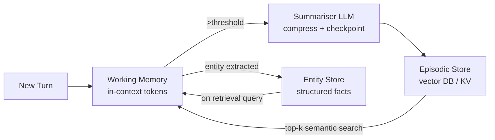
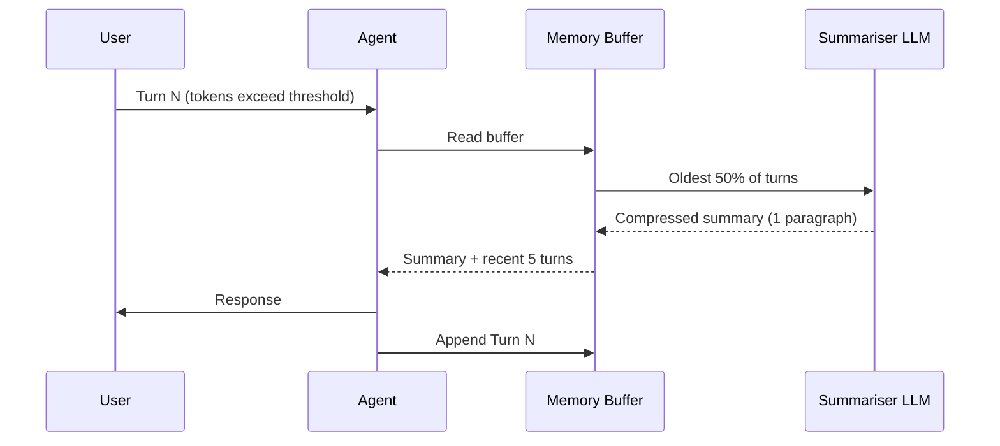
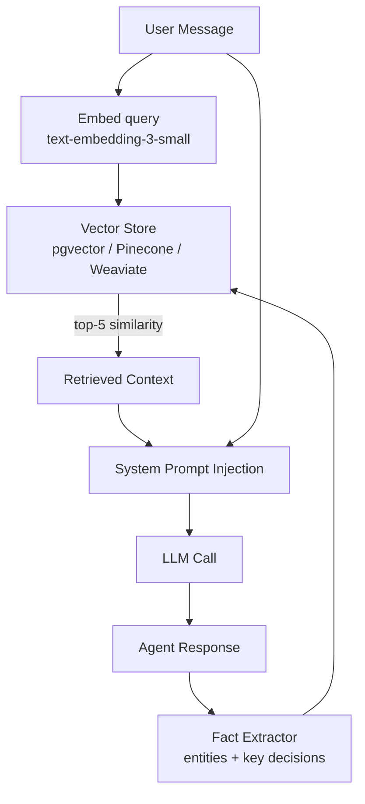
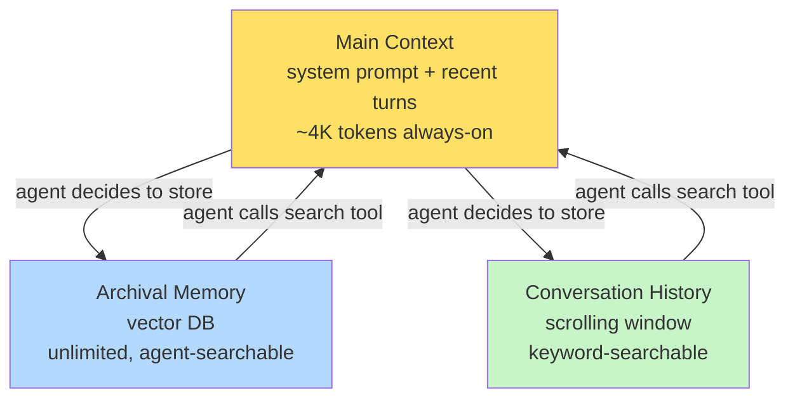
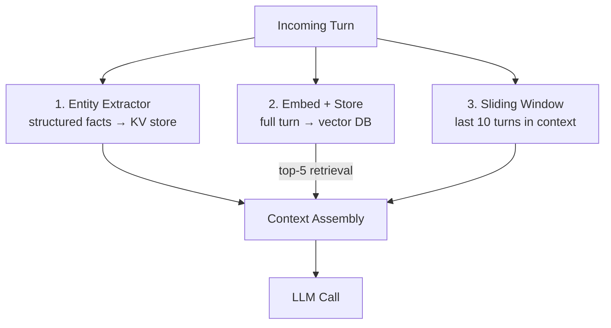

# Agent Memory Patterns

**Level**: 🟡 Intermediate
**Reading Time**: 14 minutes

> Memory is the difference between a stateless chatbot and an agent that actually learns. The patterns below tell you *how* to wire the layers together — not just what they are.

---

## Level 1 — Surface (2-minute read)

### What It Is

Agent memory patterns are **architectural recipes** for how an agent stores, retrieves, and forgets information across turns, sessions, and deployments. Unlike a single context-window dump, patterns define *when* data moves between hot (in-context) and cold (external) storage, and under what conditions it is retrieved, summarised, or discarded.

### When You Need This

- Your agent handles **multi-turn sessions longer than 50 turns** (context fills up fast)
- You want the agent to **remember users** across separate sessions (days/weeks later)
- Your agent runs **long background tasks** (hours) where full replay is prohibitive
- You are building a **team of agents** that must share state without dumping full histories into every prompt
- Latency or cost is an issue: you are spending > $0.01 per turn on tokens that are mostly stale context

### Core Concepts (3-5 bullets)

- **Write-through vs. write-back**: decide whether facts are saved to external memory immediately (write-through) or lazily on session end (write-back)
- **Retrieval triggering**: semantic similarity, recency, importance score, or keyword match — each changes what the agent "remembers"
- **Compression checkpoints**: summarise conversation history every N turns to keep working memory lean
- **Scoped memory**: per-user, per-task, per-agent-team — wrong scoping leaks private data or creates hallucinated cross-user context
- **Forgetting policies**: TTL expiry, access-count decay, explicit deletion — memory without forgetting eventually corrupts retrieval

### Quick Reference



| Use this when | Don't use this when |
|---|---|
| Sessions > 20 turns or > 30 days | Stateless single-turn Q&A |
| Agent must recall specific past facts | Token budget is not a concern |
| Multi-agent state sharing required | All context fits in 4K tokens |
| Personalisation or adaptation matters | Retrieval latency would break UX |

---

## Level 2 — Deep Dive

### Problem Statement

Consider a customer support agent handling 200 000 monthly sessions. Each session averages 18 turns. Without memory patterns:

- **Turn 1** costs 500 tokens (system prompt + user query)
- **Turn 18** costs ~8 000 tokens (full history replay)
- At GPT-4o pricing ($5 / 1M input tokens), 200 000 × 4 000 average tokens = **$4 000/month** just on repeated context
- When a user returns next week, the agent has **zero recall** — they re-explain everything

With well-designed memory patterns, average input tokens drop to 1 500 per turn (relevant retrieved context only), cutting that bill to **~$1 500/month** and enabling cross-session continuity.

---

### Approach A — Sliding Window + Summarisation

**How it works**: Keep only the last N turns verbatim in the context window. When N is exceeded, run a compression step that summarises older turns and stores the summary as a single message (or in episodic store).

```python
# Python pseudocode — LangChain-style sliding window with summarisation
from langchain.memory import ConversationSummaryBufferMemory
from langchain_openai import ChatOpenAI

llm = ChatOpenAI(model="gpt-4o-mini")

memory = ConversationSummaryBufferMemory(
    llm=llm,
    max_token_limit=2000,          # keep recent turns verbatim up to 2K tokens
    return_messages=True,
    memory_key="chat_history",
)

# Each call automatically compresses when buffer exceeds max_token_limit
chain.invoke({"input": user_message, "chat_history": memory.load_memory_variables({})["chat_history"]})
memory.save_context({"input": user_message}, {"output": agent_reply})
```

**Mermaid — Sliding Window Flow**



**Trade-offs**

| Dimension | Sliding Window + Summarisation |
|---|---|
| Token cost | Low — recent window only |
| Latency overhead | +200–500ms for summarisation LLM call |
| Information loss | Medium — summaries lose precise details |
| Implementation complexity | Low — LangChain/LlamaIndex built-in |
| Cross-session recall | None without episodic store |

**When to use**: chat assistants, customer support, copilots with moderate history depth (< 100 turns).

---

### Approach B — Semantic Retrieval (RAG-based Memory)

**How it works**: Every turn, significant facts, decisions, and user statements are embedded and stored in a vector database. On each new turn, the agent retrieves the top-k most relevant memories via cosine similarity search and injects them into the system prompt.

```typescript
// TypeScript pseudocode — LlamaIndex VectorMemory pattern
import { VectorStoreIndex, SimpleVectorStore, Document } from "llamaindex";

const memoryStore = new SimpleVectorStore();
const index = await VectorStoreIndex.init({ vectorStore: memoryStore });

async function saveMemory(text: string, metadata: Record<string, unknown>) {
  const doc = new Document({ text, metadata: { ...metadata, ts: Date.now() } });
  await index.insert(doc);
}

async function retrieveMemory(query: string, topK = 5): Promise<string[]> {
  const retriever = index.asRetriever({ similarityTopK: topK });
  const nodes = await retriever.retrieve(query);
  return nodes.map((n) => n.node.getText());
}

// Before each LLM call:
const relevantMemories = await retrieveMemory(userMessage, 5);
const systemPrompt = `
You are a helpful assistant.
Relevant context from past interactions:
${relevantMemories.join("\n---\n")}
`;
```

**Mermaid — RAG Memory Flow**



**Trade-offs**

| Dimension | RAG Memory |
|---|---|
| Token cost | Low — only inject what's relevant |
| Retrieval latency | +50–150ms (vector search) |
| Information loss | Low — verbatim storage |
| Implementation complexity | Medium — needs vector DB infra |
| Cross-session recall | Excellent |
| Staleness | Can return outdated facts if not updated |

**When to use**: personal assistants, research agents, CRM copilots — anywhere long-term user-specific recall matters.

---

### Approach C — Structured Entity Memory

**How it works**: An extraction LLM (or regex/NER pipeline) parses each turn for named entities and facts (e.g., "user's name is Alice", "prefers dark mode", "has a subscription expiring 2026-08-01"). These are stored in a key-value or graph store, not a vector DB. Retrieval is exact-match or schema-driven, not semantic.

```python
# Python pseudocode — entity extraction + KV store
import json
from openai import OpenAI

client = OpenAI()

ENTITY_SCHEMA = {
    "user_name": None,
    "subscription_tier": None,
    "preferences": [],
    "open_issues": [],
}

def extract_entities(conversation_turn: str, existing: dict) -> dict:
    response = client.chat.completions.create(
        model="gpt-4o-mini",
        response_format={"type": "json_object"},
        messages=[
            {"role": "system", "content": f"""
Extract or update entity facts from the conversation.
Current state: {json.dumps(existing)}
Return updated JSON with same keys. Only update if new info found.
"""},
            {"role": "user", "content": conversation_turn},
        ]
    )
    return json.loads(response.choices[0].message.content)

def build_entity_context(entity_store: dict) -> str:
    lines = []
    for k, v in entity_store.items():
        if v:
            lines.append(f"- {k}: {v}")
    return "\n".join(lines) if lines else ""

# Usage
entity_store = ENTITY_SCHEMA.copy()
entity_store = extract_entities(user_turn, entity_store)

# Inject into prompt
context = build_entity_context(entity_store)
```

**Trade-offs**

| Dimension | Structured Entity Memory |
|---|---|
| Token cost | Very low — compact structured facts |
| Precision | High — no semantic drift |
| Coverage | Low — misses unstructured context |
| Conflicting updates | Risky — must resolve contradictions |
| Implementation complexity | Medium — schema design is hard |

**When to use**: user profile management, booking agents, e-commerce personalisation — structured facts about well-known entities.

---

### Approach D — Hierarchical / MemGPT Pattern

**How it works**: Inspired by the MemGPT paper (Stanford, 2023), the agent has explicit control over its own memory. There is a small "main context" (hot memory) and a larger external store (archival memory). The agent itself decides — via tool calls — what to push to archival storage and what to retrieve back into context.

```python
# Python pseudocode — MemGPT-style self-managed memory
MEMORY_TOOLS = [
    {
        "name": "core_memory_append",
        "description": "Append a fact to the agent's core (always-visible) memory block.",
        "parameters": {"block": "string", "content": "string"},
    },
    {
        "name": "archival_memory_insert",
        "description": "Store a message or summary in long-term archival memory.",
        "parameters": {"content": "string"},
    },
    {
        "name": "archival_memory_search",
        "description": "Search archival memory by semantic query.",
        "parameters": {"query": "string", "page": "int"},
    },
    {
        "name": "conversation_search",
        "description": "Search past conversation history by keyword.",
        "parameters": {"query": "string", "page": "int"},
    },
]

# The LLM itself decides when to call these tools
# No external trigger needed — agent manages its own context
```

**Mermaid — MemGPT Hierarchical Memory**



**Trade-offs**

| Dimension | MemGPT / Self-Managed |
|---|---|
| Flexibility | Very high — agent controls everything |
| Reliability | Lower — depends on LLM judgment |
| Token cost | Variable — unpredictable tool calls |
| Debugging | Hard — opaque memory decisions |
| Best model | Requires strong instruction-following |

**When to use**: research assistants, long-running autonomous agents, memory-intensive personal AI companions.

---

### Comparison Table — All Four Approaches

| | Sliding Window + Summarisation | RAG Memory | Entity Memory | MemGPT / Self-Managed |
|---|---|---|---|---|
| Session continuity | Within session only | Cross-session | Cross-session | Cross-session |
| Setup complexity | Low | Medium | Medium | High |
| Token efficiency | Good | Excellent | Excellent | Variable |
| Precision of recall | Medium | High (semantic) | Very High (exact) | Depends on LLM |
| Information loss | Medium | Low | High for unstructured | Low |
| Best for | Short-to-medium chat | Personal assistants | Structured profiles | Autonomous agents |
| Open-source example | LangChain SummaryBuffer | LlamaIndex RAG Memory | Mem0, Zep | MemGPT / Letta |

---

### Production Numbers

| Metric | Sliding Window | RAG Memory | Entity Memory |
|---|---|---|---|
| P50 retrieval latency | 0ms (in-context) | 40–80ms (vector search) | 5–15ms (KV lookup) |
| P99 retrieval latency | ~300ms (summariser) | 150–300ms | 30ms |
| Token cost reduction vs. full replay | 40–60% | 70–85% | 80–90% |
| Cross-session recall accuracy | 0% (no persistence) | 85–92% | 95–99% (for known entities) |
| Write throughput | 1000 writes/s (summariser bottleneck) | 500–2000 writes/s | 5000+ writes/s |

---

### Real Company Examples

**1. LangChain — ConversationSummaryBufferMemory**
LangChain ships Approach A as a first-class component. Production deployments at companies like Replit (AI coding assistant) use sliding window + summary to cap token usage during multi-file editing sessions. The summariser runs on `gpt-4o-mini` (10× cheaper than full model) and fires when the buffer exceeds a configurable token limit. Source: LangChain docs, Replit engineering blog.

**2. LlamaIndex / ChatData — RAG Memory with pgvector**
LlamaIndex's `VectorMemory` abstraction backs many RAG chatbot products. ChatData (a document Q&A SaaS) stores conversation embeddings in pgvector and retrieves top-5 semantically similar past turns to maintain session continuity. They report 73% token reduction vs. naive full-history replay. Source: LlamaIndex blog, ChatData case study.

**3. AutoGen / Microsoft Copilot — Structured Entity Extraction**
AutoGen's `ConversableAgent` supports `memory` plugins. Microsoft's internal Copilot for enterprise uses structured entity memory to track user roles, project assignments, and preferences in a SQL-backed entity store (not a vector DB). This allows precise and auditable recall without hallucinated "similar" memories. Source: AutoGen GitHub, Microsoft Build 2024 session.

**4. CrewAI — Shared Team Memory**
CrewAI introduces a `SharedMemory` concept where all agents in a crew write to and read from a common store. In production RAG pipelines at companies like Weights & Biases (experiment tracking assistants), CrewAI agents share retrieved documents so the Researcher agent's findings are immediately available to the Writer agent without re-retrieval. Source: CrewAI docs, W&B blog.

**5. Anthropic Claude — Extended Thinking + Memory Injection**
Anthropic's Claude models are often used in agentic pipelines where the system prompt is dynamically assembled from a memory layer. Companies like Notion AI inject user-specific writing-style preferences (stored as short text summaries in a KV store) into Claude's system prompt at query time. This is a lightweight variant of entity memory with P50 injection latency under 5ms. Source: Notion engineering blog, Anthropic documentation.

**6. Mem0 / Zep — Dedicated Memory Infrastructure**
Mem0 (open-source, ~20K GitHub stars) and Zep are purpose-built memory layers for LLM agents. They combine semantic search, entity extraction, and TTL-based forgetting in a single service. Deployed by companies like Lindy AI (AI executive assistant), they report 3–5× longer effective conversation depth with the same token budget. Source: Mem0 GitHub, Zep docs.

---

### Common Mistakes

**Mistake 1 — No scoping: memories bleed across users**

Root cause: a shared vector index is used for all users, and retrieval does not filter by user ID.

```python
# BAD — no filter on user_id
results = index.query(embedding=query_emb, top_k=5)

# GOOD — metadata filter by user
results = index.query(
    embedding=query_emb,
    top_k=5,
    filter={"user_id": {"$eq": current_user_id}},
)
```

Fix: always store `user_id` (and optionally `session_id`) as metadata on every memory document, and filter every retrieval query.

**Mistake 2 — Stale facts never get updated**

Root cause: memories are only inserted, never updated or expired. The agent recalls "Alice's subscription expires 2025-03-01" even after renewal.

Fix: use upsert semantics for entity memory, and add a TTL field to vector store documents. Set TTL based on fact type (user preferences: 90 days, subscription status: 30 days, session context: 7 days).

```python
# Upsert pattern — overwrite existing fact by composite key
memory_store.upsert(
    key=f"{user_id}:subscription_tier",
    value=new_tier,
    ttl_seconds=30 * 24 * 3600,  # 30 days
)
```

**Mistake 3 — Summarising too aggressively loses critical facts**

Root cause: the summariser compresses 50 turns into one paragraph and drops the original numbers, dates, or exact user quotes.

Fix: run a structured entity extractor *before* summarisation. Preserve entities separately; summarise only narrative context.

```python
# Extract entities first, then summarise narrative
entities = extract_entities(old_turns)      # precise structured facts
narrative_summary = llm.summarise(old_turns)  # compressed prose

# Inject both separately
system = f"""
User profile: {entities}
Conversation summary: {narrative_summary}
"""
```

**Mistake 4 — Memory written after every token, causing write amplification**

Root cause: the agent writes to external memory synchronously after every turn, including trivial small-talk.

Fix: batch writes, and apply an importance filter (score 0–1) before persisting. Only store turns with importance > 0.5 (as judged by a lightweight classifier or the LLM itself with a brief self-evaluation prompt).

**Mistake 5 — Testing memory correctness with vibes, not evals**

Root cause: developers test memory by chatting manually and checking that the agent "seems to remember."

Fix: write an automated eval harness. Seed a memory store with known facts, run the agent, and assert retrieved facts appear in responses. Use the same pattern as RAG evals (context precision, context recall).

```python
# Minimal memory eval
def test_user_name_recalled():
    mem.save("Alice prefers dark mode")
    response = agent.chat("What are my display preferences?")
    assert "dark mode" in response.lower(), "Memory recall failed"
```

---

### Combining Patterns in Production

Most production agents use 2–3 patterns in combination:



**Recommended stack for a production personal assistant:**

| Layer | Technology | What it stores |
|---|---|---|
| In-context window | Native (last 10 turns verbatim) | Recent conversation |
| Entity store | Redis (hash per user) | Structured user facts |
| Semantic store | pgvector or Pinecone | Past turn embeddings |
| Episodic store | PostgreSQL + pgvector | Daily summaries |
| Forgetting policy | TTL per fact type | Prevents staleness |

---

### Key Takeaways / TL;DR

- **Sliding window + summarisation** is the easiest starting point and cuts token cost by 40–60%; use LangChain's `ConversationSummaryBufferMemory` as a drop-in.
- **RAG-based memory** (embed + retrieve) gives 70–85% token reduction with cross-session recall at P50 40–80ms; mandatory for any agent that needs to remember users across sessions.
- **Entity memory** (structured KV) achieves 95–99% recall accuracy for known facts but requires schema design upfront — use Mem0 or Zep to avoid building from scratch.
- **MemGPT / self-managed** memory gives maximum flexibility but is unpredictable; reserve it for advanced autonomous agents running strong instruction-following models (Claude 3.5+, GPT-4o).
- **The #1 production mistake** is missing `user_id` scoping — always filter retrieval by user to prevent cross-user data leakage.

---

## References

- 📚 [LangChain Memory Documentation](https://python.langchain.com/docs/concepts/memory/) — Official LangChain guide covering all built-in memory classes
- 📖 [MemGPT: Towards LLMs as Operating Systems (arxiv)](https://arxiv.org/abs/2310.08560) — Stanford paper introducing hierarchical self-managed memory
- 📖 [Building Production Memory Systems for LLM Agents (LlamaIndex Blog)](https://www.llamaindex.ai/blog/building-agent-memory) — Engineering walkthrough from the LlamaIndex team
- 📚 [AutoGen Agent Memory and Context Management](https://microsoft.github.io/autogen/docs/topics/memory) — Microsoft AutoGen docs on memory plugins
- 📚 [Zep: Long-Term Memory for AI Assistants](https://docs.getzep.com/) — Purpose-built memory infrastructure docs
- 📖 [Cognitive Architectures for Language Agents (survey)](https://arxiv.org/abs/2309.02427) — Academic survey of memory patterns across 20+ agent frameworks
