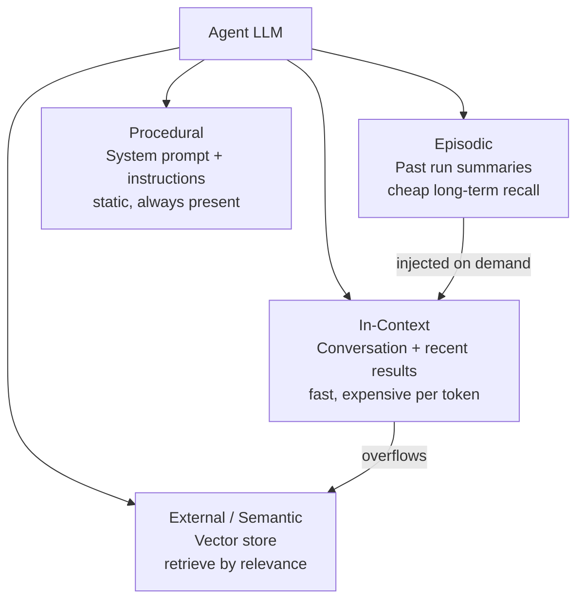
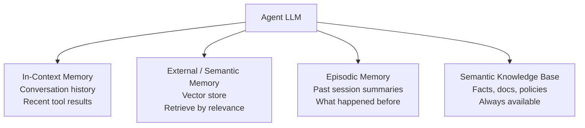

# Agent Memory Types

**Level**: 🟡 Intermediate
**Reading Time**: 11 minutes

> The context window is working memory — finite and expensive. Real agents need layers of memory, just like real brains.

## 🗺️ Quick Overview



*Four memory layers — in-context, external, episodic, and procedural — let agents manage what's hot in the window vs. stored and retrieved on demand.*

## The Problem

An agent's LLM has a context window: it can only "see" a fixed number of tokens at once (e.g., 128K tokens for GPT-4o, 200K for Claude). Every tool result, every reasoning step, and every conversation turn adds tokens. Eventually the context fills up and either:

1. The agent crashes (context exceeded error)
2. Earlier context is truncated (agent forgets what the user originally asked)
3. You pay for massive token counts on every call

A well-designed agent uses multiple memory layers to manage what goes in the context vs what gets stored and retrieved on demand.

## The Four Memory Types



### 1. In-Context Memory (Working Memory)

This is the conversation history — everything the agent has seen in the current run. It's the most immediate and accurate memory because it's in the LLM's full attention span.

```
In-Context Memory:
  [SystemPrompt]
  [HumanMessage: "Research competitors to ProductX"]
  [AIMessage: Thought: I'll search for competitors]
  [ToolResult: search result 1]
  [AIMessage: Thought: Found 3 competitors, need more info]
  [ToolResult: search result 2]
  ...
```

**Limitation**: Context windows are finite and expensive. At $5/1M tokens (GPT-4o), a 50,000-token context costs $0.25 per LLM call, and agents call the LLM many times.

**When to use**: Always. In-context is the base layer. Everything else supplements it.

### 2. External Memory (Vector Store)

A vector store stores text as embeddings (numerical vectors). When the agent needs information, it embeds the query and retrieves the most semantically similar stored chunks.

```
External Memory Operations:

// Store (during ingestion or previous runs):
store(text, metadata):
  embedding = EmbeddingModel.encode(text)
  VectorDB.insert(embedding, text, metadata)

// Retrieve (during agent run):
retrieve(query, topK=5):
  queryEmbedding = EmbeddingModel.encode(query)
  results = VectorDB.similaritySearch(queryEmbedding, limit=topK)
  return results.map(r => r.text)
```

**When to use**: When the agent needs to recall information from large document sets, previous conversations, or knowledge bases too large to fit in context.

### 3. Episodic Memory (Past Sessions)

Episodic memory stores summaries of past agent sessions. Instead of replaying the entire conversation history from last week, the agent can read a compact summary: "Last week, user researched competitors A, B, C. Found B has pricing issues."

```
Episodic Memory Lifecycle:

// End of session: compress and store
function endSession(conversationHistory):
  summary = LLM.summarize(conversationHistory,
    prompt="Summarize key decisions, findings, and open questions")
  EpisodicStore.save(sessionId, timestamp, summary)

// Start of new session: retrieve relevant past summaries
function startSession(userQuery):
  relevantSessions = EpisodicStore.searchByRelevance(userQuery, limit=3)
  return relevantSessions.map(s => s.summary)
```

**When to use**: Long-running projects where the agent is used across multiple sessions and needs to remember what happened before.

### 4. Semantic Memory (Knowledge Base)

Semantic memory holds structured, stable knowledge — product documentation, company policies, API references, domain facts. Unlike episodic memory (what happened), semantic memory is about what is true.

```
Semantic Knowledge Base:
  // Stored as indexed documents
  documents = [
    { id: "policy-001", content: "Refund policy: ...", tags: ["policy", "finance"] },
    { id: "api-ref-001", content: "POST /users creates a user...", tags: ["api", "docs"] },
    { id: "faq-001", content: "Q: How do I reset password? A: ...", tags: ["faq"] }
  ]

  // Retrieved by semantic search or tag filter
  retrieve(query):
    return VectorDB.search(query, filter={tags: relevantTags})
```

**When to use**: When the agent needs to answer questions about your product, follow company policies, or reference technical documentation.

## The Memory Retrieve-Augment-Store Cycle

Most agents use all four memory types in combination:

```
function agentWithMemory(userQuery, userId):
  // 1. Retrieve relevant memories to augment context
  episodicContext = EpisodicMemory.getRecentSessions(userId, limit=3)
  semanticContext = KnowledgeBase.search(userQuery, topK=5)
  externalContext = VectorStore.search(userQuery, topK=10)

  // 2. Build prompt with retrieved context
  systemPrompt = buildPrompt(
    baseInstructions,
    episodicContext,    // "In past sessions, you discussed..."
    semanticContext,    // "Relevant knowledge: ..."
    externalContext     // "Relevant documents: ..."
  )

  // 3. Run agent with enriched context (in-context memory)
  result = runAgent(systemPrompt, userQuery, tools)

  // 4. Store outcome back to memory
  VectorStore.store(userQuery + " → " + result.summary)
  EpisodicMemory.saveSession(userId, conversationHistory)

  return result
```

## Memory Trade-offs

| Memory Type | Freshness | Accuracy | Cost | Capacity |
|-------------|-----------|----------|------|----------|
| In-Context | Highest | Highest | High (tokens) | Low (context limit) |
| External (Vector) | Depends on indexing | Good | Medium (retrieval) | Very High |
| Episodic | Session-level | Lossy (summaries) | Low | High |
| Semantic (KB) | Slow to update | High (curated) | Low | High |

## Real-World Usage

**GitHub Copilot** uses in-context memory (your open files) + semantic memory (indexed codebase). When you ask it a question about your project, it retrieves relevant file snippets via vector search.

**ChatGPT Memory**: OpenAI added episodic memory to ChatGPT — it stores bullet-point summaries of past conversations and injects them into new sessions as "things I remember about you."

**Perplexity AI**: Primarily uses external memory via real-time web retrieval — it embeds your query, searches the web, and retrieves top results to augment the LLM's context.

**Notion AI**: Uses semantic memory — your Notion workspace is indexed, and the agent retrieves relevant pages before answering questions about your content.

## Chunking: The Foundation of Vector Memory

For external and semantic memory, you must split large documents into chunks before embedding. Chunk size matters:

```
Chunking Strategies:

1. Fixed-size chunks:
   chunk_size = 512 tokens, overlap = 64 tokens
   chunks = splitByTokenCount(document, 512, overlap=64)
   // Simple, predictable, but may cut in middle of ideas

2. Sentence-based:
   sentences = splitBySentence(document)
   chunks = groupIntoWindows(sentences, maxTokens=512)
   // Preserves sentence boundaries

3. Semantic chunking:
   sentences = splitBySentence(document)
   embeddings = EmbeddingModel.encode(sentences)
   chunks = groupBySimilarity(sentences, embeddings)
   // Groups related sentences together

4. Hierarchical chunking:
   documentSummary = summarize(document)        // Stored separately
   sectionSummaries = summarize(eachSection)    // Stored separately
   paragraphChunks = splitByParagraph(document) // Stored separately
   // Enables multi-level retrieval
```

## Common Pitfalls

1. **Only using in-context memory**: Works for short tasks, but for anything that runs multiple sessions or handles large documents, you'll hit context limits fast.
2. **Retrieving too many chunks**: Fetching 50 chunks from a vector store and putting them all in context defeats the purpose. Retrieve 5-10 highly relevant ones.
3. **No memory for tool results**: Long tool outputs (e.g., 10-page documents) should be chunked and stored in the vector store, not dumped raw into context.
4. **Stale episodic memory**: If session summaries aren't updated, the agent acts on outdated information. Add timestamps and recency weighting.
5. **No deduplication in vector store**: Adding the same document twice creates duplicate retrievals. Hash-based deduplication on ingestion prevents this.

## Procedural Memory: The Enterprise ROI Leader

> Harrison Chase (LangChain CEO): "For enterprises, procedural memory has the biggest bang for the buck. Oftentimes agents are built to do a particular task, so what you want the agent to remember is HOW to do that task the best."

Most discussion of agent memory focuses on episodic memory (what happened to this user) or external memory (what documents are relevant). But for task-specific enterprise agents — a billing escalation bot, a contract review agent, a support triage agent — **procedural memory dominates**: the agent doesn't need to remember user preferences, it needs to remember the best way to handle a billing escalation.

### Why Procedural Beats Episodic for Task-Specific Agents

- Episodic memory: "User A prefers short answers, User B mentioned they use AWS" — useful for personalization agents
- Procedural memory: "When the customer asks about refunds, always check order status first before offering compensation" — useful for every customer

Procedural memory is reusable across all users and sessions. One learned improvement benefits every future run.

### What Procedural Memory Looks Like

Procedural memory lives as instruction files — markdown documents that are loaded into the agent's system prompt on every run:

```
agent_instructions.md
-----------------------
You are a customer support agent for Acme Corp.

## Tone
- Be conversational, not formal. Avoid phrases like "I apologize for the inconvenience."
- Use the customer's name when you know it.

## Process for Billing Issues
1. Check order status in the CRM before offering any resolution.
2. If the order was placed within 30 days, offer a full refund without escalation.
3. If older than 30 days, escalate to billing team (tool: escalate_to_billing).

## Common Mistakes to Avoid
- Do NOT promise specific timelines unless the CRM confirms them.
- Do NOT mention competitor products in any response.
```

This is the CLAUDE.md pattern — the same file you're reading right now is a form of procedural memory for this agent.

### How Procedural Memory Gets Updated

The update loop is driven by natural language feedback:

```python
class ProceduralMemory:
    def __init__(self, instructions_file: str):
        self.path = instructions_file
        self.instructions = Path(instructions_file).read_text()

    def load(self) -> str:
        """Returns current procedural instructions for the system prompt."""
        return self.instructions

    def propose_update(self, feedback: str, agent: LLMAgent) -> str:
        """Agent reads feedback and proposes a diff to its own instructions."""
        proposal = agent.invoke(f"""
        Current instructions:
        {self.instructions}

        User feedback received:
        {feedback}

        Propose a minimal update to the instructions that addresses this feedback.
        Return only the updated instruction text, nothing else.
        """)
        return proposal

    def apply_update(self, proposed_instructions: str):
        """Human-approved update deployed."""
        Path(self.path).write_text(proposed_instructions)
        self.instructions = proposed_instructions
```

The feedback cycle:
1. Agent makes a mistake (too formal tone)
2. User provides natural language feedback: "Stop saying 'I apologize for the inconvenience'"
3. Agent proposes a minimal diff to the instruction file
4. Human reviews the proposed change (this is a HITL checkpoint)
5. Change deployed → all future runs have better instructions
6. The instruction file is committed to git (version-controlled, auditable)

---

## Memory as Files: The Auditable Pattern

Storing memory as plain text files (rather than vector embeddings or database records) has properties that matter for production systems:

**Auditable**: You can read what the agent knows. Open the file; the knowledge is there in plain text. No need to query a vector database and decode embeddings.

**Portable across model versions**: When you upgrade from Claude 3.5 to Claude 4, your file-based memory requires no migration. Embeddings, by contrast, may need to be re-indexed with the new model's embedding model.

**Version-controlled with git**: Instruction files live in the repository. `git log agent_instructions.md` shows you every change, who approved it, and when. `git diff HEAD~5 agent_instructions.md` shows what changed after a performance regression.

**Retrievable at inference time**: The agent simply reads the file and injects its contents into the system prompt. No vector search required for procedural memory — it's always loaded.

```
# File-based memory structure
agent_project/
  agent_instructions.md     # Procedural memory — always loaded
  user_preferences/
    user_123.md             # Episodic memory per user — loaded if relevant
    user_456.md
  knowledge/
    product_faq.md          # Semantic memory — searched when needed
    refund_policy.md
```

LangMem (LangChain's memory library) stores memory as text files with accompanying metadata JSON — a simple pattern that's more inspectable than pure vector approaches.

---

## Memory vs. Prompt Optimization: The Unified View

> Harrison Chase: "Memory and prompt optimization are basically the same thing. It's taking feedback in some form and updating the prompt in some form."

This framing collapses two concepts that are often discussed separately:

| | Memory | Prompt Optimization |
|-|--------|---------------------|
| Input | Feedback from user / trace | Failure traces, eval scores |
| Output | Updated system prompt / instruction file | Updated system prompt |
| Timescale | Within session or across sessions | Permanent improvement |
| Trigger | User feedback, HITL correction | Eval regression, automated inspection |

Both are fundamentally **prompt updates driven by experience**. The difference is timescale and trigger:
- **Memory** is fast and session-scoped: "remember what the user told me in the last 5 minutes"
- **Prompt optimization** is slow and permanent: "update the global instructions based on 100 failure traces"

### The Experience Flywheel

```
Production Trace
       ↓
   Feedback / Eval Score
       ↓
Memory update (session) OR Instruction update (permanent)
       ↓
   Evaluation (did it improve?)
       ↓
   Deploy updated agent
       ↓
Production Trace  ← cycle repeats
```

This flywheel is what makes agents improve over time. Without it, an agent deployed on day 1 performs identically on day 365 regardless of how many mistakes it made. With it, every mistake is potentially a permanent improvement.

---

## Key Takeaways

- Agents need four memory types: in-context (working memory), external (vector store), episodic (session history), and semantic (knowledge base)
- The context window is finite and expensive — manage it by offloading to external memory
- Use vector stores for large document sets: embed → store → retrieve by relevance
- Use episodic memory to persist what happened across sessions via summaries
- The retrieve-augment-store cycle is the standard pattern: retrieve context before running, store results after
- Chunk size in vector stores is a critical trade-off: too small loses context, too large dilutes relevance
- **For enterprise task-specific agents, procedural memory has the highest ROI**: the agent needs to remember how to do the task well, not user preferences
- File-based memory is auditable, portable, and version-controllable with git
- Memory and prompt optimization are the same thing at different timescales — both update the system prompt based on experience
