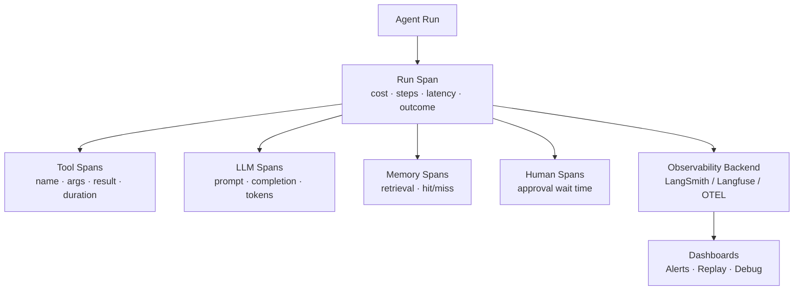
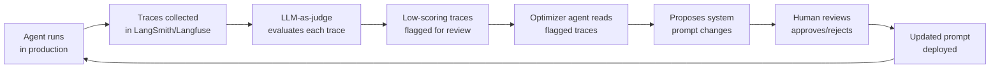

# Agent Observability

**Level**: 🔴 Advanced
**Reading Time**: 12 minutes

> Without observability, debugging an agent failure is like debugging a program with no stack traces — you see the crash but not why it happened.

## 🗺️ Quick Overview



*Every agent run becomes a nested trace of spans — tool calls, LLM calls, memory ops — exported to an observability backend for debugging and alerting.*

## The Problem

An agent fails on 2% of user requests. Your logs show the error: "Max steps exceeded." But you don't know:

- Which step did the agent get stuck on?
- What was the LLM's reasoning at step 15?
- Which tool call returned unexpected data?
- Was it this user's input specifically, or does it happen generally?
- What did the full prompt look like at the failing step?

Traditional application observability (logs, metrics, traces) doesn't translate directly to agents. You need agent-specific observability that captures the chain of reasoning, each tool call, and the state at every step.

## What to Observe

### 1. The Agent Run Span

The top-level trace covering the entire agent run:

```
AgentRunSpan = {
  spanId: string,
  runId: string,
  userId: string,
  agentType: string,
  startTime: datetime,
  endTime: datetime,
  durationMs: int,
  status: SUCCESS | FAILED | MAX_STEPS | BUDGET_EXCEEDED,
  inputQuery: string,
  finalAnswer: string,
  stepCount: int,
  totalInputTokens: int,
  totalOutputTokens: int,
  totalCostUsd: float,
  errorMessage: string  // if failed
}
```

### 2. LLM Call Spans

Each call to the LLM is a child span:

```
LLMCallSpan = {
  spanId: string,
  parentSpanId: string,  // agent run span
  stepNumber: int,
  model: string,
  inputMessages: list[Message],
  outputMessage: Message,
  inputTokens: int,
  outputTokens: int,
  latencyMs: int,
  temperature: float,
  responseType: FINAL_ANSWER | TOOL_CALL | THOUGHT,
  toolCallsRequested: list[ToolCallRequest]
}
```

### 3. Tool Call Spans

Each tool execution is a child of the LLM span:

```
ToolCallSpan = {
  spanId: string,
  parentSpanId: string,  // LLM call span
  toolName: string,
  toolArgs: dict,
  toolResult: string,
  latencyMs: int,
  status: SUCCESS | ERROR | TIMEOUT,
  errorMessage: string,  // if failed
  cached: bool           // was result from cache?
}
```

## Distributed Trace Structure

All spans nest to form a complete trace:

```mermaid
gantt
    title Agent Run Trace Timeline
    dateFormat  X
    axisFormat  %Lms

    section Agent Run
    AgentRun (total)         : 0, 4500

    section Step 1
    LLM Call 1               : 0, 800
    Tool: web_search         : 900, 1600

    section Step 2
    LLM Call 2               : 1700, 2500
    Tool: calculator         : 2600, 2700

    section Step 3
    LLM Call 3 (final)       : 2800, 3900
```



```
// Trace context propagation
function agentLoopWithTracing(task, config):
  agentSpan = tracer.startSpan("agent.run", {
    tags: {
      "agent.type": config.agentType,
      "user.id": task.userId,
      "query.text": task.query
    }
  })

  state = initState(task)

  for step in 1..config.maxSteps:
    // Start LLM call span
    llmSpan = tracer.startSpan("llm.call", {
      parent: agentSpan,
      tags: { "step": step, "model": config.model.name }
    })

    response = config.model.generate(state.messages)

    llmSpan.finish({
      "input_tokens": response.inputTokens,
      "output_tokens": response.outputTokens,
      "response_type": response.type,
      "latency_ms": llmSpan.durationMs()
    })

    if response.type == FINAL_ANSWER:
      agentSpan.finish({ "status": "success", "step_count": step })
      return response.text

    // Tool call spans
    for toolCall in response.toolCalls:
      toolSpan = tracer.startSpan("tool.call", {
        parent: llmSpan,
        tags: { "tool.name": toolCall.toolName }
      })

      result = dispatchTool(toolCall)

      toolSpan.finish({
        "tool.args": JSON.stringify(toolCall.args),
        "result_length": len(result.content),
        "status": result.status,
        "cached": result.fromCache,
        "latency_ms": toolSpan.durationMs()
      })

      state.messages.append(ToolResult(toolCall.id, result.content))

  agentSpan.finish({ "status": "max_steps_exceeded" })
```

## Key Metrics

Define and collect these metrics for every agent deployment:

```
AgentMetrics = {
  // Reliability
  completionRate: "% of runs that return a FINAL_ANSWER",
  errorRate: "% of runs that fail with error",
  maxStepsHitRate: "% of runs that hit MAX_STEPS",

  // Quality
  taskSuccessRate: "% flagged as correct by LLM judge (sampled)",
  userSatisfactionRate: "% of users who rated response helpful",

  // Performance
  p50LatencyMs: "Median end-to-end latency",
  p95LatencyMs: "95th percentile latency",
  p99LatencyMs: "99th percentile latency",

  // Efficiency
  avgStepsPerRun: "Average steps to completion",
  avgTokensPerRun: "Average total tokens per run",
  avgCostPerRun: "Average cost in USD per run",

  // Tools
  toolCallSuccessRate: "% of tool calls that succeed (per tool)",
  toolCallLatencyP95: "95th percentile tool call latency (per tool)",
  topToolsByCallCount: "Most frequently called tools"
}
```

## Alert Conditions

```
AlertRules = [
  // Runaway agent
  {
    condition: "step_count > 30 AND status != COMPLETE",
    severity: WARNING,
    message: "Agent may be stuck in loop",
    action: NOTIFY_ONCALL
  },

  // Cost spike
  {
    condition: "cost_per_run_usd > 1.00",
    severity: WARNING,
    message: "Individual run exceeded $1 cost threshold",
    action: NOTIFY_TEAM
  },

  // Tool failure spike
  {
    condition: "tool_error_rate_5min > 0.10",  // 10% error rate in 5 min window
    severity: CRITICAL,
    message: "Tool error rate spiked — possible service outage",
    action: PAGE_ONCALL
  },

  // Completion rate drop
  {
    condition: "completion_rate_1h < 0.90",  // Under 90% completion
    severity: HIGH,
    message: "Agent completion rate dropped",
    action: NOTIFY_TEAM
  }
]
```

## Observability Platforms

| Platform | Strengths | Best For |
|----------|-----------|----------|
| LangSmith | Native LangChain support, trace replay | LangChain/LangGraph agents |
| Langfuse | Open source, dataset management | Any framework |
| Arize Phoenix | Strong eval tools, drift detection | Production monitoring |
| OpenTelemetry | Standard protocol, any backend | Custom implementations |
| Datadog LLM Obs | Existing Datadog integration | Teams already using Datadog |

### OpenTelemetry Integration

If you want vendor-neutral observability, use OpenTelemetry's semantic conventions for LLM tracing:

```
// Standard OTel attributes for LLM spans
function createLLMSpan(model, inputMessages):
  span = otel.tracer.startSpan("llm.completion")
  span.setAttribute("gen_ai.system", model.provider)
  span.setAttribute("gen_ai.request.model", model.name)
  span.setAttribute("gen_ai.request.max_tokens", model.maxTokens)
  span.setAttribute("gen_ai.request.temperature", model.temperature)
  // Input
  for i, msg in enumerate(inputMessages):
    span.setAttribute("gen_ai.prompt." + i + ".role", msg.role)
    span.setAttribute("gen_ai.prompt." + i + ".content", msg.content)
  return span

function finishLLMSpan(span, response):
  span.setAttribute("gen_ai.response.model", response.model)
  span.setAttribute("gen_ai.usage.input_tokens", response.inputTokens)
  span.setAttribute("gen_ai.usage.output_tokens", response.outputTokens)
  span.setAttribute("gen_ai.completion.0.role", "assistant")
  span.setAttribute("gen_ai.completion.0.content", response.text)
  span.end()
```

## Debug Workflow: Investigating a Failure

When a user reports "the agent gave a wrong answer," here's the investigation flow:

```
Debugging steps:

1. Find the run:
   trace = TraceStore.findByRunId(runId)
   // or: TraceStore.searchByUserId(userId, timeRange)

2. Inspect the final state:
   print(trace.agentSpan.finalAnswer)
   print(trace.agentSpan.status)
   print(trace.agentSpan.stepCount)

3. Find the problematic step:
   for span in trace.llmSpans:
     if span.responseType == TOOL_CALL:
       toolSpans = trace.toolSpans.filter(t => t.parentSpanId == span.spanId)
       for toolSpan in toolSpans:
         if toolSpan.status == ERROR:
           print("Tool error at step " + span.stepNumber + ": " + toolSpan.errorMessage)

4. Inspect the full prompt at that step:
   failingLLMSpan = trace.llmSpans.find(s => s.stepNumber == failingStep)
   print("Full context at step " + failingStep + ":")
   print(failingLLMSpan.inputMessages)

5. Check tool result quality:
   print("Tool returned: " + failingToolSpan.toolResult)
   // Was the result truncated? Malformed? Empty?

6. Determine root cause and fix:
   ROOT_CAUSES = {
     "tool returned empty": CHECK_TOOL_IMPLEMENTATION,
     "llm misinterpreted result": IMPROVE_TOOL_RESULT_FORMAT,
     "context truncation": INCREASE_CONTEXT_OR_COMPRESS_EARLIER,
     "wrong tool selected": IMPROVE_TOOL_DESCRIPTIONS
   }
```

## Observability at Scale: Millions of Traces

At small scale (hundreds of traces/day), a developer can manually review failures. At enterprise scale — Clay runs millions of agent traces per month, Replit produces traces with 1000+ steps — manual review is impossible and the observability challenges are qualitatively different.

### What Changes at Scale

**Volume**: You can't read 1 million traces. You need LLM-as-judge running on every trace, automated clustering, and statistical summaries that surface the 37 traces you should actually look at.

**Trace depth**: A 1000-step Replit agent trace is not a trace — it's a document. Finding step 743 in a 1000-step trace is a search problem within a trace, not a search problem between traces. Observability tools need hierarchical navigation and in-trace search.

**Multi-trace threads**: Human-in-the-loop agents pause execution and resume later. One "user conversation" may span 5 separate traces across 3 days. Stitching these into a coherent thread for debugging requires explicit session/thread IDs that propagate across HITL pauses.

**Clustering at scale**: Instead of reviewing individual failures, you want to understand categories of failures:

```
Insights clustering:

1. Collect 10,000 traces over the past week
2. LLM-as-judge scores each trace: completeness, correctness, efficiency
3. Low-scoring traces (score < 0.5) → 1,847 failures identified
4. Clustering agent groups failures by similarity:
   - "Date parsing errors" → 682 traces (37% of failures)
   - "Tool timeout: web_search" → 441 traces (24% of failures)
   - "Ambiguous user intent" → 318 traces (17% of failures)
   - "Other" → 406 traces (22% of failures)
5. Engineer sees: fix date parsing first, it's the biggest failure category
```

### The Hierarchy of Observability Problems

| Scale | Primary Problem | Solution |
|-------|----------------|----------|
| < 100 traces/day | Manual review is possible | Review every failure by hand |
| 100-10K traces/day | Can't review all, need triage | LLM-as-judge + alerting on anomalies |
| 10K-1M traces/day | Need statistical understanding | Clustering, trend analysis, sampling |
| > 1M traces/day | Need automated insights | Full automation, humans only review cluster summaries |

---

## The Automated Prompt Improvement Flywheel

Observability data is only valuable if it feeds back into agent improvement. The flywheel:



Each cycle:
1. **Collect**: Agent runs → traces stored with metadata (user ID, timestamps, tool calls)
2. **Evaluate**: LLM-as-judge runs on every new trace (or sampled subset at high scale)
3. **Flag**: Traces scoring below threshold added to a review queue
4. **Analyze**: Optimizer agent reads the worst N traces, identifies systemic patterns
5. **Propose**: Optimizer suggests minimal changes to system prompt
6. **Approve**: Human engineer reviews the change (one quick review, not 100 trace reviews)
7. **Deploy**: Updated agent deployed; new traces start coming in
8. **Measure**: Compare avg score before/after the change on held-out eval set

This is how agents improve between releases without manual annotation of thousands of examples. One human review of a proposed prompt change can fix a bug that's appearing in 37% of traces.

---

## Trajectory Analysis

An agent's **trajectory** is the sequence of tool calls and reasoning steps across a single run. Individual spans tell you what happened at one step; trajectory analysis tells you what the agent's overall strategy was.

### Trajectory Shapes

```
Linear trajectory (simple tasks):
user_query → tool_A → tool_B → tool_C → final_answer
Good for: well-defined single-path tasks

Tree trajectory (planning with backtracking):
user_query → [plan step 1, plan step 2, plan step 3]
             ↓
         execute step 1 → result
         execute step 2 → FAIL → retry with different args → result
         execute step 3 → result
             ↓
         final_answer
Good for: complex multi-step tasks where failures are expected

Loop trajectory (failure mode):
user_query → tool_A → tool_B → tool_A → tool_B → tool_A → MAX_STEPS
The agent is cycling between two tools without making progress.
```

### Trajectory Metrics to Track

```
TrajectoryMetrics = {
  // Length metrics
  avgStepsOverTime: "Is trajectory length growing? Could mean scope creep or improving capability",
  stepsToFirstToolCall: "Long planning phase = good for complex tasks",

  // Pattern metrics
  toolRepetitionRate: "Same tool called >3 times in a row → stuck in loop",
  backtrackingRate: "How often does agent abandon a path and try another?",
  planningPhaseLength: "Steps before first external tool call",

  // Outcome correlation
  trajectoryShapeVsSuccess: "Do tree trajectories succeed more than linear for complex tasks?",
  loopDetectionAccuracy: "% of loop trajectories caught before hitting MAX_STEPS"
}
```

### What Trajectory Changes Signal

| Change | Possible Cause | Investigation |
|--------|----------------|---------------|
| Avg trajectory length growing by 20% | New task types added / model upgraded and is more thorough | Compare task distribution before/after |
| More tree trajectories | More complex tasks in production / agent now uses planning | Good sign if success rate is also up |
| Loop trajectories increasing | Tool returning unexpected format / system prompt regression | Check tool change logs |
| Planning phase getting shorter | Agent becoming more decisive / losing thoroughness | Check if success rate is maintained |

### Loop Detection

Loop trajectories are the most dangerous: they consume compute and budget without making progress. Detect them in real time:

```python
def detect_loop(trajectory: List[ToolCall], window: int = 4) -> bool:
    """Detect if agent is repeating the same tool call pattern."""
    if len(trajectory) < window * 2:
        return False

    # Check if last 'window' calls match the previous 'window' calls
    recent = [t.toolName for t in trajectory[-window:]]
    previous = [t.toolName for t in trajectory[-(window*2):-window]]
    return recent == previous

def trajectory_monitor(agent_run, config):
    """Real-time trajectory monitoring — interrupt loops early."""
    for step in agent_run.steps:
        if detect_loop(agent_run.trajectory, window=3):
            agent_run.interrupt(
                reason="Loop detected",
                message="Escalating to human — agent appears stuck."
            )
            break
```

---

## Common Pitfalls

1. **Not logging full prompts**: "LLM call failed" is useless without the full input. Log complete message arrays for every LLM call.
2. **Sampling too aggressively**: If you only trace 1% of runs, you'll miss rare failures. Trace all failures unconditionally, sample successful runs.
3. **No run IDs in user-facing errors**: When a user reports "it didn't work", you need a run ID to find their trace. Include it in error responses.
4. **Logging PII**: Tool results may contain user data (emails, names, financial info). Scrub PII before logging. Set log retention policies.
5. **No alerting on gradual degradation**: A completion rate that drops from 97% to 92% over a week may not trigger any alert. Use week-over-week comparison alerts.
6. **No thread IDs for HITL agents**: When an agent pauses for human approval and resumes later, the two traces must be linked by a thread ID or you can't reconstruct the full conversation.
7. **No clustering at scale**: At millions of traces, individual trace review is impossible. Without clustering, you're flying blind on failure patterns.

## Key Takeaways

- Agent observability requires three span types: agent run, LLM call, and tool call
- Every span should capture latency, tokens, cost, status, and input/output at that level
- Define key metrics: completion rate, error rate, avg cost per run, tool success rate
- Alert on runaway agents (high step counts), cost spikes, and tool failure rate increases
- Use OpenTelemetry for vendor-neutral tracing or platform-specific tools (LangSmith, Langfuse) for richer LLM-specific features
- Always include a run ID in error responses so you can trace back to the full span tree when users report issues
- **At millions of traces, use LLM-as-judge + clustering**: you can't read them; you need to understand categories of failures
- **The automated prompt improvement flywheel**: traces → judge → flagged failures → optimizer agent → prompt change → deploy → repeat
- **Trajectory analysis reveals patterns**: loop = stuck, tree = healthy planning, growing length = scope creep or capability growth
- **Detect loops in real time**: identical tool call sequences are the signature of a stuck agent; interrupt and escalate before hitting MAX_STEPS
