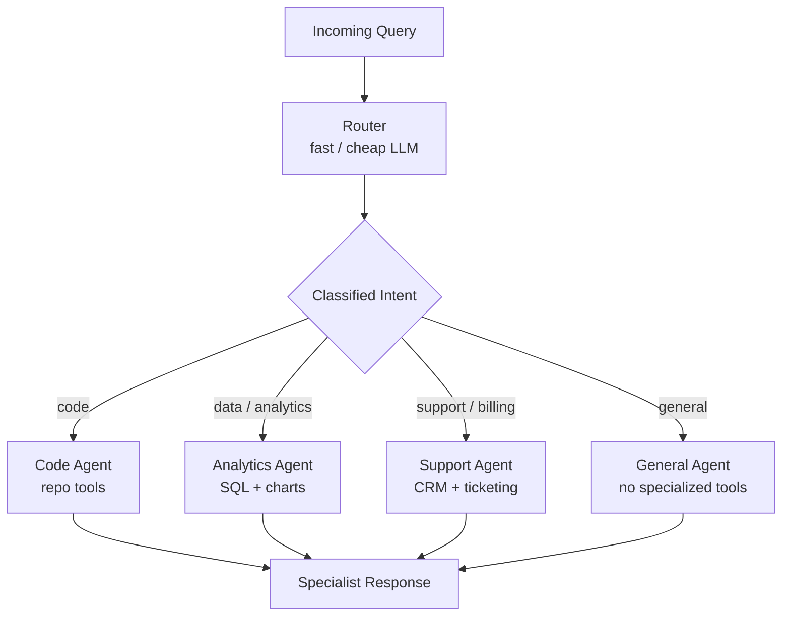
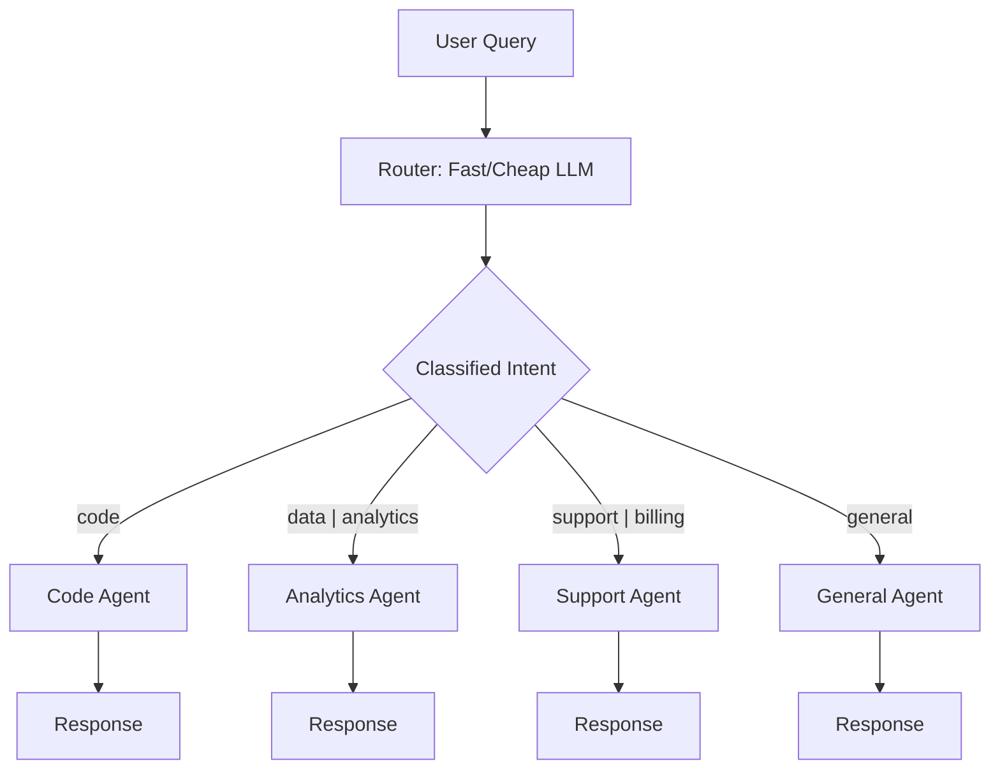

# Agent Routing & Intent Classification

**Level**: 🟡 Intermediate
**Reading Time**: 11 minutes

> A single generalist agent degrades at scale. Routing — sending each query to the best specialist — is how production systems stay accurate and fast.

## 🗺️ Quick Overview



*Intent classification by a fast cheap model routes each query to the right specialist, keeping each agent's context lean and accurate.*

## The Problem

A single LLM trying to handle all tasks simultaneously is like a surgeon also handling billing and reception. It can do all three, but poorly. Specialization wins.

Production multi-agent systems route incoming requests to agents tuned for specific task types:
- Code questions → code agent (with repo access, code execution tools)
- Data questions → analytics agent (with SQL tools, charting)
- Customer support → support agent (with CRM access, ticketing)
- General chat → general agent (no specialized tools)

Without a router, every request hits a bloated general-purpose agent carrying all tools and system prompt context for all possible tasks. This increases latency, cost, and error rates.

## Three Routing Strategies

### Strategy 1: LLM-Based Classifier

Use a small, fast model to classify the intent before routing to the specialist:



```
// LLM-based intent classification
function classifyIntent(query, availableAgents):
  agentDescriptions = availableAgents.map(a =>
    "- " + a.name + ": " + a.description
  ).join("\n")

  response = FastLLM.generate(
    model = "gpt-4o-mini",  // Small cheap model for routing
    messages = [
      SystemMessage("""
        Classify the user's query and route it to the most appropriate agent.
        Available agents:
        """ + agentDescriptions + """

        Respond with ONLY the agent name, nothing else.
        If multiple agents could handle this, pick the most specialized one.
      """),
      HumanMessage(query)
    ],
    maxTokens = 20  // Just needs to output an agent name
  )

  agentName = response.text.trim().toLowerCase()
  agent = availableAgents.find(a => a.name == agentName)

  if agent is null:
    return availableAgents.find(a => a.name == "general")  // Fallback

  return agent
```

Pros: Flexible, handles ambiguous queries, can classify multi-intent queries. Cons: Adds ~200-500ms latency and a small cost per classification.

### Strategy 2: Rule-Based Routing

Use keywords, regex, or explicit patterns. Blazing fast, no LLM call needed:

```
// Rule-based routing — O(1) latency
RoutingRules = [
  {
    pattern: /\b(bug|error|exception|crash|fix|debug)\b/i,
    agentName: "code"
  },
  {
    pattern: /\b(query|sql|database|analytics|metrics|dashboard|chart)\b/i,
    agentName: "analytics"
  },
  {
    pattern: /\b(billing|invoice|payment|refund|subscription|cancel)\b/i,
    agentName: "billing"
  },
  {
    pattern: /\b(ticket|support|issue|complaint|help)\b/i,
    agentName: "support"
  }
]

function ruleBasedRoute(query, rules, fallbackAgent):
  query = query.toLowerCase()

  // Check rules in priority order
  for rule in rules:
    if rule.pattern.test(query):
      return agentRegistry.find(rule.agentName)

  // No rule matched
  return fallbackAgent

// Hybrid: rules first (fast path), LLM fallback for unclear queries
function hybridRoute(query, rules, agents):
  ruleMatch = ruleBasedRoute(query, rules, fallbackAgent=null)

  if ruleMatch is not null:
    return ruleMatch  // Hit the fast path

  // Rules didn't match — use LLM classifier
  return classifyIntent(query, agents)
```

### Strategy 3: Embedding Similarity Routing

Represent each agent as a set of example queries. Route by finding the agent whose examples are most semantically similar to the incoming query:

```
// Embedding similarity routing
AgentExamples = {
  "code": [
    "How do I fix this Python exception?",
    "Write a function to sort a list",
    "Debug this TypeScript error",
    "Refactor this code to be more readable"
  ],
  "analytics": [
    "Show me sales trends for last quarter",
    "What's the average order value by region?",
    "Create a chart of user signups over time",
    "Why did revenue drop in November?"
  ],
  "support": [
    "I can't log into my account",
    "My order hasn't arrived",
    "How do I change my email address?",
    "I was charged twice for my subscription"
  ]
}

// At startup: build agent embeddings
function buildAgentIndex(agentExamples, embeddingModel):
  agentIndex = {}
  for agentName, examples in agentExamples:
    embeddings = embeddingModel.encode(examples)
    // Store centroid embedding for each agent
    agentIndex[agentName] = {
      centroid: meanVector(embeddings),
      examples: embeddings
    }
  return agentIndex

// At query time: find closest agent
function embeddingRoute(query, agentIndex, embeddingModel):
  queryEmb = embeddingModel.encode(query)

  bestAgent = null
  bestScore = -Infinity

  for agentName, agentData in agentIndex:
    // Compare to centroid
    score = cosineSimilarity(queryEmb, agentData.centroid)
    if score > bestScore:
      bestScore = score
      bestAgent = agentName

  // Low confidence — route to general
  if bestScore < 0.6:
    return "general"

  return bestAgent
```

Pros: Fast (one embedding call + dot products), graceful degradation via confidence threshold. Cons: Requires maintaining example sets; degrades when queries are domain-ambiguous.

## Routing Strategy Comparison

| Strategy | Latency | Accuracy | Maintenance | Best For |
|----------|---------|----------|-------------|----------|
| Rule-based | < 1ms | Medium | Low | High-volume, predictable intents |
| Embedding similarity | ~50ms | High | Medium | Semantic variety, stable domains |
| LLM classifier | 200-500ms | Very high | Low | Ambiguous queries, evolving domains |
| Hybrid (rules + LLM) | < 1ms or 200ms | Very high | Medium | Production (best of both) |

## Fallback Handling

```
// Robust routing with fallback chain
function routeWithFallback(query, router, agents):
  try:
    // Primary: rule-based (instant)
    agent = ruleBasedRoute(query, ROUTING_RULES, fallbackAgent=null)
    if agent is not null:
      return { agent: agent, method: "rule", confidence: 1.0 }

    // Secondary: embedding similarity
    embeddingResult = embeddingRoute(query, agentIndex, embeddingModel)
    if embeddingResult.confidence >= 0.7:
      return { agent: embeddingResult.agent, method: "embedding", confidence: embeddingResult.confidence }

    // Tertiary: LLM classifier
    llmAgent = classifyIntent(query, agents)
    return { agent: llmAgent, method: "llm", confidence: 0.9 }

  catch RoutingError:
    // Always have a safe fallback
    return { agent: agents.find("general"), method: "fallback", confidence: 0.0 }
```

## Hot-Path Optimization: Caching Routes

A significant percentage of production queries are repetitive. Cache the route for recently seen queries:

```
// Route caching
RouteCache = LRUCache(maxSize=10000)

function cachedRoute(query, router):
  // Exact match cache
  cacheKey = hash(query.toLowerCase().trim())
  cached = RouteCache.get(cacheKey)
  if cached is not null:
    return cached.agent

  // Semantic cache — find similar past queries
  queryEmb = embeddingModel.encode(query)
  similar = RouteCache.findSimilar(queryEmb, threshold=0.95)
  if similar is not null:
    RouteCache.set(cacheKey, similar)
    return similar.agent

  // Cache miss — run full routing
  result = routeWithFallback(query, router, agents)
  RouteCache.set(cacheKey, result)
  return result.agent
```

At scale (10M queries/day), a 60% cache hit rate on routing cuts LLM classifier costs by 60%.

## Real-World Example: ChatGPT Tool Routing

ChatGPT's routing to specialized tools (web browsing, code interpreter, DALL-E, file analysis) works as an LLM-based classifier baked into the system prompt:

1. User sends query
2. GPT-4 (acting as router) reads the query and its tool descriptions
3. It decides: does this need real-time info (→ browser), computation (→ code interpreter), image generation (→ DALL-E), or just text (→ base model)?
4. It calls the appropriate tool natively via the tool-calling mechanism
5. The tool result comes back and GPT-4 incorporates it into the final response

The "routing" is implicit in the tool selection — no separate routing step needed when you have a sufficiently capable orchestrator model.

## Common Pitfalls

1. **Missing fallback agent**: Every routing system needs a catch-all. If no rule or classifier matches, the query must go somewhere — a general agent is better than an error.
2. **Over-routing to specialists**: If you route every "email" keyword to the email agent, a question like "how do I parse email headers in Python?" goes to the email support agent instead of the code agent. Check for co-occurring keywords.
3. **No confidence threshold on embedding routing**: Embedding similarity below 0.6 means the query genuinely doesn't match any known domain. Fall through to LLM classification rather than routing wrong.
4. **Static rules for evolving domains**: Rule-based routing needs to be updated as products and features change. Add monitoring to detect queries that fall through to the general agent unexpectedly.
5. **Not logging routing decisions**: You can't debug misroutes without a routing decision log. Always log: query hash, chosen agent, routing method, and confidence.

## Key Takeaways

- Routing sends each query to the best specialist agent, improving accuracy and reducing context bloat
- Three strategies: rule-based (instant, rigid), embedding similarity (semantic, ~50ms), LLM classifier (flexible, ~300ms)
- Use a hybrid approach: rules handle the common fast path, LLM handles ambiguous cases
- Always have a general fallback agent — routing failures should degrade gracefully, not crash
- Cache routes for frequently repeated queries — high-volume systems see 40-70% cache hit rates
- Log every routing decision for debugging misroutes and improving the classifier over time
