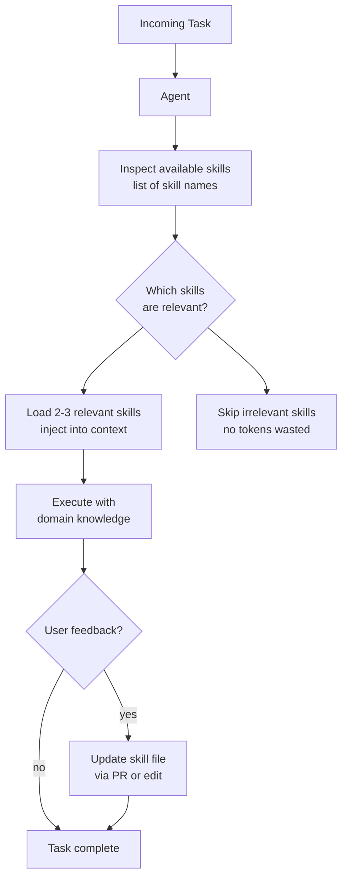

# Agent Skills & Dynamic Context

**Level**: 🟡 Intermediate
**Reading Time**: 13 minutes

> A 2,000-line system prompt for every agent run is wasteful and noisy. Skills are modular information chunks loaded only when the agent judges them relevant — the same principle behind why you don't memorize every textbook before every conversation.

## 🗺️ Quick Overview



*Task arrives → agent inspects available skill names → loads only the 2-3 relevant ones into context → executes with focused domain knowledge → on feedback, updates the skill file for future runs.*

## The Problem

Most agent tutorials start with a single system prompt: a mega-blob of instructions covering coding standards, escalation rules, API patterns, domain facts, formatting preferences, and 40 other things. For a 10-task agent, this looks fine. For a production agent that handles 100 different task types, the system prompt becomes:

- **Thousands of tokens long** — paying for them on every single LLM call
- **Noisy for the model** — relevant instructions are buried in irrelevant ones
- **Hard to maintain** — changing one section risks breaking another
- **Impossible to test** — you can't A/B test individual sections

The key insight: most tasks only need 10-20% of the instructions you've written. The other 80% is context pollution.

Skills solve this by making the system prompt modular and on-demand.

## What is a Skill?

A skill is a text block stored externally (usually a Markdown file), loaded into the agent's context only when the agent judges it relevant to the current task.

```
Skills vs. related concepts:

Tool:           function call → returns data from external system (read_file, search_web)
Sub-agent:      separate context window → deep focused work → returns structured result
Static prompt:  always in context → consumes tokens even when irrelevant
Skill:          text block → loaded on demand → same context window, modular
```

Skills sit in a specific gap in the spectrum:

```
Static System Prompt ──────────────────────────────────► Sub-Agent
 (always loaded,                                          (separate
  no flexibility)                                          context)
                        ↑
                  Skills live here
               (same context window,
                but loaded on demand)
```

## Real-World Example: Claude Code

Claude Code (Anthropic's official CLI for Claude) popularized skills in practice. It reads `.md` files in the project directory when they're relevant:

- `CLAUDE.md` — the base always-loaded skill: project structure, build commands, coding conventions
- Additional `.md` files — loaded on demand: API patterns, database schema notes, deployment checklists, architecture decisions

When you ask Claude Code to "add a new endpoint", it doesn't load the deployment checklist. When you ask it to "deploy to staging", it does. The skill selection is implicit based on the task.

This repository's own `CLAUDE.md` file is a skill. It tells Claude Code how this codebase works — and it's only "paid for" when Claude Code is actually used, not in every AI interaction you have.

## Three Types of Skills

### 1. Procedural Skills — "How to do this task"

The highest-ROI skill type for most enterprise agents. These encode your organization's process knowledge.

```
# skill: code-review-checklist.md

When reviewing code in this codebase:

1. Check for SQL injection vulnerabilities in any raw query
2. Verify all user-facing errors are sanitized (no stack traces exposed)
3. Confirm new API endpoints have rate limiting applied via the @RateLimit decorator
4. Check that database queries use the connection pool (never create raw connections)
5. Ensure new environment variables are documented in .env.example

Escalation: If you find a P0 security issue, add a SECURITY: tag to your review comment.
```

This skill is loaded when the agent is doing a code review. For a data analysis task, it's never loaded — zero tokens.

### 2. Factual Skills — "What you need to know about X"

Domain-specific knowledge the agent needs to answer questions or take action correctly.

```
# skill: payment-system-facts.md

Payment System Architecture (as of Q1 2026):

- Primary processor: Stripe (USD/EUR/GBP)
- Backup processor: Adyen (activated if Stripe latency > 500ms)
- Retry policy: 3 attempts, exponential backoff, 1s/2s/4s intervals
- Idempotency: all payment calls use order_id as idempotency key
- Fraud threshold: orders > $500 trigger manual review queue
- Refund SLA: 5-7 business days (Stripe), 7-10 (Adyen)

Common error codes:
- payment_method_declined: Ask user to try different card
- insufficient_funds: Suggest split payment option
- card_velocity_exceeded: Advise waiting 24h before retry
```

This is loaded when a customer support agent handles a payment question. It's not loaded for shipping questions.

### 3. Behavioral Skills — "How you should act"

Guardrails, preferences, and escalation rules that vary by task type.

```
# skill: customer-tier-escalation.md

When handling customer complaints:

Customer tiers (check CRM before responding):
- Tier 1 (Standard): Resolve within 24h, standard SLAs apply
- Tier 2 (Pro): Resolve within 4h, escalate to senior support if needed
- Tier 3 (Enterprise): Resolve within 1h, notify account manager immediately

ALWAYS check tier before quoting timelines. Never quote Tier 1 SLAs to Tier 3 customers.

If the issue involves data loss or security: escalate to engineering on-call regardless of tier.
```

## Implementing a Skills System

Here's a complete implementation of a skills registry with both agent-initiated and automatic retrieval:

```python
from pathlib import Path
from dataclasses import dataclass

@dataclass
class Skill:
    name: str
    content: str
    tags: list[str]  # from frontmatter or filename conventions

class SkillsRegistry:
    def __init__(self, skills_dir: str):
        self.skills: dict[str, Skill] = {}
        self.index = VectorIndex()  # similarity search over skill content

        for path in Path(skills_dir).glob("*.md"):
            name = path.stem
            content = path.read_text()
            tags = extract_tags(content)  # parse frontmatter or #tag syntax

            skill = Skill(name=name, content=content, tags=tags)
            self.skills[name] = skill
            self.index.add(document_id=name, text=content)

    def load_skill(self, name: str) -> str:
        """Agent calls this as a tool to load a skill by exact name."""
        skill = self.skills.get(name)
        if not skill:
            return f"Skill '{name}' not found. Available: {self.list_skills()}"
        return skill.content

    def search_skills(self, query: str, top_k=3) -> list[Skill]:
        """Find relevant skills by semantic similarity to the current task."""
        results = self.index.search(query, top_k=top_k)
        return [self.skills[r.document_id] for r in results]

    def list_skills(self) -> list[str]:
        """Agent can inspect available skill names before deciding what to load."""
        return list(self.skills.keys())
```

### Loading Pattern 1: Agent-Initiated (Explicit)

The agent explicitly calls `load_skill` when it needs domain knowledge:

```python
BASE_SYSTEM_PROMPT = """
You are a helpful assistant. Available skills: {skill_names}.

When you encounter a task that requires specialized knowledge, call
load_skill(name) to load the relevant skill before proceeding.
Do not guess — check available skills first.
"""

tools = [
    {
        "name": "load_skill",
        "description": "Load a skill by name to get domain knowledge or instructions",
        "parameters": {
            "name": {"type": "string", "description": "Skill name from list_skills()"}
        }
    },
    {
        "name": "list_skills",
        "description": "See what skills are available",
        "parameters": {}
    }
]

def run_agent_with_skills(task: str, registry: SkillsRegistry):
    skill_names = registry.list_skills()
    system = BASE_SYSTEM_PROMPT.format(skill_names=skill_names)

    messages = [{"role": "user", "content": task}]

    while True:
        response = llm.invoke(system=system, messages=messages, tools=tools)

        if response.is_final_answer():
            return response.content

        # Handle skill loading as a tool call
        if response.tool_call.name == "load_skill":
            skill_content = registry.load_skill(response.tool_call.args["name"])
            # Inject into system prompt for the rest of the run
            system += f"\n\n## Loaded Skill: {response.tool_call.args['name']}\n{skill_content}"
            messages.append({"role": "tool", "content": "Skill loaded."})

        elif response.tool_call.name == "list_skills":
            skill_list = "\n".join(registry.list_skills())
            messages.append({"role": "tool", "content": skill_list})
        else:
            # Handle other tools normally
            result = dispatch_tool(response.tool_call)
            messages.append({"role": "tool", "content": result})
```

### Loading Pattern 2: Automatic Pre-Loading (Implicit)

The harness detects relevance and pre-loads skills before the agent even starts:

```python
def build_context(task: str, registry: SkillsRegistry) -> str:
    """Automatically pre-load relevant skills based on task similarity."""
    base = BASE_SYSTEM_PROMPT.format(skill_names=registry.list_skills())

    # Find top 2 most relevant skills for this task
    relevant_skills = registry.search_skills(task, top_k=2)

    if relevant_skills:
        skills_block = "\n\n".join(
            f"## Skill: {s.name}\n{s.content}" for s in relevant_skills
        )
        base += f"\n\n## Pre-Loaded Skills\n{skills_block}"

    return base

# Usage
system_prompt = build_context(
    task="Review this Python function for security issues",
    registry=registry
)
# → automatically loads "code-review-checklist" and "security-patterns"
# → "deployment-guide" and "customer-tier-escalation" are never loaded
```

### Loading Pattern 3: Hierarchical (Base + Topic)

A base skill is always loaded; additional skills are loaded per topic:

```python
ALWAYS_LOADED_SKILLS = ["core-assistant-behavior", "company-facts"]
TOPIC_SKILLS = {
    "code": ["code-review-checklist", "coding-standards"],
    "payment": ["payment-system-facts", "refund-policy"],
    "customer": ["customer-tier-escalation", "support-sla"],
    "data": ["data-analysis-patterns", "reporting-formats"]
}

def hierarchical_context(task: str, registry: SkillsRegistry) -> str:
    # Base: always loaded
    base_content = "\n\n".join(registry.load_skill(s) for s in ALWAYS_LOADED_SKILLS)

    # Detect topic from task (simple keyword matching or LLM classification)
    topic = classify_topic(task)  # returns "code", "payment", etc.
    topic_skills = TOPIC_SKILLS.get(topic, [])

    topic_content = "\n\n".join(registry.load_skill(s) for s in topic_skills)

    return f"{base_content}\n\n{topic_content}"
```

## Skills vs. RAG

Skills and RAG both retrieve external content, but they answer fundamentally different questions:

| Dimension | Skills | RAG |
|-----------|--------|-----|
| Content type | Instructions, procedures, rules | Documents, facts, past data |
| Question answered | "How should I behave?" | "What do I know about X?" |
| Update frequency | Slow (process changes) | Can be real-time |
| Source | Curated by humans | Ingested from large corpora |
| Size | Small (2K tokens ideal) | Can be huge (millions of docs) |
| Format | Markdown, structured | Any document format |
| Trust level | High (explicit instructions) | Medium (retrieved and may be noisy) |

A customer support agent might use both: Skills for "how to handle a refund" (procedural, curated), RAG for "what did this customer say in past conversations" (episodic, retrieved).

## The Memory Flywheel: Skills That Learn

Skills become a self-improving feedback loop when agents can update them:

```
flowchart:

  Agent runs task
       ↓
  User gives feedback: "You should have checked the customer tier first"
       ↓
  Agent identifies which skill to update: "customer-tier-escalation.md"
       ↓
  Agent proposes a diff: adds "ALWAYS check tier before responding" as rule #1
       ↓
  Human reviews and merges PR
       ↓
  Skill file updated in git
       ↓
  All future agent runs benefit from the improvement
```

In practice, this is similar to how RLHF improves model weights — except skills are human-readable text files that can be reviewed, rolled back, and audited. No retraining needed.

```python
def update_skill_from_feedback(
    feedback: str,
    relevant_skill: str,
    registry: SkillsRegistry
) -> str:
    """Generate a skill update proposal based on user feedback."""
    current = registry.load_skill(relevant_skill)

    proposed_update = llm.invoke(
        system="You are improving agent skill files based on user feedback.",
        messages=[{
            "role": "user",
            "content": f"""
Current skill file ({relevant_skill}):
{current}

User feedback: {feedback}

Propose a minimal edit to the skill file that addresses this feedback.
Output the full updated skill file content.
"""
        }]
    )

    # In production: create a PR, not auto-apply
    return proposed_update.content
```

## Production Considerations

### 1. Version control skill files

Skills are just text files — put them in git. This gives you:
- Change history (who updated what and when)
- Rollback capability (if a skill update made things worse)
- Code review for skill changes (same as code review for code)
- Auditability for compliance (what instructions was the agent following on date X?)

### 2. Test skill changes before deployment

```python
# eval_skills.py — run before merging skill file PRs
def eval_skill_change(
    changed_skill: str,
    eval_dataset: list[EvalCase]
) -> EvalResult:
    """
    Run a set of test cases against the new skill file
    before deploying it.
    """
    results = []
    for case in eval_dataset:
        response = run_agent_with_skill(case.task, changed_skill)
        score = evaluate_response(response, case.expected_behavior)
        results.append(score)

    return EvalResult(
        mean_score=mean(results),
        regression_count=sum(1 for r in results if r < PASSING_THRESHOLD)
    )
```

### 3. Log which skills were loaded per trace

```python
def run_with_skill_logging(task: str, registry: SkillsRegistry):
    loaded_skills = []
    start = time()

    result = run_agent(task, registry, on_skill_load=loaded_skills.append)

    # Emit to your observability system
    trace.log({
        "task": task,
        "skills_loaded": loaded_skills,
        "skill_count": len(loaded_skills),
        "duration_ms": (time() - start) * 1000,
        "tokens_from_skills": sum(count_tokens(s) for s in loaded_skills)
    })

    return result
```

This data tells you which skills are used frequently (high value — keep them sharp) vs. rarely (consider merging or removing).

### 4. Keep skills small

Ideal skill size: 500–2,000 tokens. If a skill grows beyond that:

- Split it into sub-skills: `payment-facts.md` → `stripe-facts.md` + `adyen-facts.md`
- Move large reference docs to RAG; keep only the key decisions/rules in the skill
- The goal is focused injection, not comprehensive documentation

### 5. Skills are portable across model versions

Unlike fine-tuned weights, skills are plain text. When you upgrade from GPT-4o to GPT-4.5, your skill files transfer immediately. No retraining. This is one of the underappreciated advantages of the skills approach over fine-tuning.

## Procedural Skills: The Highest-ROI Category

Most enterprise agents are built for specific, repeated tasks: code review, customer support, data analysis, content moderation. What they need most is "how to do this task well" — not general world knowledge.

A procedural skill that says:

```
When analyzing customer churn data:
1. Always segment by subscription tier first
2. Check for seasonality before flagging anomalies
3. Include the revenue impact in every finding
4. Flag any cohort with >5% MoM increase for immediate review
```

...is worth more than any amount of RAG over past reports. It encodes the decision logic your best analyst already knows.

When building your first skills system: start with procedural skills for your three most common task types. Get those right before building the retrieval infrastructure.

## Common Pitfalls

1. **One massive skill file**: Defeats the purpose. A 10,000-token skill is as bad as a 10,000-token system prompt. Split by topic and load selectively.
2. **Skills that overlap**: If `code-review.md` and `security-review.md` both say "check for SQL injection", you have duplication. Consolidate or create a hierarchy.
3. **No version control**: Skill files edited ad-hoc without git history. You won't know when a skill was changed when debugging a regression.
4. **Treating skills as RAG**: Skills should be concise, curated instructions — not long documents. Long documents belong in RAG with chunking and embedding.
5. **No evals before deployment**: Changing a skill file without running evals is like shipping code without tests. Always run your eval suite.
6. **Skills that age poorly**: Factual skills go stale (API endpoints change, policies change). Add a `last_reviewed` date to each skill and build a review schedule.

## Key Takeaways

- Skills are modular text blocks stored externally and loaded into context only when relevant — filling the gap between static system prompts and sub-agents
- A static 2,000-line system prompt is inefficient; skills load the right 200 lines for the task at hand
- Three types: procedural (how to do X), factual (what is true about X), behavioral (how to act in context X)
- Two loading patterns: agent-initiated (explicit `load_skill` tool call) and automatic (similarity search pre-loads relevant skills)
- Claude Code's `.md` file convention is the canonical real-world example of skills in production
- Skills beat fine-tuning for process knowledge: they're auditable, version-controlled, and portable across model versions
- The feedback flywheel: user feedback → skill update proposal → human review → merged improvement → better future runs
- Keep skills small (500–2,000 tokens), version-controlled, and tested before deployment
