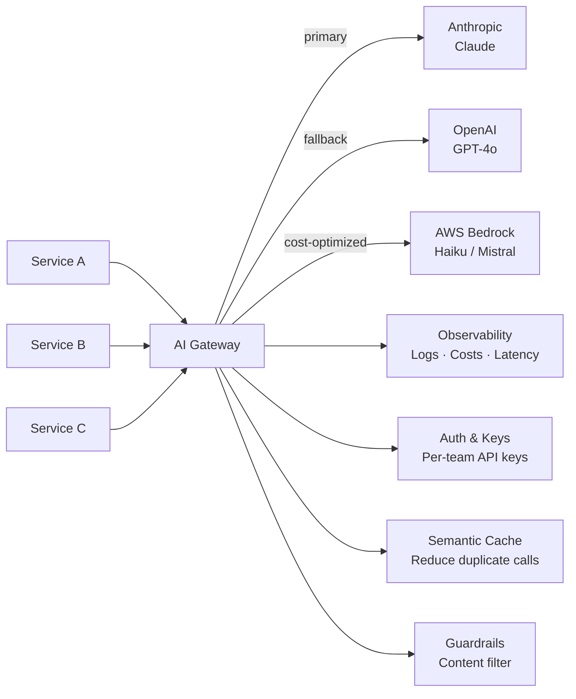

# AI Gateway & Proxy — Centralized LLM Routing and Observability

**Level**: 🔴 Advanced
**Reading Time**: 13 minutes

> Hitting Claude, OpenAI, and Bedrock directly from every microservice is the LLM equivalent of hardcoding database credentials. An AI Gateway centralizes routing, rate limiting, cost tracking, and fallback into one place — and you wonder how you lived without it after the first time one provider goes down at 3am.

## 🗺️ Quick Overview



*The AI Gateway is a single egress point for all LLM traffic — giving you visibility, control, and resilience across providers.*

## The Problem

A startup with 5 microservices calling 3 LLM providers ends up with:

- **15 different API integrations** — each with its own SDK, auth pattern, error handling
- **API keys scattered** across environment files, CI secrets, and developer laptops
- **No cost visibility** — you see one combined bill at month end with no breakdown by team/feature
- **No fallback** — when Anthropic has a 30-minute outage, all 5 services fail together
- **No rate limit enforcement** — one runaway batch job can exhaust your monthly quota in hours
- **No request logging** — debugging failures requires asking individual teams to add logging
- **No centralized guardrails** — every team implements their own safety filters (or doesn't)

At 100k requests/day, this is unmanageable. An AI Gateway solves all of these with a single deployment.

## Core Features

### 1. Unified API (Provider Abstraction)

All providers return different response formats. A gateway normalizes them:

```python
# Without gateway: different code per provider
if provider == "anthropic":
    response = anthropic_client.messages.create(...)
    text = response.content[0].text
elif provider == "openai":
    response = openai_client.chat.completions.create(...)
    text = response.choices[0].message.content
elif provider == "bedrock":
    response = bedrock_client.invoke_model(...)
    text = json.loads(response['body'].read())['content'][0]['text']

# With gateway: same OpenAI-compatible format for all
response = gateway_client.chat.completions.create(
    model="claude-sonnet-4-5",  # gateway translates to Anthropic format
    messages=[{"role": "user", "content": "Hello"}]
)
text = response.choices[0].message.content  # always the same format
```

### 2. Provider Routing & Fallback

```yaml
# litellm_config.yaml
model_list:
  - model_name: "smart-claude"
    litellm_params:
      model: "anthropic/claude-sonnet-4-5"
      api_key: os.environ/ANTHROPIC_API_KEY

  - model_name: "smart-claude"
    litellm_params:
      model: "openai/gpt-4o"
      api_key: os.environ/OPENAI_API_KEY

router_settings:
  routing_strategy: "latency-based-routing"  # or: simple-shuffle, least-busy
  fallbacks:
    - {"smart-claude": ["openai/gpt-4o", "bedrock/claude-haiku"]}
  context_window_fallbacks:
    - {"anthropic/claude-sonnet-4-5": ["anthropic/claude-opus-4-5"]}
  num_retries: 3
  retry_after: 5  # seconds between retries
```

### 3. Cost Budgeting

```yaml
litellm_settings:
  budget_manager:
    total_budget: 500.00  # $500/month hard cap
    budget_duration: "1mo"

  # Per-user budgets
  user_budget:
    default: 10.00  # $10/month per user
    admin: 100.00

  # Per-team budgets
  team_budget:
    team-engineering: 300.00
    team-product: 100.00
    team-marketing: 50.00
```

When a budget is exhausted, the gateway returns a `429 BudgetExceededError` instead of making the API call — preventing runaway costs.

### 4. Semantic Caching

Cache responses when the semantic meaning of the query is similar enough to a previous query:

```yaml
litellm_settings:
  cache: True
  cache_params:
    type: "redis"
    host: os.environ/REDIS_HOST
    port: 6379
    similarity_threshold: 0.95  # cosine similarity to hit cache
    ttl: 3600  # 1 hour cache TTL
```

Typical cache hit rates: 15-40% for customer support bots (users ask similar questions). At $0.003/1k tokens, a 30% hit rate on 1M tokens/day = $900/month savings.

### 5. Request Logging & Observability

```yaml
litellm_settings:
  callbacks: ["langfuse", "prometheus"]
  success_callback: ["langfuse"]
  failure_callback: ["langfuse", "slack"]
```

Every request automatically logs: timestamp, model, tokens (input/output), cost, latency, user ID, team ID, success/failure, error type.

## LiteLLM Deep Dive

LiteLLM is the leading open-source AI gateway. It supports 100+ providers with an OpenAI-compatible interface.

### Starting the Proxy

```bash
# Install
pip install litellm[proxy]

# Start proxy with config file
litellm --config litellm_config.yaml --port 8000

# Or with Docker
docker run ghcr.io/berriai/litellm:main-latest \
  --config /app/config.yaml \
  --port 8000 \
  --num_workers 4
```

### Full Production Config

```yaml
# litellm_config.yaml
model_list:
  # Claude as primary
  - model_name: "claude-fast"
    litellm_params:
      model: "anthropic/claude-haiku-4-5"
      api_key: os.environ/ANTHROPIC_API_KEY
      rpm: 50  # requests per minute limit

  - model_name: "claude-smart"
    litellm_params:
      model: "anthropic/claude-sonnet-4-5"
      api_key: os.environ/ANTHROPIC_API_KEY
      rpm: 50

  # OpenAI as fallback
  - model_name: "claude-fast"
    litellm_params:
      model: "openai/gpt-4o-mini"
      api_key: os.environ/OPENAI_API_KEY

  # Bedrock for batch/cost optimization
  - model_name: "claude-batch"
    litellm_params:
      model: "bedrock/anthropic.claude-3-haiku-20240307-v1:0"
      aws_region_name: "us-east-1"

router_settings:
  routing_strategy: "latency-based-routing"
  fallbacks:
    - {"claude-smart": ["openai/gpt-4o", "claude-fast"]}
  num_retries: 2
  timeout: 30

litellm_settings:
  # Caching
  cache: True
  cache_params:
    type: "redis"
    host: "redis-host"
    port: 6379

  # Observability
  callbacks: ["langfuse"]
  langfuse_public_key: os.environ/LANGFUSE_PUBLIC_KEY
  langfuse_secret_key: os.environ/LANGFUSE_SECRET_KEY

  # Safety
  guardrails:
    - guardrail_name: "aporia-guard"
      litellm_params:
        guardrail: aporia
        mode: "during_call"

  # Cost limits
  max_budget: 1000.00
  budget_duration: "1mo"
```

### Calling the Gateway

```python
from openai import OpenAI

# Point OpenAI client at your gateway
client = OpenAI(
    base_url="http://localhost:8000",
    api_key="sk-your-litellm-api-key"  # Gateway-issued key, not provider key
)

# Use any provider through the same interface
response = client.chat.completions.create(
    model="claude-smart",  # Defined in litellm_config.yaml
    messages=[{"role": "user", "content": "Explain caching strategies"}],
    metadata={
        "user_id": "user-123",
        "team_id": "team-engineering",
        "request_id": "req-abc"
    }
)
print(response.choices[0].message.content)
```

### Cost Savings Example

A team running 500k LLM calls/month with average 2000 tokens each:

| Without Gateway | With Gateway (semantic cache 25% hit) | Savings |
|-----------------|---------------------------------------|---------|
| 500k calls × $0.006/1k tokens | 375k calls × $0.006/1k tokens | $750/month |
| No fallback → 30min outages | Fallback to GPT-4o-mini → 0 downtime | Reliability |
| API keys in 15 services | 1 master key in gateway | Security |
| No budget limits | Hard stops per team | Cost control |

## Platform Comparison

| | LiteLLM (OSS) | Portkey | OpenRouter | Kong AI Gateway | Custom (API GW + Lambda) |
|--|--------------|---------|------------|-----------------|--------------------------|
| **Cost** | Free + hosting | $49-$499/mo | Pay per token | Enterprise | Engineering time |
| **Setup** | 30 min | 5 min | 2 min | Complex | Weeks |
| **Providers** | 100+ | 250+ | 100+ | 50+ | Whatever you build |
| **Semantic cache** | Yes (Redis) | Yes | No | Plugin | Custom |
| **Budget limits** | Yes | Yes | No | Custom | Custom |
| **Guardrails** | Yes | Yes | No | Plugin | Custom |
| **Analytics** | Basic | Advanced | Basic | Via Kong | Custom |
| **Self-hosted** | Yes | No | No | Yes | Yes |
| **Best for** | Self-hosted control | Quick start, analytics | Simple model switching | Enterprise Kong users | Full custom control |

## Production Deployment

### On EC2/ECS

```bash
# Docker Compose for production
services:
  litellm:
    image: ghcr.io/berriai/litellm:main-latest
    ports:
      - "8000:8000"
    volumes:
      - ./litellm_config.yaml:/app/config.yaml
    environment:
      - ANTHROPIC_API_KEY=${ANTHROPIC_API_KEY}
      - OPENAI_API_KEY=${OPENAI_API_KEY}
      - REDIS_HOST=redis
      - DATABASE_URL=postgresql://user:pass@db:5432/litellm
    command: --config /app/config.yaml --port 8000 --num_workers 4
    depends_on:
      - redis
      - db

  redis:
    image: redis:7-alpine

  db:
    image: postgres:16
    environment:
      POSTGRES_DB: litellm
      POSTGRES_USER: user
      POSTGRES_PASSWORD: pass
```

### Health and Monitoring

```bash
# Health check endpoint
curl http://localhost:8000/health

# Active model status
curl http://localhost:8000/health/liveliness

# Spend report
curl -H "Authorization: Bearer sk-admin" http://localhost:8000/spend/logs

# Model information
curl http://localhost:8000/model/info
```

## Common Mistakes

1. **Putting provider API keys directly in services**: This is the problem the gateway solves. If any service is compromised, all provider keys are exposed. Centralize keys in the gateway with per-service gateway API keys.

2. **No fallback configuration**: An AI Gateway without fallbacks is just a proxy. Configure primary → fallback for every model alias. Test failover monthly — gateways degrade silently when fallback config is wrong.

3. **Ignoring semantic cache hit rates**: A cache with no monitoring tells you nothing. Track hit rates weekly. If hit rate drops below 10%, investigate — it often means new query patterns that aren't being cached correctly.

4. **Setting budget limits too high**: Start low and raise. It's easier to raise a limit after a request than to explain to finance why a batch job spent $5000 in one hour. Set hard stops at 120% of expected monthly spend.

5. **Deploying gateway as single instance**: The gateway is now critical path for all LLM traffic. Run at least 2 instances behind a load balancer. One instance failing = complete LLM outage for all services.

6. **Not monitoring gateway latency overhead**: LiteLLM adds ~10-50ms of overhead per request. For latency-sensitive applications, this matters. Measure gateway overhead separately from model latency.

## Key Takeaways

- An AI Gateway provides: unified API, provider routing/fallback, cost budgeting, semantic caching, centralized guardrails, and observability — with a single deployment
- LiteLLM (open-source) supports 100+ providers, OpenAI-compatible interface, Redis caching, and per-team budget limits — production-ready in 30 minutes
- Semantic caching with 25% hit rate saves ~$750/month on 500k daily calls at typical token costs
- Fallback configuration is not optional — configure primary → fallback for every model, and test it
- Gateway API keys (per-service) replace direct provider API keys — one compromised service doesn't expose all providers
- Deploy minimum 2 gateway instances — it's critical path infrastructure, not a nice-to-have
- LiteLLM vs Portkey vs OpenRouter: choose LiteLLM for self-hosted control, Portkey for quick analytics, OpenRouter for simple model switching

## References

> 📚 [LiteLLM Documentation](https://docs.litellm.ai/) — Official proxy setup and configuration guide

> 📖 [Portkey AI Gateway](https://portkey.ai/docs) — Hosted gateway with advanced analytics

> 📖 [OpenRouter](https://openrouter.ai/docs) — Unified API for 100+ models

> 📺 [Building an AI Gateway at Scale](https://www.youtube.com/watch?v=kp2ZdFvTXF8) — LiteLLM production deployment walkthrough

> 📖 [Kong AI Gateway](https://konghq.com/products/kong-ai-gateway) — Enterprise gateway for Kong users
