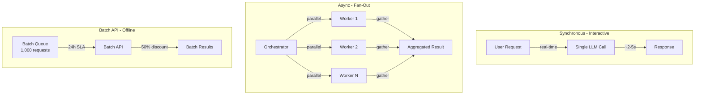
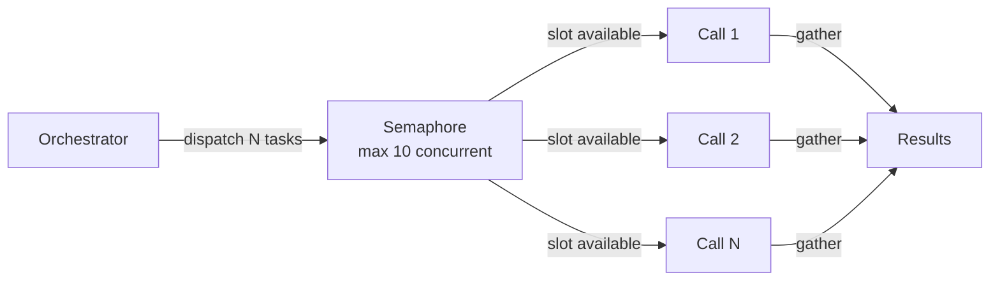
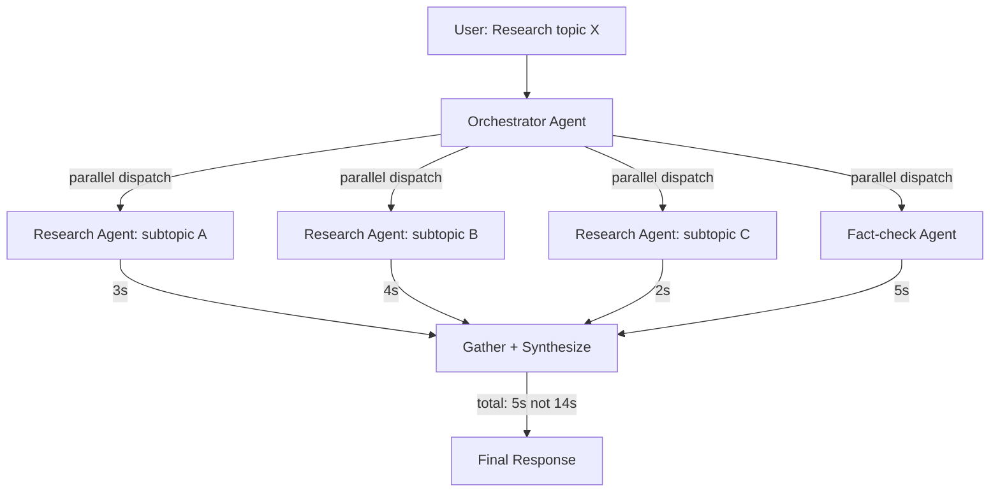

# Batching & Async LLM Requests — Processing at Scale

**Level**: 🟡 Intermediate
**Reading Time**: 14 minutes

> Calling LLMs one at a time is like sending couriers individually. Batching is the postal service — slower per item, but 10x more efficient at scale.

## 🗺️ Quick Overview



*Three processing modes — sync for interactive UX, async fan-out for parallelism, batch API for offline workloads at half price.*

## The Problem

Most developers start with synchronous sequential LLM calls. This works for demos but breaks at scale:

- Processing 10,000 customer reviews one-at-a-time at 3 seconds each = 8.3 hours
- A multi-agent research task with 20 sub-questions fires them sequentially = 60 seconds latency
- Monthly model evaluation runs cost full price even though there's no user waiting

The solution is using the right processing mode for the right job: async concurrency for latency-sensitive parallelism, and batch APIs for offline workloads at 50% cost.

---

## Why Batching and Async Matter

| Metric | Sequential Sync | Async Parallel | Batch API |
|--------|----------------|---------------|-----------|
| **Latency** | n × 3s | ~3s (bottleneck) | 1–24 hours |
| **Throughput** | 1 call/3s | 10–50 calls/3s | Thousands/hour |
| **Cost** | Full price | Full price | 50% discount |
| **Use case** | Interactive | Multi-agent, fan-out | Offline, bulk |
| **Complexity** | Low | Medium | Low (fire and forget) |

**Key insight**: For 1,000+ independent LLM tasks with no user waiting, the Anthropic Batch API gives you 50% off. For a user waiting on 20 parallel sub-tasks, async concurrency cuts latency from 60s to ~4s.

---

## Anthropic Batch API

The Anthropic Batch API processes up to 10,000 requests per batch with a 24-hour SLA and 50% price discount. Ideal for:
- Bulk document processing (summarization, extraction)
- Model evaluation runs (testing prompt variations)
- Offline data enrichment pipelines
- Nightly batch jobs

### Creating a Batch

```python
import anthropic
import json

client = anthropic.Anthropic()

# Prepare requests with custom_id for tracking
requests = [
    {
        "custom_id": f"review-{i}",
        "params": {
            "model": "claude-haiku-4-5",
            "max_tokens": 256,
            "messages": [
                {
                    "role": "user",
                    "content": f"Classify this review as positive/negative/neutral and extract key themes: {review_text}"
                }
            ]
        }
    }
    for i, review_text in enumerate(reviews)  # reviews = list of 1,000 review strings
]

# Submit batch
batch = client.messages.batches.create(requests=requests)
print(f"Batch created: {batch.id}")
print(f"Status: {batch.processing_status}")  # 'in_progress'
print(f"Estimated cost: 50% of normal price for {len(requests)} requests")
```

### Polling for Results

```python
import time

def wait_for_batch(client, batch_id: str, poll_interval: int = 60) -> list:
    """
    Polls batch status until complete.
    Batches typically complete in 1-4 hours for < 1,000 requests.
    Max SLA is 24 hours.
    """
    while True:
        batch = client.messages.batches.retrieve(batch_id)

        print(f"Status: {batch.processing_status} | "
              f"Succeeded: {batch.request_counts.succeeded} | "
              f"Errored: {batch.request_counts.errored} | "
              f"Processing: {batch.request_counts.processing}")

        if batch.processing_status == "ended":
            break

        time.sleep(poll_interval)

    # Retrieve results
    results = []
    for result in client.messages.batches.results(batch_id):
        if result.result.type == "succeeded":
            results.append({
                "custom_id": result.custom_id,
                "text": result.result.message.content[0].text,
                "input_tokens": result.result.message.usage.input_tokens,
                "output_tokens": result.result.message.usage.output_tokens,
            })
        else:
            results.append({
                "custom_id": result.custom_id,
                "error": result.result.error.type,
            })

    return results

# Usage
results = wait_for_batch(client, batch.id)

# Cost comparison
total_input = sum(r.get("input_tokens", 0) for r in results)
total_output = sum(r.get("output_tokens", 0) for r in results)

# claude-haiku-4-5: $0.25/1M input, $1.25/1M output (batch = 50% off)
batch_cost = (total_input * 0.000000125) + (total_output * 0.000000625)
sync_cost = batch_cost * 2  # Double the batch price
print(f"Sync cost: ${sync_cost:.4f} | Batch cost: ${batch_cost:.4f} | Savings: ${sync_cost - batch_cost:.4f}")
```

---

## Async Patterns for Concurrent LLM Calls

When you need results quickly and tasks are independent, run them concurrently with `asyncio`:

### Basic Async Fan-Out with Semaphore



```python
import asyncio
import anthropic
from typing import Any

client = anthropic.AsyncAnthropic()

async def process_single(semaphore: asyncio.Semaphore, task_id: str, content: str) -> dict:
    """Process one task, respecting the concurrency limit."""
    async with semaphore:  # Blocks if max concurrent reached
        response = await client.messages.create(
            model="claude-haiku-4-5",
            max_tokens=512,
            messages=[{"role": "user", "content": content}]
        )
        return {
            "task_id": task_id,
            "result": response.content[0].text,
            "tokens": response.usage.input_tokens + response.usage.output_tokens
        }

async def fan_out(tasks: list[dict], max_concurrent: int = 10) -> list[dict]:
    """
    Run up to max_concurrent LLM calls simultaneously.
    max_concurrent=10 is safe for Tier 2 (1,000 RPM, 80,000 TPM).
    """
    semaphore = asyncio.Semaphore(max_concurrent)

    coroutines = [
        process_single(semaphore, task["id"], task["content"])
        for task in tasks
    ]

    # asyncio.gather runs all coroutines, collecting results in order
    # return_exceptions=True prevents one failure from canceling all others
    results = await asyncio.gather(*coroutines, return_exceptions=True)

    # Separate successes from failures
    successful = [r for r in results if not isinstance(r, Exception)]
    failed = [r for r in results if isinstance(r, Exception)]

    if failed:
        print(f"Warning: {len(failed)}/{len(results)} tasks failed")

    return successful


# Usage — process 50 questions in parallel
async def main():
    questions = [
        {"id": f"q{i}", "content": f"Summarize topic {i}"}
        for i in range(50)
    ]

    # With max_concurrent=10: wall-clock time ≈ ceil(50/10) * 3s = 15s
    # Without concurrency: 50 * 3s = 150s
    results = await fan_out(questions, max_concurrent=10)
    print(f"Processed {len(results)} questions")

asyncio.run(main())
```

### gather vs as_completed: Which to Use

```python
import asyncio

# asyncio.gather — waits for ALL, returns in INPUT order
# Use when: you need all results before proceeding, order matters
results = await asyncio.gather(task1(), task2(), task3())
# Returns [result1, result2, result3] regardless of completion order

# asyncio.as_completed — yields each result AS it finishes
# Use when: you can process results incrementally, want to start sooner
async def stream_results(coroutines):
    for coro in asyncio.as_completed(coroutines):
        result = await coro
        yield result  # Process result immediately when available

# Example: multi-agent research with partial results
async def research_with_streaming(questions: list[str]):
    coroutines = [ask_llm(q) for q in questions]
    partial_answers = []

    async for answer in stream_results(coroutines):
        partial_answers.append(answer)
        print(f"Got answer {len(partial_answers)}/{len(questions)}")
        # Could yield partial results to user here

    return partial_answers
```

---

## Parallel LLM Calls in Multi-Agent Systems

The fan-out pattern is the foundation of parallelism in multi-agent architectures:



```python
async def multi_agent_research(topic: str) -> str:
    """
    Orchestrator dispatches 4 parallel agents.
    Total latency = slowest agent, not sum of all agents.
    """
    # Define parallel sub-tasks
    subtasks = [
        f"Research the technical aspects of: {topic}",
        f"Research the business implications of: {topic}",
        f"Find 3 real-world examples of: {topic}",
        f"Identify common misconceptions about: {topic}",
    ]

    # Run all agents concurrently
    semaphore = asyncio.Semaphore(4)
    sub_results = await asyncio.gather(*[
        process_single(semaphore, f"subtask-{i}", task)
        for i, task in enumerate(subtasks)
    ])

    # Synthesize with a final LLM call
    synthesis_prompt = f"""
    Based on the following research on '{topic}', write a comprehensive summary:

    Technical: {sub_results[0]['result']}
    Business: {sub_results[1]['result']}
    Examples: {sub_results[2]['result']}
    Misconceptions: {sub_results[3]['result']}
    """

    synthesis = await client.messages.create(
        model="claude-sonnet-4-5",
        max_tokens=2048,
        messages=[{"role": "user", "content": synthesis_prompt}]
    )

    return synthesis.content[0].text
```

---

## Sync vs Async vs Batch — Decision Guide

| Scenario | Recommended Approach | Reason |
|----------|---------------------|--------|
| User asks a question, waits for answer | **Sync** | Low complexity, instant feedback |
| Multi-agent task with N independent sub-tasks | **Async fan-out** | Parallelism cuts latency from N×t to t |
| Nightly processing of 10,000 records | **Batch API** | 50% cost discount, no latency requirement |
| Evaluation run on 500 prompt variations | **Batch API** | Offline, cost matters more than speed |
| Background classification of user uploads | **Async + queue** | Responsive UI, rate-limit friendly |
| Code agent with sequential tool calls | **Sync** | Steps depend on each other, can't parallelize |

**Sync threshold**: Use sync when concurrency < 5 or tasks are sequential (each depends on the previous).
**Async threshold**: Use async when concurrency > 5 and tasks are independent.
**Batch threshold**: Use batch API when there's no user waiting and volume > 100 requests.

---

## Priority Queue for Mixed Workloads

Production agents typically mix user-facing and background work. A priority queue ensures background batch jobs don't starve interactive requests:

```python
import asyncio
from enum import IntEnum

class Priority(IntEnum):
    USER_FACING = 0    # Blocks a user, process immediately
    BACKGROUND = 5     # No user waiting, can wait
    BATCH_BULK = 10    # Lowest priority, process when idle

class PriorityLLMQueue:
    """
    Ensures user-facing requests get processed before background work.
    """
    def __init__(self, max_concurrent: int = 10):
        self.queue = asyncio.PriorityQueue()
        self.semaphore = asyncio.Semaphore(max_concurrent)

    async def submit(self, content: str, priority: Priority = Priority.BACKGROUND):
        future = asyncio.get_event_loop().create_future()
        await self.queue.put((priority.value, content, future))
        return await future

    async def worker(self):
        while True:
            priority, content, future = await self.queue.get()
            async with self.semaphore:
                try:
                    result = await client.messages.create(
                        model="claude-haiku-4-5",
                        max_tokens=512,
                        messages=[{"role": "user", "content": content}]
                    )
                    future.set_result(result.content[0].text)
                except Exception as e:
                    future.set_exception(e)
                finally:
                    self.queue.task_done()
```

---

## Common Mistakes

1. **Running async calls without a semaphore**: `asyncio.gather()` with 100 coroutines fires 100 simultaneous API calls, instantly hitting your concurrent request limit and rate limits. Always use a `Semaphore` to cap concurrency at 5–20 depending on your tier.

2. **Using batch API for time-sensitive requests**: The Batch API has a 24-hour SLA. It's not suitable for anything a user is waiting on. Use it only for background processing where latency is irrelevant.

3. **Not handling partial failures in gather**: `asyncio.gather()` raises on the first exception by default, canceling remaining tasks. Always use `return_exceptions=True` and handle failures in the result list.

4. **Sequential sub-tasks in a multi-agent orchestrator**: The whole point of multi-agent systems is parallelism. If your orchestrator calls sub-agents one at a time with `await` in a loop, you've added overhead without gaining speed.

5. **Polling batch results too frequently**: Polling every second for a 24-hour batch wastes API quota. Start polling after 30 minutes, then every 5–15 minutes. Use a webhook if available.

---

## Key Takeaways

- **Batch API = 50% discount** — use it for any offline processing with volume > 100 requests; savings compound quickly at scale
- **Async fan-out latency formula**: total time ≈ slowest individual task, not sum — 10 tasks at 3s each takes ~3s, not 30s
- **Semaphore cap**: 10 concurrent calls is safe for Tier 2 (1,000 RPM); scale up proportionally with your tier
- **`gather` vs `as_completed`**: use `gather` when you need all results together; use `as_completed` when you can stream partial results to the user
- **Priority queue** ensures user-facing requests are never blocked by background batch jobs running on the same infrastructure
- **Decision threshold**: batch when volume > 100 + no deadline; async when > 5 parallel independent tasks; sync otherwise

---

## References

> 📚 [Anthropic Message Batches API](https://docs.anthropic.com/en/api/creating-message-batches) — Official documentation for the batch API, including request format, polling, and result retrieval

> 📚 [OpenAI Batch API](https://platform.openai.com/docs/guides/batch) — OpenAI's equivalent batch processing documentation

> 📖 [Python asyncio documentation](https://docs.python.org/3/library/asyncio.html) — Official Python asyncio reference for gather, semaphore, and as_completed

> 📖 [Anthropic Python SDK Async Support](https://github.com/anthropic-ai/anthropic-sdk-python#async-usage) — AsyncAnthropic client usage and patterns

> 📺 [Async Python Patterns (PyCon)](https://www.youtube.com/results?search_query=asyncio+patterns+pycon) — Conference talks on production asyncio patterns
