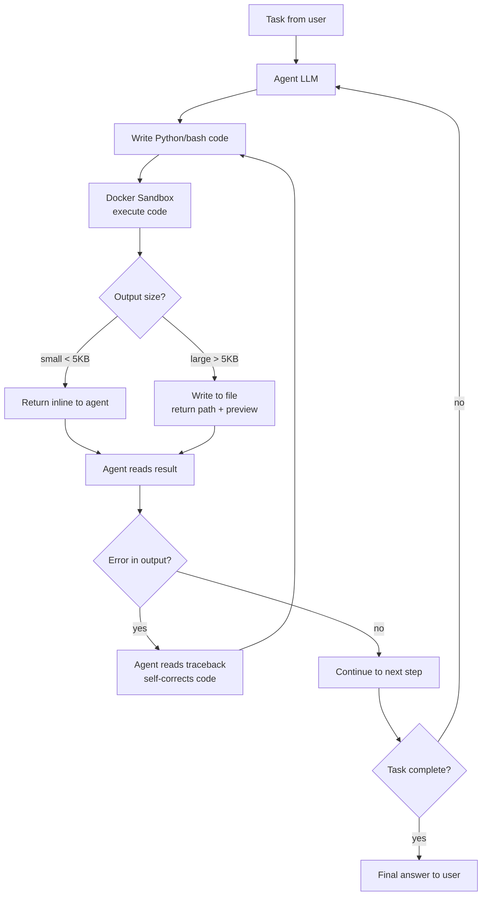

# Code Sandbox Agents

**Level**: 🔴 Advanced
**Reading Time**: 14 minutes

> Coding agents are general-purpose agents. The ability to write code is useful not just for creating code — it's useful for doing tasks. — Harrison Chase, CEO of LangChain

## 🗺️ Quick Overview



*Task arrives → agent writes code → sandbox executes → agent reads stdout/stderr → self-corrects on error → writes large outputs to files → loops until complete.*

## The Core Insight

Most people think of coding agents as agents that write software. That's too narrow.

When an agent has access to a Python interpreter and a bash shell, it can do nearly anything:

- **Data analysis**: "Find anomalies in this CSV" → write pandas code → read results
- **Web scraping**: write requests + BeautifulSoup → parse pagination → save to file
- **API orchestration**: write code to call multiple APIs → parse responses → join data
- **File processing**: write a loop to process 1,000 files → report summary
- **System administration**: run commands, check processes, parse logs
- **Report generation**: write data → render markdown → export to PDF

All of these use the same two primitives: write code, run code. You don't need 50 specialized tools for 50 use cases. You need one code execution environment.

This is why Harrison Chase predicted that most long-running production agents will run in code sandboxes — not because everything is a coding task, but because code is the most flexible action primitive available.

## Why Code Beats 50 Specialized Tools

Consider two agents handling the task: *"Analyze last month's sales data and find which product categories have declining repeat purchase rates."*

**Agent A — Tool-based:**
```
1. call get_sales_data(start="2026-02-01", end="2026-02-28")
2. call filter_by_metric(metric="repeat_purchases")
3. call group_by(dimension="category")
4. call calculate_trend(window="MoM")
5. call sort_by(field="trend", order="asc")
6. call format_report(template="analysis")
```
You had to build 6 tools. The tools have rigid schemas. What if the user now asks for quarterly instead of monthly? You need `calculate_trend` to accept a `window` parameter, a new tool call, or a new tool entirely.

**Agent B — Code sandbox:**
```python
import pandas as pd

df = pd.read_csv('/workspace/sales_2026_02.csv')
df['date'] = pd.to_datetime(df['date'])

# Repeat purchasers: customers who bought in same category more than once
repeat = (df.groupby(['customer_id', 'category'])
            .size()
            .reset_index(name='purchase_count'))
repeat['is_repeat'] = repeat['purchase_count'] > 1

# Merge back and calculate category-level repeat rate by week
weekly = df.merge(repeat[['customer_id', 'category', 'is_repeat']],
                  on=['customer_id', 'category'])
result = (weekly.groupby(['category', pd.Grouper(key='date', freq='W')])
                .agg(repeat_rate=('is_repeat', 'mean'))
                .reset_index())

# Find declining categories
from scipy.stats import linregress
def slope(group):
    x = range(len(group))
    return linregress(x, group['repeat_rate']).slope

trends = result.groupby('category').apply(slope).sort_values()
print(trends[trends < 0].to_string())
```
The agent wrote exactly the analysis needed, with no pre-built tools. When the user asks for quarterly instead of monthly, the agent changes `freq='W'` to `freq='Q'` — no tool changes needed.

The comparison by dimension:

| Dimension | Tool Calling | Code Sandbox |
|-----------|-------------|--------------|
| Flexibility | Rigid — must match tool schema | Arbitrary — express anything |
| New task coverage | Need new tool per task | Write new code per task |
| Composition | Chained calls, lossy data handoff | Single script, native data flow |
| Debuggability | Error from tool is opaque | Traceback shows exactly what failed |
| Inspection | Can only see tool I/O | Agent reads its own output |
| Security surface | Tool permissions per call | Sandbox boundary controls all |
| Latency | One LLM call per tool | One LLM call writes N operations |

## Architecture: The Code Sandbox

A code sandbox is an isolated container that persists for the duration of one agent session.

```mermaid
graph TD
    AGENT[Agent Process] -->|submit code| API[Sandbox API]
    API -->|execute| CONTAINER[Docker Container\n- Python 3.12\n- bash\n- /workspace volume]
    CONTAINER -->|stdout/stderr| API
    API -->|result| AGENT
    CONTAINER <-->|read/write| FS[(/workspace)\nPersistent filesystem\nwithin session]
    CONTAINER -. "restricted" .-> NET[Network\nwhitelisted URLs only]
    CONTAINER -->|enforced| LIMITS[Resource Limits\n0.5 CPU / 512MB RAM\n30s timeout per exec]
```

Key properties:

1. **Per-session isolation**: Each agent run gets its own container. Agent A cannot see Agent B's files.
2. **Persistent file system within session**: Files written in step 3 are still there in step 17. The agent accumulates intermediate results.
3. **Interpreter available**: Python, bash, Node.js depending on your setup.
4. **Resource bounded**: CPU/memory limits prevent runaway loops from consuming the host.
5. **Network controlled**: The sandbox doesn't get unrestricted internet access by default.

## Full Implementation: Code Sandbox Agent

```python
import docker
import uuid
from dataclasses import dataclass
from typing import Optional

@dataclass
class ExecutionResult:
    stdout: str
    stderr: str
    exit_code: int

    @property
    def success(self) -> bool:
        return self.exit_code == 0

    @property
    def output(self) -> str:
        return self.stdout if self.success else self.stderr


class DockerSandbox:
    """Isolated Docker container that persists for one agent session."""

    def __init__(self, session_id: str):
        self.session_id = session_id
        self.workspace = f"/tmp/sessions/{session_id}"

        # Launch persistent container
        self.container = docker.from_env().containers.run(
            image="python:3.12-slim",
            command="sleep infinity",   # keep alive for session
            volumes={self.workspace: {"bind": "/workspace", "mode": "rw"}},
            mem_limit="512m",
            nano_cpus=500_000_000,      # 0.5 CPU
            network_mode="none",        # no external network by default
            detach=True,
            remove=True                 # auto-cleanup on stop
        )

    def execute(self, code: str, timeout: int = 30) -> ExecutionResult:
        """Run Python code in the sandbox, return stdout/stderr."""
        # Write code to a temp file to avoid shell escaping issues
        script_path = f"/workspace/.tmp_script_{uuid.uuid4().hex[:8]}.py"
        self._write_raw(script_path, code)

        exec_result = self.container.exec_run(
            f"python3 {script_path}",
            workdir="/workspace",
            demux=True,
            timeout=timeout
        )

        stdout = (exec_result.output[0] or b"").decode("utf-8", errors="replace")
        stderr = (exec_result.output[1] or b"").decode("utf-8", errors="replace")

        return ExecutionResult(
            stdout=stdout,
            stderr=stderr,
            exit_code=exec_result.exit_code or 0
        )

    def execute_bash(self, command: str, timeout: int = 30) -> ExecutionResult:
        """Run a bash command in the sandbox."""
        exec_result = self.container.exec_run(
            f"bash -c {repr(command)}",
            workdir="/workspace",
            demux=True,
            timeout=timeout
        )
        stdout = (exec_result.output[0] or b"").decode("utf-8", errors="replace")
        stderr = (exec_result.output[1] or b"").decode("utf-8", errors="replace")
        return ExecutionResult(stdout=stdout, stderr=stderr, exit_code=exec_result.exit_code or 0)

    def write_file(self, name: str, content: str) -> str:
        """Write content to a file in the workspace. Returns absolute path."""
        path = f"/workspace/{name}"
        self._write_raw(path, content)
        return path

    def read_file(self, name: str) -> str:
        """Read a file from the workspace."""
        result = self.container.exec_run(f"cat /workspace/{name}", demux=True)
        return (result.output[0] or b"").decode("utf-8", errors="replace")

    def _write_raw(self, path: str, content: str):
        """Internal: write content to an absolute path in the container."""
        escaped = content.replace("'", "'\"'\"'")
        self.container.exec_run(f"bash -c 'cat > {path} << \\'HEREDOC\\'\n{escaped}\nHEREDOC'")

    def cleanup(self):
        """Stop the container and remove the workspace."""
        self.container.stop(timeout=5)


LARGE_OUTPUT_THRESHOLD = 5000  # characters

class CodeSandboxAgent:
    """General-purpose agent that uses code execution as its primary action primitive."""

    SYSTEM_PROMPT = """You are a general-purpose agent with access to a Python/bash sandbox.

Core principles:
- Prefer writing and executing code over calling specialized tools
- Store intermediate results as files in /workspace; read them when needed
- When you get an error, read the full traceback and self-correct
- For large outputs (>1000 lines), write to a file and read the relevant section
- Think step by step: plan your code before writing it when the task is complex
- You have a persistent /workspace directory — use it to accumulate results

Available actions:
- execute_python(code): run Python code, returns stdout/stderr
- execute_bash(command): run bash command, returns stdout/stderr
- read_file(name): read a file from /workspace
- write_file(name, content): write content to /workspace/name
"""

    def __init__(self, model, sandbox: DockerSandbox):
        self.model = model
        self.sandbox = sandbox
        self.messages = []

    def run(self, task: str) -> str:
        self.messages = [{"role": "user", "content": task}]
        max_steps = 50

        for step in range(max_steps):
            response = self.model.invoke(
                system=self.SYSTEM_PROMPT,
                messages=self.messages,
                tools=self._tools()
            )

            if response.is_final_answer():
                return response.content

            # Handle code execution
            tool_call = response.tool_call
            result_content = self._dispatch(tool_call)

            self.messages.append({"role": "assistant", "content": None, "tool_calls": [tool_call]})
            self.messages.append({"role": "tool", "content": result_content})

        return "Max steps reached. Partial results in /workspace."

    def _dispatch(self, tool_call) -> str:
        name = tool_call.name
        args = tool_call.args

        if name == "execute_python":
            result = self.sandbox.execute(args["code"])
        elif name == "execute_bash":
            result = self.sandbox.execute_bash(args["command"])
        elif name == "read_file":
            return self.sandbox.read_file(args["name"])
        elif name == "write_file":
            path = self.sandbox.write_file(args["name"], args["content"])
            return f"Written to {path}"
        else:
            return f"Unknown tool: {name}"

        return self._format_result(result)

    def _format_result(self, result: ExecutionResult) -> str:
        """Handle large outputs by writing to file rather than inline."""
        if result.success:
            output = result.stdout
        else:
            output = f"Error (exit code {result.exit_code}):\n{result.stderr}"
            if result.stdout:
                output += f"\n\nPartial stdout:\n{result.stdout[:1000]}"

        if len(output) > LARGE_OUTPUT_THRESHOLD:
            filename = f"output_{uuid.uuid4().hex[:6]}.txt"
            path = self.sandbox.write_file(filename, output)
            preview = output[:500]
            return (
                f"Output was large ({len(output):,} chars). "
                f"Written to {path}\n\n"
                f"First 500 chars:\n{preview}\n\n"
                f"Use read_file('{filename}') to read more."
            )

        return output

    def _tools(self) -> list[dict]:
        return [
            {
                "name": "execute_python",
                "description": "Execute Python code in the sandbox. Returns stdout and stderr.",
                "parameters": {
                    "code": {"type": "string", "description": "Python code to execute"}
                }
            },
            {
                "name": "execute_bash",
                "description": "Execute a bash command in the sandbox.",
                "parameters": {
                    "command": {"type": "string", "description": "Bash command to run"}
                }
            },
            {
                "name": "read_file",
                "description": "Read a file from /workspace by name.",
                "parameters": {
                    "name": {"type": "string", "description": "Filename relative to /workspace"}
                }
            },
            {
                "name": "write_file",
                "description": "Write content to /workspace/name.",
                "parameters": {
                    "name": {"type": "string", "description": "Filename"},
                    "content": {"type": "string", "description": "File content"}
                }
            }
        ]
```

## Real-World Examples Beyond Coding

### Data Analysis

Task: *"Our retention cohort data is in cohorts.csv. Find the cohorts with the steepest 30-day drop."*

Without code sandbox: you'd need a `read_csv` tool, `calculate_retention` tool, `sort_cohorts` tool — each with a specific schema, each handling only the case you anticipated.

With code sandbox:
```python
import pandas as pd
import numpy as np

df = pd.read_csv('/workspace/cohorts.csv')

# Calculate 30-day retention drop per cohort
df['day_30_drop'] = df['day_0_retention'] - df['day_30_retention']

# Find steepest drops
worst = df.nlargest(10, 'day_30_drop')[['cohort_date', 'day_0_retention', 'day_30_retention', 'day_30_drop']]
print(worst.to_string())
worst.to_csv('/workspace/worst_cohorts.csv', index=False)
```

The agent adapts to whatever CSV schema it finds. It reads the column names from the actual data, not from a tool schema you wrote months ago.

### API Orchestration

Task: *"Get the last 7 days of orders from our API, join with the customer tier data from the CRM, and tell me which enterprise customers had their first order delayed."*

```python
import requests
import json

# Fetch orders
orders_resp = requests.get(
    'https://api.internal/orders',
    params={'days': 7},
    headers={'Authorization': f'Bearer {open("/workspace/secrets/api_token").read().strip()}'}
)
orders = orders_resp.json()['data']

# Fetch customer tiers
customers_resp = requests.get('https://crm.internal/customers/tiers')
tiers = {c['id']: c['tier'] for c in customers_resp.json()}

# Join and filter
delayed_enterprise = [
    o for o in orders
    if o['status'] == 'delayed'
    and o['is_first_order']
    and tiers.get(o['customer_id']) == 'enterprise'
]

print(f"Found {len(delayed_enterprise)} delayed first orders for enterprise customers")
for o in delayed_enterprise:
    print(f"  Order {o['id']}: customer {o['customer_id']}, delayed by {o['delay_hours']}h")

with open('/workspace/delayed_enterprise.json', 'w') as f:
    json.dump(delayed_enterprise, f, indent=2)
```

Three API calls, a join, a filter — all in one code block. No tool schemas needed per operation.

### File Processing at Scale

Task: *"Parse 800 server log files and give me a breakdown of error codes by service."*

```bash
# First get the count to verify
find /workspace/logs -name "*.log" | wc -l

# Extract error codes from all files
grep -h 'ERROR' /workspace/logs/*.log | \
  awk '{print $5, $6}' | \
  sort | uniq -c | sort -rn | head -50
```

800 individual tool calls vs. one shell pipeline. The code is faster, clearer, and more flexible.

## Security Considerations

Code sandboxes are powerful — which is exactly why enterprise adoption is cautious.

### Network Egress Control

By default, the sandbox should have no external network access. Whitelist specific domains as needed:

```python
# Instead of network_mode="none", use a restricted network
# with iptables rules that whitelist only approved endpoints

ALLOWED_ENDPOINTS = [
    "api.internal",       # internal APIs
    "crm.internal",       # CRM
    "pypi.org",           # for pip installs
]

# In practice: use a proxy container that enforces the whitelist
sandbox = DockerSandbox(
    session_id=session_id,
    network_policy="restricted",        # → proxy with ALLOWED_ENDPOINTS
)
```

### File System Isolation

Credentials and secrets must never be in the workspace at agent startup. Use:

```
/workspace/           ← agent workspace (clean slate each session)
/secrets/             ← read-only mount, agent can read but not list
  api_token           ← specific file the agent is told about in the prompt
```

The agent can use the API token but can't `ls /secrets` to discover what else is there.

### Resource Limits

Runaway loops (agent writes an infinite loop) consume host CPU. Always set:

```python
container = docker.containers.run(
    mem_limit="512m",           # 512MB RAM hard limit
    nano_cpus=500_000_000,      # 0.5 CPU hard limit
    # Per-execution timeout enforced in DockerSandbox.execute()
)
```

### Human-in-the-Loop Gates for Sensitive Operations

Not everything should run automatically:

```python
SENSITIVE_OPERATIONS = [
    r"DELETE FROM",             # SQL deletes
    r"drop_table",              # Pandas/SQLAlchemy
    r"requests\.delete",        # HTTP DELETE
    r"os\.remove",              # File deletion
    r"shutil\.rmtree",          # Directory deletion
]

def pre_execute_gate(code: str) -> bool:
    """Returns True if code can run automatically, False if HITL needed."""
    for pattern in SENSITIVE_OPERATIONS:
        if re.search(pattern, code, re.IGNORECASE):
            return False  # Needs human review
    return True
```

### Audit Trail

Every code execution is logged with the full code text, output, session ID, and timestamp. This is a compliance requirement in most regulated industries:

```python
def execute_with_audit(self, code: str, session_id: str) -> ExecutionResult:
    result = self.sandbox.execute(code)
    audit_log.append({
        "session_id": session_id,
        "timestamp": utcnow().isoformat(),
        "code": code,
        "exit_code": result.exit_code,
        "stdout_length": len(result.stdout),
        "stderr": result.stderr[:2000] if result.stderr else None
    })
    return result
```

This is precisely why Harrison Chase mentioned that companies were telling employees they cannot install Claude Code (then called "OpenClaw") on company laptops — the audit and network control infrastructure wasn't in place yet. It's not that code sandboxes are inherently unsafe; it's that deploying them safely requires deliberate infrastructure.

## When to Use Code Sandbox vs. Tool Calling

Use **tools** when:
- The action requires authenticated API calls with complex OAuth flows
- You need atomic transactions (database writes that must not be partially executed)
- The action has a well-defined, stable schema (create user, send message)
- You need guaranteed format validation before execution

Use **code sandbox** when:
- The task is exploratory and the output format isn't known in advance
- You need to compose multiple operations (parse + filter + join + format)
- The task involves data transformation with variable input schemas
- The output might be large (agent writes to file rather than returning inline)
- The task is a one-off: writing a tool for it would be overengineering

Use **both** when:
- Use tools for authenticated, transactional side effects (create_order)
- Use code sandbox for all the data work surrounding those calls (analysis, parsing, preparation)

## The Future: Sandboxes as the Default Runtime

Harrison Chase's prediction: most long-running production agents will run in code sandboxes.

The reasoning:

1. Long-running tasks accumulate intermediate state. Files are the natural way to store and pass state between steps — much more reliable than passing data inline through the context window.
2. Code execution is the most general-purpose action primitive. As tasks get more complex, you run out of pre-built tools.
3. The debugging loop (write code → read traceback → fix) maps naturally to how agents self-correct, better than opaque tool error messages.
4. The file system gives the agent a working scratchpad: it can organize its work, store checkpoints, and produce clean output files for the user.

```
/workspace/
  raw_data/          ← input files
  intermediate/      ← agent's scratch space
  analysis/          ← intermediate results
  output/            ← final deliverables for user
```

The agent navigates this directory like a human analyst navigates their working folder.

## Common Pitfalls

1. **No output size limit**: An agent that prints a million-row dataframe inline will blow the context window. Always truncate inline output and write large results to files.
2. **Mutable shared workspace**: Multiple agent sessions sharing a workspace will conflict. Session ID should be part of every workspace path.
3. **No timeout per execution**: An agent stuck in an infinite loop will hold the container forever. Enforce a per-execution timeout (30s is usually enough; use 300s for heavy data jobs).
4. **Credentials in workspace at start**: If the agent can list files, it will see credentials. Mount secrets read-only at a separate path and tell the agent where to find specific ones.
5. **No code review gate for destructive operations**: Agents will sometimes write destructive code (deleting rows, calling DELETE APIs). Gate these with HITL review.
6. **Container not cleaned up**: If sessions aren't properly terminated, containers accumulate. Always clean up on session end, including orphan cleanup via a background job.

## Key Takeaways

- Code execution is the most general-purpose action primitive for agents — it handles exploratory tasks, data transformation, and multi-step composition without pre-built tool schemas
- A code sandbox is an isolated Docker container with a persistent file system that lives for one agent session
- The agent loop: write code → execute in sandbox → read stdout/stderr → self-correct on error → store large outputs as files → repeat
- Large outputs belong in files, not inline in the context window — the agent reads files when needed
- Security requires: network egress control, file system isolation, resource limits, HITL gates for destructive operations, and full audit logging
- Use tools for authenticated, transactional side effects; use code sandbox for exploratory, compositional, data-heavy work
- Harrison Chase's prediction: most long-running production agents will run in code sandboxes as the default execution environment
