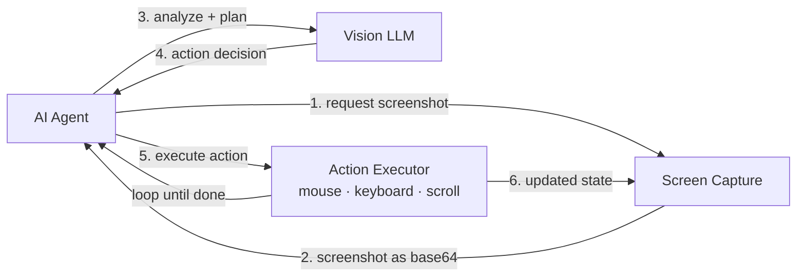
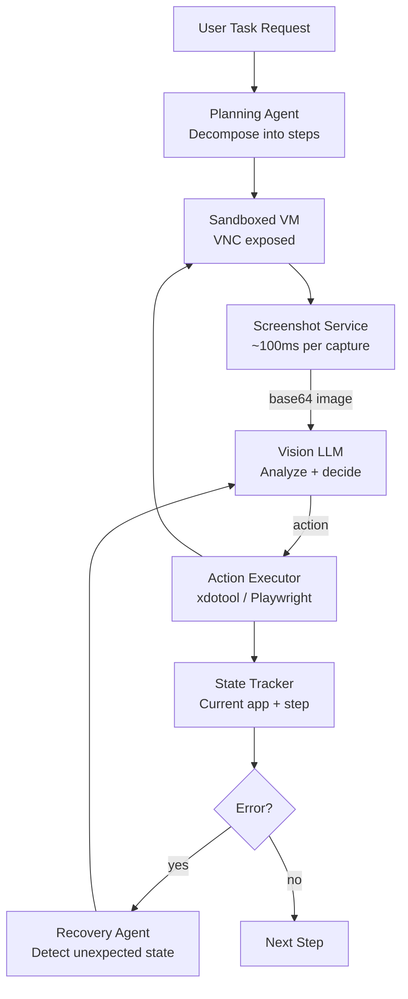

# Computer Use Agents — AI Controlling GUIs & Browsers

**Level**: ⚫ Senior
**Reading Time**: 14 minutes

> 90% of enterprise software has no API. It has a UI. Computer use agents are how you automate the automation layer that was previously impossible to touch without humans.

## 🗺️ Quick Overview



*Computer use is a perception → reasoning → action loop. Each cycle costs 2-10 seconds (screenshot + LLM API call). Reliability depends on state tracking and error recovery.*

## The Problem

Most automation tools assume an API exists. They don't:

- **Enterprise legacy systems**: SAP, Oracle ERP, custom-built internal tools from 2005 — GUI only, no REST API
- **Government and compliance portals**: Filing systems with web UIs that explicitly disallow scraping
- **SaaS without enterprise API tier**: Tier-1 features locked behind a UI, API only available on Enterprise plans at 10x cost
- **Desktop applications**: PDF editing, accounting software, CAD tools

Traditional RPA (Robotic Process Automation — UiPath, Automation Anywhere) attempted to solve this but required human experts to manually record every click, button label, and XPath selector. Each time the UI changed, the automation broke. Maintenance cost exceeded development cost within 18 months for most deployments.

Computer use agents solve this differently: the AI looks at the screen and figures out what to click, without needing hardcoded selectors. When the UI changes, the agent adapts.

## Anthropic Computer Use

Claude 3.5 Sonnet (released October 2024) introduced native computer use tools. The model can observe and control a computer via:

```python
import anthropic
import base64
from pathlib import Path

client = anthropic.Anthropic()

def take_screenshot() -> str:
    """Take a screenshot and return as base64 string."""
    import subprocess
    # On Linux with X11
    subprocess.run(["scrot", "/tmp/screenshot.png"])
    return base64.b64encode(Path("/tmp/screenshot.png").read_bytes()).decode()

def run_computer_use_agent(task: str) -> str:
    """Run an agent that controls the computer to complete a task."""
    messages = []
    max_iterations = 20

    # Define computer use tools
    tools = [
        {
            "type": "computer_20241022",
            "name": "computer",
            "display_width_px": 1280,
            "display_height_px": 800,
            "display_number": 1,
        }
    ]

    # Initial message with task
    messages.append({"role": "user", "content": task})

    for i in range(max_iterations):
        response = client.beta.messages.create(
            model="claude-sonnet-4-5",
            max_tokens=4096,
            tools=tools,
            messages=messages,
            betas=["computer-use-2024-10-22"],
        )

        messages.append({"role": "assistant", "content": response.content})

        # Check if agent is done
        if response.stop_reason == "end_turn":
            # Extract final text response
            for block in response.content:
                if hasattr(block, 'text'):
                    return block.text
            break

        # Process tool calls
        tool_results = []
        for block in response.content:
            if block.type == "tool_use" and block.name == "computer":
                result = execute_computer_action(block.input)
                tool_results.append({
                    "type": "tool_result",
                    "tool_use_id": block.id,
                    "content": result
                })

        if tool_results:
            messages.append({"role": "user", "content": tool_results})

    return "Task completed"


def execute_computer_action(action_input: dict) -> list:
    """Execute a computer action and return screenshot."""
    import subprocess
    action = action_input["action"]

    if action == "screenshot":
        screenshot = take_screenshot()
        return [{"type": "image", "source": {"type": "base64", "media_type": "image/png", "data": screenshot}}]

    elif action == "left_click":
        x, y = action_input["coordinate"]
        subprocess.run(["xdotool", "mousemove", str(x), str(y), "click", "1"])

    elif action == "type":
        text = action_input["text"]
        subprocess.run(["xdotool", "type", "--clearmodifiers", text])

    elif action == "key":
        key = action_input["key"]
        subprocess.run(["xdotool", "key", key])

    elif action == "scroll":
        x, y = action_input["coordinate"]
        direction = action_input.get("direction", "down")
        amount = action_input.get("amount", 3)
        button = "5" if direction == "down" else "4"
        for _ in range(amount):
            subprocess.run(["xdotool", "mousemove", str(x), str(y), "click", button])

    # Take screenshot after each action to show resulting state
    screenshot = take_screenshot()
    return [{"type": "image", "source": {"type": "base64", "media_type": "image/png", "data": screenshot}}]
```

### Action Types Available

| Action | Description | Parameters |
|--------|-------------|------------|
| `screenshot` | Capture current screen | None |
| `left_click` | Click at coordinate | coordinate: [x, y] |
| `right_click` | Right-click at coordinate | coordinate: [x, y] |
| `double_click` | Double-click at coordinate | coordinate: [x, y] |
| `type` | Type text | text: string |
| `key` | Press keyboard key | key: string (e.g., "Return", "ctrl+c") |
| `scroll` | Scroll at position | coordinate, direction, amount |
| `mouse_move` | Move mouse without clicking | coordinate: [x, y] |

## Browser-Specific Agents

For web tasks, browser-specific tools are more reliable than full computer use:

```python
# Stagehand — LLM-powered Playwright wrapper
from stagehand import Stagehand, StagehandConfig
from anthropic import Anthropic

async def web_task_with_stagehand(task: str) -> str:
    config = StagehandConfig(
        env="LOCAL",  # or "BROWSERBASE" for cloud
        model_name="claude-sonnet-4-5",
        model_client_options={"apiKey": "your-key"},
    )

    async with Stagehand(config) as stagehand:
        page = stagehand.page

        # Navigate
        await page.goto("https://example.com")

        # Natural language actions — Stagehand handles element finding
        await stagehand.act("Click the login button")
        await stagehand.act("Fill in username field with 'user@example.com'")
        await stagehand.act("Fill in password field with 'password123'")
        await stagehand.act("Click submit")

        # Extract structured data
        result = await stagehand.extract(
            instruction="Extract all product names and prices",
            schema={"products": [{"name": "string", "price": "number"}]}
        )

        return result
```

### Browser Agent Libraries

| Library | Approach | Strengths | Weaknesses |
|---------|----------|-----------|------------|
| **Stagehand** (Browserbase) | Playwright + LLM | Natural language actions, TypeScript-first | Node.js only |
| **Browser Use** (Python) | Playwright + vision LLM | Python, handles complex navigation | Slower than direct Playwright |
| **Playwright + Claude** | Direct screenshot → actions | Maximum control | More code to write |
| **OpenAI Operator** | Cloud-hosted browser agent | No infrastructure | Expensive, limited customization |
| **Selenium + GPT-4V** | Selenium + vision LLM | Mature Selenium ecosystem | Legacy tool, less capable than Playwright |

## Architecture for Production Computer Use



### State Tracking

The agent must track what it's doing to handle failures:

```python
from dataclasses import dataclass, field
from enum import Enum

class TaskStatus(Enum):
    PENDING = "pending"
    IN_PROGRESS = "in_progress"
    WAITING_FOR_INPUT = "waiting_for_input"
    FAILED = "failed"
    COMPLETE = "complete"

@dataclass
class ComputerUseState:
    task: str
    steps_completed: list[str] = field(default_factory=list)
    current_step: str = ""
    status: TaskStatus = TaskStatus.PENDING
    error_count: int = 0
    max_errors: int = 3
    screenshots: list[str] = field(default_factory=list)  # for debugging

    def record_step(self, step: str, success: bool):
        if success:
            self.steps_completed.append(step)
            self.error_count = 0  # Reset on success
        else:
            self.error_count += 1
            if self.error_count >= self.max_errors:
                self.status = TaskStatus.FAILED

    def is_stuck(self) -> bool:
        """Detect if we're in a loop."""
        if len(self.screenshots) < 3:
            return False
        # If last 3 screenshots are identical, we're stuck
        return (self.screenshots[-1] == self.screenshots[-2] ==
                self.screenshots[-3])
```

## Reliability Challenges

| Challenge | Description | Mitigation |
|-----------|-------------|-----------|
| **Dynamic layouts** | UI changes between action and verification | Re-screenshot before each click |
| **CAPTCHA** | Anti-bot protection | Use Browserbase (CAPTCHA solving), or escalate to human |
| **Authentication** | Session expiration mid-task | Store session cookies, refresh before starting |
| **Popups** | Unexpected dialogs interrupt flow | Detect and dismiss before main task |
| **Latency** | 2-10s per action × 20 steps = 40-200s per task | Batch non-dependent actions |
| **Model confusion** | Agent misidentifies UI elements | High-resolution screenshots, explicit element descriptions |
| **Infinite loops** | Agent retries same failing action | Detect screenshot similarity, enforce step limits |

## Cost Analysis

Computer use is expensive. Budget appropriately:

```
Per-action cost breakdown (Claude Sonnet):
- Screenshot: ~1500 tokens (1280×800 at medium quality) = $0.006
- Action response: ~500 tokens output = $0.015
- Total per action: ~$0.021

Typical tasks:
- Simple form fill (5 actions): $0.11
- Data extraction from 10 pages (30 actions): $0.63
- Complex workflow (50 actions): $1.05

At scale (1000 tasks/day at 20 actions average):
- Daily cost: 1000 × 20 × $0.021 = $420/day
- Monthly: ~$13,000/month
```

Compare to: a human operator completing the same tasks at 10 tasks/hour = 100 hours/day = cost of 5+ FTEs.

## Security Requirements

Computer use agents are the highest-risk category of AI agent. Mandatory security controls:

```
Security Checklist for Computer Use Agents:
[ ] Run in isolated VM — never on host machine
[ ] VPN or air-gap from production systems
[ ] No access to credentials beyond what task requires
[ ] Network egress allowlisted (only to task-required domains)
[ ] Screenshot storage encrypted and access-logged
[ ] Session timeout: terminate VM after task completion
[ ] Human approval required before any irreversible action
[ ] Audit log all actions with screenshots for replay
[ ] Cannot access user files outside task scope
[ ] Tested for prompt injection via screen content
```

A compromised computer use agent with access to a logged-in browser can exfiltrate data, transfer funds, send emails — anything a human operator could do. Sandbox aggressively.

## Real-World Use Cases

| Company / Tool | Use Case | Approach |
|----------------|----------|----------|
| **Anthropic demo** (2024) | Book flights on travel sites | Claude computer use + sandboxed browser |
| **Cognition Devin** | Code across multiple IDEs | Computer use for UI-heavy dev tools |
| **Harvey AI** | Legal research in proprietary databases | Browser agents for systems without API |
| **Sierra** | Customer service automation | Web UI automation for legacy CRM |
| **Browserbase** | B2B data extraction | Managed cloud browser with Stagehand |

## Common Mistakes

1. **Running computer use on non-sandboxed machines**: If the model misidentifies an element and clicks the wrong thing on your development machine, it can delete files or send unintended messages. Always sandbox.

2. **No screenshot-based error detection**: If the task errors out (login failed, timeout page, unexpected modal), the agent needs to detect this from the screenshot. Without error detection, it will keep clicking on a page that's stuck.

3. **Fixed coordinates instead of visual search**: Hardcoding pixel coordinates (click at 450, 200) breaks when screen resolution, zoom, or layout changes. Let the model find elements visually each time.

4. **Not setting action limits**: Without a max_steps parameter, a stuck agent will run indefinitely, spending $20+ on a task that should cost $0.50. Always set max_iterations and budget limits.

5. **Giving agents access to production credentials**: Test with read-only or staging credentials first. Only grant production access after extensive testing. Implement confirmation gates for any write operation.

## Key Takeaways

- Computer use agents close the "API gap" — 90% of enterprise software has UI-only access; computer use agents automate it without hardcoded selectors
- Anthropic Computer Use (Claude 3.5 Sonnet) provides screenshot → action loop with 8 action types: screenshot, click, type, key, scroll, etc.
- Cost: ~$0.021 per action (screenshot + response tokens) → $0.11 for simple form fill, $1.05 for 50-action workflow
- For web tasks: use Stagehand or Browser Use instead of raw computer use — more reliable, lower latency
- Mandatory security: isolated VM, allowlisted network, no production credentials, human approval for irreversible actions
- Reliability killers: dynamic layouts, CAPTCHAs, session expiration, unexpected popups — build detection and recovery for each
- State tracking + screenshot-similarity detection prevents infinite loops — enforce max_iterations regardless

## References

> 📚 [Anthropic Computer Use Documentation](https://docs.anthropic.com/en/docs/build-with-claude/computer-use) — Official guide to Claude computer use tools

> 📖 [Stagehand: LLM-Powered Browser Automation](https://github.com/browserbase/stagehand) — Open-source natural language browser agent

> 📖 [Browser Use Python Library](https://github.com/browser-use/browser-use) — Python browser agent with vision LLM

> 📺 [Anthropic Computer Use Demo](https://www.youtube.com/watch?v=vH2f7cjXjKI) — Original computer use announcement and demos

> 📖 [OSWorld: Benchmarking GUI Agents](https://arxiv.org/abs/2404.07972) — Academic benchmark for computer use agent evaluation

> 📖 [Security Considerations for Computer Use Agents](https://www.anthropic.com/research/computer-use) — Anthropic's own security analysis
