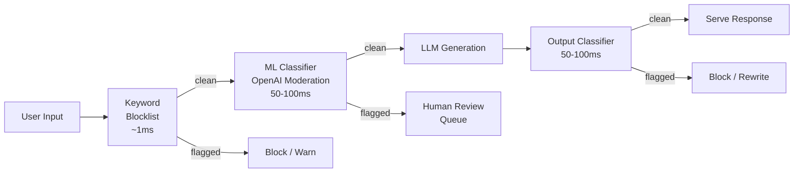
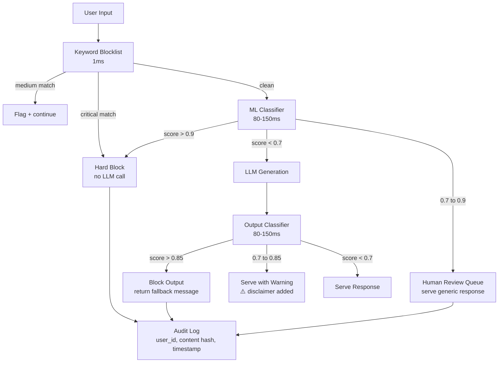

# Content Moderation — Input/Output Safety Pipelines

**Level**: 🟡 Intermediate
**Reading Time**: 13 minutes

> You cannot trust users not to send harmful content — and you cannot trust LLMs not to generate it. Content moderation is the automated enforcement layer that catches both.

## 🗺️ Quick Overview



*Two moderation checkpoints (input and output) with layered speed: fast keyword filter first, slower ML classifier second. Blocking at input is cheaper than discarding LLM output.*

**When you need this**:
- Your product is user-facing with any public or semi-public user base
- Your LLM can be prompted to generate policy-violating content
- You operate under GDPR, COPPA, or platform safety policies
- Your product is in healthcare, finance, or legal where harmful outputs have real consequences

## The Problem

Users will send harmful content to your AI system. This is not a theoretical threat — in any system at scale, adversarial and malicious inputs arrive within hours of launch:

- Teenagers testing the system for shock value
- Bad actors probing for jailbreaks to generate CSAM, weapon instructions, or fraud
- Users who are in crisis and send self-harm content
- Automated bots scraping content or stress-testing filters

And beyond adversarial inputs, LLMs will generate harmful content without any adversarial intent. A user asking innocuously about chemistry can receive step-by-step synthesis instructions. A mental health chatbot can inadvertently provide suicide methods.

**Two-sided problem**:
- **Input moderation**: catch harmful user inputs before they reach the LLM
- **Output moderation**: catch harmful LLM outputs before they reach the user

Both are required. Input-only moderation misses cases where the LLM hallucinates harmful content from benign inputs. Output-only moderation wastes compute on inputs that should never have been processed.

## Moderation Categories

| Category | Examples | Severity |
|----------|---------|----------|
| Hate speech | Racial slurs, genocide glorification | Critical |
| Violence | Graphic violence, threats, incitement | Critical |
| Sexual content | NSFW, CSAM | Critical |
| Self-harm | Suicide methods, self-injury instructions | Critical |
| Illegal activity | Drug synthesis, weapons manufacturing | High |
| PII exposure | SSN, credit cards, passwords | High |
| Harassment | Targeted bullying, doxxing | High |
| Spam | Repetitive, low-quality, off-topic | Medium |
| Profanity | Offensive language | Low |
| Competitor mentions | Brand safety violations | Low |

## Input Moderation

### OpenAI Moderation API (Free and Fast)

The OpenAI Moderation API is free to use regardless of which model you use for generation. It evaluates 11 categories and returns per-category confidence scores:

```python
import openai

client = openai.OpenAI()

def check_input_openai(text: str) -> dict:
    """
    Free moderation API. Latency: ~80-150ms.
    Returns per-category scores and top-level flagged boolean.
    """
    response = client.moderations.create(input=text)
    result = response.results[0]

    return {
        "flagged": result.flagged,
        "categories": {
            "hate": result.categories.hate,
            "hate_threatening": result.categories.hate_threatening,
            "harassment": result.categories.harassment,
            "harassment_threatening": result.categories.harassment_threatening,
            "self_harm": result.categories.self_harm,
            "self_harm_intent": result.categories.self_harm_intent,
            "self_harm_instructions": result.categories.self_harm_instructions,
            "sexual": result.categories.sexual,
            "sexual_minors": result.categories.sexual_minors,
            "violence": result.categories.violence,
            "violence_graphic": result.categories.violence_graphic,
        },
        "category_scores": {
            "hate": result.category_scores.hate,
            "self_harm": result.category_scores.self_harm,
            "sexual": result.category_scores.sexual,
            "violence": result.category_scores.violence,
        }
    }

# Example
result = check_input_openai("How do I make a bomb?")
# result.flagged = True, violence score = 0.94
```

### Azure Content Safety (Severity Levels)

Azure Content Safety uses a 0-6 severity scale per category instead of a 0-1 probability:

```python
from azure.ai.contentsafety import ContentSafetyClient
from azure.ai.contentsafety.models import AnalyzeTextOptions
from azure.core.credentials import AzureKeyCredential

def check_input_azure(text: str, threshold: int = 2) -> dict:
    """
    Azure Content Safety. Cost: ~$1/1000 calls.
    Severity 0-6: 0=safe, 2=low, 4=medium, 6=high.
    """
    client = ContentSafetyClient(
        endpoint=AZURE_ENDPOINT,
        credential=AzureKeyCredential(AZURE_KEY)
    )
    request = AnalyzeTextOptions(text=text)
    response = client.analyze_text(request)

    violations = {}
    for category in response.categories_analysis:
        if category.severity >= threshold:
            violations[category.category] = category.severity

    return {
        "flagged": len(violations) > 0,
        "violations": violations,
        "raw": {c.category: c.severity for c in response.categories_analysis}
    }
```

### Keyword Blocklist (Fast First Pass)

Before hitting any ML classifier, run a fast keyword check. This catches obvious cases in ~1ms:

```python
import re
from functools import lru_cache

# Organized by severity — highest severity categories first
BLOCKLIST = {
    "critical": [
        "how to make.*bomb",
        "child.*sexual",
        "suicide.*method",
        "step.*by.*step.*kill",
    ],
    "high": [
        r"\bkill\s+yourself\b",
        r"\bhate\s+crime\b",
        "drug.*synthesis",
    ],
    "medium": [
        r"\b(fuck|shit|bitch)\b",  # profanity
    ]
}

@lru_cache(maxsize=1000)
def compile_patterns(severity: str) -> list:
    return [re.compile(p, re.IGNORECASE | re.DOTALL)
            for p in BLOCKLIST[severity]]

def keyword_check(text: str) -> dict:
    """Returns highest severity match found, or None."""
    for severity in ["critical", "high", "medium"]:
        for pattern in compile_patterns(severity):
            match = pattern.search(text)
            if match:
                return {
                    "flagged": True,
                    "severity": severity,
                    "matched_pattern": pattern.pattern
                }
    return {"flagged": False}
```

## Output Moderation

Output moderation runs the same pipeline on the LLM's generated response. This catches:
- Jailbreaks that slipped through input moderation
- LLM "helpfulness" that produces harmful instructions from benign prompts
- Brand safety violations (competitor mentions, legal claims, PII leakage)

```python
def check_output(response_text: str, context: dict) -> dict:
    """
    Multi-layer output moderation.
    Returns action: 'serve' | 'warn' | 'block' | 'rewrite'
    """
    results = {}

    # 1. OpenAI moderation on output
    mod_result = check_input_openai(response_text)
    results["content_safety"] = mod_result

    # 2. PII detection (don't expose user data)
    pii_result = detect_pii(response_text)
    results["pii"] = pii_result

    # 3. Brand safety: check for competitor names if required
    if context.get("brand_safety_enabled"):
        brand_result = check_competitor_mentions(response_text)
        results["brand_safety"] = brand_result

    # 4. Determine action
    if mod_result["flagged"] or pii_result["has_pii"]:
        # Check severity of content safety violation
        max_score = max(mod_result["category_scores"].values())
        if max_score > 0.9:
            return {"action": "block", "results": results}
        else:
            return {"action": "warn", "results": results}

    return {"action": "serve", "results": results}
```

## Full Moderation Pipeline



### Threshold Decision Matrix

| Score Range | Category | Action | Example |
|------------|----------|--------|---------|
| > 0.90 | Any harmful category | Hard block | "How to make meth" |
| > 0.90 | Self-harm intent | Hard block + crisis resource | User mentions suicide |
| 0.70 – 0.90 | Hate/harassment | Queue for human review | Ambiguous slur context |
| 0.70 – 0.90 | Violence | Serve with disclaimer | Historical violence context |
| 0.50 – 0.70 | Profanity/mild | Allow with logging | Casual profanity |
| < 0.50 | Any | Allow | Normal user input |

```python
def make_moderation_decision(
    category_scores: dict[str, float],
    input_type: str  # "input" or "output"
) -> dict:
    """
    Layered threshold decision logic.
    Different categories have different risk profiles.
    """
    CRITICAL_CATEGORIES = {"sexual_minors", "self_harm_instructions", "hate_threatening"}
    HIGH_CATEGORIES = {"violence", "hate", "self_harm"}
    MEDIUM_CATEGORIES = {"harassment", "sexual"}

    # Critical categories: hard block at lower threshold
    for cat in CRITICAL_CATEGORIES:
        if category_scores.get(cat, 0) > 0.7:
            return {
                "action": "hard_block",
                "reason": f"Critical category: {cat}",
                "score": category_scores[cat]
            }

    # High severity: block or queue
    for cat in HIGH_CATEGORIES:
        score = category_scores.get(cat, 0)
        if score > 0.85:
            return {"action": "hard_block", "reason": cat, "score": score}
        elif score > 0.65:
            return {"action": "human_review", "reason": cat, "score": score}

    # Medium severity: warn or allow
    for cat in MEDIUM_CATEGORIES:
        score = category_scores.get(cat, 0)
        if score > 0.80:
            return {"action": "warn", "reason": cat, "score": score}

    return {"action": "allow"}
```

## Bypass Attacks and Countermeasures

Sophisticated users will attempt to bypass your moderation. Know the common patterns:

| Attack Type | Example | Countermeasure |
|-------------|---------|----------------|
| Encoding | "How to make b0mb" (zero) | Normalize text; deobfuscation step |
| Language switching | Ask in Pig Latin or Morse | Detect language; translate before classifying |
| Indirect phrasing | "What would a villain need to hurt people?" | Contextual classifier, not keyword only |
| Context injection via tools | Web page with embedded instructions | Moderate tool outputs too |
| Gradual escalation | Normal chats, then slowly increase severity | Multi-turn context window moderation |
| Jailbreak prompts | "DAN" mode, "pretend you are..." | System prompt hardening + injection detection |

```python
def preprocess_for_moderation(text: str) -> str:
    """Normalize text to defeat encoding attacks."""
    import unicodedata

    # Normalize unicode (catches homoglyph attacks: а = cyrillic a)
    text = unicodedata.normalize("NFKC", text)

    # Replace common number-for-letter substitutions
    substitutions = {
        "0": "o", "1": "l", "3": "e", "4": "a",
        "5": "s", "7": "t", "@": "a", "$": "s"
    }
    normalized = text
    for num, letter in substitutions.items():
        normalized = normalized.replace(num, letter)

    # Also check both original AND normalized form
    return normalized
```

## Cost vs. Coverage Tradeoffs

| Solution | Cost | Latency | Categories | Control |
|----------|------|---------|-----------|---------|
| OpenAI Moderation API | Free | 80-150ms | 11 | Low (black box) |
| Azure Content Safety | ~$1/1k calls | 50-100ms | 4, severity 0-6 | Medium |
| Perspective API (Google) | Free (limited) | 50-100ms | Toxicity, insult, threat | Low |
| Local DistilBERT classifier | $0.01-0.05/call GPU cost | 20-50ms | Custom | Full |
| Custom fine-tuned model | Training cost + inference | 20-50ms | Any | Full |

**Recommended approach for most products**:
1. OpenAI Moderation API as primary (free, good coverage)
2. Custom keyword blocklist for domain-specific terms (e.g., medication names if you're building healthcare)
3. Custom classifier for brand safety or industry-specific needs
4. Human review queue for borderline cases (0.70-0.85 range)

## Real-World Examples

**OpenAI ChatGPT**: Multi-layer moderation combining a fast classifier for obvious violations, then more nuanced Constitutional AI-style evaluation for edge cases. OpenAI publishes their usage policies and trains their models to follow them, creating a first layer of in-model moderation before any external classifiers run.

**Discord**: Uses Perspective API from Google for automated server moderation. Server admins can configure toxicity thresholds. Discord processes over 4 billion messages per day — moderation must be sub-100ms and highly parallelizable.

**Anthropic Claude**: Uses Constitutional AI to train models to refuse harmful requests, plus inference-time classifiers and red-team testing. Anthropic runs their moderation as a defense-in-depth stack — in-model behavior, inference classifiers, and API-level filters all operate independently.

## Common Mistakes

1. **Only moderating input, not output**
   - Root cause: Assuming the LLM won't generate harmful content from a safe input
   - Fix: Always run output moderation; a model can hallucinate harmful content from completely benign inputs
   - Impact: LLMs generate harmful drug information when asked innocuous chemistry questions; output-only blocks catch this

2. **Thresholds too aggressive, causing false positives**
   - Root cause: Setting block threshold at 0.5 across all categories to be "safe"
   - Fix: Calibrate thresholds per category; measure false positive rate on a benign test set
   - Impact: A 0.5 threshold on `violence` blocks discussions of historical battles and news articles; ruins product experience

3. **Not moderating tool outputs**
   - Root cause: Moderation pipeline only covers direct user input and LLM output
   - Fix: Apply moderation to content retrieved from tools (web scraping, database lookups) before injecting into LLM context
   - Impact: Malicious web pages can inject harmful content through a web search tool that bypasses all input moderation

4. **Not logging moderation decisions for review**
   - Root cause: Block decisions are ephemeral — log volume seems too high to store everything
   - Fix: Log all moderation decisions with content hash (not raw content), user ID, category scores, and action taken
   - Impact: Without logs, you can't audit why users were blocked, identify systematic false positives, or comply with legal requests

5. **Treating moderation as a one-time setup**
   - Root cause: Deploy moderation, move on, assume it works
   - Fix: Weekly review of blocked-request samples; monthly threshold calibration against new attack patterns
   - Impact: Jailbreak techniques evolve constantly; a static filter from 6 months ago misses 40% of current attack patterns

## Key Takeaways

- Content moderation requires **two checkpoints**: input (before LLM) and output (after LLM) — input-only misses in-model failures
- Pipeline order matters for cost: keyword blocklist (~**1ms**, free) → ML classifier (~**80-150ms**, free-$1/1k) → LLM → output classifier → serve
- OpenAI Moderation API is **free** even for non-OpenAI workloads and covers 11 categories — use it as your baseline
- Threshold tuning is not optional: hard block > 0.90, human review 0.70-0.90, allow < 0.70; miscalibration causes false positives that destroy user experience
- Encoding attacks (number substitutions, language switching) bypass keyword filters — normalize input text before classification
- Log all moderation decisions with content hashes (not raw content) for audit trails and threshold calibration
- Jailbreak techniques evolve; re-evaluate moderation coverage **monthly** against current attack patterns

## References

> 📚 [OpenAI Moderation API Documentation](https://platform.openai.com/docs/guides/moderation) — Official docs with all 11 category descriptions and API usage examples

> 📚 [Azure Content Safety Documentation](https://learn.microsoft.com/en-us/azure/ai-services/content-safety/) — Microsoft's content safety service with severity levels and integration guides

> 📖 [Perspective API by Google Jigsaw](https://perspectiveapi.com/) — Free toxicity detection API used by major platforms; documentation and model cards

> 📖 [Constitutional AI: Harmlessness from AI Feedback](https://arxiv.org/abs/2212.08073) — Anthropic's research paper on training models to self-moderate using constitutional principles

> 📺 [Building Safe AI Products at Scale — Anthropic](https://www.youtube.com/watch?v=zgFBexVXh0o) — Engineering talk on multi-layer safety systems and content moderation in production
