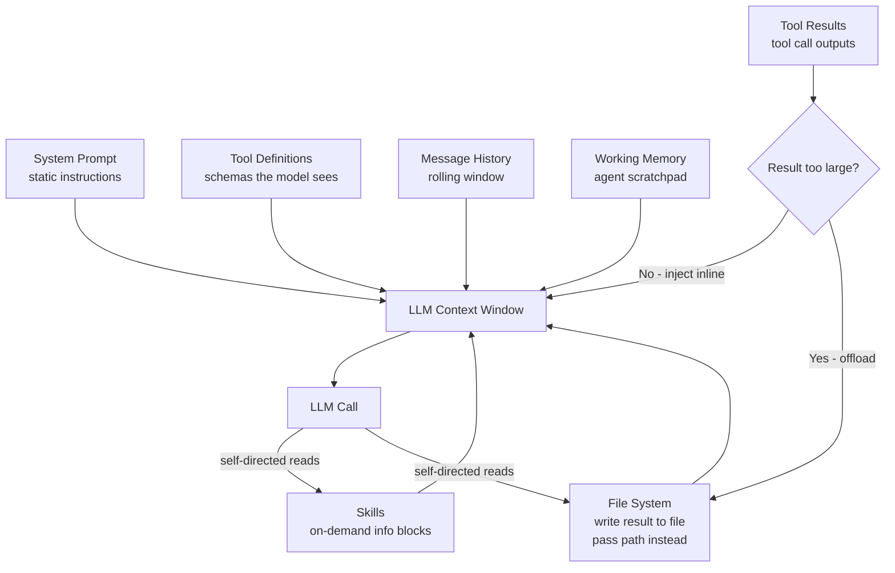

# Context Engineering

**Level**: 🔴 Advanced
**Reading Time**: 15 minutes

> Prompt engineering asks "how do I word this instruction?" Context engineering asks "what information does the model need, when, and in what form?" The second question is harder — and more important.

## 🗺️ Quick Overview



*Six components fill the context window. Tool results that exceed a size threshold are offloaded to the file system — the agent gets the file path, not the full content. Skills are loaded on demand as the task evolves.*

## What Context Engineering Is

When Harrison Chase (CEO of LangChain) describes what separates reliable agents from flaky ones, he doesn't say "better prompts." He says better context management. Context engineering is the discipline of deciding:

- **What** information goes into the context window
- **When** it goes in (at init, dynamically as the task progresses, or on demand)
- **What form** it takes (raw JSON, summarized text, file reference)
- **What comes out** (truncation, offloading, summarization) when the window fills

This is different from prompt engineering. Prompt engineering is about the wording of instructions — "be concise", "think step by step", "respond as a senior engineer." Context engineering is about the information landscape the model operates in. You can have a perfectly worded system prompt and still have the agent fail because it lacked a critical piece of context, or because 80% of its window was consumed by a noisy tool result it never needed again.

**The central insight**: when agents fail mid-task, the failure is almost always an information failure — the model didn't have what it needed, or it was buried under noise. When agents succeed, the right information was available at the right time.

## Prompt Engineering vs. Context Engineering

| Dimension | Prompt Engineering | Context Engineering |
|-----------|-------------------|---------------------|
| Question it answers | How should I word this? | What information should be here? |
| Focus | Phrasing, tone, instruction structure | Data selection, timing, format, size |
| Scope | Mostly the system prompt | The entire context window at every step |
| When it matters | One-shot tasks and chatbots | Multi-step agents, long-running tasks |
| Primary failure mode | Ambiguous instructions | Missing context or context overflow |
| Key skill | Writing clarity | Information architecture |

Prompt engineering got the field started — it was the dominant mental model for 2022-2024. As agents became more complex (multi-step, multi-tool, multi-session), context engineering emerged as the more important discipline.

## Anatomy of an Agent's Context Window

At any moment during an agent run, the context window contains some combination of these six components:

### 1. System Prompt

The static foundation — instructions, persona, constraints. But "static" doesn't mean small or simple. Claude Code's system prompt is approximately 2,000 lines. It encodes how to plan, how to use tools, what to verify, how to handle errors.

In a well-designed harness, even the system prompt has dynamic parts. The core instructions are static (and cache-able — more on this later), but certain capabilities are injected only when needed.

```
// System prompt structure
SystemPrompt = {
  core: STATIC_INSTRUCTIONS,          // Never changes — prime candidate for prompt caching
  dynamicCapabilities: [],             // Loaded based on task type
  environmentContext: {               // Changes per session
    currentDate: today(),
    workingDirectory: session.cwd,
    projectContext: session.metadata
  }
}
```

### 2. Skills (On-Demand Information Blocks)

Skills are chunks of information loaded into the context window on demand — not an API call, not a tool, but a block of text that expands the model's knowledge or behavior in a specific area.

Examples:
- A "code review" skill that explains your team's standards, loaded when the agent is doing review tasks
- A "database schema" skill that dumps the relevant schema, loaded when the agent is writing queries
- A "customer context" skill that injects customer tier, history, and preferences before a support task

Skills are distinct from:
- **Tools** (tools make API calls; skills are read-only context)
- **The system prompt** (the system prompt is always present; skills are loaded as needed)
- **RAG** (RAG retrieves from a corpus; skills are pre-authored blocks)

```
// Skill loader
function loadSkillsForStep(step, availableSkills, contextBudget):
  // Model itself can request skills by name
  requestedSkills = step.requestedSkills  // e.g., ["sql-query-patterns", "db-schema"]

  // Or deterministic rules based on task type
  inferredSkills = inferRequiredSkills(step.toolsUsed, step.taskType)

  allNeeded = deduplicate(requestedSkills + inferredSkills)

  // Respect context budget
  loaded = []
  remainingBudget = contextBudget.skills
  for skill in allNeeded:
    skillContent = readSkillFile(availableSkills, skill)
    if tokenCount(skillContent) <= remainingBudget:
      loaded.append(skillContent)
      remainingBudget -= tokenCount(skillContent)

  return loaded
```

### 3. Tool Definitions

Every tool the model can see consumes context. A typical tool definition with name, description, and JSON schema is 100-500 tokens. With 20 tools, that's 2,000-10,000 tokens of overhead — before a single message.

Context engineering decisions around tools:
- **Which tools to expose**: Don't show all 50 tools at every step. Load relevant tools dynamically based on task phase.
- **How to describe them**: Tool descriptions must be precise enough for the model to choose correctly, not verbose enough to waste tokens.
- **When to remove them**: After the agent has passed the phase where a tool is needed, remove it from the definition list.

```
// Dynamic tool loading
function getToolsForPhase(phase, allTools):
  if phase == "planning":
    return [TODO_TOOL, READ_FILE_TOOL, SEARCH_TOOL]
  elif phase == "execution":
    return [BASH_TOOL, WRITE_FILE_TOOL, API_CALL_TOOL]
  elif phase == "review":
    return [READ_FILE_TOOL, RUN_TESTS_TOOL]
  else:
    return allTools  // Default: show everything
```

### 4. Message History

The conversation so far — user messages, assistant responses, tool call requests, tool results. This is where context accumulates fastest.

Key decisions:
- **How far back to include**: A rolling window based on token count, not message count
- **When to summarize**: When history exceeds the history budget (see context budget below)
- **What to preserve**: Always keep the first message (original task) even when summarizing

See [Context Window Management](./context-window-management) for compression strategies.

### 5. Tool Call Results

The output from tool invocations. This is the most dangerous component for context bloat. A single bash command that lists directory contents can return 50 lines. A database query can return 10,000 rows. A web scrape can return 100KB of HTML.

The rule: **tool results should be sized to the model's need, not the tool's output**.

```
// Tool result injection policy
function injectToolResult(result, contextBudget):
  resultTokens = tokenCount(result)

  if resultTokens <= contextBudget.singleResultInline:
    // Small result: inject directly
    return ToolResultMessage(result)

  elif resultTokens <= contextBudget.singleResultSummarize:
    // Medium result: summarize before injecting
    summary = LLM.summarize(result, maxTokens=500)
    return ToolResultMessage("[Summarized] " + summary)

  else:
    // Large result: offload to file system
    path = workingDir.write(result)
    return ToolResultMessage(
      "[Large result saved to " + path + "]\n" +
      "First 200 chars: " + result[:200] + "..."
    )
```

### 6. Working Memory

The agent's scratchpad — thoughts, plans, intermediate conclusions written by the model itself. This is different from message history (which is the dialogue record) and from external memory (which is persisted across runs).

Working memory is what the agent uses to track its own progress:
- "I've already checked files A, B, C — next is D"
- "The user wants the output in JSON format — remember this"
- "I found the bug on line 47 — the fix requires changing the function signature"

Some frameworks give the agent an explicit `write_memory` tool. Others use the model's native reasoning (chain-of-thought) as implicit working memory.

## The Context Budget

Every production context window has an explicit budget. Without one, individual components grow unchecked until the window overflows.

```python
class ContextBudget:
    TOTAL = 200_000         # tokens (Claude 3.5 Sonnet)

    # Fixed allocations
    SYSTEM_PROMPT = 4_000   # Core static instructions
    SKILLS = 2_000          # On-demand info blocks (per loaded skill)
    TOOL_DEFINITIONS = 3_000 # Tool schemas the model sees

    # Dynamic allocations
    HISTORY = 80_000        # Rolling message history
    WORKING_MEMORY = 10_000 # Agent scratchpad
    TOOL_RESULTS = 100_000  # Tool outputs (overflow → file system)

    # Safety reserve
    OUTPUT_RESERVE = 8_000  # Tokens for model's response
    # Always leave room for output — this is a common mistake

    def check(self, current_usage: dict) -> ContextStatus:
        total_used = sum(current_usage.values()) + self.OUTPUT_RESERVE
        if total_used > self.TOTAL * 0.90:
            return ContextStatus.CRITICAL   # Trigger compaction now
        elif total_used > self.TOTAL * 0.75:
            return ContextStatus.WARNING    # Prepare for compaction
        else:
            return ContextStatus.OK
```

The budget is not just a number — it enforces behavior. When the tool results budget is exceeded, results go to the file system automatically. When the history budget is exceeded, summarization triggers. The agent never has to think about this — the harness manages it.

## The Context Engineering Decision Loop

At every step of an agent run, the harness makes these decisions:

```
function prepareContextForStep(step, session, budget):
  ctx = ContextBuilder()

  // 1. System prompt (mostly static — cache-friendly)
  ctx.add(CORE_SYSTEM_PROMPT, slot="system")

  // 2. Load relevant skills for this step
  skills = loadSkillsForStep(step, session.availableSkills, budget)
  ctx.add(skills, slot="skills")

  // 3. Load relevant tool definitions for this phase
  tools = getToolsForPhase(step.phase, session.allTools)
  ctx.add(tools, slot="tools")

  // 4. Message history (with rolling window)
  history = session.getHistory(maxTokens=budget.HISTORY)
  ctx.add(history, slot="history")

  // 5. Working memory
  ctx.add(session.workingMemory, slot="working_memory")

  // 6. Pending tool results
  for result in step.pendingResults:
    if result.tokenCount <= budget.singleResultInline:
      ctx.add(result, slot="tool_results")
    else:
      path = session.workingDir.write(result)
      ctx.add(fileReference(path), slot="tool_results")

  // 7. Verify budget before calling LLM
  status = budget.check(ctx.usage())
  if status == CRITICAL:
    ctx.compact(strategy="summarize_history")

  return ctx.render()
```

## Context Offloading: The File System Pattern

The most underused technique in context engineering. When a tool result is too large to keep in the message list, write it to the file system and give the agent the path.

Why this works: the agent can read the file later if it actually needs the content. Often it doesn't — the agent just needs to know the result existed and where to find it. The cost of the actual read is incurred only when needed.

```
// Before: naive approach
result = bash("find / -name '*.log' -exec grep 'ERROR' {} \;")
// result = 80,000 tokens of log lines
messages.append(ToolResult(result))  // Context immediately overwhelmed

// After: file system offload
result = bash("find / -name '*.log' -exec grep 'ERROR' {} \;")
path = workingDir.write("error_scan_results.txt", result)
messages.append(ToolResult(
  "Error scan complete. " + lineCount(result) + " matches found.\n" +
  "Full results saved to: " + path + "\n" +
  "First 5 lines:\n" + firstLines(result, 5)
))
// Context cost: ~100 tokens instead of 80,000
```

The agent can now call `read_file(path)` if it needs to examine specific entries. It doesn't pay the context cost for data it doesn't end up using.

This pattern is central to how Claude Code works. When you ask it to analyze a codebase, it doesn't dump every file into context. It reads files selectively — the ones it determines are relevant to the current task.

## Self-Directed Context: The Model Decides What to Read

The emerging frontier in context engineering. Instead of the harness deciding what to inject, the model itself decides what context it needs.

Claude Code is the clearest example: given a task like "fix the bug in the authentication module", the model:
1. Reads the directory structure to understand the codebase
2. Opens the files it thinks are relevant
3. Follows imports to related modules
4. Reads test files to understand expected behavior
5. Only then makes changes

At no point does the harness inject the full codebase into context. The model navigates to what it needs. This scales to codebases with millions of lines — you can't fit that in any context window.

```
// Self-directed context agent
function selfDirectedContextAgent(task, tools, maxContextTokens):
  // Agent starts with task and minimal context
  messages = [HumanMessage(task)]
  // tools include: read_file, list_directory, search_code, write_file

  while true:
    response = LLM.generate([SystemPrompt] + messages, tools=tools)

    if response.type == FINAL_ANSWER:
      return response.text

    // Agent reads what it decides it needs
    for toolCall in response.toolCalls:
      if toolCall.tool == "read_file":
        content = readFile(toolCall.args.path)
        // Inject just this file, not everything
        result = ToolResult(toolCall.id, content)
      elif toolCall.tool == "list_directory":
        listing = listDir(toolCall.args.path)
        result = ToolResult(toolCall.id, listing)
      // ...
      messages.append(result)

    // Context compaction still applies — even self-directed reads accumulate
    messages = manageContext(messages, maxContextTokens)
```

The key shift: the model's reasoning drives what enters context, not a predetermined injection plan. The harness still manages budget and compaction — but the selection is model-driven.

## Context Compaction

When the window fills, two approaches:

**Hard threshold (deterministic)**: When context usage exceeds X%, trigger summarization immediately. Simple, predictable. The downside: the cutoff point may be arbitrary — summarizing at 80% might discard context that was still relevant.

**Model-triggered (adaptive)**: Let the model signal when it feels context is getting noisy. Anthropic's API for Claude now supports a mode where the model can request compaction mid-run. More adaptive, but requires model support and adds complexity.

```
// Hybrid: hard threshold + model signal
function shouldCompact(context, modelSays):
  if context.usage() > HARD_THRESHOLD:
    return True  // Always compact at hard limit
  if modelSays.wantsCompaction:
    return True  // Honor model request
  return False

// Compaction: summarize middle, preserve anchors
function compact(messages):
  // Anchors: always keep
  firstMessage = messages[0]    // Original task
  lastN = messages[-5:]          // Recent context

  // Summarize everything in between
  middle = messages[1:-5]
  if middle is empty:
    return messages  // Nothing to compact

  summary = LLM.call(SUMMARIZE_PROMPT, middle)
  return [firstMessage, SummaryMessage(summary)] + lastN
```

## Prompt Caching and Context Engineering

Prompt caching (available in Anthropic, OpenAI, and Google APIs) lets you cache the KV state of a prefix so repeated calls with the same prefix don't recompute it.

Context engineering directly affects cache hit rates:

- **Stable prefix = more cache hits**: If your system prompt is 4,000 tokens and never changes, those 4,000 tokens are cached after the first call. Every subsequent call with the same prefix costs significantly less.
- **Dynamic content early in prompt = cache misses**: If you inject timestamps, user IDs, or dynamic content near the top of the system prompt, the cache key changes on every call — no hits.

Rule: **Put stable content first (system prompt, skills, tool definitions). Put dynamic content last (message history, latest tool results).** The cache prefix is always the beginning of the prompt — anything after the first dynamic token is not cached.

```
// Cache-optimized context ordering
context = [
  STATIC_SYSTEM_PROMPT,         // Cached — same every call
  STATIC_SKILLS,                // Cached — loaded once per session
  STATIC_TOOL_DEFINITIONS,      // Cached — same set of tools

  // Dynamic content starts here — cache ends here
  session.workingMemory,        // Changes as agent progresses
  session.messageHistory,       // Grows every step
  latestToolResult              // New every step
]
```

For a 200K context window where the first 80K tokens are static, you save ~80K tokens of compute on every call after the first. At scale, this is a significant cost reduction.

## Real-World Examples

### Claude Code

Demonstrates self-directed context at its best. Claude Code's harness:
- Never dumps the full codebase into context
- Starts with a list of files in the working directory
- Agent reads files as needed using `read_file` tool
- Large file reads are cached within the session
- Results of bash commands go inline if small, to a temporary file if large
- System prompt (~2,000 lines) is stable and always cache-hit after the first call

### LangGraph Agents

LangGraph's state graph manages what's in the agent's context at each node:
- Each node has explicit input/output schemas — you declare what each step needs and produces
- The graph edges control what context flows between steps
- No accidental context bleed between unrelated branches of the graph
- Reducers on the `messages` key implement the rolling window strategy

### RAG Pipelines

RAG is itself a context engineering system. The retrieval step is deciding what document chunks to inject:
- Retrieve too many chunks: context noise, model loses the important signal
- Retrieve too few: missing critical information
- Retrieve the wrong format: markdown tables vs. plain text affects comprehension
- The embedding model's quality determines whether retrieval actually surfaces the right chunks

Context engineering for RAG means: chunk size selection, retrieval limit, reranking before injection, and formatting the retrieved chunks so they're clear to the model.

## Trade-offs

| Choice | When to use | When to avoid |
|--------|------------|---------------|
| File offload for large results | Results > 5,000 tokens, agent may not need to read them | Simple tasks where every result is needed immediately |
| Static skills in system prompt | Skills used on >80% of tasks | Skills used rarely — they waste tokens on irrelevant tasks |
| Self-directed context | Large codebases, unknown scope | Narrow tasks where required context is known upfront |
| Model-triggered compaction | Long-running agents where task complexity varies | Short tasks where hard threshold is simpler |
| Separate tool definition pools per phase | >15 tools, clearly separated task phases | Few tools where the overhead of phase management is higher than token savings |

## Common Pitfalls

1. **Injecting everything at initialization**: Loading the full database schema, all documentation, and all tool results into the initial context sounds thorough — it's actually noise. The model's attention dilutes. Load what's needed for the current step.

2. **No context budget**: Without explicit budget enforcement, individual components grow unchecked. A single verbose tool result can consume the entire history budget, pushing out the task context that makes everything coherent.

3. **Forgetting tool schema tokens**: Tool definitions consume context. 20 tools with detailed schemas = 5,000-10,000 tokens before a single message. Count them in your budget and load only what's relevant per phase.

4. **Dynamic content at the start of the prompt**: Injecting a timestamp or request ID at the top of the system prompt breaks prompt caching. Every call is a cache miss. Put stable content first.

5. **Never compacting message history**: History grows linearly with agent steps. A 100-step agent that doesn't compact history will exhaust the context window by step 80. Build compaction into the loop, not as an afterthought.

6. **Working memory grows unbounded**: Agent scratchpad notes accumulate. Budget them explicitly and compress when needed — they're not exempt from the token limit.

## Key Takeaways

- Context engineering = deciding what information the model needs, when, and in what form — it's more important than prompt wording for multi-step agents
- Six components fill the context window: system prompt, skills, tool definitions, message history, working memory, tool results
- Budget each component explicitly — without budgets, verbose tool results crowd out task context
- Offload large tool results to the file system; pass the path, not the content. The agent reads on demand
- Skills are on-demand info blocks — load them when needed for the current step, not always
- Put stable content first for prompt cache hits; dynamic content goes last
- Self-directed context (agent decides what to read) scales to arbitrarily large information spaces — Claude Code is the production example
- Compaction triggers at 75-80% of the limit, not 100% — waiting until full means the next LLM call fails
