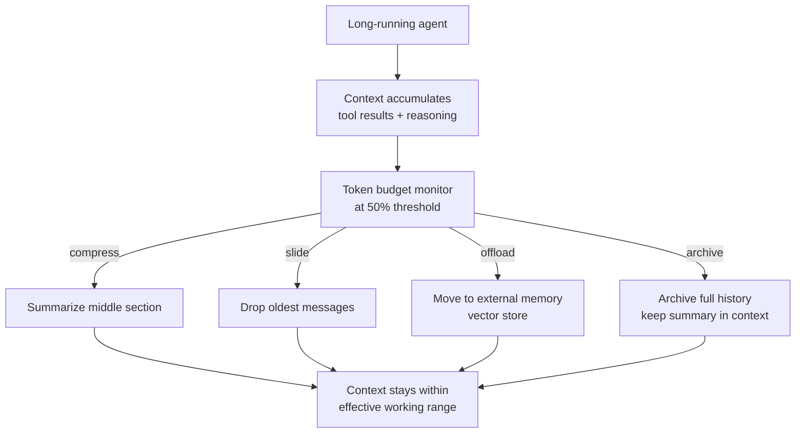
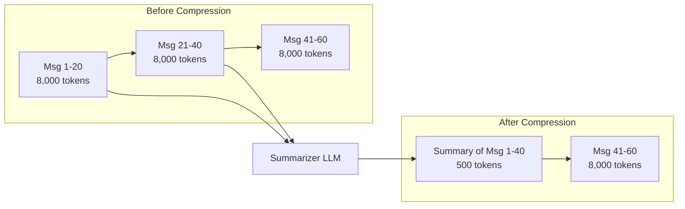
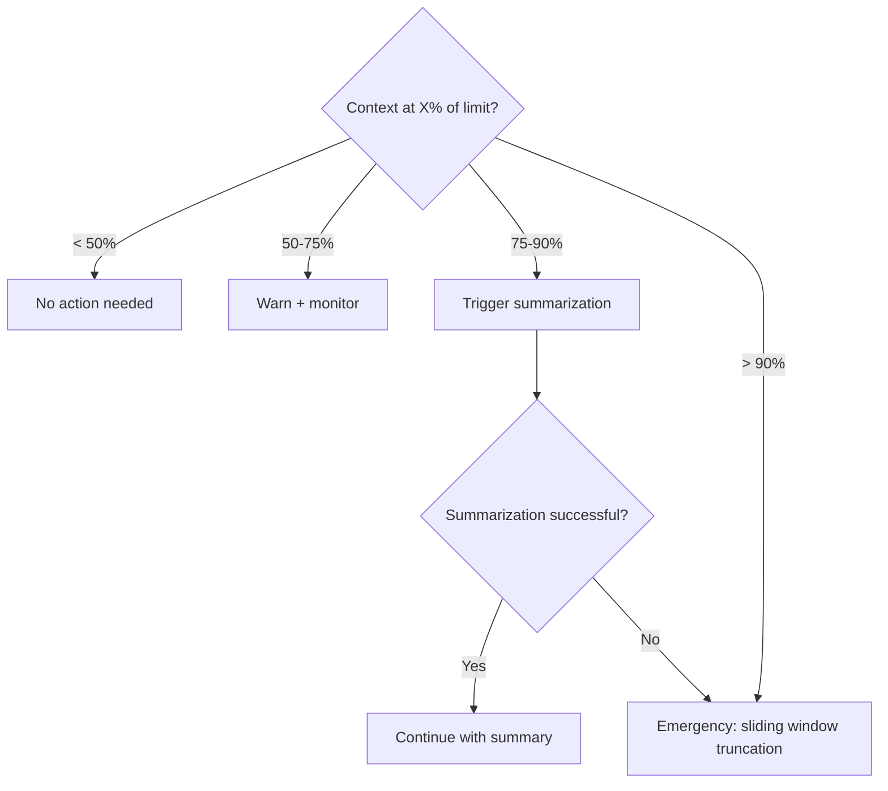

# Context Window Management

**Level**: 🔴 Advanced
**Reading Time**: 12 minutes

> Context windows have limits. Long-running agents that ignore those limits don't fail gracefully — they fail expensively, mid-task, with a cryptic token count error.

## 🗺️ Quick Overview



*Four strategies — summarize, sliding window, external memory, archive — keep accumulated context within the model's effective working range.*

## The Problem

Every LLM call has a maximum context window — a hard limit on how many tokens can be included in a single call. Long-running agents accumulate:

- Tool call results (often verbose JSON)
- Agent reasoning traces
- Conversation history
- Retrieved document chunks
- System prompt overhead

A research agent working a 30-step task can easily accumulate 50,000-200,000 tokens of context. For most models, this either:
1. Hits the hard token limit and crashes with an error
2. Causes severe performance degradation well before the limit (models lose coherence in very long contexts)
3. Costs significantly more — billing is per-token, both input and output

Context window management is the discipline of keeping the working context within effective bounds throughout a long agent run.

## Model Context Limits (2025)

Knowing your model's limits is the first step:

| Model | Context Window | Effective Working Range | Notes |
|-------|----------------|------------------------|-------|
| GPT-4o | 128k tokens | ~60k practical | Degrades beyond ~60k |
| GPT-4o-mini | 128k tokens | ~60k practical | Same |
| Claude 3.5 Sonnet | 200k tokens | ~100k practical | Strong long-context capability |
| Claude 3.5 Haiku | 200k tokens | ~100k practical | Fast + long context |
| Gemini 1.5 Pro | 1M tokens | ~500k practical | Longest window available |
| Gemini 2.0 Flash | 1M tokens | ~500k practical | Fast |
| Llama 3.3 70B | 128k tokens | ~80k practical | Open source |

"Effective working range" = where the model reliably attends to all content. Beyond this, models often fail to use information from the middle of context ("lost in the middle" problem).

**Practical threshold for triggering compression**: when accumulated context exceeds 50% of the model's effective working range.

## The Four Strategies

### Strategy 1: Sliding Window (Drop Oldest)

Keep a fixed-size window of the most recent messages. Oldest messages are dropped when the window fills:

```
// Sliding window context management
function slidingWindowContext(messages, systemPrompt, maxTokens, modelReserve=2000):
  systemTokens = countTokens(systemPrompt)
  availableTokens = maxTokens - systemTokens - modelReserve

  // Always keep the first user message (task definition)
  firstUserMsg = messages.find(m => m.role == "user")
  keptMessages = [firstUserMsg]
  usedTokens = countTokens(firstUserMsg)

  // Add most recent messages until we hit the limit
  recentMessages = messages.reverse()  // newest first
  for message in recentMessages:
    if message == firstUserMsg:
      continue  // Already added
    msgTokens = countTokens(message)
    if usedTokens + msgTokens <= availableTokens:
      keptMessages.prepend(message)  // Add to front (chronological order)
      usedTokens += msgTokens
    else:
      break  // Window full

  return [SystemMessage(systemPrompt)] + keptMessages
```

Pros: Simple, predictable, O(1) memory. Cons: Loses early context — if the task goal was mentioned in an early message, the agent forgets it.

Fix: Always preserve the first user message (task definition) and the last N tool results. Only drop middle history.

### Strategy 2: Summarization (Compress Old History)

When context gets too long, summarize the older portion into a compact summary node, then continue with summary + recent messages:



```
// Summarization-based compression
function compressContextWithSummary(messages, systemPrompt, maxTokens):
  currentTokens = countTokens(messages) + countTokens(systemPrompt)
  targetTokens = maxTokens * 0.6  // Compress down to 60% to leave room to grow

  if currentTokens <= targetTokens:
    return messages  // No compression needed

  // Determine split point: summarize messages 2 through N-10
  // Keep: first message + last 10 messages
  firstMsg = messages[0]
  recentMessages = messages[-10:]
  toSummarize = messages[1:-10]

  if toSummarize is empty:
    // Can't summarize — window is too small
    return messages[-20:]  // Fall back to sliding window

  // Generate summary of old messages
  summary = LLM.generate(
    model = CHEAP_FAST_MODEL,  // Use cheap model for summarization
    messages = [
      SystemMessage("""
        Summarize the following agent conversation history.
        Preserve:
        - The original task/goal
        - Key decisions made
        - Important information discovered (numbers, names, findings)
        - Actions already taken (so the agent doesn't repeat them)
        - Current state/progress

        Be concise but complete. This summary replaces the full history.
      """),
      HumanMessage(formatMessagesAsText(toSummarize))
    ],
    maxTokens = 800  // Target a compact summary
  )

  summaryMessage = SystemMessage("[CONVERSATION SUMMARY]\n" + summary.text)

  // Rebuild context: system + summary + recent
  return [firstMsg, summaryMessage] + recentMessages

// Integrate into agent loop
function agentWithCompression(task, tools, maxTokens):
  messages = [HumanMessage(task)]

  while true:
    // Check context size before each LLM call
    messages = compressContextWithSummary(messages, SYSTEM_PROMPT, maxTokens)

    response = LLM.generate([SystemMessage(SYSTEM_PROMPT)] + messages, tools=tools)

    if response.type == FINAL_ANSWER:
      return response.text

    messages.append(AIMessage(response))
    for toolCall in response.toolCalls:
      result = executeToolCall(toolCall)
      messages.append(ToolResult(toolCall.id, result))
```

### Strategy 3: Selective Retrieval (External Memory)

For very long-running agents, store completed episodes in a vector database and retrieve only what's relevant at each step:

```
// External episodic memory with vector retrieval
ExternalMemory = {
  store: VectorDatabase,
  embeddingModel: EmbeddingModel,

  // Store a completed episode
  saveEpisode: function(episode):
    embedding = this.embeddingModel.encode(episode.summary)
    this.store.insert({
      id: episode.id,
      vector: embedding,
      content: episode.summary,
      metadata: {
        timestamp: episode.timestamp,
        taskId: episode.taskId,
        tools_used: episode.toolsUsed
      }
    })

  // Retrieve relevant past episodes
  retrieveRelevant: function(currentQuery, topK=3):
    queryEmb = this.embeddingModel.encode(currentQuery)
    return this.store.similaritySearch(queryEmb, limit=topK)
}

// Agent that stores and retrieves from external memory
function longRunningAgent(task, tools, memory):
  messages = [HumanMessage(task)]
  completedEpisodes = []

  while true:
    // Retrieve relevant past context
    relevantMemory = memory.retrieveRelevant(
      currentQuery = getLastNMessages(messages, n=3).asText(),
      topK = 3
    )

    // Inject relevant past context if useful
    if relevantMemory is not empty:
      memoryContext = "[RELEVANT PAST CONTEXT]\n" + relevantMemory.map(e => e.content).join("\n---\n")
      contextualMessages = [SystemMessage(memoryContext)] + messages
    else:
      contextualMessages = messages

    response = LLM.generate([SystemMessage(SYSTEM_PROMPT)] + contextualMessages, tools=tools)

    if response.type == FINAL_ANSWER:
      return response.text

    messages.append(AIMessage(response))
    for toolCall in response.toolCalls:
      result = executeToolCall(toolCall)
      messages.append(ToolResult(toolCall.id, result))

    // Archive old episodes to external memory if context is getting long
    if countTokens(messages) > TOKEN_THRESHOLD:
      episode = createEpisode(messages[:-5])  // Summarize all but last 5 messages
      memory.saveEpisode(episode)
      messages = messages[-5:]  // Keep only recent messages
```

### Strategy 4: Token Counting Before Every LLM Call

Regardless of the strategy, always count tokens before calling the LLM:

```
// Token budget enforcer — wraps every LLM call
function llmCallWithBudget(messages, tools, model, maxContextTokens):
  // Count current context
  messageTokens = countTokens(messages)
  toolTokens = countTokens(tools)  // Tool schemas consume context too
  totalTokens = messageTokens + toolTokens

  if totalTokens > maxContextTokens * 0.85:  // 85% threshold triggers compression
    messages = compressContextWithSummary(messages, "", maxContextTokens - toolTokens)
    totalTokens = countTokens(messages) + toolTokens

  if totalTokens > maxContextTokens:
    raise ContextOverflowError(
      "Context " + totalTokens + " exceeds limit " + maxContextTokens + " after compression"
    )

  return LLM.generate(messages, tools=tools, model=model)
```

## Compression Strategy Selection



| Context Level | Action |
|--------------|--------|
| < 50% limit | No action |
| 50-75% limit | Log warning, no action |
| 75% limit | Summarize oldest 50% of history |
| 90% limit | Hard truncation (sliding window) as safety net |
| 100% limit | LLM call will fail — this should never be reached |

## Common Pitfalls

1. **Compressing at 100%**: Don't wait until the context is full. By then, the LLM call has already failed. Trigger compression at 75-80% of the limit.
2. **Losing the original task in compression**: A summary of conversation history is useless if it doesn't include what the agent is trying to accomplish. Always preserve the first user message.
3. **Cheap model produces poor summaries**: Summarization with a very weak model loses critical details. Use at least a medium-quality model for summaries — the cost is a single call.
4. **Not counting tool schemas in token budget**: Tool definitions (especially if you have many tools) consume 1,000-5,000 tokens. Include them in your token count, or you'll get surprises.
5. **Summarizing tool results verbosely**: A tool result that's a 10,000-token JSON blob should be summarized before adding to context, not added raw. Compress tool results at injection time.

## Key Takeaways

- Hard model limits (2025): GPT-4o 128k, Claude 3.5 200k, Gemini 1M — but effective working range is 50-60% of that
- Four strategies: sliding window (simple, loses early context), summarization (compact history, requires LLM call), external retrieval (infinite memory, requires vector DB), token counting (preventative, use with any strategy)
- Trigger compression at 75% of the limit, not 100%
- Always preserve the original task/goal message — never compress it away
- Include tool schema tokens in your budget calculation — they're invisible but expensive
- For most production agents: summarization is the default strategy; external retrieval is for agents running over hours or days

---

## Level 1 — Surface (2-minute read)

**What is context window management?**
It is the set of techniques used to keep an LLM agent's active context (the tokens sent in each API call) within the model's hard limit and effective working range, without losing information critical to completing the task.

**When do you need it?**
- Agent runs > 10 steps or > 5 minutes
- Tool results are large (JSON blobs, web page text, database rows)
- You're building research agents, coding agents, or any multi-step task runner
- Context already exceeded ~40,000 tokens in testing

**Core concepts (5 bullets):**
- Every LLM API call has a hard token ceiling: 128k–1M tokens depending on the model
- "Lost in the middle": models attend poorly to content in the center of a very long context — effective working range is 50–60% of the hard limit
- Four main strategies: sliding window, summarization, external retrieval, and token-budget enforcement
- Always trigger compression at 75% of the limit, not 100% — by 100% the call has already failed
- Tool schemas themselves cost tokens: 10 tools with rich descriptions can consume 3,000–8,000 tokens per call

**Quick decision table:**

| Task duration | Strategy |
|--------------|----------|
| < 10 steps | No management needed — monitor only |
| 10–50 steps | Summarization on the message history |
| 50+ steps or hours | External episodic memory (vector store) |
| Unknown / safety net | Token budget enforcer on every call |

---

## Level 2 — Deep Dive

### Problem Statement with Failure Scenario

A coding agent is given the task: "Refactor our 5,000-line monolith into microservices. Use the file-reader, bash, and GitHub tools."

After 25 steps:
- System prompt: 2,000 tokens
- Tool schemas (3 tools): 4,000 tokens
- Conversation history (25 exchanges): 35,000 tokens
- Retrieved file contents: 28,000 tokens
- **Total: ~69,000 tokens** — 54% of GPT-4o's 128k limit

After 45 steps it hits 115,000 tokens. The 46th LLM call throws:
```
openai.BadRequestError: This model's maximum context length is 128000 tokens.
Your messages resulted in 131,402 tokens. Please reduce your messages.
```

**The agent dies mid-task with no recovery path.** All work is lost. The user retries from scratch and hits the same wall.

This is why context window management must be baked into the agent loop from day one, not added after the first production incident.

---

### Approach A — Sliding Window (Drop Oldest)

**How it works:** Maintain a rolling window of the N most recent messages. When total tokens exceed a threshold, drop the oldest messages (except the first user message which holds the task definition).

**Python pseudocode:**
```python
import tiktoken

def sliding_window_context(
    messages: list[dict],
    system_prompt: str,
    max_tokens: int = 100_000,
    reserve_for_output: int = 4_000
) -> list[dict]:
    enc = tiktoken.encoding_for_model("gpt-4o")

    def count(text: str) -> int:
        return len(enc.encode(text))

    system_tokens = count(system_prompt)
    available = max_tokens - system_tokens - reserve_for_output

    # Always keep the first user message (task definition)
    first_user = next((m for m in messages if m["role"] == "user"), None)
    kept = [first_user] if first_user else []
    used = count(str(first_user)) if first_user else 0

    # Walk from newest to oldest, fill up to budget
    for msg in reversed(messages):
        if msg == first_user:
            continue
        tokens = count(str(msg))
        if used + tokens <= available:
            kept.insert(0 if msg != first_user else len(kept), msg)
            used += tokens
        # else: drop this message

    return kept
```

**Trade-offs:**

| | Sliding Window |
|-|---------------|
| Complexity | Very low — no LLM call needed |
| Memory loss | High — early critical context is dropped |
| Cost | Zero extra API cost |
| Recovery from loss | None — dropped messages are gone |
| Best for | Short stateless pipelines, chat bots |

---

### Approach B — Summarization (Compress Old History)

**How it works:** When context hits the 75% threshold, call a cheap/fast model to summarize the oldest 50% of message history into a compact paragraph. Replace the summarized messages with the summary node.

**TypeScript pseudocode:**
```typescript
interface Message {
  role: "user" | "assistant" | "system" | "tool";
  content: string;
}

async function compressWithSummary(
  messages: Message[],
  systemPrompt: string,
  maxTokens: number,
  summarizerModel: string = "gpt-4o-mini"
): Promise<Message[]> {
  const currentTokens = countTokens([...messages, { role: "system", content: systemPrompt }]);
  const targetTokens = maxTokens * 0.60; // compress down to 60%

  if (currentTokens <= targetTokens) return messages; // no-op

  // Keep first user message + last 8 messages; summarize the rest
  const firstUserMsg = messages.find(m => m.role === "user");
  const recentMessages = messages.slice(-8);
  const toSummarize = messages.slice(1, -8); // skip first, skip last 8

  if (toSummarize.length === 0) {
    // Fallback: hard truncate
    return messages.slice(-20);
  }

  const summaryResponse = await callLLM({
    model: summarizerModel,
    messages: [
      {
        role: "system",
        content: `Summarize the following agent conversation history in under 600 tokens.
Preserve: original task/goal, key decisions, important data discovered (names, numbers, paths),
actions already completed (to prevent repetition), and current progress state.`
      },
      {
        role: "user",
        content: toSummarize.map(m => `[${m.role}]: ${m.content}`).join("\n\n")
      }
    ],
    maxTokens: 700
  });

  const summaryMsg: Message = {
    role: "system",
    content: `[HISTORY SUMMARY — steps 1 to ${toSummarize.length}]\n${summaryResponse.content}`
  };

  // Rebuild: first user message + summary + recent messages
  return [firstUserMsg!, summaryMsg, ...recentMessages];
}
```

**Trade-offs:**

| | Summarization |
|-|--------------|
| Complexity | Medium — requires a summarizer LLM call |
| Memory loss | Low — key facts preserved in summary |
| Cost | 1 extra LLM call per compression (use cheap model) |
| Compression ratio | 10,000 tokens → 500–700 token summary |
| Best for | Research agents, coding agents, 10–100 step tasks |

---

### Approach C — External Episodic Memory (Vector Store)

**How it works:** Every N steps, archive completed reasoning episodes to a vector database. On each agent step, retrieve the top-K most semantically relevant past episodes and inject them as context.

**Python pseudocode (LangChain-style):**
```python
from dataclasses import dataclass
from typing import Any

@dataclass
class Episode:
    id: str
    summary: str
    tools_used: list[str]
    outcome: str
    step_range: tuple[int, int]
    embedding: list[float] | None = None

class EpisodicMemory:
    def __init__(self, vector_store, embedding_model):
        self.store = vector_store        # e.g., ChromaDB, Pinecone, Weaviate
        self.embedder = embedding_model  # e.g., text-embedding-3-small

    def save(self, episode: Episode) -> None:
        episode.embedding = self.embedder.embed(episode.summary)
        self.store.upsert(
            ids=[episode.id],
            embeddings=[episode.embedding],
            documents=[episode.summary],
            metadatas=[{"tools": ",".join(episode.tools_used), "outcome": episode.outcome}]
        )

    def retrieve(self, query: str, top_k: int = 3) -> list[Episode]:
        query_emb = self.embedder.embed(query)
        results = self.store.query(query_embeddings=[query_emb], n_results=top_k)
        return [Episode(id=r["id"], summary=r["document"], ...) for r in results["documents"][0]]


async def agent_with_episodic_memory(
    task: str,
    tools: list,
    memory: EpisodicMemory,
    archive_every_n_steps: int = 10
) -> str:
    messages = [{"role": "user", "content": task}]
    step = 0

    while True:
        step += 1

        # Retrieve relevant past episodes
        recent_text = " ".join(m["content"] for m in messages[-3:])
        past_episodes = memory.retrieve(query=recent_text, top_k=3)
        if past_episodes:
            memory_block = "\n---\n".join(e.summary for e in past_episodes)
            injected = [{"role": "system", "content": f"[RELEVANT PAST EPISODES]\n{memory_block}"}]
        else:
            injected = []

        response = await call_llm(SYSTEM_PROMPT, injected + messages, tools)

        if response.is_final_answer:
            return response.content

        messages.append({"role": "assistant", "content": response.content})

        for tool_call in response.tool_calls:
            result = await execute_tool(tool_call)
            messages.append({"role": "tool", "content": str(result)})

        # Archive old messages to external memory periodically
        if step % archive_every_n_steps == 0 and len(messages) > 15:
            archive_batch = messages[:-5]  # keep last 5
            episode = await summarize_to_episode(archive_batch, step_range=(step - 10, step))
            memory.save(episode)
            messages = messages[-5:]  # slim down working context
```

**Trade-offs:**

| | Episodic Memory |
|-|----------------|
| Complexity | High — requires vector DB infra |
| Memory loss | Very low — near-lossless with good summarization |
| Cost | Extra infra + embedding API calls |
| Scale | Theoretically unlimited (days, weeks of agent runs) |
| Best for | Long-horizon agents, autonomous workflows, multi-session tasks |

---

### Framework-Level Support

**LangChain** — `ConversationSummaryBufferMemory`

LangChain ships a built-in memory class that automatically summarizes conversation history when it exceeds a token threshold:

```python
from langchain.memory import ConversationSummaryBufferMemory
from langchain.chat_models import ChatOpenAI

# Summarizes when history exceeds 2000 tokens
memory = ConversationSummaryBufferMemory(
    llm=ChatOpenAI(model="gpt-4o-mini"),
    max_token_limit=2000,
    return_messages=True
)
```

Under the hood, `ConversationSummaryBufferMemory` keeps recent messages verbatim and summarizes older exchanges. The summary is prepended to the context as a `SystemMessage`. This matches Approach B exactly.

**LlamaIndex** — `SimpleChatStore` + `TokenCountingHandler`

LlamaIndex exposes token counting as a callback:

```python
from llama_index.callbacks import TokenCountingHandler, CallbackManager
import tiktoken

token_counter = TokenCountingHandler(
    tokenizer=tiktoken.encoding_for_model("gpt-4o").encode
)
callback_manager = CallbackManager([token_counter])

# Attach to your index/agent
agent = OpenAIAgent.from_tools(
    tools,
    callback_manager=callback_manager,
    verbose=True
)

# After each step, check
print(f"Tokens used so far: {token_counter.total_llm_token_count}")
```

LlamaIndex's `CondensePlusContextChatEngine` automatically compresses chat history before each retrieval step, similar to Approach B.

**AutoGen** — `GroupChatManager` with `max_consecutive_auto_reply`

AutoGen caps per-agent conversation turns with `max_consecutive_auto_reply`. For long runs, you set up a `GroupChatManager` that monitors the aggregated conversation:

```python
from autogen import AssistantAgent, UserProxyAgent, GroupChat, GroupChatManager

assistant = AssistantAgent(
    "assistant",
    llm_config={
        "model": "gpt-4o",
        "max_tokens": 4096
    },
    max_consecutive_auto_reply=30  # Stop the agent after 30 rounds
)

# AutoGen does NOT compress context automatically (as of 2025).
# You must implement a custom reply_func to inject compression.
def compressing_reply(recipient, messages, sender, config):
    if count_tokens(messages) > 80_000:
        messages = compress_messages(messages)  # Your compression logic
    return False, None  # Let AutoGen handle the actual reply

assistant.register_reply(
    [AssistantAgent, UserProxyAgent],
    reply_func=compressing_reply,
    position=0  # Run before default reply
)
```

**CrewAI** — `Process.sequential` + task memory

CrewAI agents share state through a `Crew`'s `memory=True` flag, which uses a ChromaDB vector store internally:

```python
from crewai import Crew, Agent, Task, Process

researcher = Agent(
    role="Senior Researcher",
    goal="Research and summarize findings",
    backstory="Expert at distilling large information sets",
    memory=True,          # Enables per-agent episodic memory
    verbose=True
)

crew = Crew(
    agents=[researcher],
    tasks=[...],
    process=Process.sequential,
    memory=True,          # Shared crew memory (ChromaDB)
    embedder={
        "provider": "openai",
        "config": {"model": "text-embedding-3-small"}
    }
)
```

CrewAI stores task outputs in a vector database and retrieves relevant past context automatically before each agent step — this is Approach C out of the box.

**Anthropic Claude — Extended Thinking + Prompt Caching**

Claude's 200k context window and prompt caching feature address context costs differently:

- **Prompt caching**: Mark static portions of context (system prompt, tool definitions, document chunks) with a `cache_control` flag. Subsequent calls reuse the cached KV, reducing cost by 90% for those tokens.
- **Extended thinking**: Claude 3.5+ can run multi-step reasoning internally without all intermediate steps appearing in the message history, reducing visible token accumulation.

```python
import anthropic

client = anthropic.Anthropic()

# Use prompt caching for static system prompt + documents
response = client.messages.create(
    model="claude-sonnet-4-5",
    max_tokens=4096,
    system=[
        {
            "type": "text",
            "text": LARGE_SYSTEM_PROMPT,
            "cache_control": {"type": "ephemeral"}  # Cache this static block
        }
    ],
    messages=conversation_history
)
```

Prompt caching doesn't reduce context window usage — it reduces cost and latency of repeated static blocks. You still need compression for the dynamic message history.

---

### Real Company Examples

**OpenAI's GPT-4o Assistants API** (internal agent framework):
The Assistants API automatically truncates conversation threads when they approach the model's context limit. In 2024 OpenAI added a `truncation_strategy` parameter with two modes: `auto` (OpenAI decides what to drop) and `last_messages` (keep the N most recent). The default `auto` mode approximates a sliding window that preserves the task instructions. Source: OpenAI Platform Docs, Assistants API migration guide (2024).

**Anthropic's Claude.ai Projects** (product):
Projects use a 200k context window. Long conversations are automatically summarized via an internal "memory" system that distills key facts from old messages into a compact representation injected at the top of context. This is Approach B (summarization) running transparently for users. Source: Anthropic blog, Claude Projects announcement (2024).

**LangChain's LangGraph** (open source):
LangGraph ships a `MemorySaver` checkpoint backend. Between graph nodes, the full agent state (including message history) is checkpointed to a SQLite or PostgreSQL store. On context overflow, graph authors implement a `summarize_messages` node that compresses history and replaces it in the state. LangGraph's official docs show this exact pattern as the recommended production approach. Source: LangGraph documentation, "How to manage conversation history" (2025).

**Google's Gemini 1M context** (model):
Rather than managing context, Google takes the "context window so large it rarely overflows" approach with Gemini 1.5 Pro (1M token window). For a 45-step research agent with verbose tool results, 1M tokens is enough for ~10 hours of continuous work before overflow. However, per-call cost scales linearly with context size — a 500k token call with Gemini 1.5 Pro costs ~$6.25 per call at list pricing, making compression still economically necessary. Source: Google AI Studio pricing page (2025).

**Replit's GhostWriter Agent** (product):
Replit's coding agent uses a modified sliding window that preserves three categories of messages regardless of age: (1) the original task, (2) file edit events (critical to undo history), and (3) the last 5 exchanges. Everything else is eligible for eviction. This domain-specific pinning prevents the agent from forgetting that it already rewrote `user.py` in step 3 when it's on step 47. Source: Replit engineering blog (2024).

---

### Common Mistakes

**Mistake 1: Compressing at 100% utilization**
Root cause: Developers add compression as error handling (try/catch the token limit exception). By the time the exception fires, the call has already failed and the agent state may be partially corrupted.
Fix: Check token count before every LLM call. Trigger compression at 75-80% utilization. The check costs microseconds; the LLM call costs hundreds of milliseconds.

**Mistake 2: Not counting tool schema tokens**
Root cause: Developers count only message tokens. Tool definitions (especially if you have 10+ tools with rich descriptions and JSON schemas) can consume 3,000–8,000 tokens per call.
Fix: Count tool tokens separately and subtract them from the available budget for messages. Most tokenizer libraries let you serialize the tools JSON and count it directly.

**Mistake 3: Dropping the original task instruction**
Root cause: Naive sliding window evicts oldest messages, including the first user message that defines the task. The agent loses its north star.
Fix: Explicitly pin certain message categories: always keep `messages[0]` (original task), and any message tagged as `[CRITICAL]` (e.g., security constraints, hard requirements).

**Mistake 4: Using the primary model for summarization**
Root cause: Developers reuse the same claude-opus-4 / gpt-4o model for both the agent and the summarizer.
Fix: Use a cheaper, faster model (GPT-4o-mini, claude-haiku) for summarization. A summary call costs 1/10th the price and takes 1/5th the latency. Quality difference is negligible for extracting key facts from agent history.

**Mistake 5: Compressing tool results at retrieval time instead of injection time**
Root cause: A web search returns a 15,000-token HTML page. The developer adds it raw to the message history.
Fix: Summarize or truncate tool results before adding them to context. A 15,000-token web page can be reduced to 300 tokens of relevant facts at the point of injection. Use a fast summarizer LLM or extract only the relevant section with a targeted prompt.

---

### Production Checklist

Before deploying a long-running agent to production, verify:

- [ ] Token counting is in place on every LLM call (not just as error handling)
- [ ] Tool schema tokens are included in the budget
- [ ] Compression triggers at 75% of the model's effective working range (not hard limit)
- [ ] Original task message is pinned and never evicted
- [ ] A cheap model (not the primary model) handles summarization
- [ ] Tool results are compressed at injection time, not added raw
- [ ] You have a fallback strategy (sliding window) if summarization fails
- [ ] Context size is logged as a metric per agent step for observability
- [ ] You've tested with max-length tool results (not just happy-path short responses)
- [ ] The agent has been run to > 50 steps in a staging environment without overflow

---

### Key Numbers to Memorize

| Metric | Value |
|--------|-------|
| GPT-4o hard limit | 128k tokens |
| GPT-4o effective working range | ~60k tokens |
| Claude 3.5 hard limit | 200k tokens |
| Claude 3.5 effective working range | ~100k tokens |
| Gemini 1.5 Pro hard limit | 1M tokens |
| Typical tool schema overhead (10 tools) | 3,000–8,000 tokens |
| Average LLM response per step | 300–800 tokens |
| Compression trigger threshold | 75% of effective working range |
| Target after compression | 60% of effective working range |
| Summarization compression ratio | ~20:1 (10,000 tokens → 500 tokens) |

---

## References

- 📖 [LangGraph — How to manage conversation history](https://langchain-ai.github.io/langgraph/how-tos/memory/manage-conversation-history/) — Official LangGraph guide with working code for summarization-based compression
- 📖 [Anthropic — Prompt caching](https://docs.anthropic.com/en/docs/build-with-claude/prompt-caching) — How to use cache_control to reduce cost on repeated static context blocks
- 📖 [OpenAI — Assistants API: Conversation thread truncation](https://platform.openai.com/docs/assistants/deep-dive#context-window-control) — OpenAI's built-in truncation strategies for the Assistants API
- 📺 [Lost in the Middle: How Language Models Use Long Contexts](https://arxiv.org/abs/2307.03172) — Stanford/UC Berkeley research paper showing performance degradation at long context lengths (2023)
- 📖 [CrewAI — Memory](https://docs.crewai.com/concepts/memory) — How CrewAI uses episodic, semantic, and short-term memory out of the box
- 📖 [AutoGen — Context management for long chats](https://microsoft.github.io/autogen/stable/user-guide/agentchat-user-guide/tutorial/chat-termination.html) — AutoGen's approach to termination conditions and per-agent reply limits
