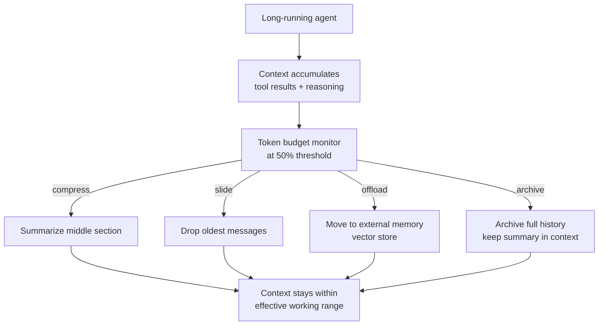
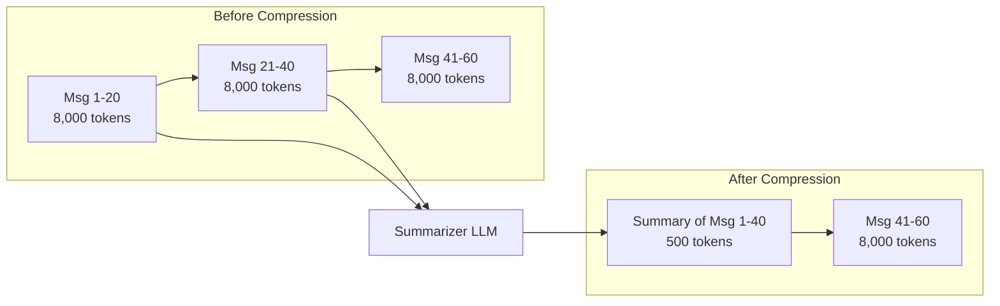
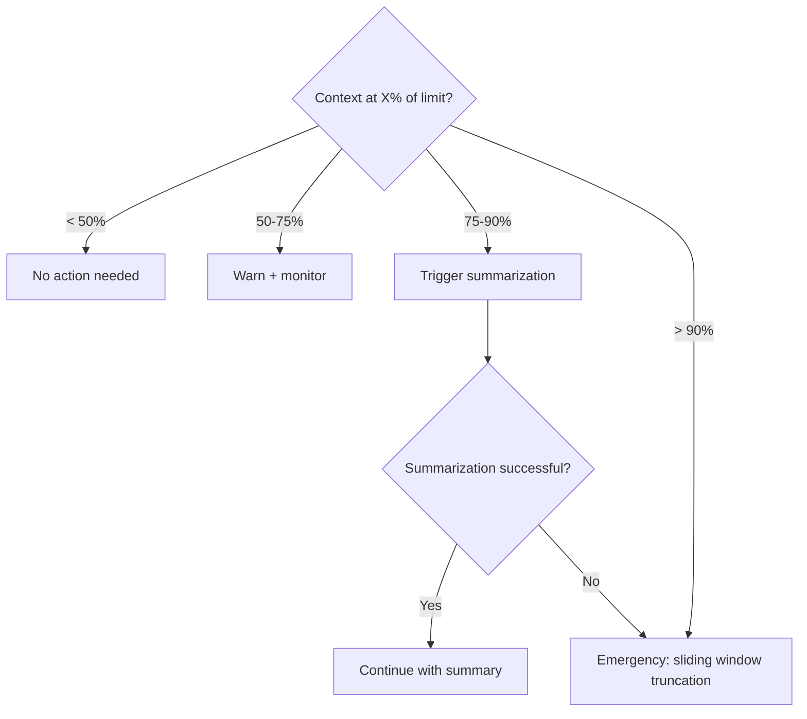

# Context Window Management

**Level**: 🔴 Advanced
**Reading Time**: 12 minutes

> Context windows have limits. Long-running agents that ignore those limits don't fail gracefully — they fail expensively, mid-task, with a cryptic token count error.

## 🗺️ Quick Overview



*Four strategies — summarize, sliding window, external memory, archive — keep accumulated context within the model's effective working range.*

## The Problem

Every LLM call has a maximum context window — a hard limit on how many tokens can be included in a single call. Long-running agents accumulate:

- Tool call results (often verbose JSON)
- Agent reasoning traces
- Conversation history
- Retrieved document chunks
- System prompt overhead

A research agent working a 30-step task can easily accumulate 50,000-200,000 tokens of context. For most models, this either:
1. Hits the hard token limit and crashes with an error
2. Causes severe performance degradation well before the limit (models lose coherence in very long contexts)
3. Costs significantly more — billing is per-token, both input and output

Context window management is the discipline of keeping the working context within effective bounds throughout a long agent run.

## Model Context Limits (2025)

Knowing your model's limits is the first step:

| Model | Context Window | Effective Working Range | Notes |
|-------|----------------|------------------------|-------|
| GPT-4o | 128k tokens | ~60k practical | Degrades beyond ~60k |
| GPT-4o-mini | 128k tokens | ~60k practical | Same |
| Claude 3.5 Sonnet | 200k tokens | ~100k practical | Strong long-context capability |
| Claude 3.5 Haiku | 200k tokens | ~100k practical | Fast + long context |
| Gemini 1.5 Pro | 1M tokens | ~500k practical | Longest window available |
| Gemini 2.0 Flash | 1M tokens | ~500k practical | Fast |
| Llama 3.3 70B | 128k tokens | ~80k practical | Open source |

"Effective working range" = where the model reliably attends to all content. Beyond this, models often fail to use information from the middle of context ("lost in the middle" problem).

**Practical threshold for triggering compression**: when accumulated context exceeds 50% of the model's effective working range.

## The Four Strategies

### Strategy 1: Sliding Window (Drop Oldest)

Keep a fixed-size window of the most recent messages. Oldest messages are dropped when the window fills:

```
// Sliding window context management
function slidingWindowContext(messages, systemPrompt, maxTokens, modelReserve=2000):
  systemTokens = countTokens(systemPrompt)
  availableTokens = maxTokens - systemTokens - modelReserve

  // Always keep the first user message (task definition)
  firstUserMsg = messages.find(m => m.role == "user")
  keptMessages = [firstUserMsg]
  usedTokens = countTokens(firstUserMsg)

  // Add most recent messages until we hit the limit
  recentMessages = messages.reverse()  // newest first
  for message in recentMessages:
    if message == firstUserMsg:
      continue  // Already added
    msgTokens = countTokens(message)
    if usedTokens + msgTokens <= availableTokens:
      keptMessages.prepend(message)  // Add to front (chronological order)
      usedTokens += msgTokens
    else:
      break  // Window full

  return [SystemMessage(systemPrompt)] + keptMessages
```

Pros: Simple, predictable, O(1) memory. Cons: Loses early context — if the task goal was mentioned in an early message, the agent forgets it.

Fix: Always preserve the first user message (task definition) and the last N tool results. Only drop middle history.

### Strategy 2: Summarization (Compress Old History)

When context gets too long, summarize the older portion into a compact summary node, then continue with summary + recent messages:



```
// Summarization-based compression
function compressContextWithSummary(messages, systemPrompt, maxTokens):
  currentTokens = countTokens(messages) + countTokens(systemPrompt)
  targetTokens = maxTokens * 0.6  // Compress down to 60% to leave room to grow

  if currentTokens <= targetTokens:
    return messages  // No compression needed

  // Determine split point: summarize messages 2 through N-10
  // Keep: first message + last 10 messages
  firstMsg = messages[0]
  recentMessages = messages[-10:]
  toSummarize = messages[1:-10]

  if toSummarize is empty:
    // Can't summarize — window is too small
    return messages[-20:]  // Fall back to sliding window

  // Generate summary of old messages
  summary = LLM.generate(
    model = CHEAP_FAST_MODEL,  // Use cheap model for summarization
    messages = [
      SystemMessage("""
        Summarize the following agent conversation history.
        Preserve:
        - The original task/goal
        - Key decisions made
        - Important information discovered (numbers, names, findings)
        - Actions already taken (so the agent doesn't repeat them)
        - Current state/progress

        Be concise but complete. This summary replaces the full history.
      """),
      HumanMessage(formatMessagesAsText(toSummarize))
    ],
    maxTokens = 800  // Target a compact summary
  )

  summaryMessage = SystemMessage("[CONVERSATION SUMMARY]\n" + summary.text)

  // Rebuild context: system + summary + recent
  return [firstMsg, summaryMessage] + recentMessages

// Integrate into agent loop
function agentWithCompression(task, tools, maxTokens):
  messages = [HumanMessage(task)]

  while true:
    // Check context size before each LLM call
    messages = compressContextWithSummary(messages, SYSTEM_PROMPT, maxTokens)

    response = LLM.generate([SystemMessage(SYSTEM_PROMPT)] + messages, tools=tools)

    if response.type == FINAL_ANSWER:
      return response.text

    messages.append(AIMessage(response))
    for toolCall in response.toolCalls:
      result = executeToolCall(toolCall)
      messages.append(ToolResult(toolCall.id, result))
```

### Strategy 3: Selective Retrieval (External Memory)

For very long-running agents, store completed episodes in a vector database and retrieve only what's relevant at each step:

```
// External episodic memory with vector retrieval
ExternalMemory = {
  store: VectorDatabase,
  embeddingModel: EmbeddingModel,

  // Store a completed episode
  saveEpisode: function(episode):
    embedding = this.embeddingModel.encode(episode.summary)
    this.store.insert({
      id: episode.id,
      vector: embedding,
      content: episode.summary,
      metadata: {
        timestamp: episode.timestamp,
        taskId: episode.taskId,
        tools_used: episode.toolsUsed
      }
    })

  // Retrieve relevant past episodes
  retrieveRelevant: function(currentQuery, topK=3):
    queryEmb = this.embeddingModel.encode(currentQuery)
    return this.store.similaritySearch(queryEmb, limit=topK)
}

// Agent that stores and retrieves from external memory
function longRunningAgent(task, tools, memory):
  messages = [HumanMessage(task)]
  completedEpisodes = []

  while true:
    // Retrieve relevant past context
    relevantMemory = memory.retrieveRelevant(
      currentQuery = getLastNMessages(messages, n=3).asText(),
      topK = 3
    )

    // Inject relevant past context if useful
    if relevantMemory is not empty:
      memoryContext = "[RELEVANT PAST CONTEXT]\n" + relevantMemory.map(e => e.content).join("\n---\n")
      contextualMessages = [SystemMessage(memoryContext)] + messages
    else:
      contextualMessages = messages

    response = LLM.generate([SystemMessage(SYSTEM_PROMPT)] + contextualMessages, tools=tools)

    if response.type == FINAL_ANSWER:
      return response.text

    messages.append(AIMessage(response))
    for toolCall in response.toolCalls:
      result = executeToolCall(toolCall)
      messages.append(ToolResult(toolCall.id, result))

    // Archive old episodes to external memory if context is getting long
    if countTokens(messages) > TOKEN_THRESHOLD:
      episode = createEpisode(messages[:-5])  // Summarize all but last 5 messages
      memory.saveEpisode(episode)
      messages = messages[-5:]  // Keep only recent messages
```

### Strategy 4: Token Counting Before Every LLM Call

Regardless of the strategy, always count tokens before calling the LLM:

```
// Token budget enforcer — wraps every LLM call
function llmCallWithBudget(messages, tools, model, maxContextTokens):
  // Count current context
  messageTokens = countTokens(messages)
  toolTokens = countTokens(tools)  // Tool schemas consume context too
  totalTokens = messageTokens + toolTokens

  if totalTokens > maxContextTokens * 0.85:  // 85% threshold triggers compression
    messages = compressContextWithSummary(messages, "", maxContextTokens - toolTokens)
    totalTokens = countTokens(messages) + toolTokens

  if totalTokens > maxContextTokens:
    raise ContextOverflowError(
      "Context " + totalTokens + " exceeds limit " + maxContextTokens + " after compression"
    )

  return LLM.generate(messages, tools=tools, model=model)
```

## Compression Strategy Selection



| Context Level | Action |
|--------------|--------|
| < 50% limit | No action |
| 50-75% limit | Log warning, no action |
| 75% limit | Summarize oldest 50% of history |
| 90% limit | Hard truncation (sliding window) as safety net |
| 100% limit | LLM call will fail — this should never be reached |

## Common Pitfalls

1. **Compressing at 100%**: Don't wait until the context is full. By then, the LLM call has already failed. Trigger compression at 75-80% of the limit.
2. **Losing the original task in compression**: A summary of conversation history is useless if it doesn't include what the agent is trying to accomplish. Always preserve the first user message.
3. **Cheap model produces poor summaries**: Summarization with a very weak model loses critical details. Use at least a medium-quality model for summaries — the cost is a single call.
4. **Not counting tool schemas in token budget**: Tool definitions (especially if you have many tools) consume 1,000-5,000 tokens. Include them in your token count, or you'll get surprises.
5. **Summarizing tool results verbosely**: A tool result that's a 10,000-token JSON blob should be summarized before adding to context, not added raw. Compress tool results at injection time.

## Key Takeaways

- Hard model limits (2025): GPT-4o 128k, Claude 3.5 200k, Gemini 1M — but effective working range is 50-60% of that
- Four strategies: sliding window (simple, loses early context), summarization (compact history, requires LLM call), external retrieval (infinite memory, requires vector DB), token counting (preventative, use with any strategy)
- Trigger compression at 75% of the limit, not 100%
- Always preserve the original task/goal message — never compress it away
- Include tool schema tokens in your budget calculation — they're invisible but expensive
- For most production agents: summarization is the default strategy; external retrieval is for agents running over hours or days
