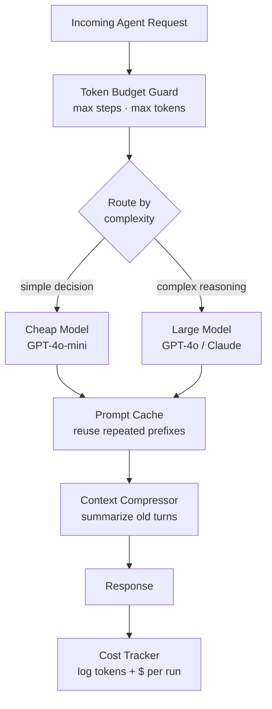
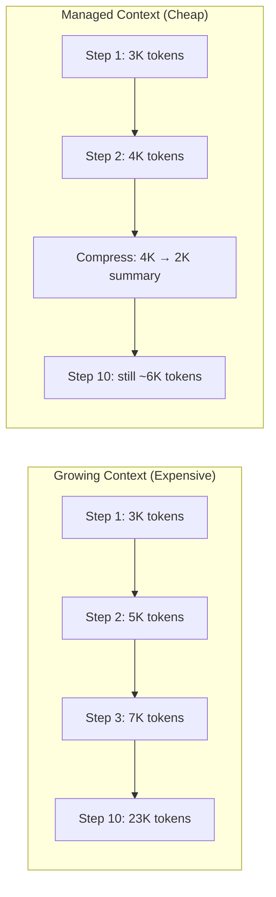

# Cost Control for Agents

**Level**: 🔴 Advanced
**Reading Time**: 11 minutes

> A single LLM call costs fractions of a cent. An agent that runs 20 steps, each with a 10,000 token context, costs $1 per run. At 10,000 runs per day, that's $10,000 per day — from one feature.

## 🗺️ Quick Overview



*Layer budget guards, model routing, prompt caching, and context compression to cut per-run costs by 60–80% without sacrificing quality.*

## The Problem

Agents are naturally expensive because:

1. **Multiple LLM calls**: A 20-step agent makes 20 LLM calls per run.
2. **Growing context**: Each step, the context grows with tool results and reasoning. By step 20, you're sending 20,000+ tokens on every call.
3. **No natural cap**: Without explicit budget controls, a confused agent can loop forever, spending more with each step.
4. **Using large models everywhere**: You don't need GPT-4o to decide "should I search the web?" — a cheaper model can make that call.

## Real Cost Calculation

Let's calculate what an agent actually costs:

```
Cost estimation:
  Model: GPT-4o
  Rate: $5 per 1M input tokens, $15 per 1M output tokens

  Per step:
    Input tokens: 8,000 (context grows by ~500 tokens/step)
    Output tokens: 500 (thought + tool call)
    Step cost: 8,000 * $5/1M + 500 * $15/1M = $0.04 + $0.0075 = $0.0475

  10-step agent (context grows from 3K to 8K tokens):
    Avg input tokens: ~5,500/step
    Total input: 55,000 tokens = $0.275
    Total output: 5,000 tokens = $0.075
    Total per run: ~$0.35

  100-step agent (context grows from 3K to 53K tokens):
    Total input: ~2,800,000 tokens = $14.00
    Total output: 50,000 tokens = $0.75
    Total per run: ~$14.75 — for one run!
```

This is why cost control is critical for any agent in production.

## Strategy 1: Token Budgeting

Set a hard token budget per agent run. When the budget is reached, return a partial result.

```
// Token budget tracker
TokenBudget = {
  total: int,       // e.g., 100,000 tokens
  inputUsed: 0,
  outputUsed: 0,
  warningThreshold: 0.8,  // Warn at 80% usage

  track: function(inputTokens, outputTokens):
    this.inputUsed += inputTokens
    this.outputUsed += outputTokens

  isExceeded: function():
    return (this.inputUsed + this.outputUsed) >= this.total

  isNearLimit: function():
    return (this.inputUsed + this.outputUsed) >= (this.total * this.warningThreshold)

  remaining: function():
    return this.total - this.inputUsed - this.outputUsed
}

// Agent loop with budget tracking
function budgetedAgent(task, config):
  budget = TokenBudget(total=config.tokenBudget)
  state = initState(task)

  for step in 1..config.maxSteps:
    if budget.isExceeded():
      log.warn("Token budget exceeded at step " + step)
      return AgentResult(
        status = BUDGET_EXCEEDED,
        partial = summarizeCurrentState(state),
        tokenReport = budget
      )

    if budget.isNearLimit():
      // Switch to a cheaper model for remaining steps
      model = config.cheapModel
      log.info("Near budget limit, switching to " + model.name)
    else:
      model = config.primaryModel

    response = model.generate(state.messages)
    budget.track(response.inputTokens, response.outputTokens)

    if response.type == FINAL_ANSWER:
      return AgentResult(SUCCESS, response.text, tokenReport=budget)

    // Handle tool calls
    handleToolCalls(response, state)

  return AgentResult(MAX_STEPS, partial=summarize(state), tokenReport=budget)
```

## Strategy 2: Model Routing

Not every step needs the most expensive model. Route to cheaper models for simple decisions.

```
// Model tiers
Models = {
  nano: {
    name: "gpt-4o-mini",
    costPer1MInput: 0.15,
    costPer1MOutput: 0.60,
    maxContext: 128000
  },
  standard: {
    name: "gpt-4o",
    costPer1MInput: 5.00,
    costPer1MOutput: 15.00,
    maxContext: 128000
  },
  powerful: {
    name: "o1",
    costPer1MInput: 15.00,
    costPer1MOutput: 60.00,
    maxContext: 128000
  }
}

// Route based on task complexity
function selectModel(task, context):
  // Simple tool selection: cheap model
  if task.type == TOOL_SELECTION:
    return Models.nano

  // Routine summarization: cheap model
  if task.type == SUMMARIZATION and context.length < 10000:
    return Models.nano

  // Complex reasoning: standard model
  if task.type == REASONING:
    return Models.standard

  // Multi-step math or logic: expensive model
  if task.type == COMPLEX_REASONING:
    return Models.powerful

  return Models.standard  // Default

// Router in action
function routedAgent(task):
  state = initState(task)

  for step in 1..MAX_STEPS:
    // Determine what kind of decision this step needs
    stepType = classifyNextStep(state)
    model = selectModel(stepType, state)

    response = model.generate(state.messages)
    handleResponse(response, state)
```

A practical heuristic: use a mini model for tool dispatch decisions (which tool to call) and the standard model for synthesis and final answers. This can cut costs by 60-80% on tool-heavy agents.

## Strategy 3: Context Truncation

The context window grows with every step. Truncating it aggressively is the most effective cost control.



```
function truncateContext(messages, maxTokens, strategy):
  currentTokens = countTokens(messages)
  if currentTokens <= maxTokens:
    return messages

  systemPrompt = messages[0]  // Always keep

  if strategy == ROLLING_WINDOW:
    // Keep last N messages
    keepCount = 20
    return [systemPrompt] + messages[-keepCount:]

  if strategy == SUMMARIZE_OLD:
    recentMessages = messages[-15:]
    oldMessages = messages[1:-15]
    summary = LLM.generate(
      messages = [SystemMessage("Summarize these agent steps in 3-5 bullet points:")],
      additionalContext = formatMessages(oldMessages),
      model = Models.nano,  // Use cheap model for summarization
      maxOutputTokens = 300
    )
    summaryMsg = SystemMessage("Earlier steps summary:\n" + summary.text)
    return [systemPrompt, summaryMsg] + recentMessages

  if strategy == DROP_TOOL_RESULTS:
    // Tool results are often large. Replace with just "returned N results"
    compressedMessages = []
    for msg in messages:
      if msg.type == TOOL_RESULT and countTokens(msg) > 500:
        compressedMessages.append(ToolResult(
          msg.toolCallId,
          "[Result truncated for context management. Key point: " +
          LLM.summarize(msg.content, maxTokens=100) + "]"
        ))
      else:
        compressedMessages.append(msg)
    return compressedMessages
```

## Strategy 4: Semantic Caching

Cache LLM responses for identical or semantically similar inputs. When an agent repeatedly asks similar questions, serve from cache.

```
SemanticCache = {
  store: VectorDB,
  similarityThreshold: 0.92,

  get: function(input):
    inputEmbedding = embed(input)
    closest = this.store.search(inputEmbedding, topK=1)

    if closest.similarity >= this.similarityThreshold:
      log.info("Cache hit! Similarity: " + closest.similarity)
      return CachedResult(closest.response, hit=true)
    return CachedResult(null, hit=false)

  set: function(input, response):
    inputEmbedding = embed(input)
    this.store.insert(inputEmbedding, { input, response, timestamp: now() })
}

// Cache wrapper around LLM call
function cachedLLMCall(messages, model, cache):
  cacheKey = buildCacheKey(messages)
  cached = cache.get(cacheKey)

  if cached.hit:
    return cached.response  // Free — no LLM call

  response = model.generate(messages)
  cache.set(cacheKey, response)
  return response
```

Tool call caching is even more effective — if the same tool is called with the same arguments, return the cached result:

```
ToolResultCache = {
  cache: dict,

  key: function(toolName, args):
    return sha256(toolName + JSON.stringify(sorted(args)))

  get: function(toolName, args):
    return this.cache.get(this.key(toolName, args))

  set: function(toolName, args, result, ttlSeconds):
    this.cache.set(
      this.key(toolName, args),
      result,
      ttl = ttlSeconds
    )
}
```

## Cost Dashboard: What to Track

```
CostReport = {
  runId: string,
  userId: string,
  agentType: string,

  // Token breakdown
  inputTokens: int,
  outputTokens: int,
  totalTokens: int,

  // Cost breakdown
  inputCost: float,        // $ based on model pricing
  outputCost: float,
  totalCost: float,

  // Efficiency metrics
  stepCount: int,
  cacheHits: int,
  cacheSavings: float,     // $ saved from cache

  // Model routing
  modelBreakdown: {
    "gpt-4o-mini": { calls: 12, tokens: 8000 },
    "gpt-4o": { calls: 5, tokens: 15000 }
  }
}

// Alert on cost anomalies
function checkCostAlert(report, thresholds):
  if report.totalCost > thresholds.perRunMax:
    alert("Run " + report.runId + " cost $" + report.totalCost +
          " — exceeds $" + thresholds.perRunMax + " limit")

  if report.stepCount > thresholds.maxSteps:
    alert("Run " + report.runId + " used " + report.stepCount + " steps")
```

## Common Pitfalls

1. **No per-run cost cap**: Without a cap, a runaway agent (infinite loop, huge tool results) can spend $50 on a single user request.
2. **Using expensive models for cheap tasks**: Tool selection, routing decisions, and simple summarization don't need the most expensive model.
3. **Not caching tool results**: If your agent searches the web 5 times for the same query in one session, that's 4 unnecessary tool calls.
4. **Injecting full tool results**: A search result that returns 5,000 tokens when only 500 are needed. Truncate or summarize tool results before adding to context.
5. **Tracking cost per LLM call but not per user/feature**: You need to know which feature or user is driving costs to make optimization decisions.

## Key Takeaways

- A 20-step GPT-4o agent can easily cost $0.35-1.00 per run — multiply by your daily run count for the real number
- Token budgeting sets a hard spending cap per run and returns partial results on budget exhaustion
- Model routing uses cheap models (gpt-4o-mini) for simple decisions and expensive models only for complex reasoning
- Context truncation via rolling windows or summarization keeps per-step token counts bounded
- Semantic caching and tool result caching can cut costs 20-50% for agents that handle similar queries
- Track cost per user, per feature, and per agent type to make informed optimization decisions
