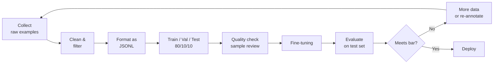
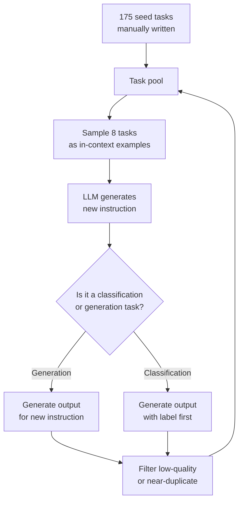
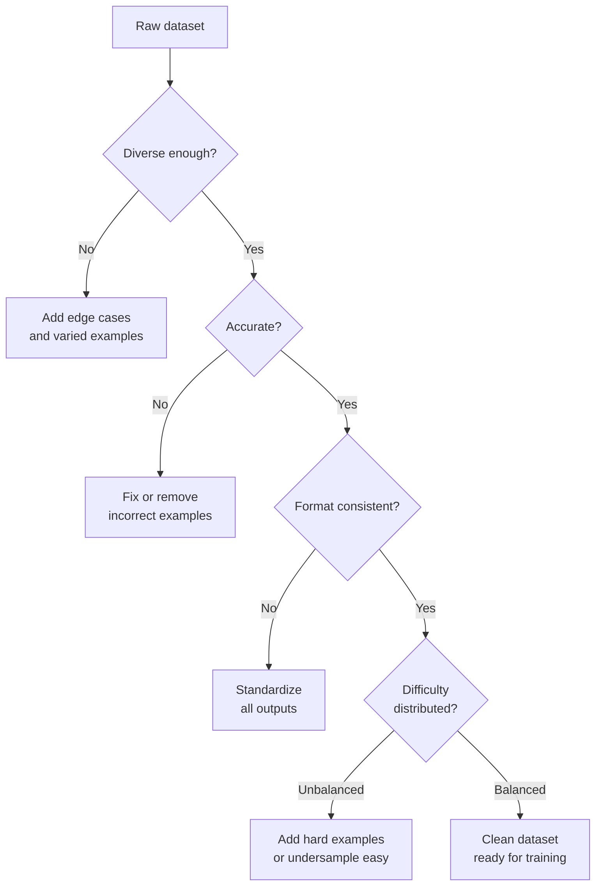

# Dataset Curation & Annotation for Fine-Tuning

**Level**: 🟡 Intermediate
**Reading Time**: 13 minutes

> The model is only as good as the data it learned from. Bad data with good training is still bad data — garbage in, garbage out at scale.

## 🗺️ Quick Overview



*Dataset curation is iterative — you rarely get it right on the first pass.*

## The Problem

Most teams treat dataset creation as a one-time step before training. They collect a batch of examples, fine-tune, get mediocre results, and blame the model. The real culprit is almost always data quality.

Three failure patterns appear constantly:

**Pattern 1: Volume over quality.** A team collects 50,000 noisy examples from logs or scraped web data. The model trains for hours, and the result is marginally better than the baseline. The same team achieves better results with 500 carefully curated examples written by domain experts.

**Pattern 2: Format inconsistency.** Half the training examples use `{"result": ...}` and half use `{"answer": ...}`. The fine-tuned model produces inconsistent output formats in production — exactly the problem they were trying to solve.

**Pattern 3: Test contamination.** The team evaluates on examples from the same source as training data. The model performs great internally, then fails in production on real user queries that look slightly different.

This article gives you a systematic approach to avoid all three.

---

## Dataset Formats

### Instruction-Following Format (single-turn)

Used for: classification, extraction, summarization, format conversion

```json
{"prompt": "Extract the product name and price from this text: 'The Sony WH-1000XM5 headphones are now available for $349.99'",
 "completion": "{\"product\": \"Sony WH-1000XM5\", \"price\": 349.99}"}

{"prompt": "Classify the sentiment of this review: 'Great battery life but the headphones feel cheap'",
 "completion": "mixed"}
```

### Chat Format (multi-turn)

Used for: conversational assistants, support bots, interactive tasks

```json
{"messages": [
  {"role": "system", "content": "You are a Python debugging assistant. Be concise and specific."},
  {"role": "user", "content": "Why is my list comprehension returning None values?"},
  {"role": "assistant", "content": "Your comprehension likely has a function call that returns None. Check if you're using `list.append()` inside the comprehension — it returns None. Use `[item for item in collection]` with the value directly, not a function with side effects."}
]}
```

### Preference Format (for DPO/RLHF)

Used for: alignment training, preference learning

```json
{
  "prompt": "Write a function to check if a number is prime",
  "chosen": "def is_prime(n):\n    if n < 2:\n        return False\n    for i in range(2, int(n**0.5) + 1):\n        if n % i == 0:\n            return False\n    return True",
  "rejected": "def is_prime(n):\n    for i in range(2, n):\n        if n % i == 0:\n            return False\n    return True  # inefficient O(n) instead of O(sqrt(n))"
}
```

---

## Data Collection Strategies

### Strategy 1: Manual Human Annotation

**When to use**: Highest quality tasks, legal/medical domains, tasks where errors are costly.

**Process**:
1. Write detailed annotation guidelines with worked examples
2. Hire domain experts (not general crowd workers for specialized domains)
3. Annotate in batches of 50–100; review each batch before continuing
4. Calculate inter-annotator agreement on 20% overlap

**Cost**: $0.50–$5 per example for general tasks; $10–$50 for specialized domains
**Quality**: Highest — sets the upper bound
**Scale**: Slow — 100–500 examples/day per annotator

### Strategy 2: Synthetic Data Generation with a Stronger LLM

Use a more capable model (Claude 3.5 Sonnet, GPT-4o) to generate examples, then verify quality.

```python
import anthropic

client = anthropic.Anthropic()

def generate_training_examples(topic: str, n: int = 10) -> list[dict]:
    """Generate fine-tuning examples using Claude as the teacher model."""

    prompt = f"""Generate {n} diverse training examples for fine-tuning a model to extract
    {topic} information from customer support emails.

    Each example should have:
    - A realistic customer email (varied length, tone, writing quality)
    - The correct JSON extraction

    Format as a JSON array where each item has "prompt" and "completion" keys.

    Requirements:
    - Vary the email styles (formal, casual, frustrated, confused)
    - Include edge cases (missing information, ambiguous values)
    - Ensure the extraction is always correct and complete

    Output only the JSON array, no other text."""

    response = client.messages.create(
        model="claude-3-5-sonnet-20241022",
        max_tokens=4000,
        messages=[{"role": "user", "content": prompt}]
    )

    examples = json.loads(response.content[0].text)
    return examples

# Generate 200 examples
examples = generate_training_examples("shipping address", n=200)

# Always verify a sample before using
print("Sample verification:")
for ex in examples[:3]:
    print(f"Prompt: {ex['prompt'][:100]}...")
    print(f"Completion: {ex['completion']}")
    print()
```

**Cost**: $0.002–$0.01 per example (API cost for generation + review)
**Quality**: High for well-defined tasks; needs verification for subtle tasks
**Scale**: Fast — thousands of examples per hour

**The verification step is mandatory.** Sample at least 10% of synthetic examples manually. Common synthetic data issues:
- Model generates the same structure repeatedly (low diversity)
- Edge cases are realistic-looking but factually wrong
- Completions use inconsistent formatting

### Strategy 3: Self-Instruct

The model generates its own instruction-response pairs, using a small "seed" dataset to bootstrap diversity. Used in Stanford Alpaca: 175 seed tasks → 52K generated examples.



**Cost**: Primarily API cost; very cheap at scale
**Quality**: High diversity but quality degrades for complex tasks
**Scale**: Unlimited in theory; quality is the ceiling

### Strategy 4: Distillation from Model Outputs

Collect real user prompts (with consent), generate responses using a strong model, quality-filter, and use for training.

This is how many commercial models are trained on the "wisdom" of larger models. Legal note: some model providers (OpenAI, Anthropic) explicitly prohibit using their outputs to train competing models — check the terms of service.

---

## Data Quality Criteria



### Quality Checklist

| Criterion | Check | Common Issue |
|-----------|-------|-------------|
| **Accuracy** | All outputs are factually correct | Synthetic data hallucinations |
| **Format consistency** | Exact same JSON structure in every example | `"result"` vs `"output"` vs `"answer"` |
| **Diversity** | Covers the full input distribution | Only easy examples, missing edge cases |
| **Difficulty distribution** | Mix of easy, medium, hard examples | 90% easy → model underperforms on hard |
| **No contamination** | Test examples not in training set | Overfitted evaluation metrics |
| **Representativeness** | Training distribution matches production | Lab conditions vs. real user inputs |
| **Label consistency** | Same input → same label | Contradictory examples confuse model |

### Dataset Size Guidelines

| Task type | Minimum | Good | Excellent |
|-----------|---------|------|-----------|
| Output format/style change | 100 | 500 | 1,000 |
| Domain vocabulary adaptation | 500 | 2,000 | 5,000 |
| New classification skill | 1,000 | 5,000 | 10,000 |
| Complex multi-step reasoning | 5,000 | 20,000 | 50,000 |
| Alignment/preference data | 10,000 | 50,000 | 200,000 |

These are not hard limits — a 100-example dataset of perfectly curated, diverse examples can outperform a 10,000-example dataset of noisy scraped data.

---

## Train / Val / Test Split

The canonical 80/10/10 split matters more than most practitioners realize:

```
Total dataset: 1,000 examples
├── Training set: 800 examples     (used for model weight updates)
├── Validation set: 100 examples   (used during training to catch overfitting)
└── Test set: 100 examples         (held out — never seen during training OR tuning)
```

**Critical rule**: The test set must be locked before you write a single line of training code. Every time you look at test results to make decisions (adjust learning rate, change architecture), you're leaking information from the test set into your decisions. Eventually you've overfit to the test set too.

Use stratified splitting if your data has class imbalance or subgroups — random splitting of 100 examples across 10 classes might give some classes 0 test examples.

---

## Annotation Tools

| Tool | Best for | Cost | Notes |
|------|----------|------|-------|
| **Label Studio** | General annotation, text/image/audio | Free (self-hosted) | Most flexible, good UI |
| **Argilla** | NLP tasks, feedback collection | Free (self-hosted) | Built for LLM datasets |
| **Scale AI** | Managed human annotation at scale | $0.10–$5/task | Enterprise-grade quality |
| **Prolific** | Academic/research annotation | ~$12/hour per annotator | Reliable participant pool |
| **Custom LLM pipeline** | Synthetic data generation | API cost | Build with Claude or GPT-4 |

---

## Real-World Examples

**OpenAI InstructGPT**: The SFT dataset was ~13,000 prompts with high-quality human-written responses, carefully curated by ~40 contractors. The preference dataset (~33,000 comparisons) was rated by the same annotators following detailed guidelines. Quality over quantity: these 13K examples are what made GPT-3.5 dramatically more useful than GPT-3.

**Anthropic's Constitutional AI**: Rather than collecting human preference labels for safety, Anthropic generated synthetic preference pairs using Claude's own self-critique against 16 constitutional principles. This produced hundreds of thousands of preference pairs at a fraction of human annotation cost.

**Meta's Llama 2-Chat**: Used ~27,500 human preference annotations (initially) combined with rejection sampling to generate additional training data. Notable finding: adding more annotation volume helped less than improving annotation quality — doubling annotators' guidelines coverage improved RLHF results more than doubling the dataset size.

---

## Synthetic Data Generation: Full Example

```python
import anthropic
import json
from pathlib import Path

client = anthropic.Anthropic()

def generate_customer_support_examples(n_per_category: int = 50) -> list[dict]:
    """Generate diverse customer support training examples."""

    categories = [
        "billing dispute",
        "product defect",
        "shipping delay",
        "account access",
        "refund request"
    ]

    all_examples = []

    for category in categories:
        system_prompt = """You are generating training data for a customer support classifier.
        Create realistic, diverse customer emails. Vary:
        - Urgency level (calm → frustrated → angry)
        - Writing quality (professional → casual → typo-filled)
        - Email length (one sentence → multiple paragraphs)
        - Implicit vs. explicit problem description

        Output format: JSON array of objects with "email" and "category" keys."""

        user_prompt = f"""Generate {n_per_category} customer support emails that are about '{category}'.
        All should be labeled with category="{category}".
        Make them realistic and diverse — avoid repetitive patterns."""

        response = client.messages.create(
            model="claude-3-5-sonnet-20241022",
            max_tokens=8000,
            system=system_prompt,
            messages=[{"role": "user", "content": user_prompt}]
        )

        examples = json.loads(response.content[0].text)
        all_examples.extend(examples)
        print(f"Generated {len(examples)} examples for category: {category}")

    return all_examples

def format_for_finetuning(examples: list[dict]) -> list[dict]:
    """Convert raw examples to instruction-tuning JSONL format."""
    formatted = []
    for ex in examples:
        formatted.append({
            "messages": [
                {
                    "role": "system",
                    "content": "Classify this customer support email into one of: billing_dispute, product_defect, shipping_delay, account_access, refund_request. Respond with only the category name."
                },
                {
                    "role": "user",
                    "content": ex["email"]
                },
                {
                    "role": "assistant",
                    "content": ex["category"]
                }
            ]
        })
    return formatted

def split_and_save(examples: list[dict], output_dir: str):
    """Split into train/val/test and save as JSONL."""
    import random
    random.shuffle(examples)

    n = len(examples)
    train_end = int(0.8 * n)
    val_end = int(0.9 * n)

    splits = {
        "train": examples[:train_end],
        "val": examples[train_end:val_end],
        "test": examples[val_end:]
    }

    Path(output_dir).mkdir(exist_ok=True)
    for split_name, split_data in splits.items():
        path = f"{output_dir}/{split_name}.jsonl"
        with open(path, "w") as f:
            for example in split_data:
                f.write(json.dumps(example) + "\n")
        print(f"Saved {len(split_data)} examples to {path}")

# Generate, format, and split
raw_examples = generate_customer_support_examples(n_per_category=100)
formatted = format_for_finetuning(raw_examples)
split_and_save(formatted, "./training_data")
```

---

## Common Mistakes

1. **Not reviewing synthetic data before training** — Synthetic examples look plausible but may have subtle errors: wrong JSON structure, hallucinated product names, inconsistent formatting. Sample 10% of generated examples manually before using them. One bad pattern repeated across 1,000 examples will bake that error into your model permanently.

2. **Train/test contamination** — If your training examples come from the same source as test examples (e.g., customer queries from the same week), high test accuracy is meaningless. Always split temporally (train on older data, test on newer) when data has a time dimension, or ensure splits are stratified by source.

3. **Ignoring class imbalance** — If 80% of your examples are the "simple" case and 20% are the "edge case," the model will learn to handle the simple case well and fail on edge cases. Identify minority categories and oversample or generate more synthetic examples for them.

4. **Format inconsistency in completions** — Using `{"result": "..."}` in some examples and `{"output": "..."}` in others teaches the model that both formats are acceptable — so it will randomly choose at inference time. Fix: establish a canonical format before annotation begins and validate every example against it with a JSON schema.

5. **Using production logs directly as training data** — Production logs contain real user queries (good for diversity) but the "correct" response is whatever the old system returned — which may be wrong, inconsistent, or exactly what you're trying to improve. Use logs for prompts only; write or generate new correct completions.

---

## Key Takeaways

- **1,000 high-quality examples beat 100,000 noisy ones** — invest in quality first, then scale
- The **80/10/10 split** must be locked before training starts; every peek at the test set adds measurement bias
- **Synthetic data generation** with Claude or GPT-4o costs $0.002–$0.01/example and can match human annotation quality for well-defined tasks — but always verify 10% manually
- **Format consistency** in completions is more important than content variation — inconsistent output schemas are the #1 cause of post-fine-tuning production failures
- For most tasks: style/format needs **100–500 examples**, domain adaptation needs **1,000–10,000**, new complex skills need **10,000+**

---

## References

> 📖 [Self-Instruct: Aligning Language Models with Self-Generated Instructions](https://arxiv.org/abs/2212.10560) — Wang et al., the original self-instruct paper used to create Alpaca
> 📚 [Label Studio Documentation](https://labelstud.io/guide/) — Open-source annotation tool with LLM dataset support
> 📚 [Argilla Documentation](https://docs.argilla.io/) — Purpose-built platform for NLP and LLM dataset curation
> 📖 [Llama 2: Open Foundation and Fine-Tuned Chat Models](https://arxiv.org/abs/2307.09288) — Meta's paper with detailed data collection methodology and annotation guidelines
> 📖 [OpenAI Cookbook: Fine-tuning](https://cookbook.openai.com/examples/how_to_finetune_chat_models) — Practical guide with dataset format examples and best practices
