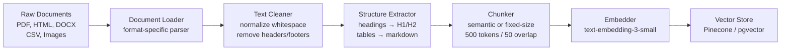
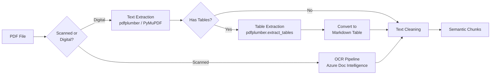

# Document Loaders & Parsers — Ingesting the Real World into RAG

**Level**: 🟡 Intermediate
**Reading Time**: 14 minutes

> Garbage in, garbage out. A RAG system is only as good as the text it ingests — and 80% of the real work in building a production RAG system is getting clean, structured text out of real-world documents.

## 🗺️ Quick Overview



*Every RAG system starts with a document ingestion pipeline. The quality of the output embeddings is determined by the quality of the text cleaning steps, not the embedding model.*

**When you need this**:
- Building RAG over internal knowledge bases (wikis, manuals, policies)
- Ingesting customer contracts, legal documents, or research papers
- Building a chatbot that can answer questions from PDFs
- Processing web content or scraped data for retrieval

## The Problem

Your RAG system needs to answer questions from real-world documents: PDFs, Word files, web pages, code repositories, Notion pages, Slack exports. Getting clean, structured text out of these sources is 80% of the real engineering work.

The naive approach fails immediately:

- **PDF extraction**: A PDF is a rendering format, not a text format. Text is stored as positioned glyphs on a page. A two-column layout extracts as interleaved text. A table becomes random whitespace-separated numbers. A scanned PDF returns nothing at all.
- **HTML extraction**: The rendered DOM of a news article contains navigation, ads, cookie banners, related articles, and footer links — often more boilerplate than actual content.
- **DOCX files**: Track changes markup, hidden text, embedded objects, and custom styles all create extraction noise.

The downstream effects of poor parsing are severe: retrieval quality drops because chunks contain garbled text that doesn't match user queries; LLM generation fails because context is incoherent; embedding quality suffers because noisy text creates misleading vector representations.

**Scale context**: A 100-page PDF might have 50,000 words. Poor extraction might corrupt 15% of content. At 1,000 documents in your knowledge base, that's 7.5 million words of garbled text polluting your vector store.

## Document Types and Challenges

| Format | Core Challenge | Best Tool | OCR Needed? |
|--------|---------------|-----------|-------------|
| PDF (digital) | Multi-column layout, tables, ligatures | pdfplumber, LlamaParse | No |
| PDF (scanned) | Image-only, no text layer | Azure Doc Intelligence, Textract | Yes |
| HTML / Web | Boilerplate, JS-rendered content | Trafilatura, Playwright | No |
| DOCX | Track changes, styles, embedded objects | python-docx, Unstructured | No |
| XLSX / CSV | Tabular data needs different chunking | pandas, openpyxl | No |
| Images (JPG/PNG) | No text at all | GPT-4o Vision, Tesseract | Yes |
| Code repos | Structure matters: function/class boundaries | tree-sitter, custom splitters | No |
| Markdown | Already clean, preserve heading hierarchy | Built-in split on ## | No |

## PDF Parsing in Depth

PDFs are the most common and most challenging format. The tool you choose determines the quality ceiling of your RAG system:



### PDF Tool Comparison

| Tool | Text Quality | Table Support | OCR | Speed | Cost |
|------|-------------|---------------|-----|-------|------|
| PyMuPDF (fitz) | Good | Partial | No | Very fast (50ms/page) | Free |
| pdfminer.six | Good | Poor | No | Medium (200ms/page) | Free |
| pdfplumber | Excellent | Yes | No | Medium (300ms/page) | Free |
| Unstructured.io | Excellent | Yes | Yes (Tesseract) | Slow (2-5s/page) | Free / cloud |
| LlamaParse | Best | Yes | Yes | Cloud (1-3s/page) | $3/1k pages |
| Docling (IBM) | Excellent | Yes | Yes | Medium (1s/page) | Free |

### Practical PDF Extraction with pdfplumber

```python
import pdfplumber
from pathlib import Path

def extract_pdf_structured(pdf_path: str) -> dict:
    """
    Extract text and tables from PDF, preserving structure.
    Returns dict with pages, each containing text blocks and tables.
    """
    pages = []

    with pdfplumber.open(pdf_path) as pdf:
        for page_num, page in enumerate(pdf.pages):
            page_data = {
                "page_number": page_num + 1,
                "text_blocks": [],
                "tables": []
            }

            # Extract tables first (pdfplumber can identify table regions)
            raw_tables = page.extract_tables()
            for table in raw_tables:
                if table and len(table) > 1:  # Skip empty or single-row tables
                    # Convert to markdown table format
                    md_table = table_to_markdown(table)
                    page_data["tables"].append(md_table)

            # Extract text, excluding table regions
            table_bboxes = [t.bbox for t in page.find_tables()]
            text_page = page

            # Crop out table areas to get clean text
            for bbox in table_bboxes:
                text_page = text_page.outside_bbox(bbox)

            raw_text = text_page.extract_text(x_tolerance=2, y_tolerance=2)
            if raw_text:
                cleaned = clean_pdf_text(raw_text)
                page_data["text_blocks"].append(cleaned)

            pages.append(page_data)

    return {"source": pdf_path, "pages": pages, "total_pages": len(pages)}

def table_to_markdown(table: list[list]) -> str:
    """Convert pdfplumber table (list of lists) to markdown format."""
    if not table or not table[0]:
        return ""

    headers = [str(cell or "").strip() for cell in table[0]]
    rows = table[1:]

    md = "| " + " | ".join(headers) + " |\n"
    md += "| " + " | ".join(["---"] * len(headers)) + " |\n"

    for row in rows:
        cells = [str(cell or "").strip() for cell in row]
        md += "| " + " | ".join(cells) + " |\n"

    return md

def clean_pdf_text(text: str) -> str:
    """Remove common PDF artifacts: page numbers, running headers, ligatures."""
    import re

    # Fix ligatures (common in PDFs): fi → fi, fl → fl
    ligature_map = {"fi": "fi", "fl": "fl", "ff": "ff", "ffi": "ffi", "ffl": "ffl"}
    for lig, replacement in ligature_map.items():
        text = text.replace(lig, replacement)

    # Remove page numbers (lines that are just numbers)
    text = re.sub(r'^\s*\d+\s*$', '', text, flags=re.MULTILINE)

    # Normalize whitespace
    text = re.sub(r'\n{3,}', '\n\n', text)  # max 2 blank lines
    text = re.sub(r'[ \t]{2,}', ' ', text)   # collapse spaces

    # Remove hyphenation at line breaks: "connec-\ntion" → "connection"
    text = re.sub(r'(\w)-\n(\w)', r'\1\2', text)

    return text.strip()
```

## HTML Extraction

HTML pages contain enormous amounts of boilerplate. The article text in a typical news page is 15-30% of the total DOM content.

### Trafilatura for Article Extraction

```python
import trafilatura

def extract_web_article(url: str) -> dict | None:
    """
    Extracts main article content from a web page.
    Removes nav, ads, footer, cookie banners.
    Handles both static and lightly dynamic pages.
    Latency: 200-500ms (includes HTTP fetch).
    """
    # Fetch with trafilatura's built-in downloader
    downloaded = trafilatura.fetch_url(url)
    if not downloaded:
        return None

    # Extract clean text (trafilatura handles boilerplate removal)
    text = trafilatura.extract(
        downloaded,
        include_comments=False,
        include_tables=True,    # Keep tables in markdown format
        no_fallback=False,      # Use fallback parser if main fails
        output_format="markdown"  # Preserve heading structure
    )

    # Also extract metadata
    metadata = trafilatura.extract_metadata(downloaded)

    return {
        "url": url,
        "title": metadata.title if metadata else None,
        "date": metadata.date if metadata else None,
        "text": text,
        "char_count": len(text) if text else 0
    }

def extract_js_rendered(url: str) -> str:
    """
    For JavaScript-rendered pages (SPAs, React apps).
    Uses Playwright to get fully rendered DOM.
    Latency: 2-5s per page.
    """
    from playwright.sync_api import sync_playwright

    with sync_playwright() as p:
        browser = p.chromium.launch(headless=True)
        page = browser.new_page()
        page.goto(url, wait_until="networkidle")

        # Get the rendered HTML
        html = page.content()
        browser.close()

    # Then pass through trafilatura for content extraction
    return trafilatura.extract(html, output_format="markdown")
```

## LangChain Document Loading Pipeline

LangChain provides 100+ loaders that normalize output to `Document` objects with `page_content` and `metadata`:

```python
from langchain_community.document_loaders import (
    PyPDFLoader,
    WebBaseLoader,
    UnstructuredWordDocumentLoader,
    CSVLoader,
    DirectoryLoader,
)
from langchain.text_splitter import RecursiveCharacterTextSplitter

def load_knowledge_base(directory: str) -> list:
    """
    Load all supported document types from a directory.
    Returns list of LangChain Document objects ready for embedding.
    """
    documents = []

    # PDF files
    pdf_loader = DirectoryLoader(
        directory,
        glob="**/*.pdf",
        loader_cls=PyPDFLoader,
        show_progress=True
    )
    documents.extend(pdf_loader.load())

    # Word documents
    docx_loader = DirectoryLoader(
        directory,
        glob="**/*.docx",
        loader_cls=UnstructuredWordDocumentLoader
    )
    documents.extend(docx_loader.load())

    # CSV files (each row becomes a document)
    csv_loader = DirectoryLoader(
        directory,
        glob="**/*.csv",
        loader_cls=CSVLoader
    )
    documents.extend(csv_loader.load())

    print(f"Loaded {len(documents)} raw documents")

    # Chunk documents
    splitter = RecursiveCharacterTextSplitter(
        chunk_size=500,          # tokens (approximate)
        chunk_overlap=50,        # overlap to preserve context across chunks
        separators=["\n\n", "\n", ". ", " ", ""],  # semantic boundaries first
        length_function=len
    )
    chunks = splitter.split_documents(documents)
    print(f"Split into {len(chunks)} chunks")

    return chunks

# Full ingestion pipeline
def ingest_to_vector_store(directory: str, vector_store):
    chunks = load_knowledge_base(directory)

    # Filter out low-quality chunks
    good_chunks = [c for c in chunks if is_quality_chunk(c.page_content)]
    print(f"Kept {len(good_chunks)} / {len(chunks)} chunks after quality filter")

    # Batch embed and store
    batch_size = 100
    for i in range(0, len(good_chunks), batch_size):
        batch = good_chunks[i:i + batch_size]
        vector_store.add_documents(batch)
        print(f"Indexed batch {i//batch_size + 1}")

def is_quality_chunk(text: str) -> bool:
    """Filter out chunks with too little content or too much noise."""
    if len(text.strip()) < 50:
        return False  # Too short

    # Check ratio of alphanumeric characters (gibberish has low ratio)
    alpha_count = sum(1 for c in text if c.isalpha())
    if alpha_count / max(len(text), 1) < 0.4:
        return False  # Less than 40% alphabetic — likely garbled

    return True
```

## OCR for Scanned Documents

When a PDF has no text layer (entirely image-based), OCR is required. The tool choice significantly impacts quality:

```python
def extract_scanned_pdf_azure(pdf_path: str) -> list[dict]:
    """
    Azure Document Intelligence for scanned PDFs.
    Word error rate (WER): <1% for clean scans.
    Cost: ~$1.50/1000 pages.
    Handles: multi-column layouts, tables, handwriting.
    """
    from azure.ai.formrecognizer import DocumentAnalysisClient
    from azure.core.credentials import AzureKeyCredential

    client = DocumentAnalysisClient(
        endpoint=AZURE_ENDPOINT,
        credential=AzureKeyCredential(AZURE_KEY)
    )

    with open(pdf_path, "rb") as f:
        poller = client.begin_analyze_document("prebuilt-document", f)
        result = poller.result()

    pages = []
    for page in result.pages:
        page_text = ""
        for line in page.lines:
            page_text += line.content + "\n"

        # Extract tables if present
        page_tables = []
        for table in result.tables:
            if table.bounding_regions[0].page_number == page.page_number:
                page_tables.append(azure_table_to_markdown(table))

        pages.append({
            "page_number": page.page_number,
            "text": page_text,
            "tables": page_tables
        })

    return pages

def extract_with_vision_llm(image_path: str, llm_client) -> str:
    """
    Use GPT-4o or Claude to OCR and structure an image.
    Most expensive: ~$0.01-0.05 per page, but highest quality for complex layouts.
    Best for: forms, mixed text/diagrams, handwritten notes.
    """
    import base64

    with open(image_path, "rb") as f:
        image_data = base64.b64encode(f.read()).decode()

    response = llm_client.messages.create(
        model="claude-3-5-sonnet-20241022",
        max_tokens=4096,
        messages=[{
            "role": "user",
            "content": [
                {
                    "type": "image",
                    "source": {
                        "type": "base64",
                        "media_type": "image/jpeg",
                        "data": image_data
                    }
                },
                {
                    "type": "text",
                    "text": "Extract all text from this image. Preserve formatting. "
                           "Convert any tables to markdown table format. "
                           "Use ## for section headers. Return only the extracted content."
                }
            ]
        }]
    )
    return response.content[0].text
```

## Text Cleaning Pipeline

After extraction, a systematic cleaning pipeline ensures consistent quality:

```python
import re
import langdetect

def full_cleaning_pipeline(raw_text: str, source_metadata: dict) -> dict:
    """
    Complete cleaning pipeline for any extracted text.
    Returns cleaned text with quality metrics.
    """
    text = raw_text

    # Step 1: Encoding normalization
    text = text.encode("utf-8", errors="replace").decode("utf-8")

    # Step 2: Whitespace normalization
    text = re.sub(r'\r\n', '\n', text)          # Normalize line endings
    text = re.sub(r'\t', ' ', text)              # Tabs to spaces
    text = re.sub(r' {2,}', ' ', text)           # Multiple spaces to one
    text = re.sub(r'\n{4,}', '\n\n\n', text)     # Max 3 consecutive newlines

    # Step 3: Remove headers/footers (repeated patterns across pages)
    # Remove lines that appear 3+ times (likely running header/footer)
    lines = text.split('\n')
    from collections import Counter
    line_counts = Counter(l.strip() for l in lines if l.strip())
    text = '\n'.join(
        l for l in lines
        if line_counts.get(l.strip(), 0) < 3 or len(l.strip()) > 50
    )

    # Step 4: Language detection
    try:
        language = langdetect.detect(text[:1000])
    except:
        language = "unknown"

    # Step 5: Quality metrics
    char_count = len(text)
    alpha_ratio = sum(1 for c in text if c.isalpha()) / max(char_count, 1)
    word_count = len(text.split())

    return {
        "text": text.strip(),
        "language": language,
        "char_count": char_count,
        "word_count": word_count,
        "alpha_ratio": round(alpha_ratio, 3),
        "quality": "good" if alpha_ratio > 0.5 and word_count > 50 else "poor",
        "source": source_metadata
    }
```

## Chunking Strategies

Once text is clean, chunking determines retrieval quality:

| Strategy | Chunk Size | Best For | Trade-off |
|----------|-----------|----------|-----------|
| Fixed-size | 500 tokens, 50 overlap | Most use cases | Simple, but breaks mid-sentence |
| Sentence-based | 3-5 sentences | Conversational content | Variable size complicates batching |
| Paragraph-based | One paragraph | Articles, documentation | Good semantic coherence |
| Hierarchical | Section → subsection | Long docs with H1/H2/H3 | Best retrieval, complex to implement |
| Semantic | Variable (similarity-based) | Dense technical docs | Highest quality, expensive |

```python
from langchain.text_splitter import RecursiveCharacterTextSplitter, MarkdownHeaderTextSplitter

def chunk_by_structure(markdown_text: str) -> list[dict]:
    """
    Hierarchical chunking that respects markdown structure.
    Best for documents with clear heading hierarchy.
    """
    # First split by headers to preserve section context
    header_splitter = MarkdownHeaderTextSplitter(
        headers_to_split_on=[
            ("#", "h1"),
            ("##", "h2"),
            ("###", "h3"),
        ]
    )
    header_chunks = header_splitter.split_text(markdown_text)

    # Then split large sections by size, preserving header metadata
    size_splitter = RecursiveCharacterTextSplitter(
        chunk_size=500,
        chunk_overlap=50
    )

    final_chunks = []
    for chunk in header_chunks:
        if len(chunk.page_content) > 600:
            sub_chunks = size_splitter.split_documents([chunk])
            final_chunks.extend(sub_chunks)
        else:
            final_chunks.append(chunk)

    return final_chunks
```

## Common Mistakes

1. **Not handling table structure in PDFs**
   - Root cause: Using a simple `extract_text()` call that flattens table cells into a stream of numbers
   - Fix: Use `pdfplumber.extract_tables()` and convert to markdown table format before chunking
   - Impact: Financial reports, technical specs with tables become useless for retrieval — model can't answer questions about tabular data

2. **Chunking before cleaning**
   - Root cause: Running the splitter immediately on raw extracted text to "save a step"
   - Fix: Always clean first (normalize encoding, remove headers/footers, fix ligatures), then chunk
   - Impact: Header text from page 1 gets merged into chunk 1 content; footer text "Page 47 of 200" appears in retrieval results and confuses the LLM

3. **Ignoring encoding errors silently**
   - Root cause: Using `errors='ignore'` in encoding conversion — silently drops characters
   - Fix: Use `errors='replace'` and log documents with high replacement rates for manual review
   - Impact: Documents with non-ASCII characters (international names, technical symbols, accented characters) lose critical content silently

4. **Fixed chunk size that ignores semantic boundaries**
   - Root cause: Hard-coding 500 tokens without considering whether that cuts mid-sentence or mid-table
   - Fix: Use `RecursiveCharacterTextSplitter` with semantic separators `["\n\n", "\n", ". "]` to prefer paragraph and sentence boundaries
   - Impact: Chunks that cut mid-sentence have lower embedding quality, reducing retrieval precision by 10-20%

5. **Not validating extraction quality before indexing**
   - Root cause: Running the full ingestion pipeline and assuming all documents were parsed correctly
   - Fix: Add quality checks (alpha ratio > 0.4, word count > 50) and log failed documents; spot-check 5% of parsed output manually
   - Impact: Scanned PDFs without OCR return empty strings; multi-column PDFs return interleaved text — both silently pollute the vector store

## Key Takeaways

- Getting clean text out of real-world documents is **80% of RAG engineering effort** — invest in your parsing pipeline before your retrieval algorithm
- pdfplumber is the best free tool for PDFs with tables; LlamaParse ($3/1k pages) is the best quality for complex layouts
- Always extract tables separately and convert to markdown format — flattening table content destroys retrieval quality for structured data
- Trafilatura removes boilerplate from HTML pages in one call; Playwright is only needed for JavaScript-rendered SPAs
- For scanned PDFs: Azure Document Intelligence has **<1% word error rate** vs Tesseract's **3-5% WER** — the quality difference compounds at scale
- Chunk after cleaning, not before; use semantic separators that prefer paragraph/sentence boundaries over hard token counts
- Quality-filter chunks: **alpha ratio < 0.4** or **word count < 50** indicates garbled text that should be excluded from the index

## References

> 📚 [LangChain Document Loaders Documentation](https://python.langchain.com/docs/integrations/document_loaders/) — Full list of 100+ supported formats with code examples

> 📚 [LlamaIndex SimpleDirectoryReader](https://docs.llamaindex.ai/en/stable/examples/data_connectors/simple_directory_reader/) — LlamaIndex's universal document loading and parsing API

> 📖 [Unstructured.io: Document Understanding at Scale](https://unstructured.io/blog/document-understanding-at-scale) — Engineering blog on handling complex document formats in production RAG systems

> 📖 [pdfplumber Documentation and Examples](https://github.com/jsvine/pdfplumber) — The best open-source Python library for structured PDF extraction with table support

> 📖 [Trafilatura: Web Scraping for LLMs](https://trafilatura.readthedocs.io/en/latest/) — Documentation for the best open-source article extraction library for HTML content

> 📺 [Building Production RAG: The Ingestion Pipeline](https://www.youtube.com/watch?v=TRjq7t2Ms5I) — LlamaIndex talk on production document ingestion patterns and common failure modes
