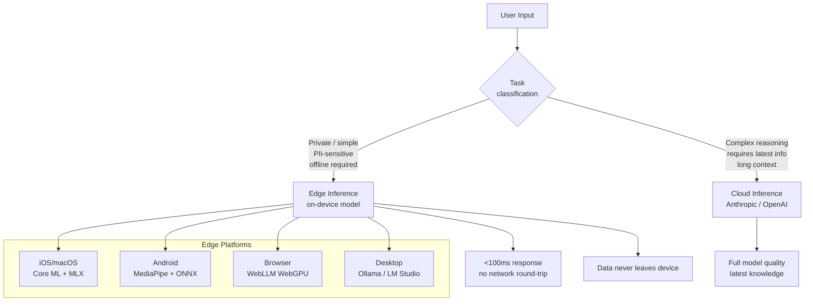
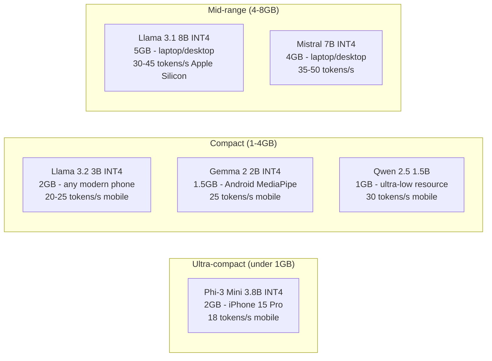
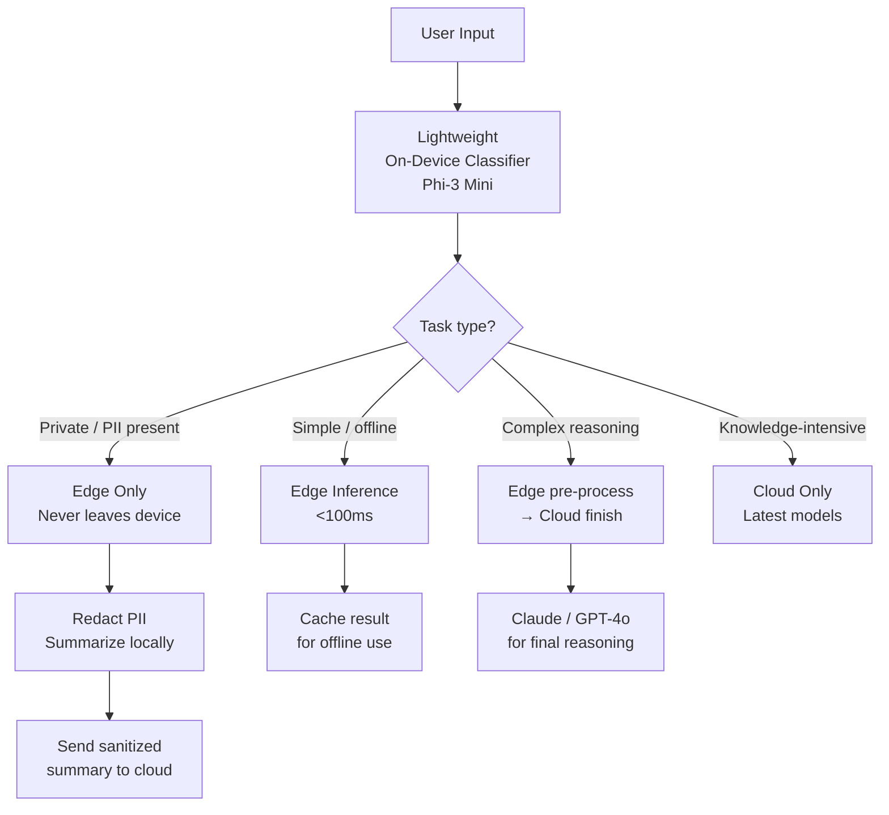

# Edge AI — Running LLMs On-Device

**Level**: 🔴 Advanced
**Reading Time**: 14 minutes

> When the AI runs on your phone, your data never leaves your pocket. That's a fundamentally different privacy promise than "we promise not to look at your data while it travels to our servers."

## 🗺️ Quick Overview



*Hybrid architecture: edge inference for private/simple tasks, cloud for complex/knowledge-intensive tasks.*

## The Problem

Cloud LLMs have two fundamental problems that edge inference solves:

**Privacy**: Every query sent to a cloud API is a data transfer. For healthcare apps (patient symptoms), legal tools (confidential case details), personal assistants (diary entries, relationship dynamics), and enterprise apps (proprietary code, internal strategies) — the requirement to send data to third-party servers is either a compliance blocker or an unacceptable privacy risk.

**Connectivity and Latency**: Cloud APIs require internet. Mobile apps used in airports, remote areas, or countries with poor connectivity fail. Even with good connectivity, a cloud round-trip adds 500-2000ms of latency that on-device inference eliminates entirely.

The cost of edge inference is model quality: on-device models are 1B-7B parameters, not 100B+. But for many tasks — autocomplete, PII detection, intent classification, offline document summarization — a small model running locally is perfectly sufficient.

## Edge Platforms by Environment

### iOS and macOS: Core ML and MLX

Apple's ML stack is optimized for Apple Silicon's unified memory architecture, where CPU and GPU share the same memory pool. A MacBook M3 Pro with 36GB unified memory can run a 7B model in FP16 without any quantization.

**Core ML:** Apple's inference framework for running models on iPhone Neural Engine (ANE), GPU, and CPU. Supports converted ONNX and PyTorch models.

**MLX:** Apple's open-source ML framework designed specifically for Apple Silicon. Dramatically faster than Core ML for LLM inference.

```swift
// iOS: On-device text generation with Core ML
import CoreML
import NaturalLanguage

class OnDeviceLLM {
    private var model: MLModel?

    func loadModel() async throws {
        let config = MLModelConfiguration()
        config.computeUnits = .cpuAndNeuralEngine  // Use Neural Engine on iPhone

        // Load a Core ML model (e.g., distilGPT2 converted to .mlpackage)
        model = try await MLModel.load(
            contentsOf: Bundle.main.url(forResource: "distilgpt2", withExtension: "mlpackage")!,
            configuration: config
        )
    }

    func generate(prompt: String) async throws -> String {
        guard let model = model else { throw LLMError.modelNotLoaded }
        // Tokenize and run inference
        let inputFeatures = try MLDictionaryFeatureProvider(dictionary: [
            "input_ids": MLMultiArray(tokenize(prompt))
        ])
        let prediction = try await model.prediction(from: inputFeatures)
        return detokenize(prediction.featureValue(for: "logits"))
    }
}
```

**Inference speed on Apple Silicon (Ollama benchmarks):**
| Hardware | Model | Speed |
|----------|-------|-------|
| M4 MacBook Air | Llama 3.2 3B (Q4) | ~45 tokens/s |
| M3 Pro MacBook | Llama 3.1 8B (Q4) | ~35 tokens/s |
| M2 Ultra Mac Studio | Llama 3.1 70B (Q4) | ~22 tokens/s |
| iPhone 15 Pro | Phi-3 Mini 3.8B | ~18 tokens/s |
| iPhone 16 Pro | Llama 3.2 3B | ~25 tokens/s |

### Android: MediaPipe and ONNX Runtime

Google's MediaPipe LLM Inference API supports Gemma 2B, Phi-2, and other small models on Android:

```kotlin
// Android: MediaPipe LLM Inference
import com.google.mediapipe.tasks.genai.llminference.LlmInference

class AndroidLLM(context: Context) {
    private val llmInference: LlmInference

    init {
        val options = LlmInference.LlmInferenceOptions.builder()
            .setModelPath("/data/local/tmp/gemma-2b-it-gpu-int4.bin")
            .setMaxTokens(1024)
            .setTopK(40)
            .setTemperature(0.8f)
            .setRandomSeed(101)
            .build()

        llmInference = LlmInference.createFromOptions(context, options)
    }

    fun generateResponse(prompt: String): String {
        return llmInference.generateResponse(prompt)
    }

    // Streaming version
    fun generateAsync(prompt: String, onChunk: (String) -> Unit) {
        llmInference.generateResponseAsync(prompt) { partialResult, done ->
            onChunk(partialResult ?: "")
        }
    }
}
```

**ONNX Runtime Mobile** handles quantized models with hardware acceleration on both Android GPU and Apple Neural Engine, making it the cross-platform choice.

### Browser: WebLLM (WebGPU)

WebLLM runs LLMs directly in the browser using WebGPU for acceleration. No server required — the model downloads to the user's browser and runs locally.

```javascript
// Browser: WebLLM with WebGPU
import * as webllm from "@mlc-ai/web-llm";

const SELECTED_MODEL = "Llama-3.2-3B-Instruct-q4f16_1-MLC";

async function initWebLLM() {
    const engine = await webllm.CreateMLCEngine(
        SELECTED_MODEL,
        {
            initProgressCallback: (progress) => {
                // Model downloads on first use (~2GB for 3B model)
                console.log(`Loading: ${(progress.progress * 100).toFixed(1)}%`);
                document.getElementById("progress").textContent =
                    `Downloading model: ${(progress.progress * 100).toFixed(1)}%`;
            }
        }
    );
    return engine;
}

async function chat(engine, userMessage) {
    const response = await engine.chat.completions.create({
        messages: [
            { role: "system", content: "You are a helpful assistant." },
            { role: "user", content: userMessage }
        ],
        stream: true,
        temperature: 0.7,
        max_tokens: 512
    });

    let fullResponse = "";
    for await (const chunk of response) {
        const delta = chunk.choices[0]?.delta?.content ?? "";
        fullResponse += delta;
        document.getElementById("output").textContent += delta;  // Stream to UI
    }
    return fullResponse;
}

// Usage
const engine = await initWebLLM();
await chat(engine, "Explain how WebGPU enables browser AI");
```

**WebLLM performance:**
- Requires WebGPU support (Chrome 113+, Safari 17.4+, Firefox 120+)
- 3B model: ~2GB download on first load (cached by browser thereafter)
- Speed: ~8-15 tokens/s on modern desktop GPU
- Mobile browser: ~3-8 tokens/s (battery drain is significant)

**Transformers.js** is the alternative for smaller models, using WebAssembly instead of WebGPU — slower but works on more devices:

```javascript
import { pipeline } from "@xenova/transformers";

// Runs in browser via WASM — no WebGPU needed
const generator = await pipeline(
    "text-generation",
    "Xenova/Phi-3-mini-4k-instruct",
    { dtype: "q4" }  // 4-bit quantized for smaller download
);
const output = await generator("What is edge AI?", { max_new_tokens: 100 });
```

### Desktop: Ollama

Ollama is the simplest path to local inference on macOS, Linux, and Windows:

```bash
# Install and pull a model
curl -fsSL https://ollama.ai/install.sh | sh
ollama pull phi3:mini           # 2.3GB, great for laptop
ollama pull llama3.2:3b         # 2.0GB, fast
ollama pull llama3.1:8b         # 4.7GB, better quality

# REST API
curl http://localhost:11434/api/chat -d '{
  "model": "llama3.2:3b",
  "messages": [{"role": "user", "content": "Summarize this document: ..."}],
  "stream": true
}'
```

```python
# Python client for Ollama
from ollama import Client

client = Client(host='http://localhost:11434')

# Streaming response
for chunk in client.chat(
    model='llama3.2:3b',
    messages=[{'role': 'user', 'content': 'Explain neural networks briefly'}],
    stream=True
):
    print(chunk['message']['content'], end='', flush=True)
```

## Models for Edge Deployment



| Model | Size (INT4) | Hardware requirement | Best for | Speed (M3 Pro) |
|-------|------------|---------------------|---------|----------------|
| Qwen 2.5 1.5B | 1GB | 2GB RAM, any phone | Ultra-low latency, autocomplete | 55 t/s |
| Gemma 2 2B | 1.5GB | 3GB RAM, Android | Mobile apps, MediaPipe | 45 t/s |
| Llama 3.2 3B | 2GB | 4GB RAM, iPhone 15+ | General mobile AI | 40 t/s |
| Phi-3 Mini 3.8B | 2.3GB | 4GB RAM, laptop | Reasoning, code on mobile | 35 t/s |
| Llama 3.1 8B | 5GB | 8GB RAM, laptop/desktop | High quality local inference | 32 t/s |
| Llama 3.1 70B | 42GB | 64GB RAM, M2 Ultra | Best quality on-device | 22 t/s |

## Hybrid Edge + Cloud Architecture

The production pattern is hybrid: use edge for quick, private tasks and cloud for complex ones.



```python
class HybridLLM:
    def __init__(self):
        self.edge_model = OllamaClient(model="llama3.2:3b")
        self.cloud_model = anthropic.Anthropic()
        self.pii_detector = OnDevicePIIDetector()

    def process(self, user_input: str, context: dict) -> str:
        # Step 1: Classify task on-device (fast, private)
        task_type = self.classify_task(user_input)

        # Step 2: PII detection on-device (never send PII to cloud)
        has_pii = self.pii_detector.detect(user_input)

        if task_type == "simple" or not context.get("requires_latest_knowledge"):
            # Handle entirely on-device
            return self.edge_model.generate(user_input)

        if has_pii:
            # Redact PII on-device, send sanitized version to cloud
            sanitized = self.pii_detector.redact(user_input)
            cloud_response = self.cloud_generate(sanitized)
            return cloud_response

        # Complex task without PII — send to cloud
        return self.cloud_generate(user_input)

    def classify_task(self, text: str) -> str:
        # On-device classification using small model
        prompt = f"Classify: '{text[:200]}'. Return only: simple/complex/knowledge"
        result = self.edge_model.generate(prompt, max_tokens=5)
        return result.strip().lower()
```

## Privacy-First Design Pattern

The strongest privacy guarantee: PII stays on device, only anonymized summaries go to the cloud.

```python
# Privacy-first document analysis
class PrivacyFirstAnalyzer:
    def analyze_medical_record(self, document: str) -> dict:
        """Analyze medical document with privacy: no PHI leaves device."""

        # Phase 1: On-device — identify and extract structure
        # Small model handles extraction of non-PHI structure
        structure = self.edge_model.generate(
            f"Extract: dates, diagnoses, medications (not patient names/IDs): {document}",
            max_tokens=500
        )

        # Phase 2: On-device — detect and redact all PHI
        redacted = self.phi_detector.redact(structure)
        # Replaces: "John Smith, DOB 1985-03-15" → "[PATIENT_A], DOB [DATE_1]"

        # Phase 3: Cloud — complex clinical reasoning on redacted data
        cloud_analysis = self.cloud_model.messages.create(
            model="claude-sonnet-4-5",
            messages=[{
                "role": "user",
                "content": f"Analyze this redacted clinical summary: {redacted}"
            }]
        )

        return {
            "analysis": cloud_analysis.content[0].text,
            "phi_redacted": True,
            "phi_left_device": False  # Compliance guarantee
        }
```

## Tradeoffs: Edge vs Cloud

| Dimension | Edge Inference | Cloud Inference |
|-----------|---------------|----------------|
| Privacy | Data never leaves device | Data sent to third-party servers |
| Latency | 50-200ms (no network) | 300-3000ms (network + inference) |
| Offline | Works without internet | Requires connectivity |
| Model quality | 1B-7B parameters | 70B-2T parameters |
| Knowledge cutoff | Fixed at model download | Provider updates regularly |
| Battery (mobile) | 15-30% drain per hour | Minimal (offloaded to server) |
| App size | +500MB-5GB model download | No model storage |
| Model updates | Manual app update required | Automatic, transparent |

## Common Mistakes

1. **Shipping a 4GB model in the app bundle**. Root cause: including the model as a static asset. App stores have size limits (200MB for iOS over-the-air), and users won't download a 4GB app. Fix: download models on first launch with a clear progress indicator, and cache them in the app's Documents directory. Let users opt in.

2. **Running edge inference on the main thread**. Root cause: calling the inference function directly from UI code. LLM inference takes 100-5000ms — running on the main thread freezes the UI. Fix: always run inference in a background thread/coroutine, report progress via callbacks or streams.

3. **Using edge for complex reasoning that needs cloud quality**. Root cause: privacy goals override UX considerations. A 3B model answering "What's the best treatment for my symptoms?" with hallucinated medical information is worse than a cloud call. Fix: route quality-critical tasks to cloud, use edge for PII extraction/redaction preprocessing, not final answers.

4. **Ignoring battery drain on mobile**. Root cause: not profiling power usage. An LLM inference call on iPhone 15 Pro can consume 30-50% battery in 20 minutes of continuous use. Fix: implement aggressive caching, only invoke on explicit user action (not background), and profile with Xcode Instruments.

5. **Not handling model download failures**. Root cause: assuming network is available during first launch. Fix: implement retry logic with progress persistence, allow partial downloads to resume, show clear error states with retry buttons, and always have a cloud fallback.

## Key Takeaways

- Edge inference guarantees data never leaves the device — the only true privacy guarantee for PII-sensitive applications (healthcare, legal, personal assistants)
- Phi-3 Mini (3.8B) runs at 18 tokens/s on iPhone 15 Pro, Llama 3.2 3B runs at 25 tokens/s — fast enough for chat applications with streaming
- Hybrid architecture is the production pattern: edge for PII detection/redaction + simple tasks, cloud for complex reasoning — users get privacy AND quality
- WebLLM (WebGPU) runs 3B models at 8-15 tokens/s in the browser with no install — the easiest path to privacy-preserving browser AI
- Battery drain is the mobile edge AI killer: continuous LLM inference can drain 30-50% battery in 20 minutes — profile early and implement aggressive caching
- Model download UX is critical: 2-4GB model downloads require clear progress indicators, resumable downloads, and opt-in flows — don't silently download on install

## References

> 📚 [Apple MLX Documentation](https://ml-explore.github.io/mlx/build/html/index.html) — Apple Silicon optimized ML framework, LLM inference performance guides

> 📚 [WebLLM Documentation](https://webllm.mlc.ai/) — Browser LLM inference with WebGPU, supported models, performance benchmarks

> 📚 [Google MediaPipe LLM Inference](https://ai.google.dev/edge/mediapipe/solutions/genai/llm_inference) — Android and iOS on-device inference SDK, supported models

> 📖 [Ollama Model Library](https://ollama.ai/library) — All supported models with size requirements and performance characteristics

> 📖 [Transformers.js — Run Hugging Face Models in the Browser](https://huggingface.co/docs/transformers.js/index) — WASM/WebGPU inference for 100+ models, quantization options
