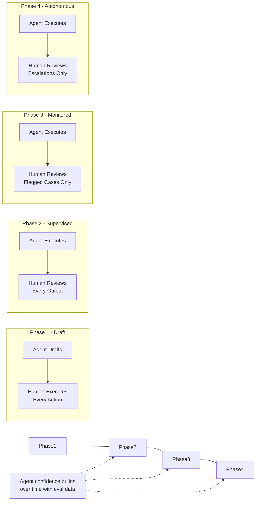

# Enterprise Agent Deployment Playbook

**Level**: 🔴 Advanced
**Reading Time**: 18 minutes

> Enterprises don't need custom orchestration graphs. They need a general-purpose harness, domain-specific tools, and domain-specific instructions. The differentiator is specificity, not framework sophistication. — Harrison Chase, CEO of LangChain

## 🗺️ Quick Overview



*Progressive autonomy: start with the agent in draft mode where humans execute everything. Expand agent authority as confidence is established through evaluation and monitoring.*

## The Enterprise Deployment Paradox

Enterprises have two demands that seem to contradict each other:

**Demand 1**: Agents must be reliable, auditable, and safe. No agent should take an action that surprises a business user, violates a company policy, or creates a liability.

**Demand 2**: Agents must be capable enough to actually handle complex, multi-step workflows — not just answer questions or fill forms.

The resolution is not a magic framework or a more powerful model. It is a methodology: start with a production-grade harness, layer in domain specificity, observe everything, define success criteria, and expand autonomy incrementally as confidence is earned.

The labs (Anthropic, OpenAI) are building general-purpose agents. General-purpose agents will win the general use case. Enterprises win on **specificity** — agents that know your CRM schema, understand your escalation rules, speak your brand voice, and connect to your internal systems. That specificity cannot be commoditized.

---

## The Enterprise Playbook: Six Steps

### Step 1: Adopt a Production-Grade Harness

Do not build your own agent loop from scratch. Production agents need checkpointing, HITL pause/resume, async execution, tool dispatch, and error handling. These are solved problems.

Choose a harness that gives you:
- Persistent state (checkpoints survive process restarts)
- Configurable HITL interrupt points
- Async execution (fire-and-forget, job queue, or inbox model)
- Trace output compatible with your observability tool

Good choices: LangGraph (stateful, native checkpointing), Claude Code SDK (built-in tool loop + HITL), or a well-tested internal harness your team owns.

**What you should NOT spend time building**: retry logic, context window management, tool call parsing, basic error handling. These are infrastructure. Your harness handles them.

### Step 2: Write Domain-Specific Tools

This is where the real work happens. The tools you write define what your agent can do in your specific environment.

Every enterprise has:
- A CRM with a proprietary schema (Salesforce, HubSpot, custom)
- An ERP or billing system
- An internal ticketing system (Jira, ServiceNow, custom)
- Product databases and catalogs
- Internal APIs that external tools don't know about

A generic "search the web" tool does nothing for a customer support agent that needs to look up a subscriber's payment history in your billing system. **Domain-specific tools are the enterprise moat.**

### Step 3: Write Domain-Specific Instructions

The system prompt is where you encode business rules, escalation criteria, tone standards, and operational context. A production enterprise system prompt is typically 500–2,000 lines. This is expected and appropriate.

### Step 4: Set Up Observability First

You cannot debug an agent you cannot see. Before the first production deployment, instrument your agent with a trace backend (LangSmith, Langfuse, or equivalent). You need to see every LLM call, every tool call, every tool result, and the full message history for any run that fails.

Observability is not an afterthought. Enterprises that skip this step spend weeks debugging production issues that would have taken minutes to diagnose with traces.

### Step 5: Define Eval Criteria

Before you deploy, answer: "How will I know if this agent is working?" Define 3–5 specific success criteria in natural language. Then translate each into an LLM-as-judge prompt. Build a golden dataset of 20–50 real tasks with ideal outputs. Regression-test every new agent version against this dataset.

### Step 6: Deploy with Progressive Autonomy

Start at Phase 1 (draft mode). Expand to the next phase only when the agent's error rate on your eval dataset is below your defined threshold at the current phase. Do not skip phases.

---

## Tool Design Is UX Design

The single biggest differentiator between a working enterprise agent and a broken one is **tool quality**. The agent's interface to the world is its tools. If the tools are vague, poorly named, or have ambiguous parameters, the agent will make wrong calls — and it will not know it is making wrong calls.

**The rule**: Tool names and descriptions are a natural language interface. Write them as if you are explaining to a junior employee what this function does, when to use it, and what each parameter means.

### Bad Tool Design vs. Good Tool Design

```python
# BAD: Vague names, no description, ambiguous parameters
@tool
def get_data(id: str, type: str, include: bool = False) -> dict:
    """Get data."""
    ...

# The agent sees this signature and has no idea:
# - What kind of "data"?
# - What does "type" mean? What valid values are there?
# - What does "include" include?
# - When should it call this vs. other tools?


# GOOD: Clear name, descriptive docstring, typed parameters with valid values
@tool
def lookup_customer_account(
    customer_id: str,
    include_payment_history: bool = False
) -> CustomerAccount:
    """
    Retrieve a customer's account details from the CRM.

    Use this tool when you need customer tier, subscription status,
    contact information, or account flags before taking any action.

    Always call this first before responding to any customer inquiry.

    Args:
        customer_id: The customer's UUID (format: cust_xxxxxxxxxxxx).
                     Found in the 'id' field of any customer object.
        include_payment_history: Set to True if the inquiry involves
                     billing, refunds, or payment issues. Adds the
                     last 12 months of payment records to the response.
                     Defaults to False to keep context lean for
                     non-billing queries.

    Returns:
        CustomerAccount with fields: id, email, tier (free/pro/enterprise),
        subscription_status, account_flags, created_at,
        and optionally payment_history.
    """
    ...
```

Additional tool design principles:

**Split read and write tools**: `get_customer` vs. `update_customer`. An agent should never accidentally mutate data when it is trying to read it.

**Scope write tools narrowly**: Instead of `update_customer(fields: dict)`, write `update_customer_email(new_email: str)` and `set_subscription_tier(tier: str, reason: str)`. Narrow tools are easier for the agent to use correctly and easier for humans to audit.

**Add guard rails in the tool, not just the prompt**: If a tool should never delete more than 10 records at once, enforce that limit in the tool's implementation — not only in the system prompt. Prompts can be overridden by adversarial inputs or model drift. Code cannot.

**Tool count in context**: Do not include every tool you have written in every agent context. If your agent has 40 tools but only needs 8 for a given task type, include only those 8. Too many tools confuse the agent and waste context window space. Use a tool registry to load the right subset per agent type.

---

## Domain-Specific Instructions: The Enterprise System Prompt

The system prompt is where enterprise-specific knowledge lives. It is the difference between a generic agent and one that actually fits your business. A production enterprise system prompt covers:

```python
class CustomerSupportAgent:
    SYSTEM_PROMPT = """
    You are a customer support agent for Acme Corp, a B2B SaaS company
    providing project management software.

    # Your Role
    You handle Tier 1 customer support: billing questions, subscription
    changes, feature explanations, and basic technical troubleshooting.

    # What You Handle vs. Escalate

    Handle directly (no human approval needed):
    - Password reset instructions
    - Billing question explanations (not refunds)
    - Feature how-to questions
    - Subscription plan comparisons
    - Status page links for known outages

    Requires human approval before action (use escalate_to_human tool):
    - Refund requests of any amount
    - Subscription cancellations (try to retain first, then escalate)
    - Requests involving data deletion (GDPR/CCPA)
    - Any mention of legal action or regulatory complaint
    - Requests where customer is threatening churn with ARR > $10,000

    Escalate immediately, do not attempt (use escalate_to_human tool):
    - Security incident reports
    - Requests for customer data exports
    - Pricing negotiation from Enterprise accounts

    # Business Rules

    Customer Tier Rules:
    - ALWAYS call check_customer_tier before discussing pricing or discounts.
    - Free tier: no discounts available; offer upgrade path only.
    - Pro tier: up to 10% courtesy discount authorized; use offer_discount tool.
    - Enterprise tier: route all pricing to Account Executive; do not quote prices.

    SLA Rules:
    - Enterprise customers have a <4h response SLA. Note this in your ticket.
    - Pro customers have a <24h response SLA.
    - Free customers have best-effort response.

    Refund Policy (do not override — always escalate refund requests):
    - Refunds within 30 days of charge: eligible, but requires human approval.
    - Refunds after 30 days: not eligible per policy; explain and empathize.
    - Do not promise refund eligibility before checking with a human reviewer.

    # Tools and When to Use Them

    lookup_customer: Call this first, always, before any response.
    get_subscription_info: Use when query involves billing, plan, seats.
    check_customer_tier: Use before discussing pricing, discounts, SLAs.
    search_knowledge_base: Use for product how-to and feature questions.
    check_known_outages: Use when customer reports something "not working."
    create_support_ticket: Create a ticket for EVERY interaction, even resolved ones.
    send_email_draft: Draft a follow-up email. Human reviews before sending.
    escalate_to_human: Pause and route to human agent. Use per escalation rules above.

    # Response Format
    - Professional, empathetic, concise.
    - Do not use jargon. Assume the customer is non-technical unless they demonstrate otherwise.
    - Always end with a clear next step: what you did, what the customer should expect, when.
    - If you escalate, tell the customer: "I've routed this to our team. You'll hear back within [SLA]."

    # Error Handling
    - If a tool call fails with a network error, retry once with a 2-second delay.
    - If a tool call fails twice, escalate to human with error context.
    - Never make assumptions about customer data if a lookup fails — always escalate.
    """
```

Note that this is a 60-line excerpt. Production prompts are longer. This is fine. A 1,000-line system prompt that accurately encodes your business rules is better than a 10-line system prompt that leaves the agent to guess.

---

## Evaluation for Enterprise Agents

Most enterprise agent tasks are open-ended: "handle this support email," "review this PR," "analyze this contract." You cannot evaluate these with exact-match accuracy. You need LLM-as-judge evaluation.

### Defining Success Criteria

Start with natural language. Ask your team: "What does a good agent run look like? What does a bad one look like?"

```
Good: Agent resolves the customer's issue, follows escalation rules, creates a ticket, uses appropriate tone.
Bad: Agent promises a refund without approval, misidentifies customer tier, forgets to create a ticket.
```

Translate to specific, measurable criteria:

```python
EVAL_CRITERIA = [
    # LLM-as-judge: asks a judge model whether the criterion was met
    LLMJudge(
        name="issue_resolved",
        prompt="""
        Given the customer's original question and the agent's response,
        was the customer's issue fully resolved, partially resolved, or unresolved?
        Answer: resolved / partial / unresolved.
        Explain your reasoning in one sentence.
        """,
        pass_values=["resolved", "partial"]  # "unresolved" = fail
    ),

    LLMJudge(
        name="escalation_rules_followed",
        prompt="""
        Review the agent's actions. Did the agent correctly follow these escalation rules:
        1. Refund requests must be escalated to human (not handled directly)
        2. Legal mentions must be escalated immediately
        3. Free tier customers must not be offered discounts
        Answer: followed / violated. If violated, state which rule was broken.
        """,
        pass_values=["followed"]
    ),

    LLMJudge(
        name="professional_tone",
        prompt="""
        Rate the agent's response tone: professional / acceptable / unprofessional.
        Professional: empathetic, clear, uses no jargon, ends with next step.
        """,
        pass_values=["professional", "acceptable"]
    ),

    # Deterministic check: no LLM needed
    DeterministicCheck(
        name="ticket_created",
        fn=lambda trace: any(
            call.tool_name == "create_support_ticket"
            for call in trace.tool_calls
        ),
        pass_condition=True
    ),

    DeterministicCheck(
        name="customer_looked_up_first",
        fn=lambda trace: (
            trace.tool_calls[0].tool_name == "lookup_customer"
            if trace.tool_calls else False
        ),
        pass_condition=True
    ),
]
```

### Building a Golden Dataset

The most valuable eval data comes from **production traces**. Run the agent in supervised mode (Phase 2). Every time a human reviewer approves or corrects an agent output, capture:

- The input (the original trigger event)
- The agent's output
- The human's decision (approved / modified / rejected)
- The human's modification if any (this is the gold label)

After 50–100 such examples, you have a golden dataset. Run every new agent version against it before promoting to the next phase.

```python
class GoldenDataset:
    def run_regression(self, agent, dataset) -> EvalReport:
        results = []
        for example in dataset.examples:
            trace = agent.run(example.input)
            scores = {}
            for criterion in EVAL_CRITERIA:
                scores[criterion.name] = criterion.evaluate(trace, example.ideal_output)
            results.append(EvalResult(
                example_id=example.id,
                pass_rate=mean(scores.values()),
                criterion_scores=scores
            ))

        report = EvalReport(
            total=len(results),
            pass_rate=mean(r.pass_rate for r in results),
            per_criterion=aggregate_by_criterion(results),
            failures=[r for r in results if r.pass_rate < 0.8]
        )
        return report
```

---

## Progressive Autonomy Deployment

This is the highest-leverage practice in enterprise agent deployment. It eliminates "big bang" risk and builds stakeholder trust incrementally.

```mermaid
flowchart LR
    subgraph P1["Phase 1 — Draft Mode"]
        direction TB
        D1[Agent: research + draft action]
        D2[Human: review + execute manually]
        D3[Goal: verify agent understands task]
    end
    subgraph P2["Phase 2 — Supervised Mode"]
        direction TB
        S1[Agent: research + execute action]
        S2[Human: review every output]
        S3[Goal: catch edge cases]
    end
    subgraph P3["Phase 3 — Monitored Mode"]
        direction TB
        M1[Agent: research + execute action]
        M2[Human: review flagged + random sample]
        M3[Goal: handle long tail]
    end
    subgraph P4["Phase 4 — Autonomous Mode"]
        direction TB
        A1[Agent: research + execute action]
        A2[Human: review escalations only]
        A3[Goal: full production throughput]
    end

    P1 -->|eval pass rate > 80%| P2
    P2 -->|eval pass rate > 90%| P3
    P3 -->|eval pass rate > 95%\nerror rate stable| P4
```



### Phase 1: Draft Mode

The agent researches the task, uses read-only tools, and produces a structured recommendation or draft. A human reads the draft and takes action manually.

**What you learn**: Does the agent correctly understand the task? Does it pull the right data? Are its recommendations sensible? You discover tool gaps and prompt gaps here — before any action is taken automatically.

**When to move to Phase 2**: When human reviewers approve the agent's draft without modifications > 80% of the time.

### Phase 2: Supervised Mode

The agent executes all actions. A human reviews the output of every run before it is considered complete. The human can reverse actions if needed.

**What you learn**: Edge cases. The 10% of situations the system prompt did not anticipate. You collect corrections that become golden dataset examples.

**When to move to Phase 3**: When the agent's eval pass rate on your golden dataset exceeds 90%, and human reviewers flag modifications < 10% of runs.

### Phase 3: Monitored Mode

The agent executes and completes. A human reviews: (a) any run the agent itself flags as uncertain, (b) a random 5–10% sample of completed runs for quality assurance.

**What you learn**: The long tail of edge cases that made it past Phase 2. Drift — is agent performance stable over time as input distribution shifts?

**When to move to Phase 4**: Eval pass rate above 95%, sampled runs have < 5% flagged by reviewers, error rate stable over 4+ weeks.

### Phase 4: Autonomous Mode

The agent executes and closes runs autonomously. Humans only see: (a) explicit escalations from the agent, (b) anomaly-detected runs from your monitoring system.

**Ongoing monitoring requirements**: Track error rate, escalation rate, and eval pass rate weekly. If any metric degrades more than 5 percentage points from baseline, pause and investigate before the agent runs degrade further.

---

## Full Deployment Pseudocode

```python
# ─── AGENT DEFINITION ─────────────────────────────────────────────

class CustomerSupportAgent:
    SYSTEM_PROMPT = """... (see above) ..."""

    # Domain-specific tools — the enterprise moat
    TOOLS = [
        lookup_customer,         # reads your CRM schema
        get_subscription_info,   # reads your billing system
        check_customer_tier,     # reads your tier definitions
        search_knowledge_base,   # searches your internal KB
        check_known_outages,     # reads your status page DB
        create_support_ticket,   # writes to your ticketing system
        send_email_draft,        # WRITE: draft only in Phase 1-2
        offer_discount,          # WRITE: requires tier check first
        escalate_to_human,       # HITL: pause + route to inbox
    ]

    EVAL_CRITERIA = [
        LLMJudge("issue_resolved"),
        LLMJudge("escalation_rules_followed"),
        LLMJudge("professional_tone"),
        DeterministicCheck("ticket_created"),
        DeterministicCheck("customer_looked_up_first"),
    ]

    # Phase controls which tools are "live" vs. "draft"
    PHASE_CONFIG = {
        "phase1": {
            "write_tools_mode": "draft",    # agent drafts; human executes
            "hitl_on_all_writes": True
        },
        "phase2": {
            "write_tools_mode": "live",     # agent executes writes
            "hitl_on_all_writes": True      # human reviews every run
        },
        "phase3": {
            "write_tools_mode": "live",
            "hitl_on_all_writes": False,
            "hitl_on_low_confidence": True  # agent self-flags uncertainty
        },
        "phase4": {
            "write_tools_mode": "live",
            "hitl_on_all_writes": False,
            "hitl_on_escalation_criteria": True  # per business rules only
        }
    }


# ─── DEPLOYMENT GATE ──────────────────────────────────────────────

class ProgressiveDeploymentGate:
    PHASE_THRESHOLDS = {
        "phase1_to_phase2": {"eval_pass_rate": 0.80},
        "phase2_to_phase3": {"eval_pass_rate": 0.90, "human_modification_rate": 0.10},
        "phase3_to_phase4": {"eval_pass_rate": 0.95, "sampled_flag_rate": 0.05},
    }

    async def check_promotion(self, agent_id: str, current_phase: str) -> PromotionResult:
        gate_key = f"{current_phase}_to_{next_phase(current_phase)}"
        thresholds = self.PHASE_THRESHOLDS[gate_key]

        metrics = await eval_system.get_recent_metrics(agent_id, days=14)

        passing = all(
            metrics[metric] >= threshold
            for metric, threshold in thresholds.items()
        )

        return PromotionResult(
            eligible=passing,
            current_metrics=metrics,
            required_thresholds=thresholds,
            recommendation="Promote to next phase" if passing else "Hold — metrics below threshold"
        )


# ─── OBSERVABILITY SETUP ──────────────────────────────────────────

def configure_agent_observability(agent_id: str, langsmith_project: str):
    return {
        # Trace every LLM call, tool call, and tool result
        "tracer": LangSmithTracer(
            project=langsmith_project,
            tags=[agent_id, DEPLOYMENT_PHASE]
        ),

        # Alert on these conditions
        "alerts": [
            Alert("error_rate_spike",
                  condition="error_rate_1h > 0.10",
                  channel="pagerduty"),
            Alert("escalation_surge",
                  condition="escalation_rate_1h > 0.30",
                  channel="slack"),
            Alert("latency_p95",
                  condition="p95_latency_min > 5",
                  channel="slack"),
            Alert("eval_regression",
                  condition="daily_eval_pass_rate < 0.85",
                  channel="email")
        ],

        # Dashboards to maintain
        "dashboards": [
            "runs_per_hour_by_status",
            "error_rate_by_tool",
            "escalation_rate_over_time",
            "eval_pass_rate_trend",
            "token_cost_per_run"
        ]
    }
```

---

## Real-World Case Studies

### Klarna: Customer Support at Scale

Klarna deployed a customer support agent that handles ~80% of customer service queries without human intervention, reportedly saving $40M annually.

What made it work:
- **Domain-specific tools**: Deep integrations with Klarna's payment system, subscription APIs, and order management — not generic web search
- **Encoded business rules**: The system prompt contains Klarna-specific escalation rules, refund policies, and tier-based handling logic
- **Progressive deployment**: Started with agent-drafted responses (Phase 1), expanded to supervised mode, then to monitored production
- **Inbox model for human review**: Support agents work from a queue of agent-handled cases, reviewing flagged items rather than every case

### ServiceNow: Customer Success Workflows

ServiceNow uses agents for customer success workflows: renewal reminders, at-risk account detection, usage alert outreach.

Key patterns:
- **Event-triggered**: Agent fires when account usage drops below threshold (database event trigger)
- **Domain tools**: Integrates with Salesforce CRM, Gainsight health scores, internal renewal tracking
- **Inbox delivery**: Customer Success Managers see agent-generated outreach proposals in an inbox, approve before sending
- **Eval focus**: Success metric is renewal rate on agent-touched accounts vs. control group

### Clay: Data Enrichment at Scale

Clay runs millions of agent traces per month enriching contact and company data.

Key patterns:
- **Massive scale observability**: Uses LangSmith Insights agent to cluster failure types — "which categories of enrichment fail most?"
- **Feedback loops**: Failure clusters feed directly into tool improvements and prompt updates
- **Eval as production feedback**: Production failures become eval dataset additions automatically

### Replit: Coding Agents

Replit's coding agents can run 100s–1,000s of steps per trace, making observability challenging.

Key patterns:
- **Search-within-trace**: Required LangSmith's ability to search for specific tool calls or outputs within a single long trace — standard trace viewing doesn't scale to 1,000 steps
- **Trajectory analysis**: Identifies step patterns where agents commonly get stuck (e.g., loop between "read file" and "list directory" without making progress)
- **Step budget controls**: Agents have hard step limits; agents that approach the limit self-escalate

---

## Common Enterprise Failure Patterns

### 1. Skipping Observability Setup

**Pattern**: Deploy the agent, skip instrumentation to "save time," spend 3 weeks debugging a production issue by reading raw logs.

**Fix**: Instrument before the first production run. Set up traces, alerts, and a dashboard in Phase 1. Cost: 1 day. Value: priceless.

### 2. Going Straight to Phase 4

**Pattern**: Skip phases 1–3 to "ship faster," discover at scale that the agent violates a business rule 2% of the time, which is 40 violations per day at 2,000 runs/day.

**Fix**: Phase 1 and 2 are cheap — human review overhead is the same you would have without an agent. You only earn the cost savings by building confidence through measured phases.

### 3. Weak Tool Design

**Pattern**: Tool names are `get_info(id, type)` and `do_action(params)`. The agent makes wrong tool calls 15% of the time because it cannot tell which tool to use or what parameters mean.

**Fix**: Name tools with full verb-noun descriptions. Write docstrings as if explaining to a junior employee. Add valid values to parameter descriptions. Review every tool call in Phase 1 traces and rewrite any tool that produces wrong calls.

### 4. Generic System Prompt

**Pattern**: System prompt is 5 lines: "You are a helpful assistant. Help customers. Use tools." The agent has no idea about tier-based rules, escalation criteria, or response format.

**Fix**: The system prompt is a business requirements document. Every rule, escalation criterion, and output standard that a human agent would know should be written out explicitly. Start with what a new employee orientation deck would cover.

### 5. No Eval Dataset

**Pattern**: Agent version 2.0 ships with a new system prompt. It fixes the top 3 known failure modes but unknowingly regresses on 4 previously-working cases. No one notices for two weeks.

**Fix**: Build a golden dataset from Phase 2 production traces. Run regression on every version before promoting. Alert if pass rate drops more than 3 percentage points.

### 6. Treating Observability as Debugging-Only

**Pattern**: Traces are only looked at when something breaks. No one monitors escalation rate trends, so a gradual drift from 5% to 25% escalation rate over 3 months goes unnoticed until a stakeholder complains.

**Fix**: Review weekly dashboards as part of regular operations. Escalation rate, error rate, and eval pass rate should be metrics with owners and SLOs.

---

## General vs. Specific Agent Positioning

The labs (Anthropic, OpenAI, Google) are building general-purpose agents. Claude Code, GPT-4o with tools, and Gemini with function calling are already highly capable general agents. These will get better every quarter.

If an enterprise tries to compete on "general agent capability," they will lose to the labs.

The durable competitive position is the same as it was for enterprise software in the database era:

| What commoditizes | What stays specific |
|------------------|---------------------|
| LLM capability (the labs win) | Your CRM data model |
| Orchestration framework | Your escalation rules |
| Generic tools (search, browse) | Your internal APIs |
| General reasoning | Your product knowledge |
| Base model fine-tuning | Your golden eval dataset |

The enterprise moat is the system prompt that encodes your business rules, the tools that connect to your internal systems, and the eval dataset that proves your agent actually works in your domain. None of these can be replicated by a general-purpose model or a competitor without your data.

---

## Key Takeaways

- Enterprise agents win on domain specificity — the harness is infrastructure, the tools and instructions are the moat.
- Tool design is UX design: tool names, descriptions, and parameter docs are the agent's primary interface. Invest heavily here.
- System prompts for production agents are long (500–2,000 lines) and that is expected — they encode business rules, escalation criteria, and operational context.
- Evaluation requires LLM-as-judge for open-ended tasks. Define 3–5 criteria, build a golden dataset from Phase 2 production traces, and regression-test every deployment.
- Progressive autonomy (Draft → Supervised → Monitored → Autonomous) is not optional. It is how you build confidence without catastrophic failure at scale.
- Observability must be set up before Phase 1, not added after production issues emerge.
- The labs will build general agents better than any enterprise. Enterprise value is the specificity that cannot be commoditized.
