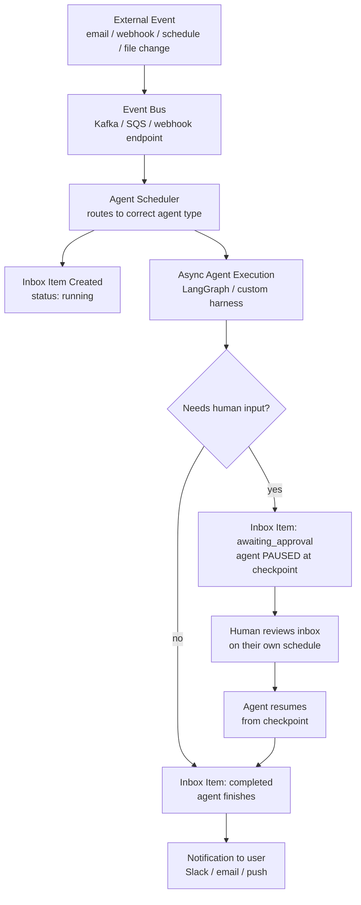
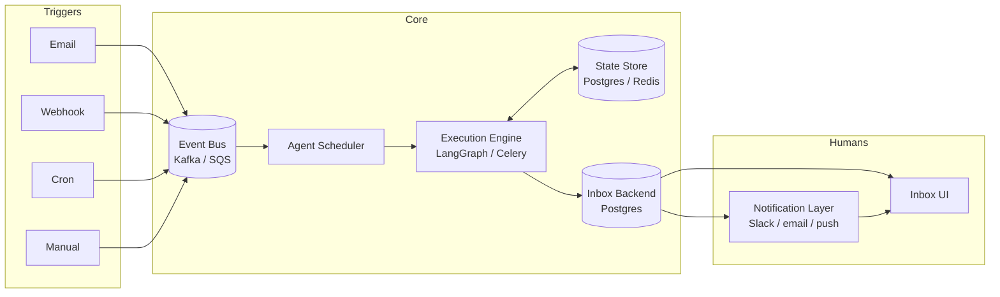
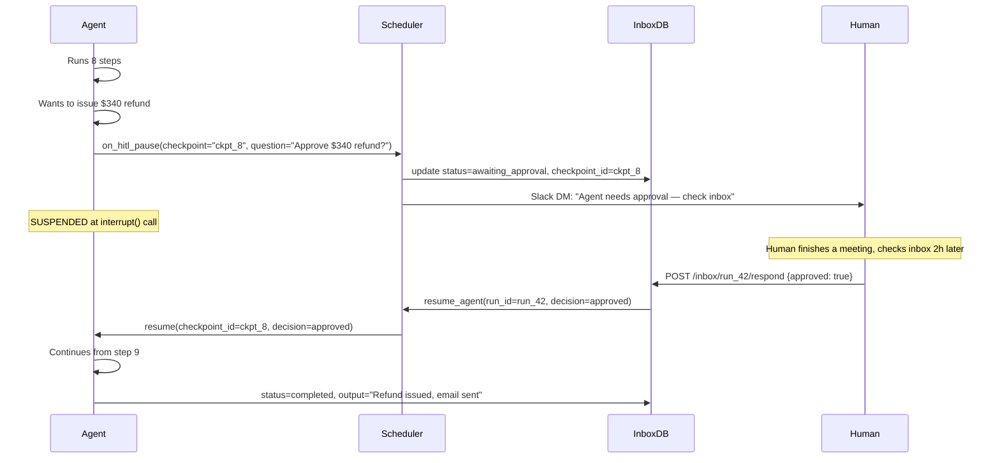

# Event-Triggered Agents & Inbox UX

**Level**: 🔴 Advanced
**Reading Time**: 16 minutes

> "I don't want to be staring at a chat window for two hours. The right UX is an inbox where the agent is triggered by events." — Harrison Chase, CEO of LangChain

## 🗺️ Quick Overview



*External events trigger agents asynchronously. Results land in an inbox — not a chat window. Human-in-the-loop interrupts appear as "awaiting approval" inbox items. The human reviews everything on their own schedule.*

## The Problem with Chat for Long-Running Agents

Chat UX was designed for conversation: you ask, you get an answer in seconds. It works brilliantly for ChatGPT-style interactions. It falls apart completely when the agent takes 30 minutes.

The fundamental mismatch:

| Assumption | Chat | Long-Running Agent |
|-----------|------|-------------------|
| **Response latency** | Sub-second to sub-minute | Minutes to hours |
| **User attention** | Synchronous — user waits | Asynchronous — user leaves and returns |
| **Concurrent runs** | One conversation at a time | Many agents running in parallel |
| **HITL UX** | Interrupts the conversation flow | Needs a separate review surface |
| **Review model** | Linear, chronological | Prioritized, filterable, batch |
| **Streaming** | Engaging for 30 seconds | Tedious for 30 minutes |

Streaming tokens are genuinely interesting when the response arrives in 5 seconds. When the agent is running a 25-step research task and streaming every intermediate reasoning step for 30 minutes — nobody is watching. The user opened a new tab, went to lunch, or forgot the agent was running.

Chat also has no native concept of "I'll get back to this later." Email does. GitHub PRs do. Slack threads do. Your project management tool does. All of these async-review-based tools use an **inbox mental model**, and that is the right paradigm for long-running agents.

---

## The Inbox Mental Model

An inbox treats agent runs as **deliverables**, not conversations.

- Each triggered agent run creates one **inbox item**
- The item moves through states: `running` → `awaiting_approval` → `completed` (or `failed`)
- The human checks their inbox when they are ready — not when the agent asks them to
- HITL interrupts appear as items flagged "awaiting your input" — same inbox, different status
- Completed runs sit in the inbox like resolved support tickets: readable, linkable, archivable

This is conceptually identical to:
- **Email**: messages arrive asynchronously; you read them when ready
- **GitHub PRs**: CI runs and code review comments accumulate; you review when you have time
- **Linear/Jira issues**: work items land in a backlog; you process them by priority

The key insight is that **the human's attention is decoupled from the agent's execution**. The agent does not need the human present to start, run, or even pause and wait. The human shows up when they want.

```
Inbox view:
┌─────────────────────────────────────────────────────────────────┐
│  INBOX                                          Filter ▾  Sort ▾ │
├──────────────────────────────────────────────────────────────────┤
│ ⏳ AWAITING YOUR INPUT                                           │
│   [Customer email] Refund request from Alice Liu                 │
│   Agent wants to issue $340 refund. Approve?       [Approve] [X] │
├──────────────────────────────────────────────────────────────────┤
│ 🔄 RUNNING                                                       │
│   [Nightly report] Weekly sales analysis — step 8/15    2m ago   │
├──────────────────────────────────────────────────────────────────┤
│ ✅ COMPLETED                                                     │
│   [PR Review] feat/payment-retry — 3 comments posted  12m ago    │
│   [Email] Reply drafted for Bob Chen support ticket    1h ago     │
│   [Monitoring] High error rate on checkout — JIRA #441 3h ago    │
└──────────────────────────────────────────────────────────────────┘
```

---

## What Triggers an Event-Triggered Agent?

The "always-on" agent is not waiting for a human to type a message. It is waiting for an event. These are the canonical trigger types:

### 1. Email Received
```
Trigger: new email arrives at support@company.com
  → Route to CustomerSupportAgent
  → Agent reads email, checks CRM, drafts response
  → If routine: send draft for human review (inbox item)
  → If refund > $500: pause, create "awaiting_approval" inbox item
```

**Real example**: Klarna's customer support agents handle incoming support messages. The human reviewer sees a queue (inbox) of agent-drafted responses, not a chat window.

### 2. Webhook (GitHub, Stripe, etc.)
```
Trigger: POST /webhooks/github  { event: "pull_request.opened", pr: {...} }
  → Route to CodeReviewAgent
  → Agent reads diff, writes review comments, posts via GitHub API
  → Human developer reviews the agent's comments (asynchronously, in GitHub)
```

### 3. Scheduled (Cron)
```
Trigger: cron "0 2 * * *"  (2am every night)
  → Route to ReportingAgent
  → Agent queries data warehouse, writes weekly analysis report
  → Human reads report at morning standup (inbox item with PDF/link)
```

### 4. File Change / Document Upload
```
Trigger: new file uploaded to S3 bucket: contracts/2025/
  → Route to ContractAnalysisAgent
  → Agent extracts key dates, parties, obligations, risks
  → Human legal reviewer sees structured summary (inbox item)
```

### 5. Database Event / CDC
```
Trigger: new row in at_risk_accounts table  (usage < 30% of seat limit)
  → Route to CustomerSuccessAgent
  → Agent reviews account health, prepares outreach plan
  → CSM reviews and approves outreach before it is sent
```

### 6. Manual Trigger with Async Result
```
Trigger: human submits "research competitors in the LLM space" via web form
  → Human immediately gets job ID and confirmation
  → Human closes the tab
  → Agent runs 45-minute research task
  → Human returns, sees completed item with structured report in inbox
```

The manual trigger is important. Even when a human starts the agent, the right UX is still the inbox — not a chat window that the human is expected to watch.

---

## Architecture Components

These six components form the core of an event-triggered agent system:



**Event Bus**: Receives all trigger events. Provides durability (no trigger is lost if the scheduler is temporarily down) and decoupling (the scheduler does not need to know about email servers). Use Kafka for high-throughput, SQS for simpler setups, or a plain webhook endpoint with a queue behind it.

**Agent Scheduler**: Routes events to the correct agent type. Manages concurrency limits (don't run 1,000 simultaneous agents), prioritizes by urgency, and creates the initial inbox item in `running` state.

**Execution Engine**: Runs the actual agent loop. Handles checkpointing, tool dispatch, and HITL pause/resume. LangGraph is a common choice here because its checkpoint mechanism maps cleanly to the inbox state model.

**State Store**: Persists in-progress agent state. This is what makes HITL pause-and-resume work across time boundaries. The state store holds the agent's message history, step count, and the checkpoint ID the human needs to reference when they respond.

**Inbox Backend**: A database table (typically Postgres) that tracks every inbox item: run ID, user ID, task description, current status, output, checkpoint ID if paused, and the question the agent is asking the human.

**Notification Layer**: Tells the human when their attention is needed. For `awaiting_approval` items, this is often an immediate Slack DM or email. For `completed` items, it can be a daily digest rather than per-item pings to avoid notification fatigue.

---

## Full System Pseudocode

```python
# ─── 1. EVENT INGESTION ────────────────────────────────────────────

@webhook_handler("/incoming-email")
async def on_email_received(email: Email):
    await event_bus.publish(AgentTriggerEvent(
        type="email_received",
        payload=email,
        agent_type="customer_support",
        user_id=email.to_address,
        priority="normal"
    ))

@webhook_handler("/github-webhook")
async def on_github_event(event: GitHubEvent):
    if event.type == "pull_request.opened":
        await event_bus.publish(AgentTriggerEvent(
            type="pr_opened",
            payload=event.pull_request,
            agent_type="code_review",
            user_id=event.repository.owner,
            priority="high"
        ))

@cron("0 2 * * *")
async def nightly_report_trigger():
    await event_bus.publish(AgentTriggerEvent(
        type="scheduled_report",
        payload={"report_type": "weekly_sales"},
        agent_type="reporting",
        user_id="data-team",
        priority="low"
    ))


# ─── 2. AGENT SCHEDULER ────────────────────────────────────────────

class AgentScheduler:
    MAX_CONCURRENT_PER_USER = 5

    async def handle(self, event: AgentTriggerEvent):
        # Check staleness — skip stale events (e.g., scheduler was down)
        if event.age_seconds() > event.stale_ttl_seconds:
            log.warn(f"Dropping stale event {event.id}, age={event.age_seconds()}s")
            return

        # Concurrency guard
        running_count = await inbox.count_running(event.user_id)
        if running_count >= self.MAX_CONCURRENT_PER_USER:
            await event_bus.publish(event, delay_seconds=60)  # requeue
            return

        run_id = uuid4()

        # Create inbox item immediately — user can see it's in progress
        await inbox.create_item(InboxItem(
            id=run_id,
            user_id=event.user_id,
            task=describe_task(event),
            agent_type=event.agent_type,
            status="running",
            trigger_event_id=event.id,
            created_at=now()
        ))

        # Launch agent asynchronously — do not await here
        asyncio.create_task(self._run_agent(run_id, event))

    async def _run_agent(self, run_id: str, event: AgentTriggerEvent):
        agent = agent_registry.get(event.agent_type)

        try:
            result = await agent.run(
                payload=event.payload,
                run_id=run_id,
                on_hitl_pause=self._handle_hitl_pause
            )
            await inbox.update_item(run_id,
                status="completed",
                output=result.summary,
                completed_at=now()
            )
            await notifier.send_completion(event.user_id, run_id)

        except Exception as e:
            await inbox.update_item(run_id,
                status="failed",
                error=str(e),
                completed_at=now()
            )
            await notifier.send_failure(event.user_id, run_id)

    async def _handle_hitl_pause(
        self,
        run_id: str,
        checkpoint_id: str,
        question: str,
        proposed_action: dict
    ):
        # Called by the agent when it needs human input
        await inbox.update_item(run_id,
            status="awaiting_approval",
            checkpoint_id=checkpoint_id,
            question=question,
            proposed_action=proposed_action
        )
        await notifier.send_approval_request(
            user_id=await inbox.get_user_id(run_id),
            run_id=run_id,
            question=question,
            proposed_action=proposed_action
        )
        # The agent coroutine is now suspended at its interrupt() call.
        # It will resume only when resume_agent() is called below.

    async def resume_agent(self, run_id: str, decision: HumanDecision):
        item = await inbox.get_item(run_id)
        agent = agent_registry.get(item.agent_type)

        await inbox.update_item(run_id, status="running")

        try:
            result = await agent.resume(
                run_id=run_id,
                checkpoint_id=item.checkpoint_id,
                decision=decision,
                on_hitl_pause=self._handle_hitl_pause
            )
            await inbox.update_item(run_id,
                status="completed",
                output=result.summary,
                completed_at=now()
            )
            await notifier.send_completion(item.user_id, run_id)

        except Exception as e:
            await inbox.update_item(run_id, status="failed", error=str(e))


# ─── 3. INBOX API ──────────────────────────────────────────────────

# Human responds to an awaiting_approval item
@api_handler("POST /inbox/{run_id}/respond")
async def respond_to_agent(run_id: str, body: HumanDecisionRequest):
    item = await inbox.get_item(run_id)

    if item.status != "awaiting_approval":
        raise HTTPError(409, "Inbox item is not awaiting approval")

    decision = HumanDecision(
        approved=body.approved,
        modifications=body.modifications,
        comment=body.comment,
        reviewer=current_user()
    )

    # Resume runs asynchronously — return 202 immediately
    asyncio.create_task(scheduler.resume_agent(run_id, decision))
    return {"status": "resuming", "run_id": run_id}

# Fetch inbox items for a user
@api_handler("GET /inbox")
async def get_inbox(user_id: str, status: Optional[str] = None):
    items = await inbox.list_items(user_id=user_id, status=status)
    return {
        "items": items,
        "counts": await inbox.get_status_counts(user_id)
    }


# ─── 4. DATA MODELS ────────────────────────────────────────────────

class InboxItem:
    id: str                    # uuid, also used as agent run_id
    user_id: str
    task: str                  # human-readable description of what triggered this
    agent_type: str
    status: Literal["running", "awaiting_approval", "completed", "failed"]
    trigger_event_id: str      # link back to the original event

    # Set when completed
    output: Optional[str]      # summary of what the agent did

    # Set when awaiting_approval
    checkpoint_id: Optional[str]   # where to resume from
    question: Optional[str]        # what the agent is asking the human
    proposed_action: Optional[dict]  # what the agent wants to do

    # Set when failed
    error: Optional[str]

    created_at: datetime
    completed_at: Optional[datetime]
    trace_url: Optional[str]   # link to LangSmith / Langfuse trace thread
```

---

## HITL in the Async Inbox Model

In a chat interface, HITL feels like an interruption: the conversation stops, the human must respond, only then does the agent continue. This creates pressure for the human to respond immediately.

In the inbox model, HITL is just another inbox state. The agent pauses. An item appears in the inbox marked "awaiting your input." The human responds when they have time — could be 5 minutes, could be 3 hours. The agent is not spinning, not polling, not holding a connection. It is simply paused at a checkpoint, waiting.



Key properties of this model:
- **No blocking**: The human does not block the system. Other agents run normally while this one waits.
- **Clean state restoration**: The agent resumes from exactly step 8, with all prior context intact.
- **No polling**: The scheduler is event-driven. Resume is triggered by the HTTP call from the inbox UI, not by the agent polling.
- **Audit trail**: The inbox item records who approved what and when.

---

## Observability: Stitching Traces Across Pauses

Long-running async agents have a tracing challenge: a single logical agent run may produce multiple traces — one before the HITL pause, one after resume. If your observability tool doesn't stitch these together, debugging becomes painful.

LangSmith uses a **threads** concept: multiple traces that belong to the same agent run are grouped under one thread ID. The thread ID is the `run_id` that propagates through the entire agent lifecycle, including across HITL boundaries.

```python
# Pass thread_id throughout the agent's lifecycle
async def run_agent_with_tracing(run_id: str, payload: dict):
    with langsmith_tracer(thread_id=run_id, run_name="CustomerSupportAgent") as tracer:
        result = await agent.run(payload, callbacks=[tracer])
    return result

async def resume_agent_with_tracing(run_id: str, checkpoint_id: str, decision: dict):
    # Same thread_id = same LangSmith thread = one coherent trace
    with langsmith_tracer(thread_id=run_id, run_name="CustomerSupportAgent.resume") as tracer:
        result = await agent.resume(checkpoint_id, decision, callbacks=[tracer])
    return result
```

What to include in each inbox item's `trace_url`:
- Link to the LangSmith thread (all sub-traces stitched)
- Total token count for the run
- Tool calls made and their results
- Time spent at each step
- Checkpoint IDs for any HITL pauses

---

## Designing for Failure in Async Agents

Async agents have more failure modes than synchronous ones because more time passes during a run.

**Agent crashes mid-run**
The agent worker process dies while the agent is running. Resolution: on worker startup, scan the inbox for items stuck in `running` status for longer than `max_expected_runtime`. For each, load the last checkpoint and requeue for retry.

```python
async def recover_stuck_runs():
    stuck = await inbox.find_stuck_running(
        older_than_minutes=MAX_RUNTIME_MINUTES
    )
    for item in stuck:
        log.warn(f"Recovering stuck run {item.id}")
        await event_bus.publish(RetryEvent(
            run_id=item.id,
            resume_from_checkpoint=await state_store.get_latest_checkpoint(item.id)
        ))
```

**Human never responds to HITL request**
Set a response deadline (typically 24–48 hours for business-hours workflows). On timeout:
- Option A: Auto-reject the proposed action (safe default)
- Option B: Escalate to a secondary reviewer
- Option C: Cancel the run and notify the original requester

```python
# Background job that checks for stale HITL requests
async def expire_stale_approvals():
    stale = await inbox.find_awaiting_approval(
        older_than_hours=HITL_TIMEOUT_HOURS
    )
    for item in stale:
        await scheduler.resume_agent(
            run_id=item.id,
            decision=HumanDecision(
                approved=False,
                comment=f"Auto-rejected: no response within {HITL_TIMEOUT_HOURS}h"
            )
        )
        await notifier.send_timeout_notice(item.user_id, item.id)
```

**Stale trigger event**
The event bus was backed up. A trigger event that should have fired 4 hours ago arrives now. The context may no longer be valid (the customer's email thread moved on, the PR was already reviewed manually, the report is no longer needed).

```python
async def handle_event(event: AgentTriggerEvent):
    # Check staleness before dispatching
    age = now() - event.emitted_at
    if age > event.stale_ttl:
        await inbox.create_item(InboxItem(
            status="cancelled",
            task=describe_task(event),
            error=f"Event arrived {age.seconds}s after emission (TTL={event.stale_ttl}s)"
        ))
        return
    # Proceed normally
    await scheduler.handle(event)
```

**Idempotency: duplicate events**
The event bus may deliver the same event twice (at-least-once delivery). Use the `trigger_event_id` as an idempotency key — before creating a new inbox item, check if one already exists for that event ID.

```python
async def handle_event(event: AgentTriggerEvent):
    existing = await inbox.find_by_trigger_event_id(event.id)
    if existing is not None:
        log.info(f"Duplicate event {event.id}, run {existing.id} already exists")
        return  # Skip — already processed
    await scheduler.handle(event)
```

---

## Chat vs. Inbox: Full Comparison

| Dimension | Chat Interface | Inbox Interface |
|-----------|---------------|-----------------|
| **Latency tolerance** | Seconds | Minutes to hours |
| **User attention model** | Synchronous, user waits | Async, user checks when ready |
| **Concurrent runs** | One conversation | Many parallel runs, separate items |
| **HITL UX** | Interrupts conversation | Dedicated "awaiting" state in inbox |
| **Observability** | Single trace, linear | Threaded traces stitched by run_id |
| **Notification on complete** | Implicit (response appears) | Explicit (Slack DM, email, push) |
| **Review model** | Chronological scroll | Prioritized, filterable, batchable |
| **State persistence** | Session-based | Durable (survives server restarts) |
| **Partial results** | Stream tokens | Progress updates on inbox item |
| **Archival** | Conversation history | Inbox archive, linkable by run_id |

---

## Real-World Patterns

**Customer support automation (Klarna model)**
Incoming support emails arrive → each triggers a CustomerSupportAgent run → agent reads CRM, checks subscription, drafts response → agent either sends directly (low-risk queries) or creates an "awaiting approval" inbox item (refunds, escalations). Human support agents work from an inbox queue of agent-drafted responses, not from a raw email inbox. The agent handles 80%+ without requiring human intervention.

**Code review agents**
A GitHub webhook fires on every PR open → CodeReviewAgent reads the diff, runs static analysis tools, drafts inline comments → posts comments via GitHub API → developer reviews the agent's comments asynchronously in GitHub. No chat window involved. The developer's "inbox" is GitHub's PR review UI.

**Nightly report generation**
A cron job fires at 2am → ReportingAgent pulls data from warehouse, runs analysis, generates the report document → places completed item in inbox with a link to the report → data team reads the report at their morning standup. The agent ran while everyone slept.

**Infrastructure monitoring**
A monitoring system detects a spike in checkout error rate → fires a webhook → MonitoringAgent investigates (checks logs, traces, recent deployments) → creates a JIRA ticket with root cause analysis → creates an "awaiting approval" inbox item: "I believe the cause is PR #4821 (deployed 40m ago). Rollback?" → on-call engineer reviews the analysis and approves or rejects the rollback.

---

## Common Pitfalls

1. **Building inbox UX as an afterthought**: If you design the agent first and bolt on the inbox later, the state model won't map cleanly. Design the inbox item schema before writing the agent.

2. **Sending too many notifications**: One Slack message per completed item will overwhelm users who have 50 agent runs a day. Batch non-urgent notifications into digests. Only send immediate notifications for `awaiting_approval` items.

3. **No stale event TTL**: An event that arrives hours late will trigger an agent with stale context. Always check event age and skip events beyond their TTL.

4. **Missing idempotency on event ingestion**: At-least-once delivery from Kafka/SQS means you will receive duplicates. Check the trigger event ID before creating a new run.

5. **Tying thread UX to the inbox**: The inbox is for completed/in-progress runs. Do not try to embed a chat thread inside an inbox item — it conflates two different interaction models. If you need back-and-forth with a user, use a separate "clarification" channel.

6. **Forgetting to set HITL timeouts**: An agent paused for a human response should not wait indefinitely. Expired approvals should auto-reject or escalate.

---

## Key Takeaways

- Chat assumes synchronous user attention; inbox assumes asynchronous review. For runs longer than ~2 minutes, the inbox model is strictly better.
- Event triggers (email, webhook, cron, file change, DB event) make agents "always-on" without requiring humans to initiate each run.
- The inbox item state machine is: `running` → `awaiting_approval` (HITL pause) → `completed` / `failed`.
- HITL pauses are inbox items, not chat interruptions. The human reviews them on their own schedule.
- Observability requires trace stitching across HITL boundaries — use a persistent thread ID (the `run_id`) across all sub-traces.
- Async agents need explicit handling for: crashed mid-run (checkpoint recovery), HITL timeout (auto-reject or escalate), stale events (TTL check), and duplicate events (idempotency key).
