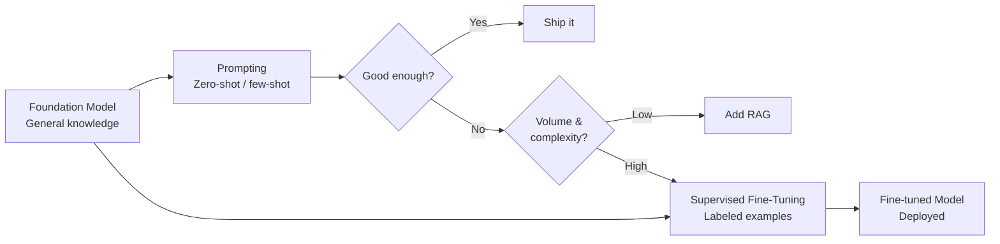
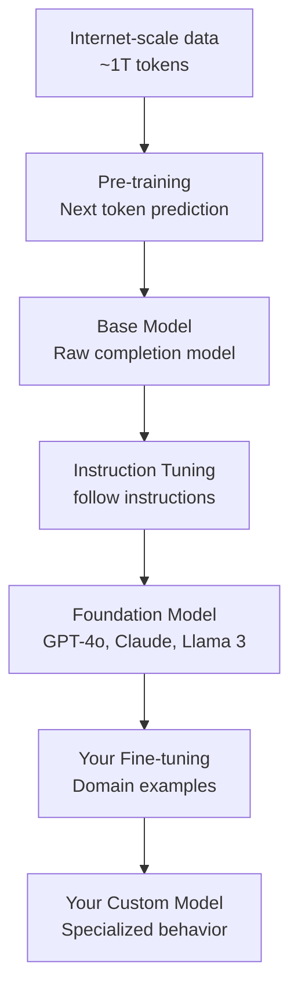
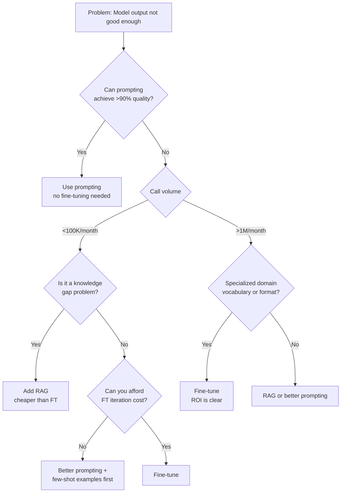
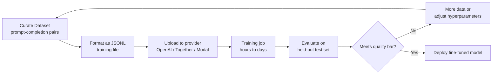

# Fine-tuning Fundamentals — When Prompting Isn't Enough

**Level**: 🟡 Intermediate
**Reading Time**: 14 minutes

> Fine-tuning is not the first tool you reach for — it's the tool you reach for when prompting has hit its ceiling and the economics finally make sense.

## 🗺️ Quick Overview



*The decision to fine-tune flows from economics and quality ceilings — not from preference.*

## The Problem

Developers building production AI features hit a familiar wall: prompting works in demos but fails at scale. The formatting is inconsistent across runs. The model uses generic language instead of domain-specific terminology. A system prompt that's 2,000 tokens long costs real money at 1M calls per month — and still produces outputs that require downstream cleanup.

Fine-tuning solves these problems by baking behavior into the model's weights rather than injecting it through the context window on every call. But it comes with its own costs, risks, and failure modes. Most teams fine-tune too early or for the wrong reasons. This article gives you the framework to know when it's actually the right move.

---

## Foundation Models vs. Fine-tuned Models

A **foundation model** (GPT-4o, Claude 3.5 Sonnet, Llama 3) is trained on vast general data to be broadly capable. It can write code, answer questions, translate languages, and more — without any specialization.

A **fine-tuned model** starts from a foundation model and continues training on a curated, task-specific dataset. Think of it as the difference between a generalist doctor and a cardiologist: both have the same medical education, but one has developed deep specialization through targeted additional training.



The foundation model already knows language, reasoning, and world knowledge. Fine-tuning does **not** teach it new facts reliably — it teaches it new *behaviors*, *styles*, and *output formats*.

**What fine-tuning is good for:**
- Consistent output format (always respond as JSON with these specific fields)
- Domain-specific tone and vocabulary (medical, legal, customer support)
- Reducing latency by moving instructions from the prompt into the weights
- Teaching new tasks that weren't well-represented in the original training data

**What fine-tuning is NOT good for:**
- Adding new factual knowledge (use RAG for this)
- Fixing fundamental reasoning limitations of a small model
- Replacing alignment/safety measures

---

## The Decision Framework: When to Fine-tune

This is the question that matters most. Fine-tuning too early wastes money. Fine-tuning too late means running inefficient prompts at scale.



| Signal | Use Prompting | Use Fine-tuning |
|--------|--------------|-----------------|
| **Call volume** | < 100K/month | > 1M/month |
| **Output format** | Flexible/varied | Rigid, consistent schema |
| **Domain vocabulary** | General language | Specialized terms (legal, medical) |
| **Accuracy target** | >90% achievable with prompts | Prompting plateaus at 80-85% |
| **System prompt size** | < 500 tokens | > 1,500 tokens (saves cost at scale) |
| **Iteration speed** | Need daily changes | Stable task definition |
| **Dataset available** | < 100 labeled examples | > 500 labeled examples |

**The economics rule of thumb**: Fine-tuning GPT-3.5 costs ~$0.008/1K training tokens (one-time). At 1M calls/month with a 2,000-token system prompt you can eliminate, you save ~$40/month (at $0.002/1K input tokens). Fine-tuning pays for itself in weeks. At 10K calls/month, it takes years — not worth it.

---

## Instruction Tuning: The Foundation of Fine-tuning

Before fine-tuning your specific use case, it helps to understand **instruction tuning** — the process that turned raw base models into the helpful assistants we use today.

**FLAN (2021)**: Google researchers fine-tuned a 137B model on 60+ NLP tasks framed as natural language instructions. Models trained this way generalized better to unseen tasks — proving that instruction format itself matters.

**InstructGPT (2022)**: OpenAI fine-tuned GPT-3 on human-written demonstrations of "good" responses, then applied RLHF (reinforcement learning from human feedback). This created the GPT-3.5 family. The insight: base models generate likely completions; instruction-tuned models generate *helpful* responses.

When you fine-tune today, you're adding a third layer on top of these existing layers:
1. Pre-training → model learns language
2. Instruction tuning → model learns to follow instructions
3. **Your fine-tuning → model learns your specific task**

---

## The SFT Pipeline Step-by-Step

**SFT (Supervised Fine-Tuning)** is the most common fine-tuning approach. You provide (input, output) pairs and train the model to reproduce your outputs given your inputs.



### Step 1: Dataset Preparation

The training file is a JSONL file where each line is one example:

```json
{"messages": [
  {"role": "system", "content": "You are a JSON API that extracts product information."},
  {"role": "user", "content": "Parse: 'Blue Nike Air Max 90, size 10, $129.99'"},
  {"role": "assistant", "content": "{\"brand\": \"Nike\", \"model\": \"Air Max 90\", \"color\": \"Blue\", \"size\": 10, \"price\": 129.99}"}
]}
{"messages": [
  {"role": "system", "content": "You are a JSON API that extracts product information."},
  {"role": "user", "content": "Parse: 'Red Adidas Ultraboost 22, size 9.5, $180.00'"},
  {"role": "assistant", "content": "{\"brand\": \"Adidas\", \"model\": \"Ultraboost 22\", \"color\": \"Red\", \"size\": 9.5, \"price\": 180.00}"}
]}
```

### Step 2: Upload and Train (OpenAI example)

```python
from openai import OpenAI
client = OpenAI()

# Upload training file
with open("training_data.jsonl", "rb") as f:
    response = client.files.create(file=f, purpose="fine-tune")
file_id = response.id

# Start fine-tuning job
job = client.fine_tuning.jobs.create(
    training_file=file_id,
    model="gpt-3.5-turbo",
    hyperparameters={
        "n_epochs": 3,        # typically 3-5 for small datasets
        "batch_size": 4,      # auto or small number
        "learning_rate_multiplier": 1.0
    }
)
print(f"Job ID: {job.id}")  # ft-xxxxxxxxxxxxx

# Check status
status = client.fine_tuning.jobs.retrieve(job.id)
print(status.status)  # "running" | "succeeded" | "failed"
```

### Step 3: Evaluate

Never deploy without evaluating on a held-out test set. Calculate your target metric (accuracy, F1, exact match) and compare against your baseline prompting approach.

---

## Cost and Compute Reality

| Provider | Base Model | Training Cost | Inference Cost vs. Base |
|---------|-----------|---------------|------------------------|
| OpenAI | GPT-3.5-turbo | ~$0.008/1K tokens | 3–4x more expensive per call |
| OpenAI | GPT-4o-mini | ~$0.003/1K tokens | Similar to base |
| Together AI | Llama 3 8B | ~$0.0003/1K tokens | Same model, your endpoint |
| Modal | Llama 3 70B | GPU cost (~$3–4/GPU-hr) | Self-hosted |
| Self-hosted A100 | Llama 3 8B | ~$2/GPU-hr × 4hrs = $8 | Infrastructure cost only |

**Real benchmark**: Fine-tuning Llama 3 8B on 10,000 examples (chat format):
- 4× A100 80GB GPUs
- Training time: ~4 hours
- Cloud cost at $3/GPU-hr: **~$48 one-time**
- Result: model matches GPT-4o on the specific task at 1/10th the inference cost

---

## Comparison: Prompting vs. RAG vs. Fine-tuning

| Dimension | Prompting | RAG | Fine-tuning |
|-----------|-----------|-----|-------------|
| **Setup cost** | Minutes | Hours–days | Days–weeks |
| **Iteration speed** | Instant | Fast | Slow (retrain) |
| **Knowledge freshness** | Stale (model cutoff) | Real-time | Stale (retrain to update) |
| **Domain vocabulary** | Mediocre | Mediocre | Excellent |
| **Output format consistency** | Variable | Variable | Excellent |
| **Cost at 1M calls/month** | High (large prompts) | Medium | Low (smaller prompts) |
| **Best for** | Prototypes, varied tasks | Knowledge-heavy apps | Format, style, domain |

The right choice is often **RAG + light fine-tuning**: RAG provides fresh knowledge, fine-tuning provides consistent behavior and vocabulary.

---

## Real-World Examples

**OpenAI's own models**: GPT-4 was instruction-tuned on human demonstrations, then refined with RLHF. The base GPT-4 model cannot follow instructions reliably — instruction tuning is what makes it useful.

**Stripe**: Fine-tuned models for extracting structured data from financial documents. Using a generic model required 1,500-token system prompts to explain the output schema. Post-fine-tuning: 200-token prompts, 94% accuracy (vs. 82% with prompting alone), 60% lower inference cost.

**Notion AI**: Fine-tuned smaller models for editing tasks (rewrite, summarize, fix grammar). The fine-tuned model matched GPT-4 quality for these specific tasks at 10x lower latency and 5x lower cost — critical for an inline editing feature where users expect instant feedback.

**Bloomberg**: Published BloombergGPT — a 50B parameter model trained from scratch on financial text, then fine-tuned. Their research showed domain-specific pre-training + fine-tuning outperforms general models on financial NLP tasks by 15–20 points on benchmarks.

---

## Common Mistakes

1. **Fine-tuning to inject knowledge** — Fine-tuning does not reliably update factual knowledge. If you train a model on "Our pricing is $99/month" and that changes, you need to retrain. Use RAG for dynamic facts; use fine-tuning for *behavior*. Root cause: conflating "the model needs to say this" with "the model needs to know this."

2. **Overfitting on small datasets** — With fewer than 100 examples, the model memorizes the training set instead of generalizing. Signs: training loss drops to near-zero, but test performance is poor. Fix: collect more data (aim for 500+), use early stopping, or use data augmentation (paraphrase existing examples with a stronger model).

3. **Skipping baseline evaluation** — Teams fine-tune and deploy without measuring accuracy before and after. Without a baseline, you can't prove the fine-tuning helped. Fix: always evaluate your baseline prompting approach on the same test set before starting fine-tuning.

4. **Catastrophic forgetting** — Fine-tuning on a narrow task can degrade performance on general tasks. Example: fine-tuning a customer support model on only product-specific data may make it worse at understanding context or multi-turn conversations. Fix: mix some general instruction-following examples (10–20%) into your training data.

5. **Using the same data for train and test** — Evaluating on data the model was trained on gives inflated metrics. Always hold out 10% of your dataset as a test set before any training begins.

---

## Key Takeaways

- Fine-tuning teaches **behaviors and formats**, not new facts — use RAG for knowledge freshness
- The break-even point for fine-tuning is roughly **1M calls/month with a 1,500+ token system prompt**; below that, optimize your prompt first
- Minimum viable dataset: **500 examples** for format/style tasks; **5,000+** for new skills
- Fine-tuning Llama 3 8B on 4× A100s for 10K examples costs **~$48** one-time — infrastructure cost is not the barrier anymore
- Always measure a **prompting baseline** before fine-tuning; many teams find prompting gets them to 90%+ with less effort

---

## References

> 📖 [OpenAI Fine-tuning Guide](https://platform.openai.com/docs/guides/fine-tuning) — Official documentation covering dataset format, training, and evaluation
> 📺 [Fine-tuning Large Language Models — DeepLearning.AI](https://www.deeplearning.ai/short-courses/finetuning-large-language-models/) — Hands-on course covering SFT pipeline end-to-end
> 📖 [Scaling Instruction-Finetuned Language Models (FLAN)](https://arxiv.org/abs/2210.11416) — Google Research paper showing instruction tuning generalizes to unseen tasks
> 📖 [BloombergGPT: A Large Language Model for Finance](https://arxiv.org/abs/2303.17564) — Case study of domain-specific training at scale
> 📚 [Together AI Fine-tuning Docs](https://docs.together.ai/docs/fine-tuning) — Open-source model fine-tuning with cost benchmarks
