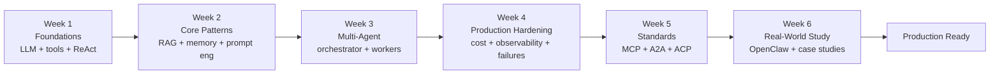
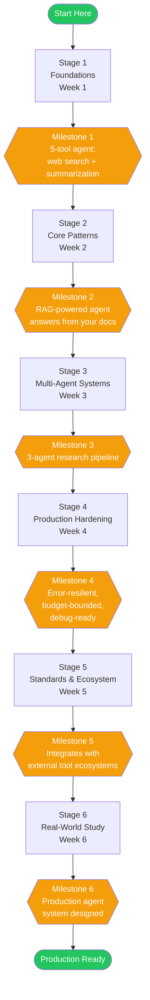

# From Zero to Production Agent — The Complete Learning Path

**Level**: 🟢 Beginner
**Reading Time**: 12 minutes

> Most tutorials get you to "hello world in 50 lines." This roadmap gets you to production: cost-controlled, observable, failure-resilient, and ready for real users.

## 🗺️ Quick Overview

*Six progressive stages take you from first LLM call to a cost-controlled, observable, failure-resilient production agent system.*

## The Journey at a Glance

---

## Stage 1 — Foundations (Week 1)

This stage answers the question: what is an agent, actually? Not the marketing definition. The technical one.

### What to Learn

**1. Understand tokens and context windows**
→ [LLM Fundamentals for Agents](./llm-fundamentals-for-agents)

Before you build anything, you need to understand the material you're working with. Tokens are the unit of everything in LLM systems — cost, speed, and the fundamental limit of what an agent can "remember" in a single session. A context window is the agent's working memory. When it fills up, something has to give.

Key facts to internalize:
- GPT-4o: 128k token context (~300 pages of text)
- Claude 3.5 Sonnet: 200k token context
- Token cost scales linearly — a 10k token conversation costs 10x a 1k conversation
- Every tool result, every message, every instruction consumes tokens

**2. Build your first agent loop manually**
→ [Basic Agent Loop POC](../hands-on/basic-agent-loop)

Don't use a framework for your first agent. Build the loop yourself: call the LLM, check if it wants to call a tool, call the tool, feed the result back, repeat. This gives you a visceral understanding of what frameworks are abstracting for you — and when that abstraction breaks.

**3. Learn the ReAct pattern**
→ [ReAct Pattern](./react-pattern)

ReAct (Reason + Act) is the dominant pattern for single-agent loops. The LLM interleaves reasoning steps ("I need to find the current stock price") with action steps (calling the stock_price tool). Understanding ReAct is understanding how 90% of production agents actually think.

**4. Master tool use / function calling**
→ [Tool Use & Function Calling](./tool-use-function-calling)

Tools are what make agents useful beyond text generation. This article covers how the LLM decides which tool to call, how tool schemas constrain its choices, and why badly-designed tool descriptions cause hallucinated arguments.

### Stage 1 Milestone

**You can build a 5-tool agent that does web search and summarization.**

The agent should:
- Accept a research question
- Search the web (or a local corpus) at least twice to gather sources
- Cross-reference results
- Return a synthesized summary with citations
- Fail gracefully if a search returns no results

---

## Stage 2 — Core Patterns (Week 2)

You've got a working loop. Now you need it to be smarter about what it remembers, what it retrieves, and how reliably it formats output.

### What to Learn

**5. Memory types and when to use each**
→ [Agent Memory Types](./agent-memory-types)

Not all memory is created equal. In-context memory (messages in the prompt) is fast but expensive. Vector memory (semantic search over a corpus) is scalable but adds latency. Episodic memory (logs of past conversations) is useful for personalization but complex to maintain. This article maps each memory type to the right use case so you're not guessing.

| Memory Type | When to Use | Cost |
|-------------|-------------|------|
| In-context | Current conversation, ≤ 20 turns | $$$ |
| Vector (RAG) | Large knowledge bases, > 1K documents | $ |
| Episodic | Per-user preferences, long-term context | $$ |
| Semantic cache | Repeated similar queries | $ |

**6. RAG for grounding**
→ [RAG Deep Dive](./rag-deep-dive)

Retrieval-Augmented Generation is how you connect an agent to your own data. Without RAG, the agent only knows what's in its training data (cutoff: months or years ago). With RAG, it can answer from your latest docs, your database, your product catalog. RAG is the most common pattern you'll implement.

**7. Write reliable prompts**

Prompt engineering for agents is different from prompt engineering for chatbots. You're writing a system prompt that must work across hundreds of different user queries, tool results, and edge cases. [Prompt Engineering for Agents](./prompt-engineering-for-agents) covers the specific techniques: role definition, output format enforcement, negative instructions, and few-shot examples in the system prompt.

*(This article is coming soon — in the meantime, focus on writing explicit, specific system prompts that define role, constraints, and escalation conditions.)*

**8. Structured output for parsing**
→ [Structured Output & JSON Mode](./structured-output)

Your agent's final output often needs to be parsed programmatically — to fill a form, update a database, or trigger another system. Structured output (JSON mode, schema-constrained generation) ensures the LLM returns machine-readable responses instead of prose. Without it, you're writing fragile regex parsers against LLM output.

### Stage 2 Milestone

**You can build a RAG-powered agent that answers questions from your own documents.**

The agent should:
- Chunk and embed a corpus of 50+ documents into a vector store
- Retrieve the top-3 relevant chunks for any query
- Answer with citations to source documents
- Refuse to answer confidently when the documents don't contain the answer (no hallucination)
- Return structured JSON output suitable for displaying in a UI

---

## Stage 3 — Multi-Agent Systems (Week 3)

A single agent is a solo contractor. Multi-agent is a team. This stage teaches you when to scale from one to many — and how to make them work together.

### What to Learn

**9. When one agent is enough vs when you need multiple**
→ [Single-Agent Architecture](./single-agent-architecture) | [Multi-Agent Systems](./multi-agent-systems)

The instinct to add more agents is strong but often wrong. A second agent adds: routing complexity, extra LLM calls (cost + latency), communication overhead, and new failure modes. Read both articles back-to-back. Single-agent covers the patterns that keep one agent scalable. Multi-agent covers the specific problems that genuinely require more than one.

Use multiple agents when:
- Different agents need different tool access (security boundary)
- Tasks benefit from parallelism (3 simultaneous research threads)
- Specialization reduces error rate (pharmacist agent vs general triage agent)
- You need distinct approval loops (supervisor reviews specialist's output)

**10. Orchestrator-worker pattern**
→ [Orchestrator-Worker Pattern](./orchestrator-worker-pattern)

The most common multi-agent topology. An orchestrator agent breaks a complex task into subtasks, delegates them to worker agents, and synthesizes the results. Workers are narrow and specialized; the orchestrator is broad and coordinates. This is how Claude Code works internally: a planner delegates to a file-reader, a code-writer, and a test-runner.

**11. Agent routing**
→ [Agent Routing & Intent Classification](./agent-routing)

Before you can delegate to a specialist agent, you need to know which specialist to send the message to. Agent routing covers intent classification (is this a billing question or a technical question?), confidence thresholds (when to route vs handle directly), and fallback behavior when no clear intent is detected.

**12. Planning patterns for complex tasks**
→ [Agent Planning Patterns](./planning-patterns)

Some tasks are too complex for a reactive ReAct loop. The agent needs to plan upfront: "To answer this question, I need to do A, then B, then C." Planning patterns (Plan-and-Execute, Tree-of-Thought, ReAct with backtracking) cover how agents handle multi-step tasks with dependencies.

### Stage 3 Milestone

**You can build a 3-agent research pipeline.**

The pipeline should:
- Accept a research topic
- Orchestrator agent breaks it into 3 parallel sub-questions
- Three worker agents research each sub-question independently (simultaneously)
- Orchestrator synthesizes the 3 results into a coherent report
- Total pipeline cost stays within a budget you set upfront
- Handle one worker failure without the whole pipeline failing

---

## Stage 4 — Production Hardening (Week 4)

A working agent and a production-ready agent are different things. This stage covers everything that makes the difference: cost, reliability, observability, and safety.

### What to Learn

**13. Context window management**
→ [Context Window Management](./context-window-management)

In production, conversations run long. Research sessions accumulate dozens of tool results. Without active management, your context fills up and either your agent silently degrades (LLMs pay more attention to recent context) or you hit a hard limit and the session crashes. This article covers the three-tier compaction strategy: compress individual results → summarize sessions → truncate old context.

**14. Cost control**
→ [Cost Control for Agents](./cost-control-agents)

The #1 production surprise is the bill. A single runaway agent loop or an under-estimated context size can cost hundreds of dollars before you notice. Cost control covers: token budgets per conversation, model routing (use cheap models for simple subtasks), caching identical queries, and kill switches for loops that exceed thresholds.

Key cost levers:
- Use GPT-4o-mini or Claude Haiku for routing and summarization tasks
- Cache tool results for identical queries within a session
- Set hard max-tokens limits on tool outputs before they enter context
- Alert when a conversation exceeds 3x your median cost

**15. Multi-model routing**
→ [Multi-Model Routing](./multi-model-routing) *(coming soon)*

Not every task needs your best model. A refund eligibility check doesn't need GPT-4o; it needs fast and cheap. Multi-model routing sends simple subtasks to smaller, cheaper models and reserves the frontier model for complex reasoning. A well-tuned routing strategy can cut costs by 60-80% with minimal quality loss.

**16. Human-in-the-loop for high-stakes actions**
→ [Long-Running Agents](./long-running-agents) *(covers HITL patterns)*

Some actions should never run without a human reviewing them: filing a legal document, processing a large refund, sending a message to all users. Human-in-the-loop (HITL) patterns cover how to pause an agent mid-execution, surface the decision to a human, and resume after approval. The key is designing the pause/resume as a first-class workflow, not an afterthought.

**17. Observability and tracing**
→ [Agent Observability](./agent-observability)

When an agent gives the wrong answer, where did it go wrong? Which tool call returned bad data? Which reasoning step took the wrong branch? Without tracing, you're debugging blind. This article covers structured logging for agent steps, distributed tracing across multi-agent pipelines, and the dashboards that tell you when something is going wrong before users notice.

**18. Failure modes to anticipate**

Before you go live, read all five failure mode articles:
- [Tool Call Failures](../failures/tool-call-failures) — tools return errors, time out, or return stale data
- [LLM Hallucination in Agents](../failures/hallucination-in-agents) — agents confidently hallucinate tool arguments
- [Context Window Overflow](../failures/context-overflow) — sessions silently degrade as context fills
- [Infinite Loops](../failures/infinite-loops) — agents that never decide they're done
- [Prompt Injection](../failures/prompt-injection) — adversarial inputs hijack the agent's behavior

### Stage 4 Milestone

**Your agent handles errors gracefully, stays within budget, and you can debug it.**

The agent should:
- Recover from tool failures with retry + fallback (not crash)
- Stay within a per-conversation token budget you set
- Produce a structured trace log for every conversation
- Alert when cost per conversation exceeds 2x your baseline
- Block prompt injection attempts in user inputs

---

## Stage 5 — Standards and Ecosystem (Week 5)

You've built a solid agent. Now you learn how to make it interoperate with external tools, other agents, and the broader ecosystem.

### What to Learn

**19. MCP for tool interoperability**
→ [Model Context Protocol](./model-context-protocol)

The Model Context Protocol (MCP) is Anthropic's standard for how agents discover and call external tools. Instead of writing a custom integration for every tool, you write one MCP server and any MCP-compatible agent can use it. This is the direction the industry is moving. If you're building tools for other people's agents, MCP is how you do it.

**20. A2A for agent-to-agent calls**
→ [Agent-to-Agent Protocol (A2A)](./agent-to-agent-protocol)

When your orchestrator agent needs to call a specialist agent, how does it do it? The Agent-to-Agent (A2A) protocol defines the standard interface for inter-agent communication: capability advertisement, task delegation, result streaming, and error handling across agent boundaries. This matters when you're integrating with agents you didn't build yourself.

**21. Choose your platform**
→ [Platform Overview](../platforms)

Now that you understand what agents need, you can evaluate frameworks intelligently:
- **LangChain**: Broad ecosystem, many integrations. Good for RAG-heavy pipelines.
- **LangGraph**: Graph-based state machines. Good for complex multi-step workflows.
- **AutoGen**: Microsoft's multi-agent framework. Strong at agent-to-agent conversations.
- **CrewAI**: Role-based multi-agent teams. Fast to prototype.
- **Claude API directly**: Maximum control. No abstraction overhead. Best for custom architectures.

### Stage 5 Milestone

**Your agent integrates with external tool ecosystems.**

Specifically:
- At least one tool exposed as an MCP server that another agent can discover and call
- Your agent can call an external A2A-compatible specialist agent
- You've evaluated at least two frameworks and can articulate why you chose your stack

---

## Stage 6 — Real-World Study (Week 6)

Theory and exercises get you to competence. Studying production systems gets you to expertise.

### What to Learn

**22. Read the OpenClaw architecture case study**
→ [OpenClaw: Architecture Deep Dive](../case-studies/openclaw-architecture)

OpenClaw is a self-hosted multi-channel AI gateway — open source, MIT-licensed, production-grade. It handles everything you've learned in this path: context compaction, auth rotation, multi-channel routing, per-agent tool policies, streaming. Reading its architecture is the clearest view available of how all these patterns come together in a real system.

**23. Extract reusable patterns**
→ [OpenClaw: Agent Patterns Extracted](../case-studies/openclaw-patterns)

This article breaks OpenClaw into 8 standalone patterns you can apply independently, even if you're not using OpenClaw itself. The patterns cover: multi-agent routing, tool policy enforcement, context compaction, auth rotation, session isolation, streaming event channels, SOUL.md configuration, and human-in-the-loop integration.

**24. Apply patterns to your domain**
→ [Adapting OpenClaw Patterns to Your Domain](../case-studies/openclaw-domain-adaptation)

The final article shows how to take OpenClaw's patterns and apply them to legal research, healthcare triage, and e-commerce — three real domains with different constraints. At the end, there's a step-by-step adaptation process you can follow for any domain you're building in.

### Stage 6 Milestone

**You've designed your production agent system.**

Deliverables:
- A SOUL.md (system prompt) for your agent
- A TOOLS.md (tool policy: allow / elevated / deny)
- A session model decision (what scopes a session? what must be isolated?)
- A multi-agent topology diagram (or justification for a single agent)
- An escalation trigger list (what requires human review?)
- An adversarial input test suite (at least 5 prompt injection attempts)

---

## What Production-Ready Actually Means

When you complete this path, your agent should satisfy this checklist:

**Reliability**
- [ ] Handles tool call failures with retry and fallback (not crash)
- [ ] Has a maximum step count — no infinite loops
- [ ] Recovers gracefully from LLM errors (rate limits, timeouts, refusals)

**Cost**
- [ ] Cost per conversation is measured (you know your p50, p95, p99)
- [ ] Cost per conversation is bounded (hard token budget enforced)
- [ ] Cheap models used for routing and simple subtasks
- [ ] Tool outputs capped in size before entering context

**Observability**
- [ ] Structured trace log for every conversation (every step, every tool call)
- [ ] Can replay any conversation step-by-step to debug it
- [ ] Alerts fire when cost or latency exceeds thresholds
- [ ] Agent error rates tracked and dashboarded

**Safety**
- [ ] Human escalation defined for all high-stakes actions
- [ ] Tested against at least 5 prompt injection patterns
- [ ] Tool policy explicitly classifies all actions as allow / elevated / deny
- [ ] Output validated before being passed to downstream systems

**Multi-User**
- [ ] Session isolation — user A cannot see user B's context
- [ ] Auth credentials stored in environment variables, never hardcoded
- [ ] Credentials rotated across multiple profiles for rate-limited APIs

---

## How to Use This Roadmap

**If you're completely new to agents**: Start at Stage 1, do every linked article and POC in order. The milestones are your checkpoints — don't advance until you've hit the milestone.

**If you've built a basic agent before**: Skim Stage 1 to confirm you have the fundamentals, then start at Stage 2 (memory + RAG). Most intermediate builders have gaps in memory types and context management.

**If you're building for production now**: Jump to Stage 4. The production hardening articles (observability, cost control, failure modes) are where most agents break. Then come back for the standards work in Stage 5.

**If you're designing a new agent system from scratch**: Start at Stage 6 (read case studies first), then work backward through Stage 4 for the production requirements, then Stage 3 for the topology.

---

## Key Takeaways

- Six stages, six weeks, six milestones. Each builds on the last.
- Start with manual implementation before adopting a framework. Frameworks hide complexity you need to understand.
- Production readiness has a checklist. Work through it explicitly — don't assume your agent is production-ready because it works in testing.
- The hardest part is not building the loop. It's cost management, observability, and failure handling — all Stage 4 topics.
- Study real systems. OpenClaw shows you what production actually looks like; tutorials show you what it's supposed to look like.
