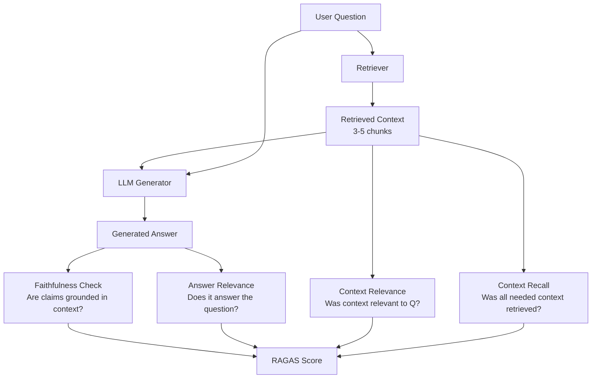
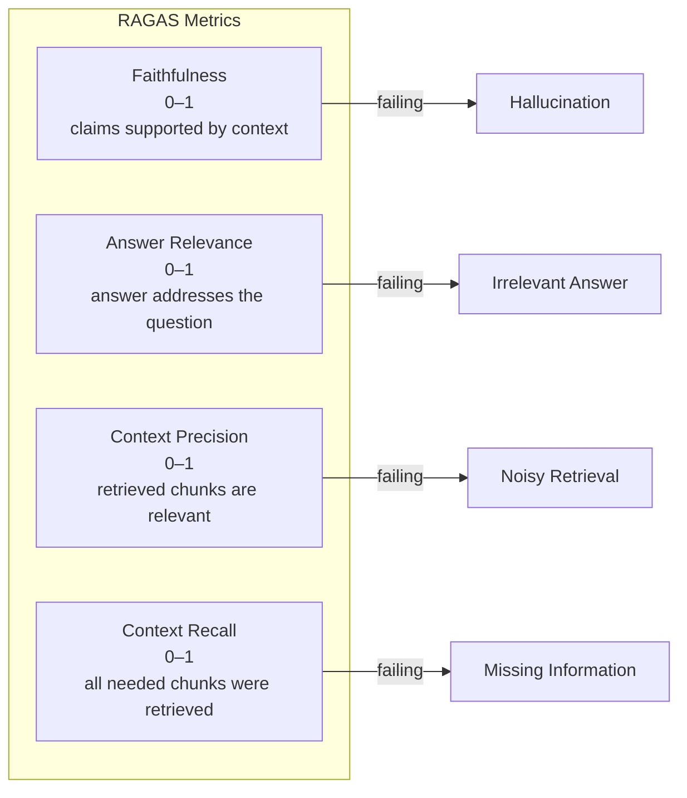

# Groundedness & Faithfulness — Preventing RAG Hallucinations

**Level**: 🟡 Intermediate
**Reading Time**: 14 minutes

> A RAG system that retrieves perfect context and still hallucinates is worse than no RAG at all — it gives users false confidence in wrong answers.

## 🗺️ Quick Overview



*RAGAS measures four distinct failure modes. A system can fail on any one independently — perfect retrieval doesn't guarantee faithful generation.*

**When you need this**:
- Your RAG system answers questions about proprietary documents (legal, medical, financial)
- Users rely on answers for decisions — hallucinations have real consequences
- You're hitting faithfulness scores below 0.85 in production
- Compliance or audit requirements demand traceable citations

## The Problem

RAG systems retrieve context from a document store and pass it to an LLM. The LLM generates an answer. But the answer may not actually be grounded in the retrieved context. It might:

1. **Mix parametric knowledge with retrieved context** — the LLM adds facts from its training data that aren't in the retrieved chunks, blending them seamlessly so users can't tell which is which
2. **Hallucinate plausible-sounding details** — dates, names, statistics that aren't in any retrieved document
3. **Contradict the context** — the retrieved document says revenue was $10M, the LLM says $100M
4. **Answer from memory when context is insufficient** — instead of saying "I don't know", the LLM fabricates

The cruel irony: a well-prompted LLM is so good at sounding confident and coherent that users cannot detect hallucinations without checking sources themselves. In enterprise RAG systems, studies show 15-25% of responses contain at least one unsupported claim when faithfulness is not explicitly enforced.

**Faithfulness vs. Groundedness** (people confuse these):
- **Faithfulness** = every claim in the answer is supported by a source
- **Groundedness** = the answer uses only information from the retrieved context (doesn't add external knowledge)
- Faithfulness is measurable per-claim; groundedness is a binary property of the whole response

## The Four RAGAS Metrics

The RAGAS framework (Retrieval Augmented Generation Assessment) defines four orthogonal metrics that together characterize RAG quality:



| Metric | Formula | Production Threshold | What Breaks It |
|--------|---------|---------------------|----------------|
| Faithfulness | supported claims / total claims | > 0.85 | LLM adds parametric knowledge |
| Answer Relevance | cosine_sim(answer embedding, question embedding) | > 0.80 | LLM answers a different question |
| Context Precision | relevant chunks / retrieved chunks | > 0.75 | Retriever pulls irrelevant docs |
| Context Recall | relevant facts covered / all relevant facts | > 0.70 | Chunk size too small, embeddings weak |

A production RAG system achieving all four above threshold is considered high-quality. Most untuned systems score 0.60-0.75 on faithfulness on first deployment.

## Faithfulness Detection Methods

There are three main approaches, each with a different speed/accuracy tradeoff:

### Method 1: NLI (Natural Language Inference)

Use a specialized classification model to determine if each claim is *entailed*, *neutral*, or *contradicted* by the context.

```python
from transformers import pipeline

# DeBERTa-NLI is fast (10–50ms) and accurate for factual claims
nli_pipeline = pipeline(
    "text-classification",
    model="cross-encoder/nli-deberta-v3-large"
)

def check_claim_entailment(claim: str, context: str) -> dict:
    """
    Returns entailment label and confidence score.
    Labels: ENTAILMENT, NEUTRAL, CONTRADICTION
    """
    result = nli_pipeline(
        f"{context} [SEP] {claim}",
        truncation=True,
        max_length=512
    )
    return {
        "claim": claim,
        "label": result[0]["label"],
        "score": result[0]["score"]
    }

def compute_faithfulness_nli(answer: str, context: str) -> float:
    """
    Decompose answer into claims, check each against context.
    Returns faithfulness score 0–1.
    """
    # Simple sentence decomposition (use NLP for production)
    claims = [s.strip() for s in answer.split('.') if len(s.strip()) > 20]

    if not claims:
        return 1.0

    supported = 0
    for claim in claims:
        result = check_claim_entailment(claim, context)
        if result["label"] == "ENTAILMENT" and result["score"] > 0.7:
            supported += 1

    return supported / len(claims)
```

**Performance**: 10-50ms per claim, ~$0 (runs locally), accuracy ~82% vs human judgement.

### Method 2: LLM-as-Judge

Use a capable LLM to evaluate whether each claim in the answer appears in the context. More accurate for complex reasoning, but slower.

```python
import json

def faithfulness_llm_judge(
    question: str,
    answer: str,
    context: str,
    judge_model  # Use different model than generator!
) -> dict:
    """
    LLM judge returns faithfulness score and per-claim breakdown.
    Use a different model family than your generator to avoid bias.
    """
    prompt = f"""You are evaluating whether an AI answer is faithful to its source context.

QUESTION: {question}

ANSWER: {answer}

SOURCE CONTEXT:
{context}

Task:
1. Extract every factual claim from the ANSWER as a list
2. For each claim, determine if it is SUPPORTED, NOT_SUPPORTED, or CONTRADICTED by the context
3. Calculate faithfulness = supported_claims / total_claims

Return valid JSON:
{{
  "claims": [
    {{"claim": "...", "verdict": "SUPPORTED|NOT_SUPPORTED|CONTRADICTED", "reason": "..."}}
  ],
  "faithfulness_score": 0.0,
  "summary": "..."
}}

IMPORTANT: Only use information from SOURCE CONTEXT. Do not use your own knowledge to validate claims."""

    response = judge_model.generate(prompt, temperature=0)
    result = json.loads(response.text)
    return result

# Example usage
result = faithfulness_llm_judge(
    question="What was Stripe's revenue in 2023?",
    answer="Stripe processed $1 trillion in payment volume and had $3.5 billion in revenue in 2023.",
    context="According to Stripe's 2023 report, the company processed $1 trillion in total payment volume.",
    judge_model=judge_llm
)
# result.faithfulness_score = 0.5  (only payment volume claim is supported)
```

**Performance**: 500ms-2s per evaluation. Use GPT-4o mini or Claude Haiku for cost efficiency. Accuracy ~91% vs human judgement when using a different model family than the generator.

### Method 3: Citation Forcing

Force the LLM to cite sources inline, then programmatically verify citations. This is the most production-reliable approach because it makes faithfulness a structural constraint.

```python
CITATION_SYSTEM_PROMPT = """You are a precise research assistant.

RULES:
1. Answer ONLY using the provided documents
2. Every factual claim MUST include an inline citation: [Doc N]
3. If a fact is NOT in any document, say "I don't have information about this in the provided documents"
4. Do NOT use your general knowledge — only what's in the documents below

Documents:
{documents}

Answer the question with inline citations."""

def answer_with_citations(question: str, documents: list[dict]) -> dict:
    """
    Returns answer with citations and verification results.
    Each document: {"id": 1, "title": "...", "content": "..."}
    """
    doc_text = "\n\n".join([
        f"[Doc {d['id']}] {d['title']}:\n{d['content']}"
        for d in documents
    ])

    response = llm.generate(
        system=CITATION_SYSTEM_PROMPT.format(documents=doc_text),
        user=question
    )

    # Verify citations are real document IDs
    cited_ids = extract_citation_ids(response.text)
    valid_ids = {d["id"] for d in documents}
    invalid_citations = cited_ids - valid_ids

    return {
        "answer": response.text,
        "cited_document_ids": list(cited_ids),
        "invalid_citations": list(invalid_citations),
        "faithfulness_ok": len(invalid_citations) == 0
    }

def extract_citation_ids(text: str) -> set:
    import re
    return {int(m) for m in re.findall(r'\[Doc (\d+)\]', text)}
```

## Production Pipeline

A production faithfulness monitoring pipeline evaluates every response automatically and flags anomalies:

```python
import time
from dataclasses import dataclass

@dataclass
class FaithfulnessCheckResult:
    faithfulness_score: float
    answer_relevance: float
    flagged: bool
    flag_reason: str | None
    latency_ms: int

class FaithfulnessMonitor:
    # Thresholds calibrated from production data
    HARD_BLOCK_THRESHOLD = 0.5      # Block response, return "I don't know"
    HUMAN_REVIEW_THRESHOLD = 0.75   # Queue for human review, serve with warning
    GOOD_THRESHOLD = 0.85           # Healthy score

    # Alert if rolling 1-hour average drops below this
    ALERT_THRESHOLD = 0.80

    def __init__(self, judge_model, nli_pipeline):
        self.judge = judge_model
        self.nli = nli_pipeline
        self.score_history = []

    def check(
        self,
        question: str,
        answer: str,
        context: str
    ) -> FaithfulnessCheckResult:
        start = time.time()

        # Fast NLI check first (10-50ms)
        nli_score = compute_faithfulness_nli(answer, context)

        # If NLI score is borderline, use slower but more accurate LLM judge
        if 0.4 < nli_score < 0.9:
            judge_result = faithfulness_llm_judge(
                question, answer, context, self.judge
            )
            final_score = judge_result["faithfulness_score"]
        else:
            final_score = nli_score

        latency = int((time.time() - start) * 1000)

        # Update rolling history for alerting
        self.score_history.append(final_score)
        if len(self.score_history) > 3600:  # 1hr @ 1 req/sec
            self.score_history.pop(0)

        # Alert if rolling average drops
        if len(self.score_history) > 100:
            avg = sum(self.score_history) / len(self.score_history)
            if avg < self.ALERT_THRESHOLD:
                alert_on_call(f"Faithfulness avg dropped to {avg:.2f}")

        # Determine action
        flagged = final_score < self.HUMAN_REVIEW_THRESHOLD
        flag_reason = None
        if final_score < self.HARD_BLOCK_THRESHOLD:
            flag_reason = "hard_block"
        elif final_score < self.HUMAN_REVIEW_THRESHOLD:
            flag_reason = "human_review"

        return FaithfulnessCheckResult(
            faithfulness_score=final_score,
            answer_relevance=0.0,  # computed separately
            flagged=flagged,
            flag_reason=flag_reason,
            latency_ms=latency
        )
```

### What to Do at Each Score Range

| Score | Status | Action |
|-------|--------|--------|
| 0.90 – 1.00 | Excellent | Serve immediately |
| 0.85 – 0.90 | Good | Serve; log for monitoring |
| 0.75 – 0.85 | Borderline | Serve with "please verify" disclaimer |
| 0.50 – 0.75 | Poor | Queue for human review; serve with strong disclaimer |
| 0.00 – 0.50 | Unacceptable | Block; return "I couldn't find reliable information about this" |

## Real-World RAGAS Evaluation

The RAGAS Python library automates all four metrics with a single call:

```python
from ragas import evaluate
from ragas.metrics import (
    faithfulness,
    answer_relevancy,
    context_precision,
    context_recall,
)
from datasets import Dataset

# Build evaluation dataset
eval_data = {
    "question": ["What is the refund policy?", "When was the company founded?"],
    "answer": [
        "You can return items within 30 days for a full refund.",
        "The company was founded in 2010 by Jane Smith."
    ],
    "contexts": [
        ["Our policy allows returns within 30 days of purchase for store credit or refund."],
        ["Founded in 2012 by John and Jane Smith, the company..."]
    ],
    "ground_truth": [
        "Items can be returned within 30 days.",
        "The company was founded in 2012."
    ]
}

dataset = Dataset.from_dict(eval_data)

results = evaluate(
    dataset=dataset,
    metrics=[faithfulness, answer_relevancy, context_precision, context_recall],
    llm=your_judge_llm,       # Use different model than your generator
    embeddings=your_embeddings
)

print(results)
# {'faithfulness': 0.71, 'answer_relevancy': 0.95,
#  'context_precision': 0.88, 'context_recall': 0.82}
# Note: answer 2 is unfaithful (says 2010, context says 2012)
```

Typical production systems first deploying RAGAS see:
- Faithfulness: 0.65-0.78 (before tuning)
- After citation forcing + context filtering: 0.85-0.92
- After 3 months of monitoring + prompt refinement: 0.88-0.95

## Real-World Examples

**Bing Chat / Microsoft Copilot**: Every response includes numbered citation footnotes linking to source URLs. Users can click any citation to verify the claim. This is citation-forcing at the UX level — it makes faithfulness visible to users and shifts accountability to the sources.

**Perplexity AI**: Highlights the specific sentence in the source document that supports each claim. This is the gold standard for faithfulness UX — users can see exactly which part of which document backs up each fact. Perplexity reports their faithfulness as a core quality metric in engineering blog posts.

**Glean (Enterprise Search)**: Highlights the exact passage from the source document inline in the answer. For enterprise use cases (HR policy, legal contracts), this citation-first design is essential for user trust and audit trails.

## Common Mistakes

1. **Testing with synthetic queries only**
   - Root cause: Engineers write test questions that match the documents perfectly, so faithfulness looks artificially high
   - Fix: Use production query logs for evaluation; real users ask ambiguous, multi-hop questions that stress the system
   - Impact: Teams discover their 0.92 eval score is actually 0.71 on real traffic

2. **Using the same LLM as generator and judge**
   - Root cause: It's convenient to use GPT-4o for both generation and faithfulness evaluation
   - Fix: Use a different model family for judging (e.g., generate with Claude, judge with GPT-4o or vice versa)
   - Impact: Same-model judges have ~15% self-preference bias, inflating scores

3. **Ignoring low-faithfulness answers instead of blocking them**
   - Root cause: Teams implement monitoring but don't add hard block logic because they worry about false positives
   - Fix: Start with a conservative hard-block threshold (0.5) and tune up based on user feedback; a wrong confident answer is worse than "I don't know"
   - Impact: Without hard blocks, LLMs confidently hallucinate 5-15% of the time on out-of-context queries

4. **Not chunking context before faithfulness checks**
   - Root cause: Passing the entire document (10,000+ tokens) to the NLI model causes truncation and missed claim detection
   - Fix: Check faithfulness against only the chunks that were actually retrieved and used
   - Impact: NLI models have 512-token limits; truncated contexts produce false ENTAILMENT labels

5. **Treating faithfulness as a one-time setup**
   - Root cause: Teams configure RAGAS once, see good numbers, and stop monitoring
   - Fix: Run RAGAS evaluation weekly on a sample of production traffic; model updates can silently degrade faithfulness
   - Impact: A GPT-4o update changed default verbosity, causing faithfulness to drop from 0.88 to 0.79 without any code changes

## Key Takeaways

- Faithfulness = supported claims / total claims; production threshold is **> 0.85** for enterprise use cases
- RAGAS measures four independent failure modes — improving retrieval quality doesn't automatically improve faithfulness
- NLI models (DeBERTa) take **10-50ms** per claim; LLM-as-judge takes **500ms-2s** — combine both for speed + accuracy
- Citation forcing is the most reliable production approach: structurally impossible for the LLM to skip citations when the format requires them
- Evaluate 100% of production responses automatically; flag < 0.75 for human review, hard-block < 0.50
- Typical untuned RAG system starts at **0.65-0.78 faithfulness**; a tuned system with citation forcing reaches **0.88-0.95**
- Never use the same model family as both generator and judge — measure self-preference bias before trusting your eval scores

## References

> 📖 [RAGAS: Automated Evaluation of Retrieval Augmented Generation](https://arxiv.org/abs/2309.15217) — The original RAGAS paper defining the four metrics framework

> 📖 [Perplexity AI: How We Built Our Answer Engine](https://blog.perplexity.ai/blog/building-perplexity) — Engineering post on citation-first RAG design and faithfulness at scale

> 📖 [Evaluating RAG Pipelines with RAGAS](https://docs.ragas.io/en/latest/getstarted/evaluation.html) — Official RAGAS documentation with code examples

> 📖 [TruLens: RAG Triad Evaluation](https://www.trulens.org/trulens_eval/getting_started/core_concepts/rag_triad/) — Alternative framework using the Context Relevance, Groundedness, Answer Relevance triad

> 📺 [Preventing Hallucinations in LLM Applications](https://www.youtube.com/watch?v=iqhNV0wkInA) — Practical guide to faithfulness detection at production scale
