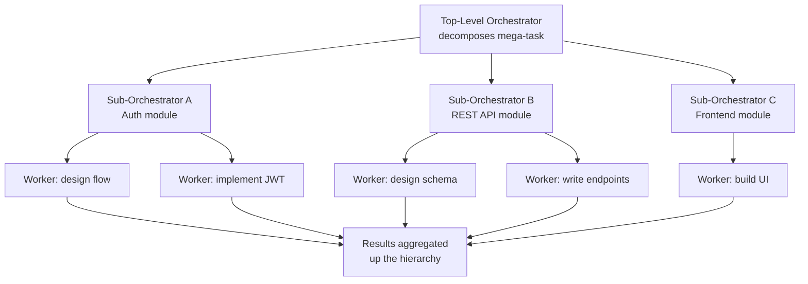
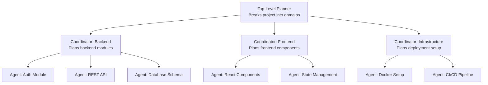

# Hierarchical Multi-Agent

**Level**: 🔴 Advanced
**Reading Time**: 12 minutes

> When a task is too complex for one level of orchestration, you need orchestrators of orchestrators — and the cost of coordination must be justified by the depth of parallelism.

## 🗺️ Quick Overview



*Two-level hierarchy — a top orchestrator delegates to sub-orchestrators, each of which decomposes and parallelizes its own sub-tasks.*

## The Problem

The orchestrator-worker pattern has one planning level. The orchestrator decomposes the task, workers execute. But some tasks have sub-tasks that are themselves complex enough to require their own planning and delegation.

Example: "Build a full web application with authentication, a REST API, a database schema, and a React frontend."

A single orchestrator would produce sub-tasks like:
- Build the authentication module
- Build the REST API
- Design the database
- Build the frontend

But "Build the authentication module" is itself a multi-step task:
- Design the auth flow
- Implement JWT handling
- Write the login/logout endpoints
- Write the middleware
- Write tests

A flat orchestrator-worker gives you one level. A hierarchical system gives you N levels, where each coordinator is itself an orchestrator for its sub-domain.

## Hierarchy Structure



The top-level planner only knows about domains (backend, frontend, infrastructure). It doesn't know about individual files or functions — that's the coordinators' job. Coordinators know about modules. Leaf agents know about implementation details.

## When Hierarchy Is Needed

Use hierarchical multi-agent when:

1. **The task has natural groupings at multiple levels**: Project → Domain → Module → Function
2. **Coordinator context needs protection**: The top-level planner shouldn't be reading individual function implementations — it would overflow its context
3. **Domain coordinators need specialized knowledge**: A frontend coordinator might have different tools and system prompts than a backend coordinator
4. **Parallelism exists at multiple levels**: Backend and frontend run in parallel (L1), and within backend, auth and API can also run in parallel (L2)

## Pseudocode: Recursive Task Delegation

```
// Task structure with hierarchy support
Task = {
  id: string,
  description: string,
  level: int,          // 0 = top, 1 = coordinator, 2 = leaf
  parentId: string,
  subTasks: list[Task],
  assignedAgent: string,
  status: PENDING | IN_PROGRESS | COMPLETE | FAILED,
  result: TaskResult
}

// Recursive execution
function executeTask(task, agents, depth=0):
  if depth > MAX_DEPTH:
    raise HierarchyTooDeep("Exceeded " + MAX_DEPTH + " levels")

  agent = selectAgent(task, agents, depth)

  if task.level == LEAF or isSimpleEnough(task):
    // Leaf agent: execute directly
    result = agent.run(task.description)
    task.status = COMPLETE
    task.result = result
    return result

  // Coordinator agent: decompose into sub-tasks
  decompositionResult = agent.decompose(task.description)
  subTasks = parseSubTasks(decompositionResult)
  task.subTasks = subTasks

  // Recursively execute sub-tasks (in parallel if possible)
  subResults = parallel_map(subTasks, function(subTask):
    return executeTask(subTask, agents, depth + 1)
  )

  // Synthesize results at this level
  synthesis = agent.synthesize(task.description, subResults)
  task.status = COMPLETE
  task.result = synthesis
  return synthesis

// Is the task simple enough for a leaf agent?
function isSimpleEnough(task):
  tokenCount = estimateTokens(task.description)
  return tokenCount < LEAF_THRESHOLD  // e.g., 2000 tokens of context
```

## Level-Specific Agent Design

Each level should have agents tuned for that level of abstraction:

```
// Top-level planner — broad, strategic
TopPlanner = {
  systemPrompt: """
  You are a senior engineering lead. Given a large project,
  break it into major domains (backend, frontend, infra, etc.)
  each of which can be worked on independently.

  Output only domain-level descriptions — do NOT specify
  implementation details. Those are handled by domain coordinators.
  """,
  tools: [projectContextTool, techStackTool]
}

// Domain coordinator — tactical, domain-specific
BackendCoordinator = {
  systemPrompt: """
  You are a backend engineering lead. Given a backend domain task,
  break it into concrete modules (auth, API, database, etc.)
  each of which can be assigned to a single engineer.

  Output module-level descriptions with enough detail for an
  engineer to implement without further clarification.
  """,
  tools: [codebaseTool, apiSpecTool, dbSchemaTool]
}

// Leaf agent — hands-on implementation
AuthImplementationAgent = {
  systemPrompt: """
  You are a backend engineer specializing in authentication.
  You implement authentication modules: JWT, sessions, OAuth, etc.
  Write production-ready code with tests.
  """,
  tools: [codeWriteTool, testRunTool, lintTool]
}
```

## State Flow in Hierarchy

Information flows up and down the hierarchy:

```
// Downward: context flows from parent to child
function buildChildContext(parentTask, childTask, parentResult):
  return {
    projectGoal: parentTask.projectDescription,
    domainGoal: parentTask.description,
    subTaskGoal: childTask.description,
    existingWork: parentResult.completedSubTasks,
    constraints: parentTask.constraints
  }

// Upward: results propagate from child to parent
function rollUpResults(parentTask, childResults):
  summaries = childResults.map(r => {
    subTask: r.task,
    summary: LLM.summarize(r.result, maxTokens=200),
    artifacts: r.artifacts,
    status: r.status
  })
  return CoordinatorResult(
    task: parentTask,
    childSummaries: summaries,
    synthesis: null  // Set after synthesis step
  )
```

## Trade-offs

| Dimension | Flat Orchestrator | Hierarchical |
|-----------|------------------|--------------|
| Coordination overhead | Low | High (N levels of LLM calls) |
| Context pollution | High (orchestrator sees everything) | Low (each level sees its domain) |
| Parallelism | One level | Multiple levels |
| Debugging | Moderate | Hard (trace spans multiple levels) |
| Specialization | Low | High (domain coordinators) |
| Cost | Lower | Higher |

The key question: does the depth of your task's structure justify the coordination overhead?

```
Coordination cost estimate:
  Flat: 1 orchestrator + N workers = N+1 LLM calls
  2-level hierarchy: 1 planner + M coordinators + N workers = M+N+1 calls
  3-level hierarchy: 1 planner + M coordinators + K sub-coordinators + N workers = M+K+N+1 calls

Only add levels if the parallelism or context benefits outweigh this overhead.
```

## Real-World Usage

**Devin (Cognition AI)**: Uses a 2-level hierarchy. A planner agent breaks down the software task; execution agents implement individual steps. The planner never reads the actual code — only summaries.

**SWE-bench approaches**: Top systems on SWE-bench (coding benchmark) use hierarchical agents: a fault localizer (finds the bug location) → a patch writer (writes the fix) → a test verifier (confirms the fix). Three specialized levels.

**Enterprise document analysis**: Large consulting firms use hierarchical agents for due diligence: top planner assigns domains (legal, financial, operational), domain coordinators assign specific document types, leaf agents read individual documents.

## Common Pitfalls

1. **Adding levels for its own sake**: Hierarchies are complex. Add a level only when you have a concrete reason (context, parallelism, specialization).
2. **Context leakage across levels**: If a coordinator reads leaf-level artifacts (individual files, raw code), the coordinator's context fills with implementation noise. Keep coordinators working with summaries only.
3. **No hierarchy-wide error propagation**: If a leaf agent fails, the coordinator should detect this and either retry, fall back, or surface the failure to the planner. Silent failures cause incomplete synthesis.
4. **Circular dependency**: Task A depends on Task B which depends on Task A. Add dependency tracking to detect and prevent this.
5. **Synthesis quality degrades with depth**: Each summarization step loses information. At 3 levels, the top-level synthesis is 3 generations removed from the actual work. Add more context at synthesis steps for deep hierarchies.

## Key Takeaways

- Hierarchical multi-agent adds levels of orchestration for tasks with naturally nested structure
- Each level has a different granularity: planner thinks in domains, coordinators in modules, leaf agents in implementation details
- Context is protected at each level — coordinators don't see implementation; planners don't see module code
- Parallelism compounds at each level, but so does coordination overhead
- Use recursion for task decomposition: if a sub-task is still too complex, it becomes its own orchestration problem
- Add hierarchy levels only when context overflow, parallelism gain, or specialization requirements justify the coordination cost
