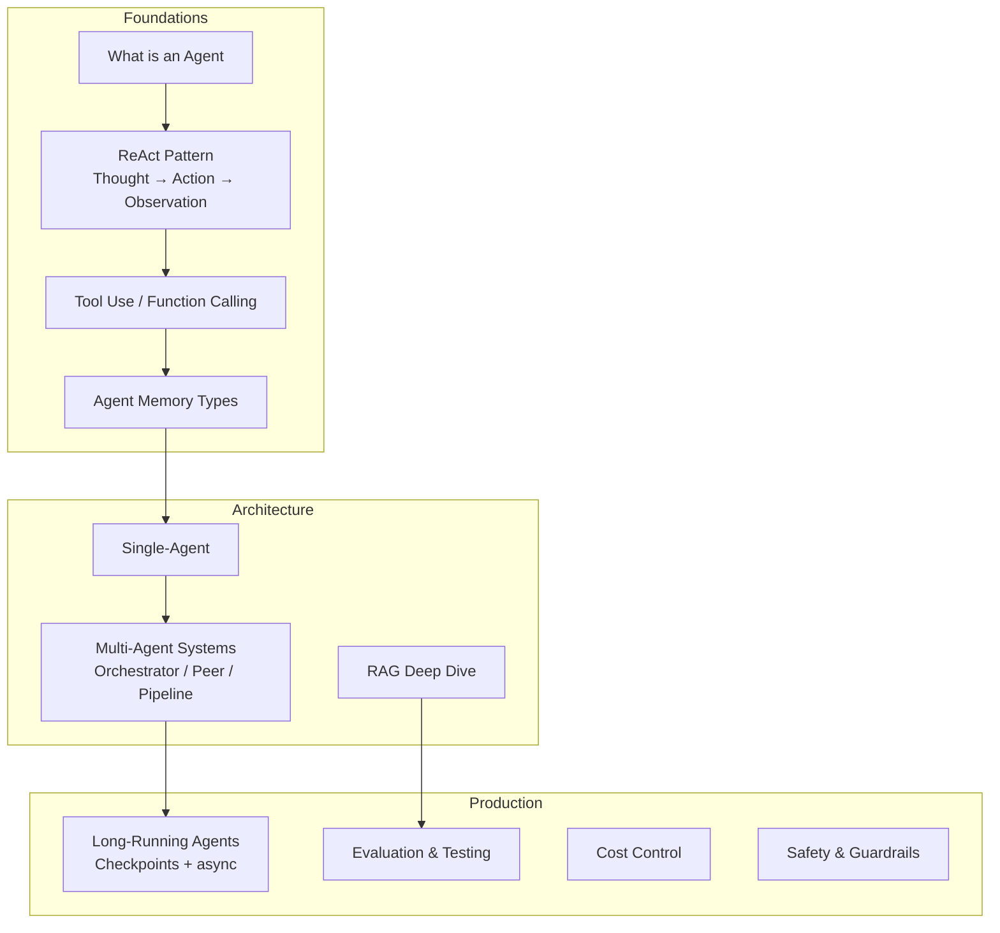

# Agent Concepts

This subsection covers the core concepts you need to understand AI agent systems — from the simplest "what is an agent" all the way to expert-level patterns like the Model Context Protocol and stateful graph-based orchestration.

## Structure

Articles are ordered by level. Start from the top if you're new to agents. Jump in wherever matches your current knowledge.

| # | Article | Level | What You'll Learn |
|---|---------|-------|------------------|
| 1 | [What is an AI Agent?](./what-is-an-agent) | 🟢 Beginner | The sense-plan-act loop, agents vs chatbots |
| 2 | [ReAct Pattern](./react-pattern) | 🟢 Beginner | Thought → Action → Observation cycle |
| 3 | [Tool Use & Function Calling](./tool-use-function-calling) | 🟢 Beginner | How LLMs call external functions |
| 4 | [Agent Memory Types](./agent-memory-types) | 🟡 Intermediate | Four memory layers every agent needs |
| 5 | [Single-Agent Architecture](./single-agent-architecture) | 🟡 Intermediate | Full single-agent loop with state |
| 6 | [Multi-Agent Systems](./multi-agent-systems) | 🟡 Intermediate | Topologies: orchestrator, peer, pipeline |
| 7 | [Orchestrator-Worker Pattern](./orchestrator-worker-pattern) | 🟡 Intermediate | Task delegation and result synthesis |
| 8 | [RAG Deep Dive](./rag-deep-dive) | 🟡 Intermediate | Retrieval-augmented generation pipelines |
| 9 | [Hierarchical Multi-Agent](./hierarchical-multi-agent) | 🔴 Advanced | Multi-level task decomposition |
| 10 | [Agent Communication Protocols](./agent-communication-protocols) | 🔴 Advanced | Shared state vs message passing |
| 11 | [Long-Running Agents](./long-running-agents) | 🔴 Advanced | Checkpoints, async jobs, human-in-loop |
| 12 | [Agent Evaluation & Testing](./agent-evaluation-testing) | 🔴 Advanced | Non-deterministic testing strategies |
| 13 | [Cost Control for Agents](./cost-control-agents) | 🔴 Advanced | Token budgets, caching, model routing |
| 14 | [Agent Observability](./agent-observability) | 🔴 Advanced | Traces, metrics, alerts for agent runs |
| 15 | [Safety & Guardrails](./safety-guardrails) | 🔴 Advanced | Input/output filters, action limits |
| 16 | [Model Context Protocol](./model-context-protocol) | ⚫ Expert | Anthropic's standard for tool interop |
| 17 | [LangGraph Stateful Agents](./langgraph-stateful-agents) | ⚫ Expert | Graph-based workflows with typed state |
| 18 | [Agent Tool Registry](./agent-tool-registry) | ⚫ Expert | Dynamic tool discovery at scale |

## Recommended Reading Order

**New to agents?** Read 1 → 2 → 3 → 4 → 5. That gives you the complete mental model.

**Building a multi-agent system?** Read 5 → 6 → 7 → 8 → 9 → 10.

**Going to production?** Read 11 → 12 → 13 → 14 → 15.

**Building agent infrastructure?** Read 16 → 17 → 18.
