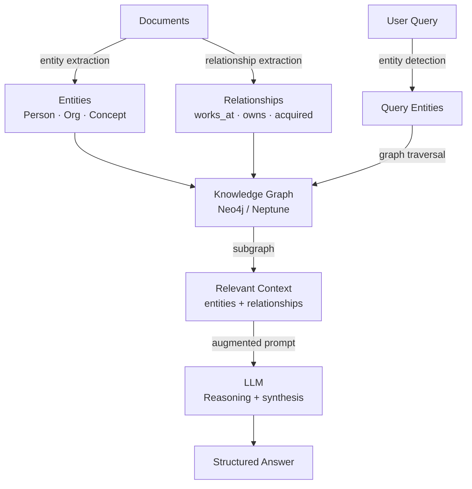
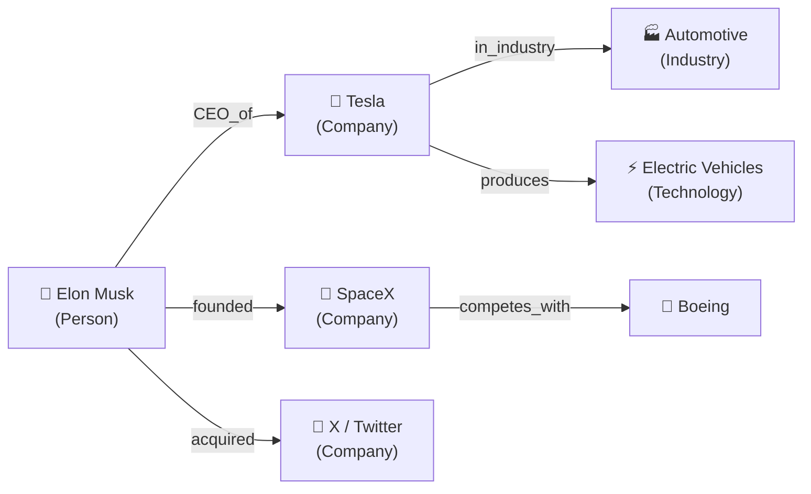
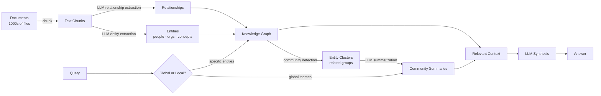

# Knowledge Graphs & GraphRAG — Structured Retrieval with Entity Relationships

**Level**: 🔴 Advanced
**Reading Time**: 14 minutes

> Standard RAG finds semantically similar text chunks. Knowledge graphs find how entities are related across the entire corpus. These are different questions — and the second one is what complex analytical queries actually need.

## 🗺️ Quick Overview



*GraphRAG builds a knowledge graph from documents during ingestion, then traverses it at query time. The result is multi-hop reasoning that vector RAG cannot achieve.*

## The Problem

Standard RAG chunks documents, embeds them, and retrieves the most semantically similar chunks. This works well for questions like "What is the company's return policy?" — retrieve the policy chunk, answer.

It fails on relational queries:

```
"Which executives at FAANG companies previously worked at Amazon?"
→ Vector RAG: retrieves chunks about FAANG or Amazon
→ But no single chunk contains the cross-company connection
→ Answer: incomplete or hallucinated

"What companies has Elon Musk acquired in the past 3 years?"
→ Vector RAG: retrieves chunks mentioning Elon Musk
→ Different acquisitions are in different documents, different chunks
→ No single chunk has the full picture
→ Answer: misses acquisitions in documents that didn't score highest

"What are the downstream effects of company X's acquisition of company Y
 on their shared suppliers?"
→ This requires multi-hop traversal:
   X → acquired → Y → supplier → Z → also_supplies → W
→ Vector RAG cannot traverse relationships at all
→ Knowledge graph can answer this in one traversal
```

Microsoft's GraphRAG paper (2024) measured a **40% improvement on complex multi-hop questions** compared to naive chunked RAG. The improvement was largest on queries requiring synthesis across multiple documents or entities.

## Knowledge Graphs Basics

A knowledge graph represents information as nodes (entities) and edges (relationships):



Example node and edge structure in Neo4j:

```cypher
-- Create nodes
CREATE (elon:Person {name: "Elon Musk", born: 1971})
CREATE (tesla:Company {name: "Tesla", founded: 2003, market_cap_billions: 600})
CREATE (spacex:Company {name: "SpaceX", founded: 2002})

-- Create relationships
CREATE (elon)-[:CEO_OF {since: 2008}]->(tesla)
CREATE (elon)-[:FOUNDED {year: 2002}]->(spacex)
CREATE (elon)-[:ACQUIRED {year: 2022, price_billions: 44}]->(twitter)
```

Query the graph with Cypher:

```cypher
-- "What companies has Elon Musk acquired?"
MATCH (person:Person {name: "Elon Musk"})-[:ACQUIRED]->(company:Company)
RETURN company.name, company.acquisition_year

-- "Who are the CEOs of companies in the EV industry?"
MATCH (person:Person)-[:CEO_OF]->(company:Company)-[:IN_INDUSTRY]->(:Industry {name: "Electric Vehicles"})
RETURN person.name, company.name

-- Multi-hop: "What technologies do companies that compete with Tesla work on?"
MATCH (tesla:Company {name: "Tesla"})<-[:COMPETES_WITH]-(competitor:Company)
      -[:DEVELOPS]->(technology:Technology)
RETURN competitor.name, collect(technology.name) as technologies
```

## GraphRAG Pipeline (Microsoft)

Microsoft's GraphRAG system (open-source, 2024) builds a full KG from documents:



### Phase 1: Knowledge Graph Construction

```python
import anthropic
import json

client = anthropic.Anthropic()

def extract_entities_and_relationships(text_chunk: str) -> dict:
    """Extract structured knowledge from text using LLM."""
    response = client.messages.create(
        model="claude-sonnet-4-5",
        max_tokens=2000,
        system="""You are a knowledge graph builder. Extract entities and relationships
        from text. Be precise and consistent with entity naming.

        Output JSON with this structure:
        {
          "entities": [
            {"name": "string", "type": "Person|Organization|Technology|Location|Concept", "description": "string"}
          ],
          "relationships": [
            {"source": "entity_name", "relation": "RELATION_TYPE", "target": "entity_name",
             "properties": {"year": 2024, "description": "optional context"}}
          ]
        }

        Use UPPERCASE_SNAKE_CASE for relation types.
        Example relations: ACQUIRED, FOUNDED, CEO_OF, WORKS_AT, INVESTED_IN, COMPETES_WITH,
        DEVELOPED_BY, PART_OF, LOCATED_IN, SUCCEEDED_BY""",
        messages=[{
            "role": "user",
            "content": f"Extract entities and relationships from this text:\n\n{text_chunk}"
        }]
    )

    return json.loads(response.content[0].text)

def build_knowledge_graph(documents: list[str]) -> dict:
    """Build a knowledge graph from a list of document chunks."""
    all_entities = {}
    all_relationships = []

    for i, doc in enumerate(documents):
        print(f"Processing chunk {i+1}/{len(documents)}")
        extracted = extract_entities_and_relationships(doc)

        # Deduplicate entities by name
        for entity in extracted.get("entities", []):
            name = entity["name"]
            if name not in all_entities:
                all_entities[name] = entity
            # Merge descriptions if entity already exists

        all_relationships.extend(extracted.get("relationships", []))

    return {
        "entities": list(all_entities.values()),
        "relationships": all_relationships
    }
```

### Phase 2: Loading into Neo4j

```python
from neo4j import GraphDatabase

def load_graph_to_neo4j(graph_data: dict, uri: str, user: str, password: str):
    """Load extracted knowledge graph into Neo4j."""
    driver = GraphDatabase.driver(uri, auth=(user, password))

    with driver.session() as session:
        # Create entity nodes
        for entity in graph_data["entities"]:
            session.run(
                f"""MERGE (e:{entity['type']} {{name: $name}})
                    SET e.description = $description""",
                name=entity["name"],
                description=entity.get("description", "")
            )

        # Create relationships
        for rel in graph_data["relationships"]:
            relation_type = rel["relation"].upper().replace(" ", "_")
            session.run(
                f"""MATCH (source {{name: $source_name}})
                    MATCH (target {{name: $target_name}})
                    MERGE (source)-[r:{relation_type}]->(target)
                    SET r += $properties""",
                source_name=rel["source"],
                target_name=rel["target"],
                properties=rel.get("properties", {})
            )

    driver.close()
```

### Phase 3: Querying the Graph

```python
from langchain_community.graphs import Neo4jGraph
from langchain.chains import GraphCypherQAChain
from langchain_anthropic import ChatAnthropic

def create_graph_rag_chain(uri: str, user: str, password: str):
    """Create a LangChain GraphCypherQAChain for NL → Cypher → Answer."""
    # Connect to Neo4j
    graph = Neo4jGraph(url=uri, username=user, password=password)
    graph.refresh_schema()

    # LLM for Cypher generation and response synthesis
    llm = ChatAnthropic(model="claude-sonnet-4-5")

    # Chain: NL query → Cypher query → graph result → natural language answer
    chain = GraphCypherQAChain.from_llm(
        llm=llm,
        graph=graph,
        verbose=True,
        return_intermediate_steps=True,  # See generated Cypher
        top_k=10,  # Max results to return from graph
        allow_dangerous_requests=True  # Enable write operations if needed
    )

    return chain

# Usage
chain = create_graph_rag_chain("bolt://localhost:7687", "neo4j", "password")

result = chain.invoke({
    "query": "Which companies did executives who previously worked at Google found?"
})

print("Answer:", result["result"])
print("Generated Cypher:", result["intermediate_steps"][0]["query"])
# Generated Cypher might be:
# MATCH (p:Person)-[:WORKED_AT]->(:Organization {name: "Google"})
# MATCH (p)-[:FOUNDED]->(company:Organization)
# RETURN p.name, company.name
```

### LlamaIndex PropertyGraphIndex

```python
from llama_index.core import PropertyGraphIndex, SimpleDirectoryReader
from llama_index.core.indices.property_graph import SchemaLLMPathExtractor
from llama_index.llms.anthropic import Anthropic

# Load documents
documents = SimpleDirectoryReader("./data").load_data()

# Define entity types and relationship types
kg_extractor = SchemaLLMPathExtractor(
    llm=Anthropic(model="claude-sonnet-4-5"),
    possible_entities=["Person", "Organization", "Technology", "Location"],
    possible_relations=["FOUNDED", "ACQUIRED", "CEO_OF", "WORKS_AT", "COMPETES_WITH"],
    strict=False,  # Allow novel relations not in the list
)

# Build index (extracts KG from all documents)
index = PropertyGraphIndex.from_documents(
    documents,
    kg_extractors=[kg_extractor],
    show_progress=True,
)

# Query
query_engine = index.as_query_engine(include_text=True)
response = query_engine.query(
    "What are the relationships between major cloud providers?"
)
print(response)
```

## GraphRAG vs Vector RAG

| Dimension | Vector RAG | GraphRAG |
|-----------|-----------|----------|
| **Best for** | Semantic similarity search | Multi-hop relational queries |
| **Query type** | "Tell me about X" | "How is X connected to Y?" |
| **Knowledge representation** | Text chunks + embeddings | Nodes + edges + embeddings |
| **Multi-document synthesis** | Limited (top-k chunks) | Strong (graph traversal) |
| **Query latency** | 50-200ms | 200-2000ms (graph traversal) |
| **Build time** | Hours (embedding) | Days (entity extraction with LLM) |
| **Build cost** | Low ($10-100 for 10k docs) | High ($100-1000 for 10k docs) |
| **Hallucination risk** | Medium | Lower (explicit relationships) |
| **Update cost** | Low (re-embed changed chunks) | High (re-extract entities/relations) |
| **Global questions** | Poor ("What are the main themes?") | Good (community summaries) |
| **Exact match** | Poor | Good (entity lookup) |
| **Best tools** | LangChain VectorStore, LlamaIndex VectorIndex | LangChain Neo4j, LlamaIndex PropertyGraph, Microsoft GraphRAG |

## Community Detection and Global Queries

GraphRAG excels at global queries by grouping entities into communities:

```python
import networkx as nx
from community import community_louvain

def build_community_summaries(graph_data: dict) -> list[dict]:
    """Cluster entities into communities and summarize each."""
    # Build NetworkX graph
    G = nx.Graph()
    for entity in graph_data["entities"]:
        G.add_node(entity["name"], **entity)
    for rel in graph_data["relationships"]:
        G.add_edge(rel["source"], rel["target"], relation=rel["relation"])

    # Community detection (Louvain algorithm)
    communities = community_louvain.best_partition(G)

    # Group entities by community
    community_groups = {}
    for node, community_id in communities.items():
        if community_id not in community_groups:
            community_groups[community_id] = []
        community_groups[community_id].append(node)

    # Generate summary for each community with LLM
    summaries = []
    for community_id, members in community_groups.items():
        member_info = [e for e in graph_data["entities"] if e["name"] in members]
        relevant_rels = [r for r in graph_data["relationships"]
                        if r["source"] in members or r["target"] in members]

        summary_response = client.messages.create(
            model="claude-haiku-4-5",
            max_tokens=500,
            system="Summarize this cluster of related entities and their relationships in 2-3 sentences.",
            messages=[{"role": "user", "content": f"Entities: {member_info}\nRelationships: {relevant_rels}"}]
        )

        summaries.append({
            "community_id": community_id,
            "members": members,
            "summary": summary_response.content[0].text
        })

    return summaries
```

## When to Use What

| Use Case | Recommended Approach | Why |
|----------|---------------------|-----|
| "Tell me about Topic X" | Vector RAG | Semantic similarity sufficient |
| Product Q&A, documentation search | Vector RAG | Fast, simple, accurate |
| "How are X and Y related?" | GraphRAG | Needs relationship traversal |
| Executive/org chart queries | GraphRAG | Entity relationship queries |
| "What are the main themes in this corpus?" | GraphRAG community summaries | Global synthesis |
| Medical knowledge base | GraphRAG | Disease → drug → interaction = multi-hop |
| "Similar items to X" | Vector RAG | Similarity, not relationships |
| Compliance: "What policies apply to X?" | Hybrid (KG for policies + Vector for context) | Both needed |

## Common Mistakes

1. **Building a knowledge graph when vector RAG would suffice**: KG construction costs 10-100x more than vector embedding. If your queries are semantic similarity ("find relevant documentation"), not relational ("find all connected entities"), vector RAG is cheaper and often better.

2. **Poor entity normalization**: "Elon Musk", "E. Musk", "Musk" are the same entity. Without normalization during extraction, you get three disconnected nodes. Use an entity resolution step with fuzzy matching or LLM-based deduplication.

3. **No schema definition for relationship types**: Letting the LLM freely invent relationship names creates inconsistent graphs ("works_at", "employed_by", "is_employee_of", "has_job_at"). Define a bounded schema of 20-50 relationship types before extraction.

4. **Not handling graph updates**: When new documents arrive, you need to extract entities/relations and merge them into the existing graph, resolving conflicts. This is complex — most teams underestimate the operational cost of graph maintenance.

5. **Running full graph traversal for simple queries**: Multi-hop traversal across a graph with 1M nodes is expensive. Add a routing layer: classify queries as "local" (specific entity) vs "global" (themes/summary) and use different retrieval strategies.

## Key Takeaways

- Knowledge graphs represent entities as nodes and relationships as edges — enabling multi-hop queries that vector RAG cannot answer
- Microsoft GraphRAG shows 40% improvement on complex multi-hop questions vs naive chunked RAG
- GraphRAG pipeline: extract entities + relationships (LLM) → store in graph DB (Neo4j) → detect communities → summarize communities → serve queries via graph traversal + LLM synthesis
- Vector RAG cost: $10-100 for 10k documents; GraphRAG cost: $100-1000 — use KG only when relational queries dominate
- LangChain GraphCypherQAChain automates NL → Cypher → graph result → NL answer — working in <50 lines of code
- Entity normalization is the hardest part: "Elon Musk" vs "E. Musk" vs "Musk" must resolve to the same node or your graph is broken
- Hybrid approach for production: use vector search for semantic similarity + graph traversal for relationship queries, with a router deciding which path

## References

> 📖 [From Local to Global: A Graph RAG Approach to Query-Focused Summarization](https://arxiv.org/abs/2404.16130) — Microsoft GraphRAG paper with 40% improvement data

> 📚 [Microsoft GraphRAG Open Source](https://github.com/microsoft/graphrag) — Full implementation of the GraphRAG pipeline

> 📚 [LangChain Neo4j Graph Integration](https://python.langchain.com/docs/integrations/graphs/neo4j_cypher/) — GraphCypherQAChain documentation

> 📚 [LlamaIndex PropertyGraphIndex](https://docs.llamaindex.ai/en/stable/examples/property_graph/property_graph_basic/) — LlamaIndex KG extraction and querying

> 📖 [Neo4j Graph Data Science Library](https://neo4j.com/docs/graph-data-science/) — Community detection and graph algorithms

> 📺 [Building Knowledge Graphs with LLMs](https://www.youtube.com/watch?v=bRj3fNkcFq0) — Practical tutorial on LLM-powered KG construction
