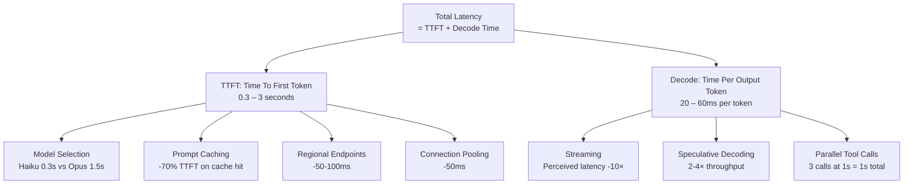
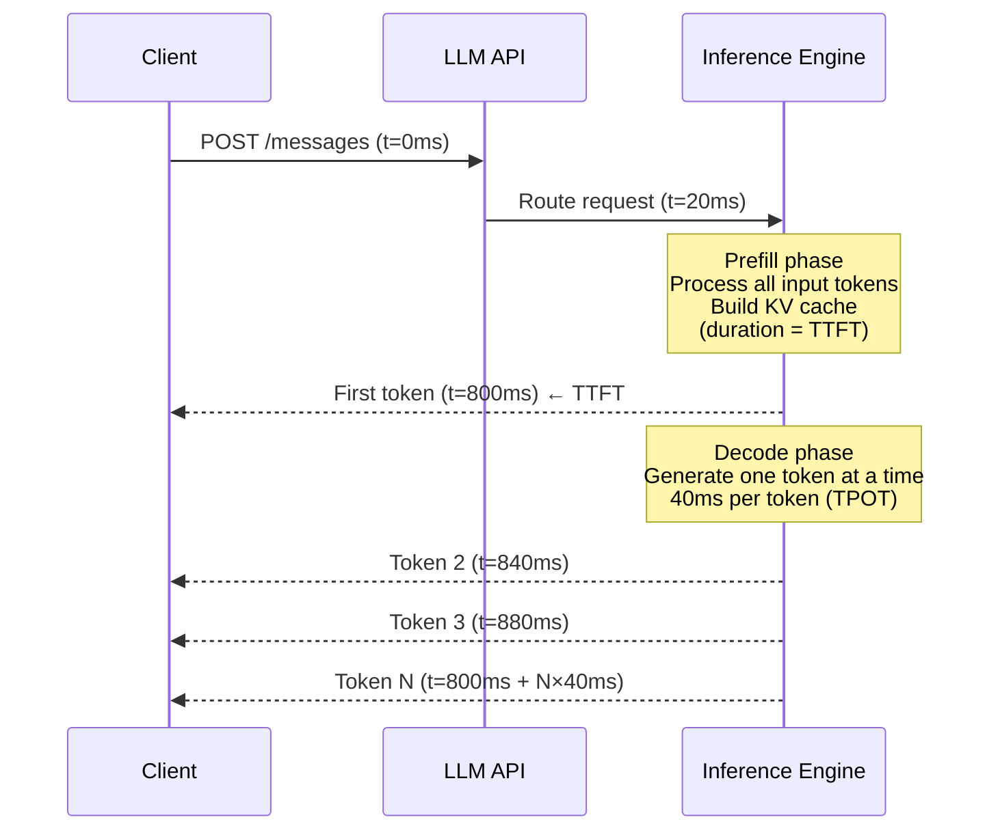
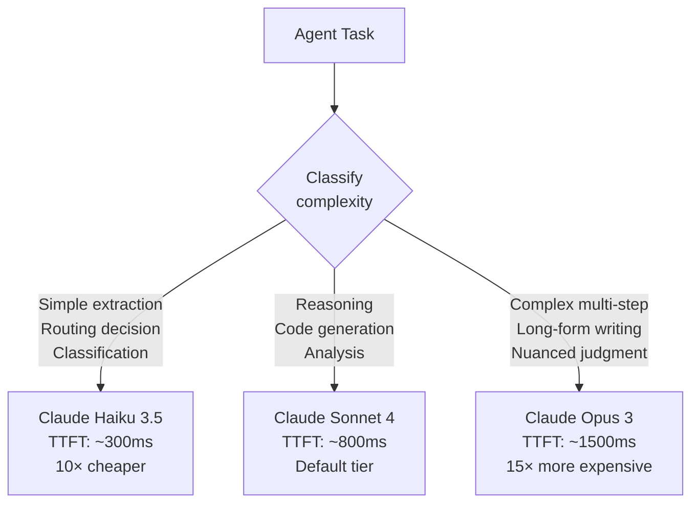
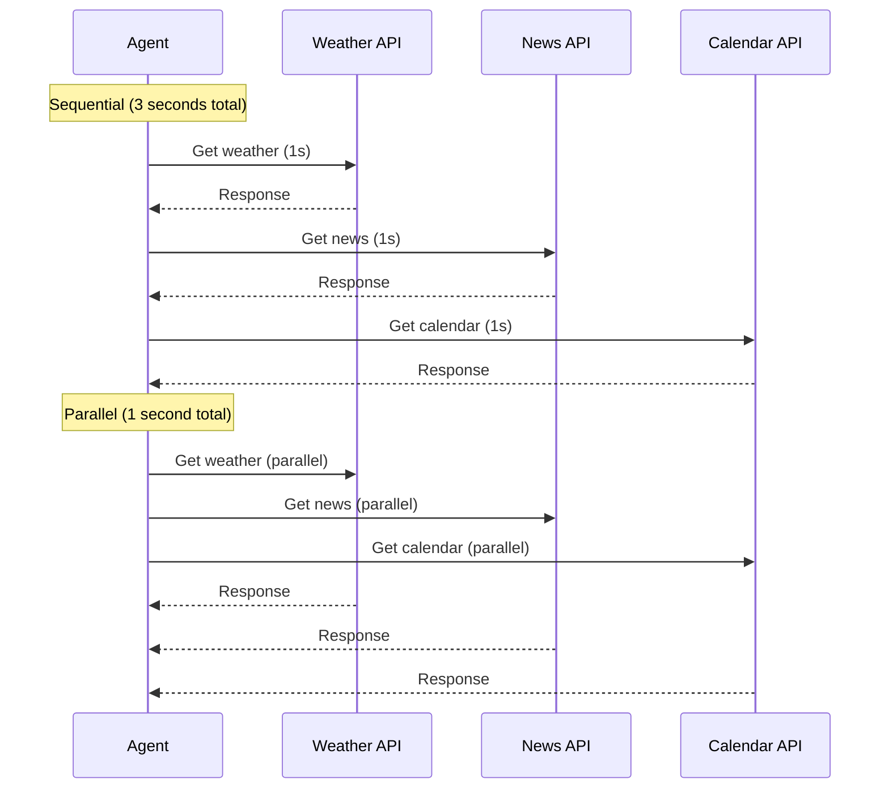

# LLM Latency Optimization — From 10 Seconds to Sub-Second

**Level**: 🔴 Advanced
**Reading Time**: 15 minutes

> Users tolerate 200ms for a web search. They tolerate 2 seconds for a complex AI query. They abandon after 10 seconds. The difference between a successful AI product and an abandoned one is often latency engineering.

## 🗺️ Quick Overview



*Optimize TTFT first (model, caching, routing), then decode time (streaming, speculative decoding).*

## The Problem

LLM latency is fundamentally different from database or API latency. You can't parallelize token generation — each token depends on all previous tokens. A 500-token response with 40ms/token takes 20 seconds to complete. No amount of horizontal scaling changes that math.

This is why most LLM products feel slow. Teams optimize the wrong things (adding more GPUs when they need streaming), measure the wrong metric (total completion time instead of TTFT), and ignore the techniques that actually move the needle.

Understanding the latency anatomy — TTFT vs decode — tells you which optimizations apply to your bottleneck.

## Latency Anatomy: TTFT vs TPOT



**TTFT (Time To First Token):** Time from request sent to first token received. Dominated by the prefill phase — processing all input tokens to build the KV cache. Scales with input length.

**TPOT (Time Per Output Token):** Time between consecutive tokens during generation. Dominated by GPU memory bandwidth and batch size. Typically 20-60ms for hosted models.

**Real numbers (2025 production measurements):**
| Model | TTFT P50 | TTFT P99 | TPOT |
|-------|----------|----------|------|
| Claude Haiku 3.5 | 300ms | 800ms | 25ms/token |
| Claude Sonnet 4 | 800ms | 2,000ms | 40ms/token |
| Claude Opus 3 | 1,500ms | 4,000ms | 55ms/token |
| GPT-4o-mini | 250ms | 700ms | 22ms/token |
| GPT-4o | 600ms | 1,800ms | 38ms/token |
| Llama 3.1 8B (vLLM A10G) | 200ms | 500ms | 20ms/token |
| Llama 3.1 70B (vLLM A100) | 400ms | 1,000ms | 35ms/token |

**Total latency = TTFT + (output_tokens × TPOT)**
A 200-token response with Claude Sonnet: 800ms + (200 × 40ms) = 800ms + 8,000ms = 8.8 seconds to completion.

This is why streaming is the most impactful optimization — it doesn't reduce total time, but users see content at 800ms instead of 8.8 seconds.

## Optimization 1: Streaming (Biggest UX Win)

Streaming delivers tokens as they're generated. Without streaming, users stare at a spinner for 8.8 seconds. With streaming, they're reading content at 800ms.

Perceived latency drops by 10× with streaming, even though total completion time is identical.

```python
import anthropic

client = anthropic.Anthropic()

# WITHOUT streaming — user waits 8.8 seconds for full response
response = client.messages.create(
    model="claude-sonnet-4-5",
    max_tokens=200,
    messages=[{"role": "user", "content": "Explain distributed systems"}]
)
print(response.content[0].text)  # Appears all at once after 8.8s

# WITH streaming — user starts reading at 800ms
with client.messages.stream(
    model="claude-sonnet-4-5",
    max_tokens=200,
    messages=[{"role": "user", "content": "Explain distributed systems"}]
) as stream:
    for text in stream.text_stream:
        print(text, end="", flush=True)  # Each token appears immediately
```

**Rule of thumb:** Always stream in user-facing applications. Only skip streaming for batch processing, evaluation pipelines, or programmatic output parsing.

See the streaming-sse article for SSE implementation details in web applications.

## Optimization 2: Model Selection (2-5× Latency Difference)

Not every task needs the most capable model. Haiku handles 80% of tasks that teams reflexively send to Sonnet.



```python
def select_model(task_type: str, context_length: int) -> str:
    """Route to cheapest model that can handle the task."""

    # Simple tasks — use Haiku
    if task_type in ["classification", "extraction", "tool_selection", "routing"]:
        return "claude-haiku-3-5"

    # Long context tasks — Sonnet handles 200K context
    if context_length > 100_000:
        return "claude-sonnet-4-5"

    # Complex reasoning — Sonnet default
    if task_type in ["reasoning", "code_generation", "analysis"]:
        return "claude-sonnet-4-5"

    # Nuanced judgment, long-form content
    if task_type in ["creative_writing", "complex_judgment"]:
        return "claude-opus-4"

    return "claude-sonnet-4-5"  # Safe default
```

**P50 latency difference for a simple extraction task:**
- Claude Opus 3: 1,500ms TTFT → total 6s for 100-token output
- Claude Haiku 3.5: 300ms TTFT → total 2.8s for 100-token output
- **5.2 seconds saved, 10× cheaper, same accuracy for extraction**

## Optimization 3: Parallel Tool Calls (N× Speedup)

Sequential tool calls are the silent killer of agent latency. Most teams make tool calls one at a time when they could be made in parallel.



Claude 3.5 Sonnet and GPT-4o support parallel tool calls natively:

```python
import anthropic
import asyncio

client = anthropic.Anthropic()

# Define tools
tools = [
    {
        "name": "get_weather",
        "description": "Get current weather for a city",
        "input_schema": {
            "type": "object",
            "properties": {"city": {"type": "string"}},
            "required": ["city"]
        }
    },
    {
        "name": "get_news",
        "description": "Get top news headlines",
        "input_schema": {
            "type": "object",
            "properties": {"topic": {"type": "string"}},
            "required": ["topic"]
        }
    }
]

response = client.messages.create(
    model="claude-sonnet-4-5",
    max_tokens=1024,
    tools=tools,
    messages=[{
        "role": "user",
        "content": "What's the weather in Tokyo and what's happening in tech news?"
    }]
)

# Claude returns BOTH tool calls in one response
tool_calls = [block for block in response.content if block.type == "tool_use"]
print(f"Tool calls: {[tc.name for tc in tool_calls]}")
# ['get_weather', 'get_news'] — both in one LLM call

# Execute ALL tool calls in parallel
async def execute_tools_parallel(tool_calls):
    tasks = [execute_tool(tc.name, tc.input) for tc in tool_calls]
    results = await asyncio.gather(*tasks)
    return results

# Send all results back in one message
tool_results = asyncio.run(execute_tools_parallel(tool_calls))

# Build tool result messages
tool_result_messages = [
    {"type": "tool_result", "tool_use_id": tc.id, "content": str(result)}
    for tc, result in zip(tool_calls, tool_results)
]
```

**Latency math:**
- 3 sequential 1s tools: 3,000ms
- 3 parallel 1s tools: 1,000ms
- **2,000ms saved (67% reduction)**

For agents with 5-10 tool calls per step, parallel execution is often the largest single optimization available.

## Optimization 4: Speculative Decoding (2-4× Throughput)

Speculative decoding uses a small model (drafter) to generate candidate tokens quickly, then a large model (verifier) to check them in parallel.

```
Normal decoding (70B model):
  Token 1: 40ms
  Token 2: 40ms
  Token 3: 40ms
  100 tokens: 4,000ms total

Speculative decoding (8B drafter + 70B verifier):
  Draft 5 tokens with 8B: 25ms (5× faster than 70B)
  Verify all 5 with 70B: 45ms (parallel check)
  Acceptance rate: ~80% of draft tokens accepted
  Effective: 4 tokens accepted per 70ms = ~17ms/token

100 tokens: ~1,700ms total (2.4× speedup)
```

```python
from vllm import LLM, SamplingParams

# vLLM speculative decoding
llm = LLM(
    model="meta-llama/Meta-Llama-3.1-70B-Instruct",        # Target (verifier)
    speculative_model="meta-llama/Meta-Llama-3.1-8B-Instruct",  # Draft model
    num_speculative_tokens=5,      # Generate 5 draft tokens per step
    speculative_draft_tensor_parallel_size=1,
    tensor_parallel_size=2         # 70B needs 2× A100 80GB
)

sampling_params = SamplingParams(temperature=0.7, max_tokens=200)
outputs = llm.generate(["Explain the CAP theorem in detail:"], sampling_params)
print(outputs[0].outputs[0].text)
```

**Requirements:**
- Draft and target models must use the same tokenizer
- Draft model must be significantly smaller (8B drafting for 70B, not 34B for 70B)
- Works best on repetitive or predictable text — code, structured output, formal writing

## Optimization 5: Prompt Caching (-70% TTFT on Cache Hit)

When input tokens are cached, the prefill phase is skipped — dramatically reducing TTFT.

Without cache: 10,000 token system prompt + 500 token query → TTFT includes prefilling 10,500 tokens
With cache hit: 10,000 tokens already computed → TTFT includes prefilling only 500 new tokens

**Measured TTFT reduction (Claude Sonnet, 10K cached prefix):**
- Cold (no cache): 2,100ms TTFT
- Warm (cache hit): 420ms TTFT
- **Reduction: 80% TTFT improvement on cache hit**

See the LLM Caching article for prompt caching implementation details.

## Optimization 6: Connection Pooling & Regional Endpoints

These are the "low-hanging fruit" optimizations — easy to implement, consistent 50-150ms savings.

```python
import anthropic
import httpx

# Connection pooling — reuse HTTP connections instead of TCP handshake per request
# Default httpx client already pools, but configure limits for high-concurrency
transport = httpx.HTTPTransport(
    limits=httpx.Limits(
        max_connections=100,
        max_keepalive_connections=20,
        keepalive_expiry=30
    )
)
http_client = httpx.Client(transport=transport)
client = anthropic.Anthropic(http_client=http_client)

# Regional endpoints — use the closest datacenter
# Anthropic uses us-east-1 and eu-west-1
# Route users to closest endpoint based on their location
```

**Regional routing impact:**
| User location | US API endpoint | EU API endpoint | Savings |
|--------------|----------------|----------------|---------|
| EU user → EU endpoint | +80ms (crossing Atlantic) | Baseline | 80ms |
| US user → US endpoint | Baseline | +80ms | 80ms |
| APAC user → closest | Pick lowest-latency | — | 50-150ms |

For a product with global users, regional routing reduces P99 latency more than P50 — it eliminates the tail latency caused by cross-continental requests.

## End-to-End Latency Budget

Real production system: AI assistant for customer support

```
User submits question → response streaming begins

Without optimization:
  1. HTTP overhead:         50ms
  2. Semantic cache miss:   15ms
  3. RAG retrieval:        200ms
  4. LLM prefill (TTFT):  2000ms  ← 10K token prompt
  5. First token received: 2265ms
  6. Stream 200 tokens:   8000ms  ← 40ms/token
  7. Final token:        10265ms

With optimization:
  1. HTTP (connection pool): 10ms
  2. Semantic cache miss:    10ms (vector DB)
  3. RAG retrieval parallel: 80ms
  4. Prompt caching hit:    400ms  ← 80% TTFT reduction
  5. First token received:   500ms  ← perceived latency
  6. Stream 200 tokens:     8000ms  ← same decode time
  7. Final token:           8500ms

Perceived latency: 2265ms → 500ms (4.5× improvement)
Total latency: 10265ms → 8500ms (17% faster end-to-end)
```

The key insight: users experience perceived latency (TTFT), not total latency. Optimize TTFT first.

## Latency Optimization Priority Order

| Optimization | TTFT Impact | Throughput Impact | Effort |
|-------------|-------------|-------------------|--------|
| Streaming | Perceived 10× | None | 1 hour |
| Model routing | 2-5× | 2-5× | 1 day |
| Parallel tool calls | None | 2-10× for tool-heavy agents | 1 day |
| Prompt caching | 5-10× | 2-3× | 2 hours |
| Regional endpoints | 10-20% | None | 1 day |
| Connection pooling | 5-10% | None | 2 hours |
| Speculative decoding | None | 2-4× | 3 days (self-hosted only) |

## Common Mistakes

1. **Optimizing decode speed instead of TTFT**. Root cause: total latency is measurable but TTFT is what users feel. Teams add more GPUs to increase throughput (tokens/sec) while users still wait 2-3s for the first character. Fix: instrument TTFT separately from total latency. Build dashboards that show TTFT at P50/P95/P99.

2. **Making tool calls sequentially in an agent loop**. Root cause: the simplest implementation calls one tool, gets the result, then calls the next. This is correct for dependent calls but wrong for independent ones. Fix: analyze each step's tool calls for dependencies. Independent tools (get_weather AND get_news) must be parallelized.

3. **Streaming from server but buffering on the client**. Root cause: implementing SSE on the server but collecting all chunks before rendering on the frontend. Fix: render each chunk to the DOM as it arrives. Use React streaming APIs or `display: inline` text updates.

4. **Using the same model for routing decisions and complex reasoning**. Root cause: simpler to use one model everywhere. A routing decision ("should I search the web or use the database?") sent to Claude Sonnet costs 2-3× more and takes 2× longer than Haiku. Fix: implement a two-tier routing system: Haiku classifies the task type, Sonnet/Opus executes.

5. **Not measuring TTFT in production**. Root cause: standard observability tools measure request duration, not TTFT. Fix: instrument TTFT explicitly by recording the timestamp when the first token arrives in the response stream, before the response completes.

## Key Takeaways

- TTFT (Time To First Token) determines perceived latency — optimize TTFT first, total completion time second
- Streaming is the highest-ROI optimization: perceived latency drops from 10s to 0.8s with zero model changes — implement it in all user-facing applications
- Parallel tool calls eliminate the most common agent latency trap: 3 sequential 1s tools → 3s; 3 parallel → 1s (67% reduction)
- Claude Haiku's 300ms TTFT vs Sonnet's 800ms is a 2.7× difference for simple tasks — model routing by complexity cuts latency and cost simultaneously
- Prompt caching delivers 70-80% TTFT reduction on cache hits — for apps with stable system prompts, this is often larger than any other single optimization
- Speculative decoding (vLLM, self-hosted only) adds 2-4× throughput improvement on top of all other optimizations — worth 3 days of implementation effort for high-volume self-hosted deployments

## References

> 📖 [Anthropic Streaming Guide](https://docs.anthropic.com/en/api/messages-streaming) — Server-sent events, streaming SDK methods, error handling in streams

> 📖 [Speculative Decoding: Exploiting Speculative Execution for Accelerating Sequential Generation](https://arxiv.org/abs/2302.01318) — Original speculative decoding paper, acceptance rate analysis

> 📚 [vLLM Speculative Decoding Documentation](https://docs.vllm.ai/en/latest/serving/spec_decode.html) — Configuration guide, supported model pairs, performance benchmarks

> 📖 [Latency Numbers Every LLM Developer Should Know](https://vercel.com/blog/ai-latency) — Vercel's production measurements, TTFT benchmarks across providers

> 📚 [Anthropic Tool Use with Parallel Calls](https://docs.anthropic.com/en/docs/build-with-claude/tool-use) — Parallel tool call API, response format, batching tool results
