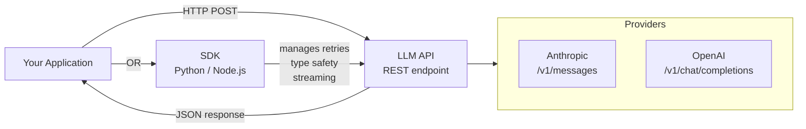
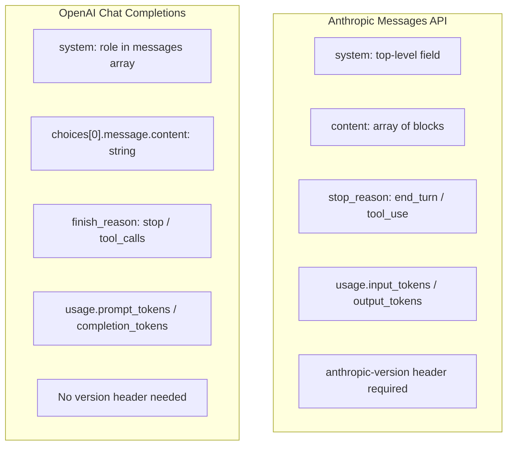

# LLM API Guide — Anthropic Messages API, OpenAI Chat Completions & SDK Patterns

**Level**: 🟢 Beginner
**Reading Time**: 14 minutes

> The LLM API is your lowest-level interface to intelligence. Before picking a framework, understand the raw HTTP surface — every abstraction eventually leaks down to these calls.

## 🗺️ Quick Overview



*REST gives you maximum control and portability; SDKs give you type safety, automatic retries, and streaming helpers. Most production code uses SDKs — but you need to understand REST to debug them.*

## The Problem

Developers new to LLM APIs often copy-paste example code without understanding the underlying HTTP structure. When things break — wrong response format, unexpected costs, auth errors — they have no mental model to debug against. This article gives you the foundational knowledge to use both Anthropic and OpenAI APIs correctly, understand their differences, and build reliable production integrations.

---

## REST API vs SDK — When to Use Each

Both providers offer raw REST endpoints and official SDKs:

| Approach | When to use | Trade-offs |
|----------|-------------|------------|
| **REST API (raw HTTP)** | Polyglot environments (Go, Rust, PHP), testing with curl, strict dependency audits | Manual retry logic, no type safety, more boilerplate |
| **Official SDK (Python/Node)** | Production applications, type-safe codebases, need streaming helpers | SDK dependency, version pinning required |
| **Third-party SDK (LangChain, etc.)** | Rapid prototyping, want provider-agnostic code | Hidden abstractions, version churn, harder to debug |

**Rule of thumb**: Use the official SDK for production. Use raw REST to understand what the SDK is doing under the hood, or when you're working in a language without an official SDK.

---

## Anthropic Messages API

### Endpoint and Headers

```
POST https://api.anthropic.com/v1/messages
Content-Type: application/json
x-api-key: YOUR_API_KEY
anthropic-version: 2023-06-01
```

The `anthropic-version` header is required. Always pin it to the version you tested against — new versions can change behavior.

### Request Structure

```json
{
  "model": "claude-sonnet-4-5",
  "max_tokens": 1024,
  "system": "You are a helpful assistant that answers concisely.",
  "messages": [
    {
      "role": "user",
      "content": "What is the capital of France?"
    },
    {
      "role": "assistant",
      "content": "Paris."
    },
    {
      "role": "user",
      "content": "What is its population?"
    }
  ]
}
```

Key fields:
- `model` — Required. Model identifier (e.g., `claude-sonnet-4-5`, `claude-opus-4-5`)
- `max_tokens` — Required. Hard limit on output tokens. No default — you must set this.
- `system` — Optional. Top-level system prompt (not a message in the array)
- `messages` — Required. Alternating `user`/`assistant` turns

### Response Structure

```json
{
  "id": "msg_01XFDUDYJgAACzvnptvVoYEL",
  "type": "message",
  "role": "assistant",
  "content": [
    {
      "type": "text",
      "text": "The population of Paris proper is about 2.1 million..."
    }
  ],
  "model": "claude-sonnet-4-5",
  "stop_reason": "end_turn",
  "usage": {
    "input_tokens": 42,
    "output_tokens": 31
  }
}
```

Key fields:
- `content` — Array (may contain `text` blocks and `tool_use` blocks)
- `stop_reason` — `end_turn` (finished naturally), `max_tokens` (hit limit), `tool_use` (waiting for tool result)
- `usage.input_tokens` / `usage.output_tokens` — Your billing basis

### Python SDK Example

```python
import anthropic

client = anthropic.Anthropic(api_key="YOUR_API_KEY")

response = client.messages.create(
    model="claude-sonnet-4-5",
    max_tokens=1024,
    system="You are a helpful assistant.",
    messages=[
        {"role": "user", "content": "What is the capital of France?"}
    ]
)

# Extract text from response
text = response.content[0].text
print(text)

# Check token usage
print(f"Input tokens: {response.usage.input_tokens}")
print(f"Output tokens: {response.usage.output_tokens}")

# Cost calculation (claude-sonnet-4-5 pricing as of 2025):
# Input: $3.00 per 1M tokens = $0.000003 per token
# Output: $15.00 per 1M tokens = $0.000015 per token
cost = (response.usage.input_tokens * 0.000003) + (response.usage.output_tokens * 0.000015)
print(f"Estimated cost: ${cost:.6f}")
```

### Node.js SDK Example

```typescript
import Anthropic from "@anthropic-ai/sdk";

const client = new Anthropic({ apiKey: process.env.ANTHROPIC_API_KEY });

const response = await client.messages.create({
  model: "claude-sonnet-4-5",
  max_tokens: 1024,
  system: "You are a helpful assistant.",
  messages: [{ role: "user", content: "What is the capital of France?" }],
});

const text = response.content[0].type === "text" ? response.content[0].text : "";
console.log(text);
console.log(`Tokens used: ${response.usage.input_tokens} in / ${response.usage.output_tokens} out`);
```

---

## OpenAI Chat Completions API

### Endpoint and Headers

```
POST https://api.openai.com/v1/chat/completions
Content-Type: application/json
Authorization: Bearer YOUR_API_KEY
```

### Request Structure

```json
{
  "model": "gpt-4o",
  "max_tokens": 1024,
  "temperature": 0.7,
  "messages": [
    {
      "role": "system",
      "content": "You are a helpful assistant that answers concisely."
    },
    {
      "role": "user",
      "content": "What is the capital of France?"
    },
    {
      "role": "assistant",
      "content": "Paris."
    },
    {
      "role": "user",
      "content": "What is its population?"
    }
  ]
}
```

Key difference from Anthropic: the system prompt is a **message with `role: "system"`**, not a top-level field.

### Response Structure

```json
{
  "id": "chatcmpl-abc123",
  "object": "chat.completion",
  "model": "gpt-4o-2024-08-06",
  "choices": [
    {
      "index": 0,
      "message": {
        "role": "assistant",
        "content": "The population of Paris proper is about 2.1 million..."
      },
      "finish_reason": "stop"
    }
  ],
  "usage": {
    "prompt_tokens": 42,
    "completion_tokens": 31,
    "total_tokens": 73
  }
}
```

Access the text via `choices[0].message.content` (not `content[0].text` like Anthropic).

### Python SDK Example

```python
from openai import OpenAI

client = OpenAI(api_key="YOUR_API_KEY")

response = client.chat.completions.create(
    model="gpt-4o",
    max_tokens=1024,
    temperature=0.7,
    messages=[
        {"role": "system", "content": "You are a helpful assistant."},
        {"role": "user", "content": "What is the capital of France?"}
    ]
)

# Extract text — note the different path vs Anthropic
text = response.choices[0].message.content
print(text)

# Token usage
print(f"Prompt tokens: {response.usage.prompt_tokens}")
print(f"Completion tokens: {response.usage.completion_tokens}")

# Cost calculation (gpt-4o pricing as of 2025):
# Input: $2.50 per 1M tokens
# Output: $10.00 per 1M tokens
cost = (response.usage.prompt_tokens * 0.0000025) + (response.usage.completion_tokens * 0.00001)
print(f"Estimated cost: ${cost:.6f}")
```

### Node.js SDK Example

```typescript
import OpenAI from "openai";

const client = new OpenAI({ apiKey: process.env.OPENAI_API_KEY });

const response = await client.chat.completions.create({
  model: "gpt-4o",
  max_tokens: 1024,
  messages: [
    { role: "system", content: "You are a helpful assistant." },
    { role: "user", content: "What is the capital of France?" },
  ],
});

const text = response.choices[0].message.content ?? "";
console.log(text);
```

---

## Key Differences: Anthropic vs OpenAI



Side-by-side comparison:

| Feature | Anthropic | OpenAI |
|---------|-----------|--------|
| System prompt | Top-level `system` field | `{ role: "system" }` message |
| Response text path | `content[0].text` | `choices[0].message.content` |
| Stop signal | `stop_reason: "end_turn"` | `finish_reason: "stop"` |
| Token fields | `input_tokens`, `output_tokens` | `prompt_tokens`, `completion_tokens` |
| Tool calling | `tool_use` content blocks | `tool_calls` array in message |
| Version pinning | Required (`anthropic-version`) | Optional (via model name) |
| Auth header | `x-api-key: KEY` | `Authorization: Bearer KEY` |

---

## Error Handling with Retry Logic

Both APIs return structured errors. Handle them defensively:

```python
import anthropic
import time
import random

def call_with_retry(client, max_retries=3, **kwargs):
    """
    Calls the Anthropic API with exponential backoff.
    Retries on: 429 (rate limit), 500/529 (server errors), timeouts.
    Does NOT retry: 401 (auth), 400 (bad request), 404 (not found).
    """
    retryable_status_codes = {429, 500, 502, 503, 529}

    for attempt in range(max_retries):
        try:
            return client.messages.create(**kwargs)

        except anthropic.RateLimitError as e:
            # 429 — check retry-after header if available
            wait = (2 ** attempt) + random.uniform(0, 1)
            print(f"Rate limited. Waiting {wait:.1f}s before retry {attempt + 1}/{max_retries}")
            time.sleep(wait)

        except anthropic.APIStatusError as e:
            if e.status_code not in retryable_status_codes:
                raise  # Don't retry auth errors or bad requests

            wait = (2 ** attempt) + random.uniform(0, 1)
            print(f"API error {e.status_code}. Waiting {wait:.1f}s before retry {attempt + 1}/{max_retries}")
            time.sleep(wait)

        except anthropic.APITimeoutError:
            wait = (2 ** attempt) + random.uniform(0, 1)
            print(f"Timeout. Waiting {wait:.1f}s before retry {attempt + 1}/{max_retries}")
            time.sleep(wait)

    raise RuntimeError(f"Failed after {max_retries} retries")


# Usage
client = anthropic.Anthropic()
response = call_with_retry(
    client,
    max_retries=3,
    model="claude-sonnet-4-5",
    max_tokens=1024,
    messages=[{"role": "user", "content": "Hello"}]
)
```

Error code reference:

| Status Code | Meaning | Retry? |
|-------------|---------|--------|
| 400 | Bad request (invalid params) | No — fix the request |
| 401 | Authentication failed | No — fix the API key |
| 403 | Permission denied | No — check account access |
| 404 | Model not found | No — check model name |
| 429 | Rate limit exceeded | Yes — exponential backoff |
| 500 | Internal server error | Yes — retry with backoff |
| 529 | API overloaded (Anthropic) | Yes — retry with backoff |

---

## SDK Advantages Over Raw REST

Why use the SDK instead of `requests` or `fetch`?

1. **Automatic retries**: The official SDKs retry on 429 and 500 errors with backoff by default
2. **Type safety**: IDEs autocomplete field names; TypeScript catches wrong response field access at compile time
3. **Streaming helpers**: `.stream()` method handles SSE parsing for you (see the Streaming article)
4. **Connection pooling**: Reuses HTTP connections across calls — important for high-throughput workloads
5. **Version compatibility**: SDK versions are tested against specific API versions

```python
# SDK handles retries automatically
client = anthropic.Anthropic(
    max_retries=3,  # Default is 2
    timeout=60.0,   # Seconds
)
```

---

## API Versioning

Anthropic uses an explicit version header:
```
anthropic-version: 2023-06-01
```

OpenAI bakes version into model names (e.g., `gpt-4o-2024-08-06`). Pinning a dated model name gives you stable behavior even after OpenAI releases new versions.

**Production rule**: Always pin your API version and model name. "Latest" aliases (`gpt-4o-latest`) can silently change behavior on you.

---

## Common Mistakes

1. **Not setting `max_tokens` on Anthropic calls**: It's required and has no default. Forgetting it causes a `400 Bad Request`. Always set it — start with 1024 and tune from there.

2. **Putting the system prompt in the messages array for Anthropic**: Anthropic's `system` is a top-level field, not a message. A `{"role": "system", ...}` message in Anthropic's API returns a validation error.

3. **Not handling `stop_reason: "max_tokens"`**: If the model hits `max_tokens`, it truncates mid-sentence. Always check `stop_reason` (Anthropic) or `finish_reason` (OpenAI) and handle truncation — either increase the limit or inform the user.

4. **Hardcoding API keys**: Use environment variables. The SDKs read `ANTHROPIC_API_KEY` and `OPENAI_API_KEY` automatically if you don't pass a key explicitly.

5. **Ignoring token counts in the response**: Every response tells you exactly how many tokens you used. Log this from day one — unexpectedly large token counts reveal context bloat issues before they become expensive.

6. **Using temperature > 0 for structured output**: When you need the model to output valid JSON or make a tool call, use `temperature=0`. Higher temperatures cause syntax errors in structured output.

---

## Key Takeaways

- **Anthropic and OpenAI have different response shapes** — `content[0].text` vs `choices[0].message.content` — get this wrong and your app silently returns `undefined`
- **System prompt placement differs**: Anthropic uses a top-level `system` field; OpenAI uses a `role: "system"` message
- **`max_tokens` is required on Anthropic** — there is no default; always set it explicitly
- **Use official SDKs in production** — they handle retries, type safety, and streaming so you don't have to
- **Always log `input_tokens` + `output_tokens`** — token counts reveal context growth issues before they become expensive surprises
- **Exponential backoff with jitter** is the correct retry strategy for 429 errors — fixed delays cause thundering herd

---

## References

> 📚 [Anthropic Messages API Reference](https://docs.anthropic.com/en/api/messages) — Complete request/response schema, error codes, and model list

> 📚 [OpenAI Chat Completions API Reference](https://platform.openai.com/docs/api-reference/chat/create) — Full parameter reference and response format

> 📖 [Anthropic SDK for Python](https://github.com/anthropic-ai/anthropic-sdk-python) — Source code and examples for the official Python SDK

> 📖 [OpenAI Python Library](https://github.com/openai/openai-python) — Source code and migration guides for the official OpenAI Python SDK

> 📺 [Anthropic API Fundamentals (Anthropic YouTube)](https://www.youtube.com/c/anthropic-ai) — Official walkthroughs of the Messages API
