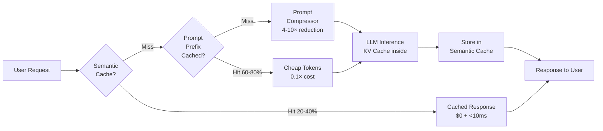
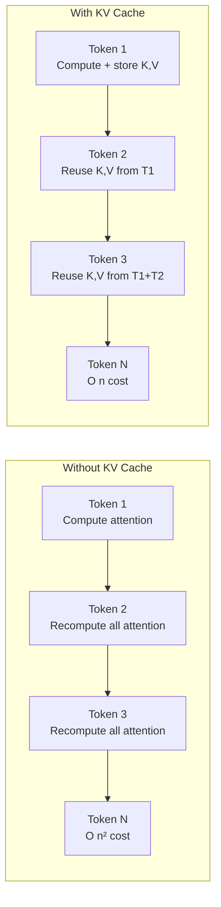
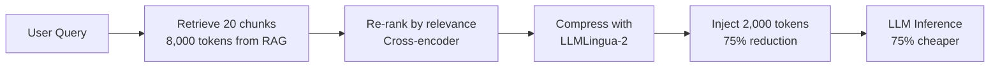

# LLM Caching — Semantic Cache, KV Cache & Prompt Compression

**Level**: 🔴 Advanced
**Reading Time**: 14 minutes

> LLM caching is not one thing — it's four distinct mechanisms operating at different levels of the stack. Using just one cuts your costs 20%. Using all four cuts costs 80%.

## 🗺️ Quick Overview



*Layer caching mechanisms: semantic cache (application level) → prompt caching (provider level) → KV cache (inference level) → prompt compression (token reduction).*

## The Problem

LLM inference costs scale linearly with tokens. A RAG application sending 10,000-token system prompts with every request is paying for the same tokens millions of times. An FAQ bot answering slight variations of the same 500 questions is making full LLM calls for answers it already computed.

The naive solution — exact-match caching — fails because "How do I reset my password?" and "I forgot my password, what do I do?" should return the same cached answer. LLM responses aren't cacheable by exact text match.

There are four independent caching mechanisms, each operating at a different level of the stack. Understanding which to use when — and why each has different effectiveness — is what separates a $40K/month LLM bill from a $8K/month one.

## Mechanism 1: Prompt Caching (Provider Level)

Anthropic, Google, and OpenAI support caching repeated prefixes of your prompt. When you send the same system prompt + context multiple times, the provider caches the computed KV representations and charges a fraction for cache hits.

### Anthropic Prompt Caching

```python
import anthropic

client = anthropic.Anthropic()

# Mark stable prefix with cache_control
response = client.messages.create(
    model="claude-sonnet-4-5",
    max_tokens=1024,
    system=[
        {
            "type": "text",
            "text": "You are a helpful customer support agent for Acme Corp...",
        },
        {
            "type": "text",
            "text": open("product-catalog.txt").read(),  # 8,000 tokens
            "cache_control": {"type": "ephemeral"}        # Cache this prefix
        }
    ],
    messages=[
        {"role": "user", "content": "What is the return policy for electronics?"}
    ]
)

# First request: full cost, primes the cache
# Subsequent requests (within 5 minutes): 90% cost reduction
print(response.usage)
# {
#   "cache_creation_input_tokens": 8200,  # Full cost first time
#   "cache_read_input_tokens": 8200,      # 0.1× cost on cache hits
#   "input_tokens": 15,                   # The user question
#   "output_tokens": 180
# }
```

**Pricing math:**
- Cache miss: $3.00 per 1M tokens (full cost, also writes cache)
- Cache hit: $0.30 per 1M tokens (0.1× cost)
- Cache write is 25% premium on first call only

**Cost example:**
```
Setup: 10,000 token system prompt + 500 token user question
Without caching: 10,500 tokens × $3/1M = $0.0315 per request
With caching (80% hit rate):
  - 20% cache miss: 10,500 × $3/1M = $0.0315
  - 80% cache hit: 500 + (10,000 × $0.30/1M) = $0.0015 + $0.003 = $0.0045
  - Blended: 0.2 × $0.0315 + 0.8 × $0.0045 = $0.0063 + $0.0036 = $0.0099
  - Savings: 68% cost reduction from prompt caching alone
```

**Cache TTL:**
- `ephemeral`: 5 minutes (default, suitable for most workloads)
- Extended cache: available on higher tiers, up to 1 hour

**What to cache:** Long system prompts, RAG context injected at the start, few-shot examples, tool definitions. The stable prefix must come before the variable part (user question).

**Hit rate reality:** 60-80% for customer-facing apps where many users share the same system prompt. Lower for per-user customized prompts.

## Mechanism 2: Semantic Cache (Application Level)

Cache LLM responses indexed by semantic similarity, not exact text. Queries with the same intent return cached answers.

```mermaid
flowchart TD
    Q[User Query:\n"How to reset password?"] --> EMB[Embed Query\ntext-embedding-3-small]
    EMB --> SEARCH[Vector Search\nRedis / Pinecone / pgvector]
    SEARCH --> SIM{Similarity\n>= 0.95?}
    SIM -->|Yes| HIT[Return Cached Response\n$0 LLM cost]
    SIM -->|No| LLM[Call LLM\n$0.03 cost]
    LLM --> STORE[Store embedding + response]
    STORE --> RESP[Return Response]
    HIT --> RESP
```

```python
import numpy as np
from openai import OpenAI
import redis
import json

client = OpenAI()
redis_client = redis.Redis(host='localhost', port=6379, db=0)

SIMILARITY_THRESHOLD = 0.95
EMBEDDING_MODEL = "text-embedding-3-small"

def embed(text: str) -> list[float]:
    response = client.embeddings.create(input=text, model=EMBEDDING_MODEL)
    return response.data[0].embedding

def cosine_similarity(a: list[float], b: list[float]) -> float:
    a, b = np.array(a), np.array(b)
    return float(np.dot(a, b) / (np.linalg.norm(a) * np.linalg.norm(b)))

def semantic_cache_get(query: str) -> str | None:
    query_embedding = embed(query)

    # Scan cached embeddings (use vector DB for production)
    for key in redis_client.scan_iter("cache:*"):
        cached = json.loads(redis_client.get(key))
        similarity = cosine_similarity(query_embedding, cached["embedding"])
        if similarity >= SIMILARITY_THRESHOLD:
            print(f"Cache hit! Similarity: {similarity:.3f}")
            return cached["response"]
    return None

def semantic_cache_set(query: str, response: str, ttl_seconds: int = 3600):
    query_embedding = embed(query)
    cache_key = f"cache:{hash(query)}"
    redis_client.setex(
        cache_key,
        ttl_seconds,
        json.dumps({"embedding": query_embedding, "response": response})
    )

def cached_llm_call(query: str, system_prompt: str) -> str:
    # Check semantic cache first
    cached = semantic_cache_get(query)
    if cached:
        return cached

    # Cache miss — call LLM
    response = client.chat.completions.create(
        model="gpt-4o-mini",
        messages=[
            {"role": "system", "content": system_prompt},
            {"role": "user", "content": query}
        ]
    )
    answer = response.choices[0].message.content

    # Cache the response
    semantic_cache_set(query, answer)
    return answer
```

**Production note:** For production scale, use a dedicated vector database (Pinecone, Weaviate, pgvector) instead of scanning Redis keys. The scan approach above is O(n) — fine for prototypes, not for 1M+ cached entries.

**Tools:** GPTCache (open-source semantic cache), Zep (conversation memory + semantic cache), LangChain's built-in `SemanticSimilarityExampleSelector`.

**Similarity threshold calibration:**
- 0.99: Very strict — only near-identical queries hit. Low false positive rate, low hit rate (~5%)
- 0.95: Balanced — same-intent queries hit, different-intent misses. Recommended starting point
- 0.90: Aggressive — may serve wrong answers to tangentially related questions. Dangerous

**Expected hit rates:**
- FAQ bot with 500 templated questions: 30-50% hit rate
- Open-ended assistant: 5-15% hit rate
- Customer support with repetitive issues: 20-40% hit rate

## Mechanism 3: KV Cache (Inference Level)

KV cache operates inside the LLM inference engine itself. When generating tokens, the model computes key-value attention pairs for each position in the context. KV cache stores these computations so they don't need to be recomputed on every token.

**This is automatic** — every production inference server (vLLM, TGI, Ollama) implements KV cache. You don't configure it; you benefit from it.



### PagedAttention (vLLM)

vLLM's PagedAttention manages KV cache like OS virtual memory — pages of KV cache are allocated on demand and can be shared across sequences. This allows:
- 2-5× higher throughput by eliminating KV cache memory fragmentation
- Prefix sharing: if 100 requests share the same system prompt, the KV cache for that prefix is computed once and shared

### Prefix Caching in vLLM

```python
# Enable prefix caching in vLLM
from vllm import LLM, SamplingParams

llm = LLM(
    model="meta-llama/Meta-Llama-3.1-8B-Instruct",
    enable_prefix_caching=True,  # Cache common prefixes across requests
    gpu_memory_utilization=0.9
)

# All requests with the same system prompt share the cached KV prefix
# First request: full prefill cost
# Subsequent requests: only compute KV for new tokens
```

For a customer support bot with a 10K token system prompt and 100 concurrent users:
- Without prefix caching: 100 × 10K = 1M tokens to prefill each time
- With prefix caching: 10K tokens prefill once, 100× reuse

## Mechanism 4: Prompt Compression

Long RAG contexts are expensive. Prompt compression reduces the number of tokens sent to the LLM while preserving the semantic content.



### LLMLingua — Iterative Token Pruning

LLMLingua uses a small LM (GPT-2 scale) to identify which tokens in the context are most informative, then drops the rest. 4-10× compression with <5% quality loss.

```python
from llmlingua import PromptCompressor

compressor = PromptCompressor(
    model_name="microsoft/llmlingua-2-bert-large-multilingual-cased-meetingbank",
    use_llmlingua2=True,
    device_map="cpu"
)

# Long RAG context
long_context = """
[Chunk 1 - retrieved document, 500 tokens]...
[Chunk 2 - retrieved document, 500 tokens]...
...
[Chunk 16 - retrieved document, 500 tokens]...
"""  # 8,000 tokens

# Compress to 2,000 tokens (75% reduction)
compressed = compressor.compress_prompt(
    long_context,
    instruction="Answer questions about the product.",
    question="What is the return policy?",
    target_token=2000,
    rank_method="longllmlingua"
)

print(f"Original: {compressed['origin_tokens']} tokens")
print(f"Compressed: {compressed['compressed_tokens']} tokens")
print(f"Ratio: {compressed['ratio']}")
# Original: 8000 tokens
# Compressed: 2100 tokens
# Ratio: 3.8×
```

### Selective Retrieval (Re-ranking)

Before compression, re-rank retrieved chunks so only the most relevant go into context:

```python
from sentence_transformers import CrossEncoder

reranker = CrossEncoder("cross-encoder/ms-marco-MiniLM-L-6-v2")

def rerank_chunks(query: str, chunks: list[str], top_k: int = 5) -> list[str]:
    """Re-rank RAG chunks and return only top_k most relevant."""
    pairs = [[query, chunk] for chunk in chunks]
    scores = reranker.predict(pairs)
    ranked = sorted(zip(scores, chunks), reverse=True)
    return [chunk for _, chunk in ranked[:top_k]]

# Retrieve 20 chunks → re-rank → keep top 5 → 75% token reduction
chunks = retrieve_from_vector_db(query, top_k=20)
relevant_chunks = rerank_chunks(query, chunks, top_k=5)
```

**Compress when:** context is >50% of context window, or token costs are significant (10K+ token contexts).

## Caching Strategy Comparison

| Strategy | Level | Implementation | Hit Rate | Cost Savings | Latency Impact |
|----------|-------|---------------|---------|-------------|----------------|
| Semantic cache | Application | Redis + vectors | 5-50% | 80-100% on hit | -10ms (cache check) |
| Prompt caching | Provider | API parameter | 60-80% | 60-89% | -70% latency on hit |
| KV cache | Inference | Automatic | ~100% | Throughput 2-5× | Major for long prompts |
| Prefix caching (vLLM) | Self-hosted | Configuration | 80%+ | 2-5× throughput | Major for shared prefixes |
| Prompt compression | Application | LLMLingua | N/A | 40-80% token reduction | +50-200ms (compression) |

## Common Mistakes

1. **Setting semantic cache similarity threshold too low**. Root cause: optimizing for hit rate without validating answer quality. At 0.90 similarity, "How do I cancel my subscription?" and "How do I cancel my order?" may match — but the answers are completely different. Fix: set threshold at 0.95+, and run a golden-set evaluation to validate false positive rate before deploying.

2. **Caching non-deterministic or time-sensitive responses**. Root cause: applying caching uniformly. "What's the weather?" should never be cached. "Explain the return policy?" can be cached for 24 hours. Fix: tag queries by cacheability (deterministic vs real-time) and apply TTL accordingly.

3. **Not marking the right prefix for prompt caching**. Root cause: putting the stable content after the variable content. Anthropic's prompt caching caches a prefix — everything before the first non-cached block. If your system prompt comes after dynamic content, it won't be cached. Fix: always put static content (system prompt, RAG context) before dynamic content (user query).

4. **Using prompt compression on short contexts**. Root cause: adding compression overhead for small inputs. LLMLingua takes 50-200ms to compress. For a 500-token context, the compression time costs more than the token savings. Fix: only compress when context exceeds 2,000 tokens.

5. **Ignoring cache invalidation**. Root cause: cached LLM responses become stale when your system prompt changes, product catalog updates, or policies change. Fix: namespace cache keys by system prompt version. When the system prompt changes, increment the version and old cache entries naturally expire.

## Key Takeaways

- Prompt caching (Anthropic/OpenAI feature) delivers 60-89% cost reduction for stable prefixes with 60-80% cache hit rates — the highest ROI caching technique requiring only a one-line API change
- Semantic cache requires 0.95+ cosine similarity threshold to avoid serving wrong answers — lower thresholds increase hit rate but create dangerous false positives
- KV cache and PagedAttention are automatic in vLLM/TGI — no configuration needed, but prefix caching requires `enable_prefix_caching=True` for cross-request sharing
- LLMLingua compresses RAG contexts 4-10× with <5% quality loss — apply only when context exceeds 2,000 tokens to justify the 50-200ms compression overhead
- Stack all four mechanisms: semantic cache (miss) → prompt cache (partial) → prompt compression (reduce tokens) → KV cache (automatic) — combined savings can reach 80%+ cost reduction

## References

> 📚 [Anthropic Prompt Caching Guide](https://docs.anthropic.com/en/docs/build-with-claude/prompt-caching) — API reference, pricing, TTL, and best practices for cache_control

> 📖 [LLMLingua: Compressing Prompts for Accelerated Inference](https://arxiv.org/abs/2310.05736) — Microsoft Research paper on iterative token pruning

> 📚 [GPTCache: A Library for Creating Semantic Cache for LLM Queries](https://github.com/zilliztech/GPTCache) — Open-source semantic caching with Redis, Milvus, and FAISS backends

> 📖 [vLLM Prefix Caching](https://docs.vllm.ai/en/latest/automatic_prefix_caching/apc.html) — PagedAttention and prefix caching implementation details

> 📖 [OpenAI Prompt Caching](https://platform.openai.com/docs/guides/prompt-caching) — OpenAI's implementation, differences from Anthropic's approach
