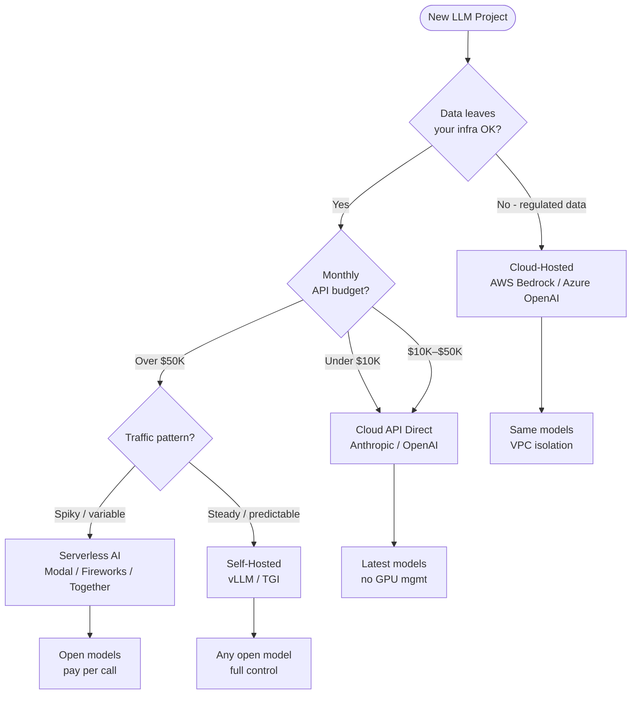
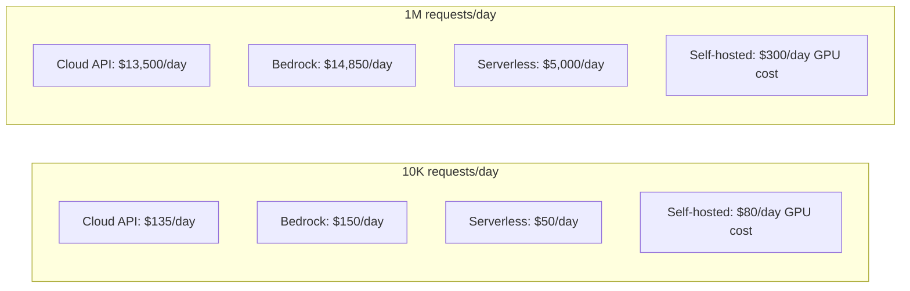

# LLM Hosting — Cloud APIs vs Self-Hosted vs Serverless

**Level**: 🟡 Intermediate
**Reading Time**: 14 minutes

> Where you run your LLM is as important as which LLM you choose — the wrong hosting decision will either cost 10× too much or violate your compliance requirements.

## 🗺️ Quick Overview



*Start with cloud API, migrate to self-hosted when monthly costs exceed $50K.*

## The Problem

Picking a hosting model feels like a one-line decision — "just call the API" — until production reality hits. Teams discover their healthcare data can't leave their VPC, or their $2K/month prototype becomes a $40K/month production system, or their latency SLA can't tolerate the variable response times of shared cloud APIs.

The four hosting models have fundamentally different cost structures, compliance postures, operational burdens, and performance profiles. Getting this wrong early is expensive to reverse: you've built integrations, tuned prompts, and trained your team around one provider's quirks.

The decision has three independent axes: **compliance** (can data leave your infrastructure?), **cost** (what's your monthly API spend?), and **operations** (can your team manage GPU clusters?). This article gives you a decision framework that's honest about all three.

## Hosting Model 1: Cloud API Direct

Call Anthropic, OpenAI, Google AI Studio, or Mistral AI APIs directly. You send HTTP requests, they run inference, you pay per token.

**Pricing (2025 reference):**
| Model | Input $/1M tokens | Output $/1M tokens |
|-------|------------------|-------------------|
| Claude Sonnet 4 | $3.00 | $15.00 |
| Claude Haiku 3.5 | $0.80 | $4.00 |
| GPT-4o | $2.50 | $10.00 |
| GPT-4o-mini | $0.15 | $0.60 |
| Gemini 1.5 Flash | $0.075 | $0.30 |

**Advantages:**
- Zero operational overhead — no GPUs to provision, patch, or scale
- Latest models immediately available, often day of release
- Automatic scaling — 10× traffic spike requires no action from you
- Built-in redundancy across datacenters

**Disadvantages:**
- Data leaves your infrastructure on every request (compliance risk)
- Variable latency — shared infrastructure means P99 can spike
- Rate limits require careful management (Claude Sonnet: 5M tokens/min on Tier 4)
- No control over model versions — providers can deprecate models

**Cost reality check:**
```
10,000 requests/day × 2,000 input tokens + 500 output tokens
= 20M input tokens + 5M output tokens per day
= $60/day input + $75/day output = $135/day = $4,050/month

At Claude Sonnet 4 pricing. Switch to Haiku for simple tasks:
= $16/day input + $20/day output = $36/day = $1,080/month
```

**Use when:** startup, prototype, budget under $10K/month, no strict data residency requirements.

## Hosting Model 2: Cloud-Hosted (Bedrock / Azure / Vertex)

The same frontier models, but running inside your cloud provider's infrastructure. Your data stays within your cloud account.

### AWS Bedrock

Access Claude (Anthropic), Llama (Meta), Mistral, Titan, and Cohere models via AWS API. Authentication uses IAM roles — no separate API keys to rotate.

```python
import boto3

bedrock = boto3.client(
    service_name='bedrock-runtime',
    region_name='us-east-1'
)

response = bedrock.invoke_model(
    modelId='anthropic.claude-3-5-sonnet-20241022-v2:0',
    body=json.dumps({
        "anthropic_version": "bedrock-2023-05-31",
        "max_tokens": 1024,
        "messages": [{"role": "user", "content": "Explain distributed systems"}]
    })
)
```

- Data stays in your AWS VPC — never touches Anthropic's API servers
- IAM-based auth integrates with your existing AWS access control
- CloudWatch logging, CloudTrail audit logs included
- ~10% price premium over direct API; +50ms latency (routing overhead)
- Provisioned throughput available for guaranteed capacity

### Azure OpenAI Service

OpenAI models (GPT-4o, GPT-4o-mini, o1, embeddings) deployed within your Azure tenant:
- GDPR, SOC 2 Type 2, ISO 27001 compliance certifications
- Enterprise SLAs (99.9% uptime)
- Microsoft Entra (Azure AD) authentication
- Content filtering controls configurable per deployment

### Google Vertex AI

Gemini 1.5 Pro, Gemini 1.5 Flash, Claude (via Model Garden) in your GCP project:
- Data never leaves GCP infrastructure
- VPC Service Controls for network isolation
- Model Garden allows access to 100+ open-source models alongside Gemini

**Cloud-hosted latency reality:**
| Path | P50 latency | P99 latency |
|------|-------------|-------------|
| Direct Anthropic API | 800ms TTFT | 2,500ms TTFT |
| AWS Bedrock (Claude) | 850ms TTFT | 2,800ms TTFT |
| Azure OpenAI (GPT-4o) | 750ms TTFT | 2,200ms TTFT |

**Use when:** enterprise compliance requirements, existing cloud commitment (AWS/Azure credits), data residency regulations (GDPR, HIPAA, SOC 2), or regulated industries (healthcare, finance, government).

## Hosting Model 3: Self-Hosted (vLLM / Ollama / TGI)

Run open-source models on your own GPU infrastructure. Full control, full responsibility.

### vLLM — Production Inference Server

vLLM is the standard for production self-hosting. Its key innovation is **PagedAttention** — managing KV cache memory like an OS paging system, eliminating memory fragmentation and enabling 2-5× higher throughput than naive inference.

```bash
# Install vLLM
pip install vllm

# Start server (Llama 3.1 8B on A10G GPU)
python -m vllm.entrypoints.openai.api_server \
  --model meta-llama/Meta-Llama-3.1-8B-Instruct \
  --tensor-parallel-size 1 \
  --max-model-len 8192 \
  --port 8000
```

```python
# Compatible with OpenAI SDK
from openai import OpenAI

client = OpenAI(
    api_key="EMPTY",
    base_url="http://localhost:8000/v1"
)

response = client.chat.completions.create(
    model="meta-llama/Meta-Llama-3.1-8B-Instruct",
    messages=[{"role": "user", "content": "Explain transformer architecture"}],
    temperature=0.7
)
```

**Throughput benchmarks (vLLM vs naive inference):**
| Setup | Tokens/sec (single GPU) | Concurrent users |
|-------|------------------------|-----------------|
| Naive Hugging Face | ~400 t/s | 1-2 |
| vLLM PagedAttention | ~1,800 t/s | 50-200 |
| vLLM + continuous batching | ~2,200 t/s | 200+ |

**GPU requirements:**
| Model size | Minimum GPU | Recommended |
|------------|-------------|-------------|
| 7B (FP16) | A10G 24GB | A100 40GB |
| 13B (FP16) | A100 40GB | A100 80GB |
| 70B (FP16) | 2× A100 80GB | 4× A100 80GB |
| 70B (INT4) | A100 80GB | A100 80GB |

### Ollama — Developer-Friendly Local Inference

Ollama makes local inference as simple as `docker pull`:

```bash
# Install and run
curl -fsSL https://ollama.ai/install.sh | sh
ollama pull llama3.2:3b
ollama serve &

# Call via REST
curl http://localhost:11434/api/chat -d '{
  "model": "llama3.2:3b",
  "messages": [{"role": "user", "content": "Hello!"}]
}'
```

Ollama uses GGUF quantized models — a 7B model runs in 4GB RAM (4-bit quantization), making it practical on developer laptops and Mac M-series machines. Performance is 15-30 tokens/s on Apple Silicon M3 Pro, 8-15 tokens/s on CPU-only.

Ollama is excellent for development and testing, but not designed for production multi-user serving. Use vLLM for production.

### Text Generation Inference (TGI)

HuggingFace's production inference server. Similar to vLLM in capability, strong integration with HuggingFace Hub:

```bash
docker run --gpus all \
  -p 8080:80 \
  ghcr.io/huggingface/text-generation-inference:latest \
  --model-id mistralai/Mistral-7B-Instruct-v0.3
```

**Use when:** data sovereignty requirements, open-source model fine-tuning, API spend exceeds $50K/month (self-hosting breaks even around that point for stable traffic).

## Hosting Model 4: Serverless AI Inference

Managed inference for open-source models, billed per inference. No GPU management, variable capacity.

**Providers:**
| Provider | Models | Cold start | Best for |
|----------|--------|------------|---------|
| Modal | Any (custom containers) | 10-60s | Custom models, fine-tunes |
| Replicate | 1000+ open models | 5-30s | Prototyping, variable traffic |
| Fireworks AI | Llama, Mixtral, Gemma | <1s (warm) | Low-latency production |
| Together AI | 50+ open models | <1s (warm) | High-throughput batch |

```python
# Fireworks AI — drop-in OpenAI replacement
from openai import OpenAI

client = OpenAI(
    api_key="fw_your_key",
    base_url="https://api.fireworks.ai/inference/v1"
)

response = client.chat.completions.create(
    model="accounts/fireworks/models/llama-v3p1-70b-instruct",
    messages=[{"role": "user", "content": "Explain RAG"}]
)
```

**Cold start problem:** serverless models spin down when idle. A 70B model can take 60 seconds to cold start. Use provisioned capacity (reserved instances) for latency-sensitive workloads.

**Use when:** variable or unpredictable traffic, specialized open-source models, want open-model pricing without GPU management complexity.

## Cost Comparison at Scale



| Scale | Cloud API | Bedrock | Serverless | Self-hosted |
|-------|-----------|---------|------------|-------------|
| 10K req/day | $4,050/mo | $4,455/mo | $1,500/mo | $2,400/mo |
| 100K req/day | $40,500/mo | $44,550/mo | $15,000/mo | $4,800/mo |
| 1M req/day | $405,000/mo | $445,500/mo | $150,000/mo | $12,000/mo |

*Assumptions: Claude Sonnet pricing, 2K input + 500 output tokens/request, self-hosted = 4× A100 80GB at $3/hr each.*

Self-hosted breaks even at roughly 100K-500K requests/day depending on model and GPU cost. Before that threshold, managed options win on total cost of ownership (no DevOps overhead).

## Migration Path

```
Phase 1 (0-6 months): Cloud API Direct
  → Fastest to build, validate product-market fit
  → Accept variable costs while learning actual usage patterns

Phase 2 ($10K-50K/month): Optimize within Cloud API
  → Add prompt caching (60-80% cost reduction on stable prompts)
  → Add model routing (Haiku for simple tasks, Sonnet for complex)
  → Evaluate Bedrock if compliance requirements emerge

Phase 3 ($50K+/month): Self-hosted for base load
  → Deploy vLLM for predictable, high-volume traffic
  → Keep Cloud API for burst, latest models, specialized tasks
  → Serverless for fine-tuned specialty models
```

## Common Mistakes

1. **Starting with self-hosted to "save money"**. Root cause: underestimating operational complexity. Self-hosted requires GPU provisioning, model management, monitoring, fault tolerance, and scaling — easily a 0.5-1 FTE of ongoing work. Fix: start with Cloud API, migrate only when monthly spend justifies the DevOps investment (typically >$50K/month).

2. **Ignoring data residency until a compliance audit**. Root cause: assuming "it's just an API call." Many regulations (HIPAA, GDPR Article 46, FedRAMP) require data to stay within specific geographic or infrastructure boundaries. Fix: assess compliance requirements before writing the first line of LLM integration code — changing providers later is a significant refactor.

3. **Using the same model for all tasks**. Root cause: default to the most capable model for everything. A tool-selection decision that needs Claude Haiku costs 10× less than using Claude Sonnet. Fix: implement model routing from the start — route by task complexity, not by default.

4. **No rate limit handling**. Root cause: assuming the API is infinitely scalable. All providers have rate limits (tokens/minute, requests/minute). Hitting them causes 429 errors and agent failures. Fix: implement exponential backoff, queue requests, and monitor rate limit headers in every LLM call.

5. **Not benchmarking latency in target region**. Root cause: testing from developer laptops in the same region as the API. Production users in Singapore hitting a US-East API endpoint see 200-400ms additional latency. Fix: benchmark from production regions early, consider regional endpoints.

## Key Takeaways

- Cloud API direct is the right starting point for 95% of teams — zero ops, latest models, start in hours not weeks
- AWS Bedrock / Azure OpenAI keep your data inside your cloud VPC — mandatory for HIPAA, GDPR, FedRAMP workloads
- Self-hosted with vLLM breaks even vs Cloud API at roughly 100K-500K requests/day (model-dependent) — before that, managed wins on TCO
- PagedAttention in vLLM delivers 2-5× higher throughput vs naive inference — it's the key reason vLLM is the production standard
- Cold starts are the serverless AI killer for latency-sensitive workloads — use provisioned capacity or always-warm replicas
- Build with model routing from day one: Haiku/GPT-4o-mini for simple tasks saves 60-80% on token costs

## References

> 📚 [AWS Bedrock Documentation](https://docs.aws.amazon.com/bedrock/latest/userguide/what-is-bedrock.html) — Model access, IAM auth, throughput modes

> 📖 [vLLM: Easy, Fast, and Cheap LLM Serving](https://blog.vllm.ai/2023/06/20/vllm.html) — PagedAttention explained, throughput benchmarks vs Hugging Face TGI

> 📚 [Ollama Documentation](https://ollama.ai/docs) — Local model management, supported models, hardware requirements

> 📖 [Fireworks AI Benchmarks](https://fireworks.ai/blog/fireworks-achieves-state-of-the-art-serving-throughput) — Serverless AI latency and throughput numbers

> 📚 [Azure OpenAI Service Overview](https://learn.microsoft.com/en-us/azure/ai-services/openai/overview) — Enterprise compliance certifications, deployment models, quota management
