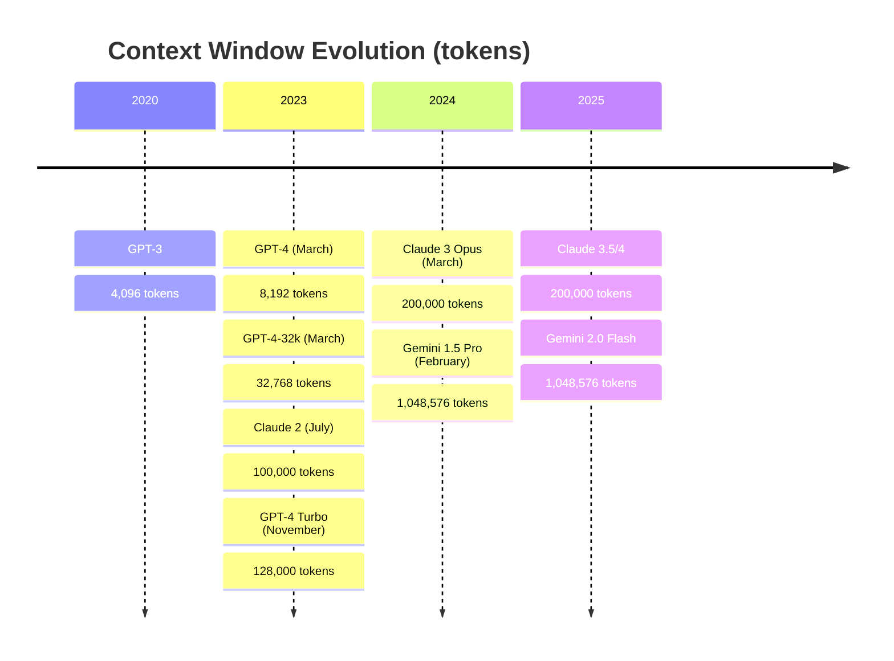
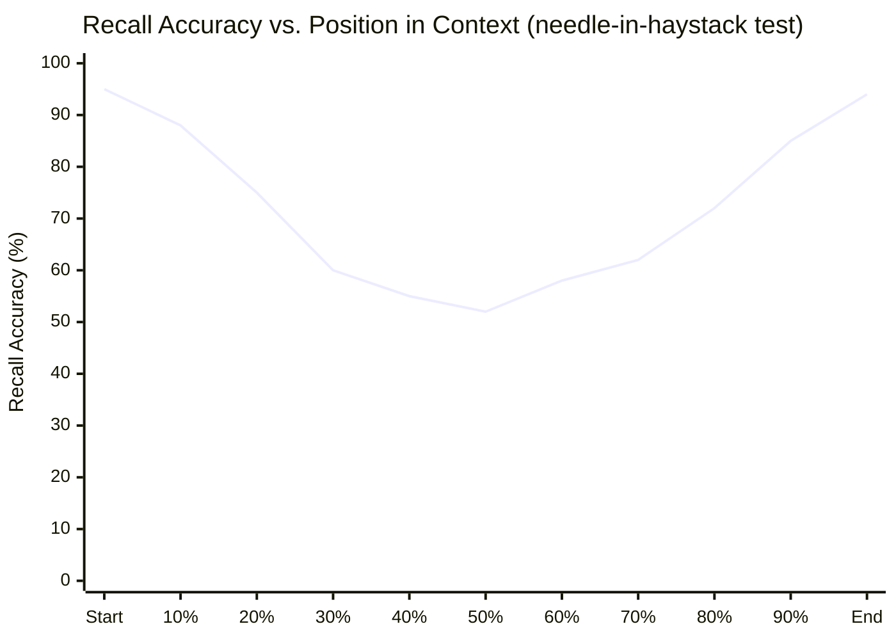
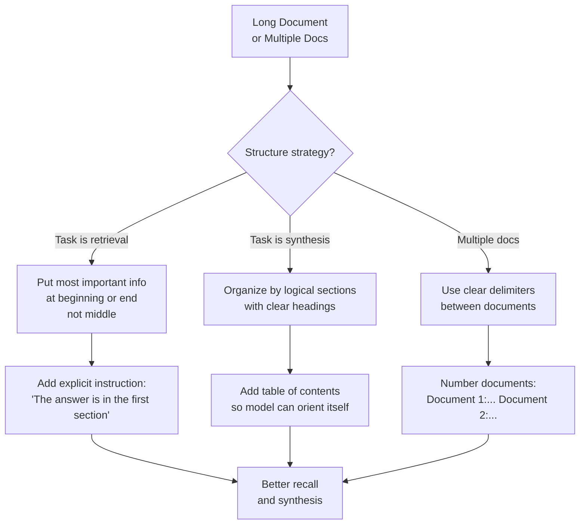

# Long Context Models — From 4K to 1M Token Windows

**Level**: 🟡 Intermediate
**Reading Time**: 13 minutes

> Gemini 1.5 Pro can hold 1,048,576 tokens in its context window. That's roughly 750 novels. Knowing when to use that capability — and when not to — is the real skill.

## 🗺️ Quick Overview



*In 5 years, context windows grew 256x. The architecture enabling this — RoPE, FlashAttention, and sparse attention — changed what's possible for agents and document analysis.*

## The Problem

Before 2023, working with documents larger than a few pages required RAG (Retrieval-Augmented Generation): chunk the document, embed chunks, retrieve the most relevant pieces, stuff them in context. This works, but has hard limitations:

- Retrieval is imprecise — you get the most similar chunks, not necessarily the right ones
- Multi-document reasoning requires pulling from multiple retrieval calls
- You can't ask "how does section 47 of this contract compare to section 12?" if both aren't retrieved
- Very long conversation histories get truncated, losing earlier context

Long context models change the trade-off: instead of retrieving relevant parts, you put the entire document in context and let the model find what it needs.

---

## What Long Context Makes Possible

**200K tokens = approximately:**
- 150,000 lines of code (a medium-sized codebase)
- 150 research papers
- A 600-page book
- 10 hours of meeting transcript
- 200 dense technical documents

**1M tokens = approximately:**
- 750,000 lines of code (a large monorepo)
- A full year of daily meeting transcripts
- The entire Harry Potter series (7 books) plus 500 other novels
- All SEC filings for a major company over 5 years

### Real Use Cases Enabled by Long Context

1. **Whole-codebase refactoring**: Send the entire repository to Claude or Gemini. Ask "rename all instances of `userID` to `userId` and explain why the tests in `/test/auth.test.js` will need updating." The model sees all files simultaneously.

2. **Full document legal review**: Upload all 50 exhibits in a legal case. Ask "which exhibits contradict the claim in paragraph 14 of the complaint?" No retrieval step needed.

3. **Long agent memory**: An agent working on a 48-hour research task can keep its entire working history in context (200K tokens ≈ 20-30 hours of typical agent output).

4. **Multi-document synthesis**: "Compare the risk disclosures in all 5 annual reports I'm about to share, and identify contradictions." This requires simultaneous access to all documents.

5. **Full book analysis**: "In this 300-page novel, which characters appear in both chapter 3 and chapter 27? Trace the arc of their relationship."

---

## The "Lost in the Middle" Problem

Long context is not free of quality issues. Research from Stanford (2023) identified a critical failure mode: **models struggle to use information placed in the middle of very long contexts.**



The "needle-in-haystack" test: insert one specific fact anywhere in a long document, then ask the model to retrieve it. Performance degrades significantly for facts placed in the 30-70% depth range.

**Practical benchmark results (2024):**
- GPT-4 Turbo (128K): strong recall at edges, degrades ~20-30% in middle of 100K+ contexts
- Claude 3 Opus (200K): better than GPT-4 at long contexts, still degrades in middle
- Gemini 1.5 Pro (1M): significantly better middle-context recall than competitors; Google attributes this to architectural improvements and training on longer sequences

**What this means for you:**
- Don't bury critical instructions in the middle of a long system prompt
- For retrieval tasks over very long documents, still prefer RAG over raw long context
- For reasoning tasks that require the whole document (synthesis, comparison), long context wins

---

## Long Context vs. RAG: Decision Matrix

| Scenario | Long Context | RAG |
|---------|-------------|-----|
| Need full document reasoning (synthesis, comparison across entire doc) | ✅ Better | ❌ Imprecise |
| Needle-in-haystack retrieval from 1,000+ page doc | ❌ Degrades in middle | ✅ Better |
| Document is larger than 1M tokens | ❌ Impossible | ✅ Only option |
| Latency-sensitive (<1s response needed) | ❌ TTFT 3-10s for large context | ✅ Fast retrieval + small context |
| Cost-sensitive at high volume | ❌ Expensive per request | ✅ Cheaper at scale |
| Cross-document reasoning (facts across 5+ docs) | ✅ All docs in one context | ❌ Hard to coordinate |
| Simple keyword lookup ("find the phone number") | ❌ Wasteful | ✅ Efficient |
| Agentic long-running task history | ✅ Entire history visible | ❌ Lossy compression |
| Sub-document granularity retrieval | ❌ Model must find itself | ✅ Precision retrieval |

**Rule of thumb:**
- Use long context when the **reasoning requires seeing everything simultaneously**
- Use RAG when you need **precision retrieval of specific facts** from large corpora

---

## Cost and Latency Reality

This is where long context bites most teams. The cost is real and scales with every request:

| Model | Context size | Approx. input cost | TTFT |
|-------|-------------|-------------------|------|
| Claude 3.5 Sonnet | 10K tokens | $0.03 | ~0.5s |
| Claude 3.5 Sonnet | 100K tokens | $0.30 | ~2s |
| Claude 3.5 Sonnet | 200K tokens | $0.60 | ~4-6s |
| Gemini 1.5 Pro | 100K tokens | $0.125 (≤128K tier) | ~2s |
| Gemini 1.5 Pro | 500K tokens | $2.50 | ~5-8s |
| Gemini 1.5 Pro | 1M tokens | ~$5.00 | ~10-15s |
| GPT-4 Turbo | 128K tokens | $1.28 | ~3-5s |

*Prices approximate as of 2025, check provider pricing pages for current rates.*

**Volume math for a typical SaaS product:**
- Feature: "Chat with your codebase" using 50K tokens per request
- 1,000 requests/day = 50M tokens/day
- With Claude Sonnet at $3/1M input: **$150/day = $4,500/month** — just for input tokens
- RAG alternative: 5K tokens per request = $450/month — **10x cheaper**

Long context is powerful. It is not cheap. Budget carefully.

---

## Architecture Techniques Enabling Long Context

Understanding how long context works helps you use it correctly.

### RoPE (Rotary Position Encoding)

Traditional position encodings struggle to extrapolate beyond training sequence length. RoPE (Su et al., 2021) encodes position as a rotation in embedding space:

- Relative position between tokens is encoded, not absolute position
- Generalizes better to sequences longer than training length
- Used in: Llama, Mistral, Gemini, and most modern LLMs

**YaRN and LongRoPE**: Techniques for extending RoPE to longer sequences without full retraining:
- Fine-tune on long sequences with modified RoPE frequencies
- Llama 3.1 extended 8K → 128K context this way
- Gemini 1.5 extended significantly beyond training length using similar techniques

### FlashAttention

Standard attention has O(n²) memory complexity — a 200K token context would require 40 billion (200K × 200K) attention computations. This was physically impossible on existing hardware.

FlashAttention (Dao et al., 2022) reorders attention computation to minimize memory I/O:
- Avoids materializing the full attention matrix in GPU SRAM
- Makes attention memory O(n) instead of O(n²) in practice
- 2-4x speedup for long sequences, 5-20x memory reduction
- Required for >32K context on any modern GPU

FlashAttention 3 (2024) further optimizes for H100 architecture. All frontier long-context models use it.

### Sparse Attention

Full attention attends every token to every other token. For very long sequences, some tokens are not important to each other:

- **Sliding window attention** (Longformer): each token attends to N neighbors + a few global tokens
- **BigBird**: random + window + global attention patterns
- **Ring attention** (Google): distributes attention across multiple GPUs for 1M+ contexts

Gemini 1.5's 1M context uses a combination of these techniques — the full architecture is not published.

---

## Context Engineering for Long Documents

Simply putting a document in context is not enough. How you structure long contexts matters:



**Practical context engineering rules for long documents:**

1. **Put critical facts and instructions at the top and bottom** — not in the middle. The "recency bias" and "primacy bias" are real: models attend better to edges.

2. **Use explicit section headers** with numbers/letters: `## Section 3: Financial Projections`. This creates navigation landmarks the model can reference.

3. **Use XML-style delimiters for multi-document contexts**:
   ```
   <document id="1" title="Q3 Annual Report">
   ...document content...
   </document>

   <document id="2" title="Q4 Annual Report">
   ...document content...
   </document>
   ```

4. **State the task before the document, and repeat it after**: "I'm going to give you a contract. After reading it, identify all clauses that could create liability. [contract] Now, list the liability clauses you identified."

---

## Code: Using Gemini 1.5 Pro for Long Context

```python
import google.generativeai as genai
import os

# Configure API
genai.configure(api_key=os.environ["GEMINI_API_KEY"])

# Initialize model with 1M context window
model = genai.GenerativeModel(
    model_name="gemini-1.5-pro",
    generation_config={
        "temperature": 0.3,
        "top_p": 0.95,
        "max_output_tokens": 8192,
    }
)

# Example 1: Full codebase analysis
def analyze_codebase(codebase_content: str, question: str) -> str:
    """
    Analyze an entire codebase using Gemini's 1M context window.
    codebase_content: concatenated files with headers
    """
    prompt = f"""You are analyzing a software codebase. Here is the full codebase:

<codebase>
{codebase_content}
</codebase>

Question: {question}

Provide a detailed, specific answer with file names and line references."""

    # Count approximate tokens (rough estimate: 4 chars per token)
    approx_tokens = len(prompt) // 4
    print(f"Approximate context size: {approx_tokens:,} tokens")

    response = model.generate_content(prompt)
    return response.text


# Example 2: Multi-document comparison
def compare_documents(docs: list[dict], comparison_question: str) -> str:
    """
    Compare multiple documents with long context.
    docs: [{"title": "...", "content": "..."}, ...]
    """
    # Build structured multi-document context
    doc_context = "\n\n".join([
        f'<document id="{i+1}" title="{doc["title"]}">\n{doc["content"]}\n</document>'
        for i, doc in enumerate(docs)
    ])

    prompt = f"""I'm providing {len(docs)} documents for comparison.

{doc_context}

Question: {comparison_question}

Structure your answer by document when relevant, and clearly identify agreements and contradictions."""

    response = model.generate_content(prompt)
    return response.text


# Example 3: Long conversation history for agents
class LongContextAgent:
    def __init__(self):
        self.model = genai.GenerativeModel("gemini-1.5-pro")
        self.chat = self.model.start_chat(history=[])
        self._turn_count = 0

    def chat_with_history(self, message: str) -> str:
        """
        Gemini maintains conversation history automatically.
        With 1M context, you can have ~500-1000 turns before management needed.
        """
        self._turn_count += 1

        # Check approximate context usage
        history_text = str(self.chat.history)
        approx_tokens = len(history_text) // 4

        if approx_tokens > 900_000:  # 90% of 1M
            print(f"WARNING: Context at {approx_tokens:,} tokens — approaching 1M limit")

        response = self.chat.send_message(message)
        return response.text


# Usage example
if __name__ == "__main__":
    # Load a codebase
    import glob

    codebase = ""
    for filepath in glob.glob("./src/**/*.py", recursive=True):
        with open(filepath) as f:
            codebase += f"\n\n--- File: {filepath} ---\n{f.read()}"

    result = analyze_codebase(
        codebase,
        "Find all places where user input is not validated before database insertion. "
        "List each location with file path, function name, and the specific risk."
    )
    print(result)
```

---

## Common Mistakes

1. **Using long context for retrieval tasks and blaming the model when it misses facts**: Long context is excellent for reasoning over documents, but it is not a search engine. Placing a single important fact at position 60% of a 200K context and expecting reliable recall is asking for the "lost in the middle" failure. Use RAG for retrieval, long context for synthesis.

2. **Ignoring cost at scale**: A team that builds "just paste the whole document" into their product and charges $10/month will discover the product runs at a loss. A single 200K-token request with Claude Sonnet costs $0.60 in input tokens alone. At 1,000 requests/day, that's $18,000/month on input costs. Always cost-model before committing to long context as a product feature.

3. **Not structuring multi-document contexts**: Concatenating 10 documents end-to-end without delimiters or headers confuses the model about document boundaries. Use clear XML-style delimiters and tell the model how many documents to expect.

4. **Treating 1M tokens as "free"**: Gemini 1.5 Pro's 1M context is real, but TTFT (time-to-first-token) at 1M tokens is 10-20 seconds. For interactive applications, this is a poor user experience. Reserve 1M context for batch processing jobs, not real-time chat.

5. **Forgetting that context includes the output too**: If you send 190K tokens of input to a 200K context model, you only have 10K tokens left for output. Many developers hit "max context" errors because they fill input, leaving no room for the model to respond. Rule of thumb: reserve at least 10-20% of context for output.

---

## Key Takeaways

- **Context window grew 256x from 2020-2024**: GPT-3's 4K → Gemini 1.5's 1M tokens, driven by FlashAttention and RoPE improvements
- **"Lost in the middle" is real**: recall degrades 20-40% for information at 30-70% depth in very long contexts — put critical facts at the start or end
- **Cost scales linearly with context length**: 200K tokens with Claude Sonnet = $0.60 per request; at 1,000 requests/day that's $18K/month in input costs alone
- **Long context beats RAG for synthesis, RAG beats long context for retrieval**: use the right tool for each task type
- **TTFT at 1M tokens is 10-20 seconds**: not suitable for interactive latency requirements — use for batch jobs
- **Context engineering matters**: structure multi-document contexts with XML delimiters, put instructions at top and bottom, repeat the task before and after long documents

## References

> 📖 [Lost in the Middle: How Language Models Use Long Contexts — Stanford (2023)](https://arxiv.org/abs/2307.03172) — The foundational paper proving recall degradation for middle-context information

> 📖 [Gemini 1.5: Unlocking Multimodal Understanding Across Millions of Tokens of Context — Google (2024)](https://arxiv.org/abs/2403.05530) — Technical report on Gemini 1.5 Pro's 1M context architecture and needle-in-haystack benchmarks

> 📖 [FlashAttention-2: Faster Attention with Better Parallelism and Work Partitioning](https://arxiv.org/abs/2307.08691) — The algorithm that made long context practically feasible by reducing attention memory complexity

> 📖 [YaRN: Efficient Context Window Extension of Large Language Models](https://arxiv.org/abs/2309.00071) — Technique for extending RoPE-based models to longer contexts without full retraining (used to extend Mistral, Llama, and others)

> 📺 [Andrej Karpathy: Long Context Is All You Need (2024)](https://www.youtube.com/watch?v=UhDOQ0os5Kg) — High-level discussion of long context capabilities, trade-offs, and where the field is heading
