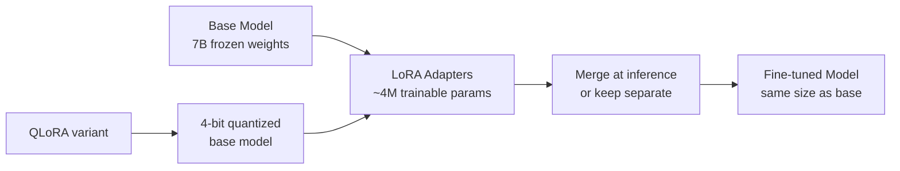
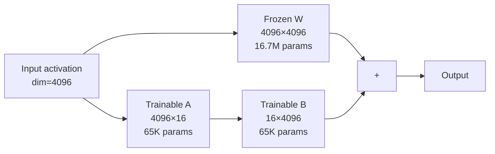
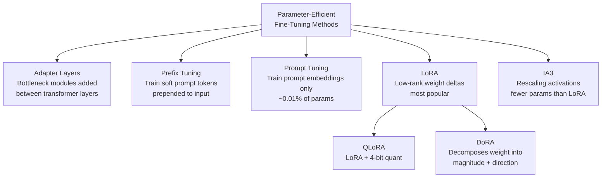

# LoRA & QLoRA — Parameter-Efficient Fine-Tuning

**Level**: 🔴 Advanced
**Reading Time**: 16 minutes

> You don't need to update 7 billion parameters to teach a model a new trick — you need to update 4 million of them in the right places.

## 🗺️ Quick Overview



*LoRA freezes 99.9% of model weights and trains only a tiny decomposed delta — enabling fine-tuning on consumer hardware.*

## The Problem

Full fine-tuning of a 7B parameter model requires:
- **28 GB VRAM** just to hold the model weights in 32-bit float
- **2–4x more VRAM** for optimizer states (Adam keeps 2 copies of every parameter gradient)
- Total: **60–100 GB VRAM** — that's two A100 80GB GPUs minimum, just for a 7B model

A 70B model like Llama 3 70B needs ~560 GB VRAM for full fine-tuning. That's 7 H100s. At $5/hr each, a single fine-tuning run costs hundreds of dollars per iteration.

The democratization problem: the teams that most need customization (startups, researchers, individual practitioners) are exactly the ones who can't afford this hardware. LoRA and QLoRA solve this without sacrificing meaningful accuracy.

---

## LoRA: Low-Rank Adaptation

### The Core Insight

A transformer model's weight matrices are large: a typical attention weight matrix W might be 4096 × 4096 = **16.7M parameters**. Full fine-tuning updates all of these.

LoRA's observation: the *change* needed to adapt a model to a new task lives in a **low-rank subspace**. You don't need to update all 16.7M values — you can represent the update as the product of two much smaller matrices:

```
ΔW = A × B
where:
  A is shape (m × r)   — "down" projection
  B is shape (r × n)   — "up" projection
  r is the rank (4–64, default 16)
  m, n are the original weight dimensions
```

For a 4096 × 4096 matrix with rank r=16:
- Original update: 4096 × 4096 = **16.7M parameters**
- LoRA update: (4096 × 16) + (16 × 4096) = **131K parameters** — 127x fewer



*During forward pass: output = W·x + (A·B)·x · scaling_factor. Only A and B are updated during training.*

### LoRA in Practice

The scaling factor α/r controls the magnitude of the LoRA update relative to the base weights:

```python
# LoRA configuration (conceptual)
lora_config = {
    "r": 16,                          # Rank — higher = more expressive, more params
    "lora_alpha": 32,                 # Scaling factor (alpha/r = 2.0 is common)
    "target_modules": [               # Which layers to apply LoRA to
        "q_proj", "k_proj",           # Attention query/key
        "v_proj", "o_proj",           # Attention value/output
        "gate_proj", "up_proj",       # MLP layers
    ],
    "lora_dropout": 0.05,             # Dropout on LoRA layers during training
    "bias": "none",                   # Don't train bias parameters
}
```

**Trainable parameter counts for Llama 3 8B with LoRA r=16:**
- Total model parameters: 8,000,000,000
- LoRA trainable parameters: ~4,000,000
- **Trainable fraction: 0.05% of original**
- Training VRAM: ~16 GB (fits on a single A100 40GB or RTX 4090)

### HuggingFace PEFT + Transformers Example

```python
from transformers import AutoModelForCausalLM, AutoTokenizer, TrainingArguments
from peft import LoraConfig, get_peft_model, TaskType
from trl import SFTTrainer
import torch

# Load base model (in float16 to save memory)
model = AutoModelForCausalLM.from_pretrained(
    "meta-llama/Meta-Llama-3-8B-Instruct",
    torch_dtype=torch.float16,
    device_map="auto"
)
tokenizer = AutoTokenizer.from_pretrained("meta-llama/Meta-Llama-3-8B-Instruct")

# Configure LoRA
lora_config = LoraConfig(
    task_type=TaskType.CAUSAL_LM,
    r=16,                             # Rank
    lora_alpha=32,                    # Scaling
    target_modules=["q_proj", "k_proj", "v_proj", "o_proj"],
    lora_dropout=0.05,
    bias="none",
)

# Wrap model with LoRA adapters
model = get_peft_model(model, lora_config)
model.print_trainable_parameters()
# Output: "trainable params: 3,407,872 || all params: 8,033,669,120 || trainable%: 0.0424"

training_args = TrainingArguments(
    output_dir="./lora-llama3-output",
    num_train_epochs=3,
    per_device_train_batch_size=4,
    gradient_accumulation_steps=4,   # effective batch size = 16
    learning_rate=2e-4,
    fp16=True,
    logging_steps=10,
    save_strategy="epoch",
)

trainer = SFTTrainer(
    model=model,
    args=training_args,
    train_dataset=train_dataset,
    tokenizer=tokenizer,
    dataset_text_field="text",
    max_seq_length=2048,
)

trainer.train()

# Save only the LoRA weights (~10MB, not the full 16GB model)
model.save_pretrained("./lora-adapter-only")

# At inference: merge LoRA into base model for faster inference
merged_model = model.merge_and_unload()
merged_model.save_pretrained("./merged-model")
```

---

## QLoRA: LoRA + 4-bit Quantization

QLoRA (Quantized LoRA) enables fine-tuning of even larger models on consumer hardware by combining three techniques:

### Technique 1: NF4 (4-bit NormalFloat) Quantization

Instead of storing each weight as a 16-bit float (2 bytes), NF4 stores it as a 4-bit integer (0.5 bytes) — **4x memory reduction** for the base model weights.

The key insight: model weights follow a roughly normal distribution. NF4 creates 16 quantization levels (4 bits = 16 values) distributed to match a normal distribution, minimizing quantization error compared to uniform quantization.

```
Full precision (float16): [-3.2, 0.15, -0.08, 1.4, ...] → 2 bytes each
NF4 (4-bit):              [  3,   7,    6,   11, ...] → 0.5 bytes each
```

### Technique 2: Double Quantization

QLoRA quantizes the quantization constants themselves. The first quantization step needs one scaling constant per 64 weights. At float32, that's 4 bytes per 64 weights = 6.25% overhead. Double quantization quantizes these constants too, reducing overhead to 0.37 bits per weight.

### Technique 3: Paged Optimizers

During backpropagation, gradient memory can spike — enough to OOM even when the forward pass fits in VRAM. QLoRA uses NVIDIA's unified memory to page optimizer state to CPU RAM during spikes, then page it back. This is transparent to the training loop.

### Hardware Requirements Comparison

| Model Size | Full FT (float16) | LoRA (float16 + r=16) | QLoRA (NF4 + r=16) |
|-----------|------------------|----------------------|-------------------|
| 7B | ~60 GB VRAM | ~16 GB VRAM | ~6 GB VRAM |
| 13B | ~100 GB VRAM | ~28 GB VRAM | ~10 GB VRAM |
| 34B | ~280 GB VRAM | ~60 GB VRAM | ~20 GB VRAM |
| 70B | ~560 GB VRAM | ~120 GB VRAM | ~48 GB VRAM |

**QLoRA makes 70B fine-tuning possible on a single A100 80GB** — a result that would have required 7 A100s with full fine-tuning.

### QLoRA Implementation

```python
from transformers import AutoModelForCausalLM, BitsAndBytesConfig
from peft import LoraConfig, get_peft_model, prepare_model_for_kbit_training
import torch

# 4-bit quantization config
bnb_config = BitsAndBytesConfig(
    load_in_4bit=True,
    bnb_4bit_quant_type="nf4",        # NormalFloat4 — better than uniform 4-bit
    bnb_4bit_compute_dtype=torch.float16,  # compute in fp16, store in nf4
    bnb_4bit_use_double_quant=True,   # Double quantization for additional savings
)

# Load model in 4-bit
model = AutoModelForCausalLM.from_pretrained(
    "meta-llama/Meta-Llama-3-70B-Instruct",
    quantization_config=bnb_config,
    device_map="auto",
)

# Prepare for k-bit training (adds gradient checkpointing, etc.)
model = prepare_model_for_kbit_training(model)

# Apply LoRA on top of the 4-bit base
lora_config = LoraConfig(
    r=64,          # Higher rank for larger model
    lora_alpha=16,
    target_modules=["q_proj", "k_proj", "v_proj", "o_proj",
                    "gate_proj", "up_proj", "down_proj"],
    lora_dropout=0.1,
    bias="none",
    task_type="CAUSAL_LM",
)

model = get_peft_model(model, lora_config)
# Trainable: ~33M params out of 70B — 0.047%
# VRAM used: ~48 GB — fits on one A100 80GB
```

---

## The PEFT Landscape

LoRA is one of several parameter-efficient fine-tuning methods. Here's how they compare:



| Method | Trainable Params | VRAM Savings | Inference Overhead | Accuracy |
|--------|-----------------|-------------|-------------------|----------|
| Full FT | 100% | 0% | None | Baseline |
| Adapter | ~0.5–3% | ~60% | +latency from new layers | -1–2% |
| Prefix Tuning | ~0.1% | ~70% | +context tokens | -3–5% |
| Prompt Tuning | ~0.01% | ~80% | +context tokens | -5–10% |
| LoRA (r=16) | ~0.05% | ~70% | None (can merge) | -0–2% |
| QLoRA (r=16, NF4) | ~0.05% | ~90% | Minor (4-bit ops) | -1–3% |

**LoRA wins** on the accuracy/efficiency tradeoff for most tasks. It can be merged into the base model at inference time (zero latency overhead), and the quality drop vs. full fine-tuning is typically 1–2 points on benchmarks.

---

## When to Use Each Approach

| Scenario | Recommendation |
|----------|---------------|
| < 7B model, have A100 or H100 | Full fine-tuning — simple, best quality |
| 7B–13B model, 1–2 GPUs (40GB each) | LoRA r=16, float16 |
| 7B–13B model, single consumer GPU (RTX 4090 24GB) | QLoRA r=16, NF4 |
| 70B model, 1–2 A100 80GB | QLoRA r=64, NF4 |
| Multiple adapters for different tasks, same base | LoRA (keep adapters separate, swap at runtime) |
| Serving multiple customers from one model | LoRA with per-customer adapter (S-LoRA pattern) |

---

## Real-World Examples

**Stanford Alpaca**: Fine-tuned LLaMA 7B on 52K instruction-following examples using full fine-tuning. Cost: ~$100 on Google Cloud. Demonstrated that instruction-tuned open models could approach GPT-3.5 quality on many tasks.

**Guanaco (QLoRA paper, 2023)**: Tim Dettmers et al. fine-tuned a 65B Llama model on a single 48GB GPU using QLoRA in 24 hours. The resulting model reached 99.3% of ChatGPT performance on the Vicuna benchmark — validating QLoRA's accuracy preservation.

**Together AI's inference service**: Uses S-LoRA (Segmented LoRA) to serve thousands of customer-specific LoRA adapters on shared base model infrastructure. A single A100 can serve ~50 different fine-tuned variants simultaneously by dynamically loading/unloading adapter weights — 10–50x more efficient than separate model endpoints.

---

## Common Mistakes

1. **Choosing rank without measuring** — Higher rank (r=64) isn't always better. For simple format/style tasks, r=4 or r=8 is often sufficient and trains 2x faster. Always ablate: train with r=4, r=8, r=16, r=32 and compare test accuracy. Root cause: treating rank as "more is better" rather than a hyperparameter to tune.

2. **Forgetting to target the right modules** — Applying LoRA only to attention layers (q_proj, v_proj) while ignoring MLP layers (gate_proj, up_proj, down_proj) limits capacity for tasks requiring knowledge adaptation. Apply LoRA to all linear layers for best results. Check with `model.print_trainable_parameters()` to verify coverage.

3. **Merging before evaluation** — Once you merge LoRA weights into the base model, you lose the ability to experiment with different scaling factors or swap adapters. Keep the unmerged adapter until you've confirmed production quality. Only merge for the final production artifact.

4. **QLoRA + large batch size = OOM** — The paged optimizer handles gradient spikes but has limits. With QLoRA on 70B models, use gradient accumulation with small per-device batch size (1–2) rather than large batches. Effective batch size = per_device_batch_size × gradient_accumulation_steps.

5. **Not setting learning rate correctly for LoRA** — LoRA adapters train from random initialization (unlike the frozen base). They need a higher learning rate than full fine-tuning. Typical range: 1e-4 to 3e-4. Full FT typically uses 1e-5 to 5e-5. Using full-FT learning rates with LoRA results in undertraining.

---

## Key Takeaways

- LoRA reduces trainable parameters by **10,000x** (from 7B to ~4M for a 7B model) by decomposing weight updates into low-rank matrices
- QLoRA = LoRA + NF4 quantization — enables **70B model fine-tuning on a single A100 80GB** GPU (previously required 7 A100s)
- Start with **rank r=16** as default; ablate down to r=4 for simple tasks, up to r=64 for complex tasks
- LoRA can be **merged at zero inference cost** — unlike adapters, there's no latency penalty after merging
- The typical accuracy gap between LoRA and full fine-tuning is **0–2 points** — rarely worth the hardware cost difference

---

## References

> 📖 [LoRA: Low-Rank Adaptation of Large Language Models](https://arxiv.org/abs/2106.09685) — Original LoRA paper by Hu et al. (Microsoft Research)
> 📖 [QLoRA: Efficient Finetuning of Quantized LLMs](https://arxiv.org/abs/2305.14314) — Original QLoRA paper with hardware benchmarks and Guanaco results
> 📚 [HuggingFace PEFT Library Documentation](https://huggingface.co/docs/peft/index) — Official library for all PEFT methods with working examples
> 📖 [S-LoRA: Serving Thousands of Concurrent LoRA Adapters](https://arxiv.org/abs/2311.03285) — Together AI's paper on efficient multi-adapter serving
> 📺 [Fine-tuning LLMs with LoRA — Sebastian Raschka](https://www.youtube.com/watch?v=YVU5wAA6Txo) — Deep-dive walkthrough of LoRA mathematics and implementation
