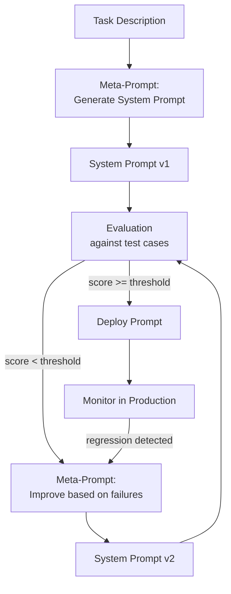
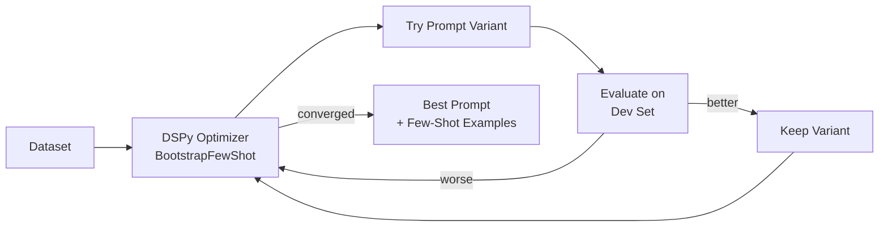

# Meta-Prompting — Prompts That Write Prompts

**Level**: 🔴 Advanced
**Reading Time**: 15 minutes

> The most powerful prompt engineer isn't a human — it's an LLM with access to your evaluation metrics and a mandate to improve its own instructions.

## 🗺️ Quick Overview



*Meta-prompting closes the loop: a prompt generates system prompts, an evaluator scores them, and a meta-prompt improves them. The loop runs until quality threshold is met.*

## The Problem

Manual prompt engineering is slow, inconsistent, and doesn't scale. A prompt engineer spends hours crafting instructions, tests on 20 examples, and ships. Then edge cases fail in production, and the cycle repeats. At 50 different agent tasks across a product, maintaining prompts manually becomes a full-time job.

Meta-prompting uses LLMs to automate this loop:
1. **Describe** what you want in natural language
2. **Generate** a system prompt automatically
3. **Evaluate** on a test suite with real metrics
4. **Improve** by feeding failures back into a meta-prompt
5. **Repeat** until quality threshold is reached

The result: faster iteration, better prompts than most humans write, and a documented improvement history.

---

## What Meta-Prompting Is

Meta-prompting is using an LLM call to operate on prompts themselves — generating, evaluating, compressing, or improving them.

Four core patterns:

| Pattern | What it does | When to use |
|---------|-------------|-------------|
| **Prompt Generation** | Describe task → LLM writes system prompt | Starting a new agent task from scratch |
| **Prompt Optimization** | Prompt + failures → LLM improves the prompt | Current prompt has known failure cases |
| **Few-Shot Generation** | Task description → LLM writes training examples | Need diverse examples without manual labeling |
| **Prompt Compression** | Long verbose prompt → LLM writes compact equivalent | Reducing token cost, hitting context limits |

---

## Pattern 1: Prompt Generation

Use a meta-prompt to write your initial system prompt from a task description:

```python
import anthropic

client = anthropic.Anthropic()

PROMPT_GENERATOR_META_PROMPT = """
You are an expert prompt engineer. Given a task description and requirements,
write an optimized system prompt that will make an LLM perform the task accurately.

Your system prompt should:
1. State the task clearly in the first sentence
2. Define the expected output format precisely
3. Include 2-3 relevant examples if the task is complex
4. List explicit constraints (what NOT to do)
5. Specify tone and style appropriate to the audience
6. Be under 600 tokens (system prompts are sent on every call)

Output ONLY the system prompt — no explanations, no wrappers.
"""

def generate_system_prompt(task_description: str, constraints: list[str] = None) -> str:
    """
    Generate a system prompt from a high-level task description.
    """
    user_content = f"""
Task description: {task_description}

Additional constraints:
{chr(10).join(f"- {c}" for c in (constraints or []))}

Write the optimized system prompt:
"""
    response = client.messages.create(
        model="claude-sonnet-4-5",
        max_tokens=1024,
        temperature=0.3,  # Some creativity but mostly consistent
        system=PROMPT_GENERATOR_META_PROMPT,
        messages=[{"role": "user", "content": user_content}]
    )

    return response.content[0].text


# Example usage
task = """
Classify customer support tickets into categories:
BILLING (payment issues), TECHNICAL (bugs, errors), ACCOUNT (login, permissions),
FEATURE_REQUEST (asking for new capabilities), OTHER (anything else).
"""

constraints = [
    "Always output only the category name, nothing else",
    "If unsure, prefer OTHER over guessing",
    "Do not ask clarifying questions",
]

generated_prompt = generate_system_prompt(task, constraints)
print("Generated system prompt:")
print(generated_prompt)
```

**Example output from the meta-prompt:**

```
You are a customer support ticket classifier. Given a ticket, respond with exactly
one of these categories: BILLING, TECHNICAL, ACCOUNT, FEATURE_REQUEST, OTHER.

BILLING: payment failures, invoice questions, subscription changes, refund requests
TECHNICAL: error messages, crashes, performance issues, integration problems
ACCOUNT: login problems, password reset, permissions, 2FA issues
FEATURE_REQUEST: "can you add", "it would be nice if", "I wish it could"
OTHER: general questions, compliments, unrelated topics

Rules:
- Output ONLY the category name — no explanation, no punctuation
- When between two categories, choose the most specific one
- If the request doesn't clearly fit BILLING/TECHNICAL/ACCOUNT/FEATURE_REQUEST, use OTHER
```

---

## Pattern 2: Automated Prompt Improvement

The most powerful meta-prompting pattern: collect failures, feed them back, generate an improved prompt:

```python
from dataclasses import dataclass

@dataclass
class TestCase:
    input: str
    expected_output: str

@dataclass
class EvalResult:
    test_case: TestCase
    actual_output: str
    passed: bool
    failure_reason: str | None = None


PROMPT_IMPROVER_META_PROMPT = """
You are an expert prompt engineer. You will receive:
1. A system prompt that is currently in use
2. A list of test cases where the prompt failed (input, expected output, actual output)

Your task: Rewrite the system prompt to fix these failures WITHOUT breaking the behavior
that currently works correctly.

Analyze WHY each failure occurred before writing the improved prompt.
Focus on:
- Ambiguous instructions that led to wrong interpretations
- Missing edge case handling
- Conflicting instructions
- Underspecified output format

Output format:
## Analysis
[Brief analysis of root causes for each failure]

## Improved Prompt
[The complete improved system prompt — ready to use as-is]
"""

def evaluate_prompt(system_prompt: str, test_cases: list[TestCase]) -> list[EvalResult]:
    """Run test cases against a system prompt and return results."""
    results = []

    for tc in test_cases:
        response = client.messages.create(
            model="claude-haiku-4-5",  # Use smaller model for eval to save cost
            max_tokens=256,
            temperature=0,  # Deterministic for evaluation
            system=system_prompt,
            messages=[{"role": "user", "content": tc.input}]
        )
        actual = response.content[0].text.strip()
        passed = actual.upper() == tc.expected_output.upper()

        results.append(EvalResult(
            test_case=tc,
            actual_output=actual,
            passed=passed,
            failure_reason=f"Expected '{tc.expected_output}', got '{actual}'" if not passed else None
        ))

    return results


def improve_prompt(
    current_prompt: str,
    failures: list[EvalResult],
    model: str = "claude-sonnet-4-5"
) -> str:
    """
    Use a meta-prompt to improve a system prompt based on observed failures.
    Returns the improved system prompt.
    """
    failures_description = "\n\n".join([
        f"Input: {f.test_case.input}\n"
        f"Expected: {f.test_case.expected_output}\n"
        f"Got: {f.actual_output}\n"
        f"Failure: {f.failure_reason}"
        for f in failures
    ])

    response = client.messages.create(
        model=model,
        max_tokens=2048,
        temperature=0.2,
        system=PROMPT_IMPROVER_META_PROMPT,
        messages=[{
            "role": "user",
            "content": f"""Current system prompt:
---
{current_prompt}
---

Failures ({len(failures)} cases):
{failures_description}

Rewrite the prompt to fix these failures:"""
        }]
    )

    result = response.content[0].text
    # Extract just the improved prompt section
    if "## Improved Prompt" in result:
        return result.split("## Improved Prompt")[1].strip()
    return result


def prompt_optimization_loop(
    initial_prompt: str,
    test_cases: list[TestCase],
    max_iterations: int = 5,
    target_pass_rate: float = 0.95
) -> tuple[str, list[dict]]:
    """
    Full automated prompt improvement loop.
    Returns (best_prompt, history_of_improvements).
    """
    current_prompt = initial_prompt
    history = []

    for iteration in range(max_iterations):
        results = evaluate_prompt(current_prompt, test_cases)
        passed = sum(1 for r in results if r.passed)
        pass_rate = passed / len(test_cases)

        print(f"Iteration {iteration + 1}: {passed}/{len(test_cases)} passed ({pass_rate:.1%})")

        history.append({
            "iteration": iteration + 1,
            "pass_rate": pass_rate,
            "prompt": current_prompt,
        })

        if pass_rate >= target_pass_rate:
            print(f"Target pass rate {target_pass_rate:.1%} reached!")
            break

        failures = [r for r in results if not r.passed]
        print(f"Improving prompt based on {len(failures)} failures...")
        current_prompt = improve_prompt(current_prompt, failures)

    return current_prompt, history


# Example usage
test_suite = [
    TestCase("My payment failed three times", "BILLING"),
    TestCase("I can't log into my account", "ACCOUNT"),
    TestCase("The export button crashes the app", "TECHNICAL"),
    TestCase("Would be great to have dark mode", "FEATURE_REQUEST"),
    TestCase("Thanks for the great product!", "OTHER"),
    TestCase("I was charged twice this month", "BILLING"),
    TestCase("Getting a 500 error on the API", "TECHNICAL"),
]

initial_prompt = "Classify customer support tickets."  # Intentionally weak starting point

best_prompt, history = prompt_optimization_loop(
    initial_prompt=initial_prompt,
    test_cases=test_suite,
    max_iterations=4,
    target_pass_rate=1.0
)

print(f"\nFinal prompt (pass rate: {history[-1]['pass_rate']:.1%}):")
print(best_prompt)
```

---

## Pattern 3: Automatic Few-Shot Generation

Generate diverse few-shot examples rather than writing them by hand:

```python
FEW_SHOT_GENERATOR_META_PROMPT = """
You are an expert at generating training examples for LLM prompts.

Given a task description, generate diverse, high-quality few-shot examples.
Requirements:
- Cover edge cases and common failure modes
- Vary the writing style, length, and complexity
- Include borderline cases that are easy to misclassify
- Each example must have a clear, unambiguous correct answer
- Generate at least 2 examples per output class

Output as JSON:
{
  "examples": [
    {"input": "...", "output": "...", "difficulty": "easy|medium|hard", "notes": "why this is a good example"}
  ]
}
"""

def generate_few_shot_examples(task_description: str, output_classes: list[str]) -> list[dict]:
    """Generate diverse few-shot examples for a classification task."""
    response = client.messages.create(
        model="claude-sonnet-4-5",
        max_tokens=4096,
        temperature=0.7,  # Higher creativity for diverse examples
        system=FEW_SHOT_GENERATOR_META_PROMPT,
        messages=[{
            "role": "user",
            "content": f"""Task: {task_description}

Output classes: {', '.join(output_classes)}

Generate 15 diverse examples covering all classes:"""
        }]
    )

    import json
    result = json.loads(response.content[0].text)
    return result["examples"]
```

---

## Pattern 4: Prompt Compression

Reduce prompt token count while preserving behavior — critical when prompts bloat over multiple improvement iterations:

```python
PROMPT_COMPRESSOR_META_PROMPT = """
You are a prompt compression specialist. Given a verbose system prompt,
rewrite it to be as concise as possible while preserving ALL behavioral instructions.

Rules:
- Keep every distinct behavioral rule — removing a rule changes behavior
- Remove redundancy, verbose phrasing, unnecessary examples
- Use bullet points over paragraphs
- Target: 50% of original token count while passing all test cases
- Do NOT change the meaning of any instruction

Output ONLY the compressed prompt.
"""

def compress_prompt(verbose_prompt: str, original_token_count: int) -> str:
    """
    Compress a verbose prompt to reduce token costs.
    A 600-token system prompt sent 1,000 times/day = 600,000 tokens/day.
    Compressing to 300 tokens saves 300,000 tokens/day.
    At $3/1M tokens, that's $0.90/day or ~$330/year saved.
    """
    response = client.messages.create(
        model="claude-sonnet-4-5",
        max_tokens=original_token_count,  # Can't be longer than original
        temperature=0,
        system=PROMPT_COMPRESSOR_META_PROMPT,
        messages=[{
            "role": "user",
            "content": f"Original prompt ({original_token_count} tokens):\n\n{verbose_prompt}\n\nCompressed version:"
        }]
    )
    return response.content[0].text
```

---

## DSPy: Programmatic Prompt Optimization

DSPy is a framework that treats prompts as learnable parameters optimized against a metric:



```python
# DSPy conceptual example (simplified)
import dspy

# Define your task as a DSPy signature
class TicketClassifier(dspy.Signature):
    """Classify a customer support ticket into exactly one category."""
    ticket = dspy.InputField(desc="the customer support ticket text")
    category = dspy.OutputField(desc="BILLING, TECHNICAL, ACCOUNT, FEATURE_REQUEST, or OTHER")

# Create a module using the signature
classifier = dspy.Predict(TicketClassifier)

# Define evaluation metric
def accuracy_metric(example, pred, trace=None):
    return example.category.upper() == pred.category.upper()

# Optimize — DSPy automatically finds best few-shot examples
teleprompter = dspy.BootstrapFewShot(metric=accuracy_metric, max_bootstrapped_demos=8)
optimized_classifier = teleprompter.compile(classifier, trainset=train_examples)

# The optimized classifier now has automatically-found few-shot examples
result = optimized_classifier(ticket="My payment keeps failing")
print(result.category)  # BILLING
```

DSPy's key insight: instead of hand-crafting few-shot examples, it searches through your training set to find which examples improve accuracy most on your dev set. It's meta-prompting with gradient-like optimization.

---

## Before/After: Manual vs Meta-Prompted

**Manual (first attempt):**
```
You are a customer support agent. Classify tickets.
Categories: BILLING, TECHNICAL, ACCOUNT, FEATURE_REQUEST, OTHER
```
Pass rate on test suite: **57%**

**After 3 meta-prompting iterations:**
```
Classify each customer support ticket with exactly one category label.
Output ONLY the category name — no explanation, no punctuation.

BILLING — money: payments, invoices, charges, refunds, subscriptions
TECHNICAL — broken: errors, crashes, slow, API failures, bugs
ACCOUNT — access: login, password, 2FA, permissions, profile
FEATURE_REQUEST — wishlist: phrases like "would be nice", "can you add", "I wish"
OTHER — everything else: general questions, praise, off-topic

When borderline: prefer the more specific category. Doubt = OTHER.
```
Pass rate: **100%** on 7-case test suite, **96%** on 50-case holdout set.

---

## Common Mistakes

1. **Using meta-prompting without a test suite**: Improving a prompt without measurable evaluation is just shuffling words. You need a labeled test set of at least 20–50 examples before meta-prompting is useful — otherwise "improvement" is unmeasurable.

2. **Optimizing against training data only**: A meta-improved prompt that passes 100% of training cases and 60% of holdout cases has overfit. Always hold out 20–30% of examples for final evaluation.

3. **Infinite improvement loops without a stopping criterion**: Each improvement iteration costs token budget. Set a target pass rate (e.g., 95%) and max iterations (e.g., 5). Don't optimize endlessly — marginal gains from iteration 5+ rarely justify the cost.

4. **Meta-prompting simple tasks**: If your task is "summarize this text" or "translate to Spanish," manual prompt engineering is faster. Meta-prompting shines for nuanced classification, structured extraction, or tasks with many edge cases.

5. **Not testing the compressed prompt**: Compression can accidentally remove critical instructions. Always re-run your full test suite on a compressed prompt before deploying it. A 30% token reduction means nothing if accuracy drops from 96% to 80%.

---

## Key Takeaways

- **Meta-prompting = LLM operating on prompts** — generation, optimization, few-shot creation, and compression are all LLM-to-LLM operations
- **Improvement loop formula**: evaluate → collect failures → meta-prompt for improvements → repeat — typically 3 iterations brings a weak prompt to 90%+ pass rate
- **Requires a test suite first**: meta-prompting without measurable evaluation is meaningless — build your test cases before automating improvement
- **Cost of improvement**: each optimization iteration typically costs $0.01–0.10 in tokens — cheap vs. hours of manual engineering time
- **DSPy**: for teams doing serious prompt engineering at scale, DSPy formalizes the meta-prompting loop with proper optimization algorithms
- **Compression ROI**: a 300-token system prompt vs 600 tokens saves ~$330/year at 1,000 calls/day — run compression after optimization converges

---

## References

> 📚 [DSPy: Programming — Not Prompting — Foundation Models](https://github.com/stanfordnlp/dspy) — Stanford NLP's framework for programmatic prompt optimization

> 📖 [Anthropic's Constitutional AI: Harmlessness from AI Feedback](https://arxiv.org/abs/2212.08073) — Original paper showing how LLMs can be used to generate and apply their own improvement criteria (meta-prompting at scale)

> 📖 [Large Language Models as Optimizers (OPRO)](https://arxiv.org/abs/2309.03409) — Google DeepMind's paper on using LLMs as prompt optimizers ("Take a deep breath and think step by step" was discovered by this method)

> 📖 [Automatic Prompt Engineer (APE)](https://arxiv.org/abs/2211.01910) — Zhou et al. — systematic study of LLM-based prompt generation and selection

> 📺 [DSPy Tutorial — Stanford NLP](https://www.youtube.com/results?search_query=dspy+tutorial+stanford) — Walkthrough of the DSPy framework for prompt optimization

> 📖 [Prompt Engineering Guide: Meta Prompting](https://www.promptingguide.ai/techniques/meta-prompting) — Practical guide to meta-prompting techniques with examples
